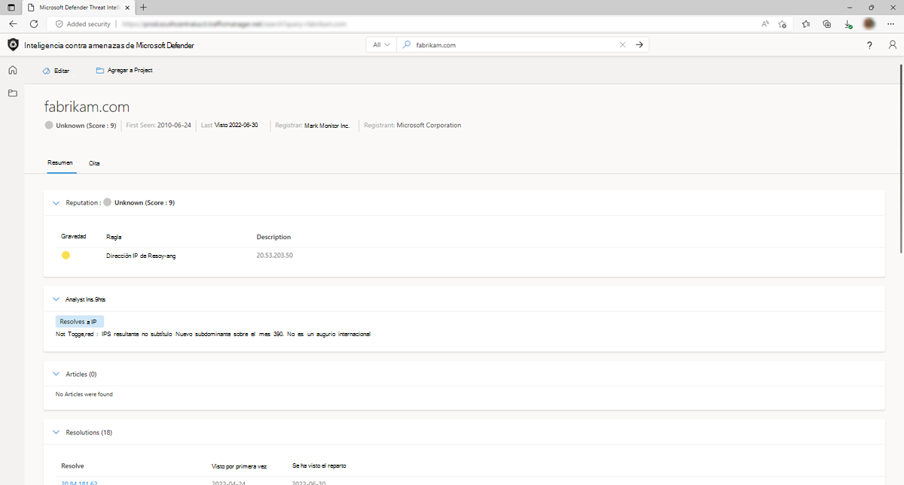

# Conclusiones de analistas

En Inteligencia contra amenazas de Microsoft Defender (TI de Defender), la sección Analyst Insights proporciona información rápida sobre el artefacto que puede ayudar a determinar el siguiente paso de una investigación. En esta sección se enumeran las conclusiones que se aplican al artefacto, así como las que no se aplican para obtener visibilidad adicional. En el ejemplo siguiente, podemos determinar rápidamente que la dirección IP es enrutable, hospeda un servidor web y tenía un puerto abierto en los últimos cinco días. Además, el sistema muestra reglas que no se desencadenaron, lo que puede ser igual de útil al iniciar una investigación.

## Tipos de información de analistas y preguntas que pueden abordar

| Tipos de información de analistas                      | Preguntas que pueden abordar                                                                                                |
|--------------------------------------------|---------------------------------------------------------------------------------------------------------------------------|
| Lista de bloqueados                                | ¿Cuándo se ha bloqueado el dominio, el host o la dirección IP?                                                                  |
|                                            | ¿Cuántas veces Defender TI ha bloqueado el dominio, el host o la dirección IP?                                                            |
| & registrado actualizado                       | ¿Cuántos días, meses, años atrás se registró el dominio?                                                               |
|                                            | ¿Cuándo se actualizó el registro WHOIS del dominio?                                                                                 |
| Recuento de direcciones IP de subdominio                         | ¿Cuántas direcciones IP diferentes están asociadas a los subdominios del dominio?                                                  |
| Nuevas observaciones de subdominio                 | ¿Cuándo fue la última vez que Microsoft observó un nuevo subdominio para el dominio en cuestión?                                     |
| Resolución de & registrada | ¿Existe el dominio consultado?                                                                                            |
|                                            | ¿El dominio se resuelve en una dirección IP?                                                                                 |
| Número de dominios que comparten el registro WHOIS | ¿Qué otros dominios comparten el mismo registro WHOIS?                                                                           |
| Número de dominios que comparten el servidor de nombres  | ¿Qué otros dominios comparten el mismo registro de servidor de nombres?                                                                     |
| Rastreado por RiskIQ                          | ¿Cuándo ha rastreado Microsoft por última vez este host o dominio?                                                                   |
| Dominio internacional                       | ¿Se consulta el dominio para un nombre de dominio internacional (IDN)?                                                             |
| Bloqueado por terceros                 | ¿Este indicador está bloqueado por un tercero?                                                                           |
| Estado del nodo de salida de Tor                       | ¿La dirección IP de las preguntas está asociada a The Onion Router Network (Tor)?                                            |
| Puertos abiertos detectados                        | ¿Cuándo escaneó Microsoft por última vez esta dirección IP?                                                                        |
| Estado del proxy                               | ¿Cuál es el estado del proxy de este indicador?                                                                               |
| Host último observado                         | ¿Es accesible la dirección IP en cuestión en Internet?                                                                        |
| Hospeda un servidor web                         | ¿La dirección IP tiene un servidor DNS que usa sus recursos para resolver el nombre en él para el servidor web adecuado? |

## Siguientes pasos

Para más información, vea:

- [Puntuación de reputación](reputation-scoring.md)
- [Uso de etiquetas](using-tags.md)