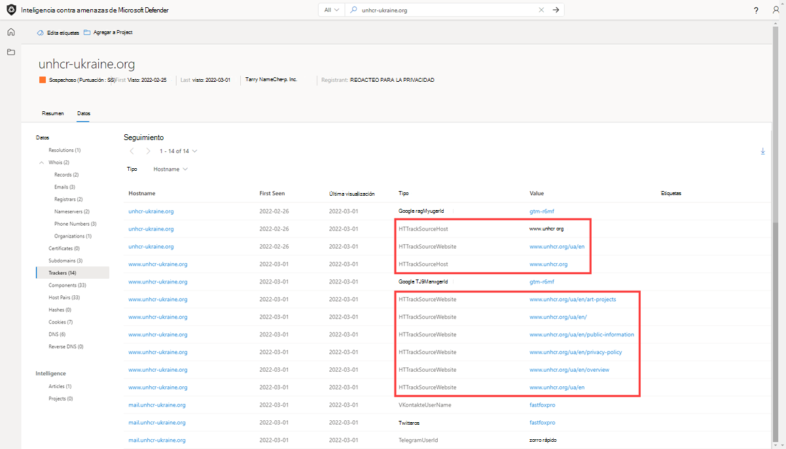

# Conjuntos de datos

Microsoft centraliza numerosos conjuntos de datos en una única plataforma, Inteligencia contra amenazas de Microsoft Defender (TI de Defender), lo que facilita a la comunidad de Microsoft y a los clientes realizar análisis de infraestructura. El objetivo principal de Microsoft es proporcionar tantos datos como sea posible sobre la infraestructura de Internet para admitir una variedad de casos de uso de seguridad.

Microsoft recopila, analiza e indexa datos de Internet para ayudar a los usuarios a detectar y responder a amenazas, priorizar incidentes e identificar proactivamente la infraestructura de adversarios asociada a grupos de actores que tienen como destino su organización. Microsoft recopila datos de Internet a través de la red del sensor PDNS, la red de proxy global de usuarios virtuales, los exámenes de puertos y aprovecha los orígenes de terceros para el malware y los datos del sistema de nombres de dominio (DNS) agregados.

Estos datos de Internet se clasifican en dos grupos distintos: tradicional y avanzado. Los conjuntos de datos tradicionales incluyen resoluciones, whois, certificados SSL, subdominios, hashes, DNS, DNS inverso y servicios. Los conjuntos de datos avanzados incluyen rastreadores, componentes, pares de host y cookies. Los conjuntos de datos Trackers, Components, Host Pairs y Cookies se recopilan de la observación del modelo de objetos de documento (DOM) de las páginas web rastreadas. Además, también se observan componentes y rastreadores de las reglas de detección que se desencadenan en función de las respuestas de banner de los exámenes de puertos o los detalles del certificado SSL.

## Soluciones

DNS pasivo (PDNS) es un sistema de registro que almacena datos de resolución DNS para una ubicación, un registro y un período de tiempo determinados. Este conjunto de datos de resolución histórica permite a los usuarios ver qué dominios se han resuelto en una dirección IP y viceversa. Este conjunto de datos permite una correlación basada en el tiempo en función de la superposición de dominio o IP.
PDNS puede habilitar la identificación de la infraestructura de actor de amenazas anteriormente desconocida o recién puesta en pie. La adición proactiva de indicadores a listas de bloqueos puede cortar las rutas de comunicación antes de que se realicen las campañas. Los usuarios encontrarán datos de resolución de registros en la pestaña Conjunto de datos resoluciones y encontrarán más tipos de registros DNS en la pestaña Conjunto de datos DNS.

Nuestros datos de resolución de PDNS incluyen lo siguiente:

- **Resolver:** el nombre de la entidad que resuelve (una dirección IP o un dominio)
- **Ubicación:** ubicación en la que se hospeda la dirección IP.
- **Red:** bloque de red o subred asociado a la dirección IP.
- **ASN:** número del sistema autónomo y nombre de la organización
- **Primera vista:** marca de tiempo que muestra la fecha en que observamos por primera vez esta resolución.
- **Última vista:** marca de tiempo que muestra la fecha en la que se observó por última vez esta resolución.
- **Origen:** origen que habilitó la detección de la relación.
- **Etiquetas:** todas las etiquetas aplicadas a este artefacto en el sistema de TI de Defender.

## Preguntas que este conjunto de datos puede ayudar a responder:

### Dominios
- ¿Cuándo se observó por primera vez que el dominio se resolvía en una dirección IP por ti de Defender?

    

- ¿Cuándo fue la última vez que defender TI vio que se resolvía activamente en una dirección IP?
    

- ¿A qué direcciones IP se resuelve actualmente?
    
  
### Direcciones IP
- ¿Se puede enrutar la dirección IP?

    

- ¿De qué subred forma parte?

    

- ¿Hay un propietario asociado a la subred?
  
    

- ¿De qué forma parte AS?

    

- ¿Qué geolocalización hay?
    

## Whois

Miles de veces al día, los dominios se compran o transfieren entre individuos y organizaciones. El proceso para hacer que todo esto suceda es fácil y solo tarda unos minutos y aproximadamente $7 dependiendo del proveedor de registradores. Más allá de los detalles de pago, debes proporcionar información adicional sobre ti mismo, algunas de las cuales se almacenan como parte de un registro Whois una vez configurado el dominio. Esto se consideraría un registro de dominio público. Sin embargo, hay servicios de registro de dominio privado, donde puede ocultar su información personal del registro whois de su dominio. En estas situaciones, la información del propietario del dominio es segura y se reemplaza por la información de su registrador. Más grupos de actores realizan registros de dominio privado para dificultar a los analistas encontrar otros dominios que poseen. Ti de Defender proporciona una variedad de conjuntos de datos para buscar la infraestructura compartida de los actores cuando los registros Whois no proporcionan clientes potenciales.

Whois es un protocolo que permite a cualquier usuario consultar información sobre un dominio, una dirección IP o una subred. Una de las funciones más comunes de Whois en la investigación de infraestructura de amenazas es identificar o conectar entidades dispares basadas en datos únicos compartidos dentro de los registros de Whois. Si ha leído cuidadosamente o ha comprado un dominio usted mismo, es posible que haya observado que el contenido solicitado a los registradores nunca se ha comprobado. De hecho, podrías haber puesto cualquier cosa en el registro (y mucha gente lo hace) que luego se mostraría al mundo.

Cada registro whois tiene varias secciones diferentes, todas las cuales podrían incluir información diferente. Entre las secciones más comunes se incluyen "registrador", "registrante", "administrador" y "técnico", cada una de las cuales podría corresponder a un contacto diferente para el registro. Gran parte del tiempo que estos datos se duplican en las secciones, pero en algunos casos, puede haber ligeras discrepancias, especialmente si un actor cometió un error. Al ver la información de Whois en Ti de Defender, verá un registro condensado que desduplica los datos y notarios de qué parte del registro procede. Hemos detectado que este proceso acelera considerablemente el flujo de trabajo de los analistas y evita pasar por alto los datos. La información whois de Defender TI cuenta con la tecnología de la base de datos WhoisIQ™.

Nuestros datos whois incluyen lo siguiente:
- **Registro actualizado:** marca de tiempo que indica el día en que se actualizó por última vez un registro Whois.
- **Último análisis:** la fecha en que el sistema de TI de Defender examinó por última vez el registro.
- **Expiración:** la fecha de expiración del registro, si está disponible.
- **Creado:** la edad del registro Whois actual.
- **Whois Server:** el servidor está configurado por un registrador acreditado de la ICANN para adquirir información actualizada sobre los dominios que están registrados en él. 
- **Registrador:** el servicio de registrador que se usa para registrar el artefacto.
- **Estado del dominio:** el estado actual del dominio. Un dominio "activo" está activo en Internet. 
- **Email:** todas las direcciones de correo electrónico que se encuentran en el registro whois y el tipo de contacto con el que cada uno está asociado (por ejemplo, administrador, técnico).
- **Nombre:** el nombre de los contactos dentro del registro y el tipo de contacto al que está asociado cada uno.
- **Organización:** el nombre de cualquier organización dentro del registro y el tipo de contacto al que está asociada cada una.
- **Calle:** todas las direcciones callejeras asociadas al registro y el tipo de contacto al que está asociado.
- **Ciudad:** cualquier ciudad que aparezca en una dirección asociada al registro y el tipo de contacto al que esté asociado.
- **Estado:** todos los estados enumerados en una dirección asociada al registro y el tipo de contacto al que está asociado.
- **Código postal:** los códigos postales enumerados en una dirección asociada al registro y el tipo de contacto al que está asociado.
- **País:** todos los países enumerados en una dirección asociada al registro y el tipo de contacto al que está asociado.
- **Teléfono:** cualquier número de teléfono que aparezca en el registro y el tipo de contacto al que está asociado.
- **Servidores de nombres:** cualquier servidor de nombres asociado a la entidad registrada.

## Búsquedas de Whois actuales

El repositorio whois actual de Defender TI resalta todos los dominios de la colección Whois de Microsoft que están registrados y asociados al atributo whois de interés. Estos datos resaltan la fecha de registro y expiración del dominio, junto con la dirección de correo electrónico que se usa para registrar el dominio. Estos datos se muestran en la pestaña Whois Search de la plataforma.

## Búsquedas históricas de Whois

El repositorio Whois History de Defender TI proporciona a los usuarios acceso a todas las asociaciones de dominio histórico conocidas a los atributos whois en función de las observaciones del sistema. Este conjunto de datos resalta todos los dominios asociados a un atributo que un usuario pivota para mostrar la primera vez y la última vez que observamos la asociación entre el dominio y el atributo consultados. Estos datos se muestran en una pestaña independiente junto a la pestaña Whois Search actual.

**Preguntas que este conjunto de datos puede ayudar a responder:**

- ¿Cuántos años tiene el dominio?

    

- ¿Parece que la información está protegida por la privacidad?

    

- ¿Parece que alguno de los datos es único?

    

- ¿Qué servidores de nombres se usan?

    

- ¿Es un dominio de agujero de receptor?

    

- ¿Es un dominio estacionado?

    

- ¿Es un dominio de honeypot?

    

- ¿Hay alguna historia?

    

- ¿Hay correos electrónicos falsos de protección de privacidad?

    

- ¿Hay nombres falsos en el registro whois?

- ¿Ha identificado otras IOC relacionadas al buscar valores whois potencialmente compartidos entre dominios?

    

## Certificados
Además de proteger los datos, los certificados SSL son una manera fantástica de que los usuarios conecten una infraestructura de red dispare. Las técnicas de examen modernas nos permiten realizar solicitudes de datos en cada nodo de Internet en cuestión de horas, lo que significa que podemos asociar fácilmente un certificado a una dirección IP que lo hospeda de forma periódica.

Al igual que un registro whois, los certificados SSL requieren que el usuario proporcione información para generar el producto final. Aparte del dominio, el usuario puede crear el certificado SSL para (a menos que se autofirme), cualquier información adicional. Donde los usuarios de Microsoft ven el mayor valor de los certificados SSL no son necesariamente los datos únicos que alguien puede usar al generar el certificado, sino dónde se hospeda.

Para acceder a un certificado SSL, debe asociarse a un servidor web y exponerse a través de un puerto determinado (más a menudo, 443). Con los exámenes masivos de Internet semanalmente, es posible examinar todas las direcciones IP y obtener cualquier certificado hospedado para crear un repositorio histórico de datos de certificado. Tener una base de datos de direcciones IP para asignaciones de certificados SSL proporciona a los usuarios una manera de identificar las superposiciones en la infraestructura.

Para ilustrar aún más este concepto, imagine que un actor ha configurado un servidor con un certificado SSL autofirmado. Después de varios días, los defensores se vuelven sabios en su infraestructura y bloquean el servidor web que hospeda contenido malintencionado. En lugar de destruir todo su trabajo duro, el actor simplemente copia todo el contenido (incluido el certificado SSL) y los coloca en un nuevo servidor. Como usuario, ahora se puede realizar una conexión mediante el valor ÚNICO SHA-1 del certificado para indicar que ambos servidores web (uno bloqueado, otro desconocido) están conectados de alguna manera.

Lo que hace que los certificados SSL sean más valiosos es que son capaces de hacer conexiones que los datos pasivos de DNS o Whois pueden perder. Esto significa más formas de correlacionar una posible infraestructura malintencionada e identificar posibles errores de seguridad operativos de los actores. Defender TI ha recopilado más de 30 millones de certificados desde 2013 hasta la actualidad y proporciona a los usuarios las herramientas para realizar correlaciones en el contenido y el historial de certificados.

Los certificados SSL son archivos que enlazan digitalmente una clave criptográfica a un conjunto de detalles proporcionados por el usuario. Mediante técnicas de análisis de Internet, Defender TI recopila asociaciones de certificados SSL de direcciones IP en varios puertos. Estos certificados se almacenan dentro de una base de datos local y nos permiten crear una escala de tiempo para dónde apareció un certificado SSL determinado en Internet.

Nuestros datos de certificado incluyen lo siguiente:

- **Sha1:** Hash del algoritmo SHA1 para un recurso de certificado SSL.
- **Primero visto:** marca de tiempo que muestra la fecha en la que se observó por primera vez este certificado en un artefacto.
- **Última vista:** marca de tiempo que muestra la fecha en que se observó por última vez este certificado en un artefacto.
- **Infraestructura:** cualquier infraestructura relacionada asociada al certificado.

Cuando un usuario se expande en un hash SHA1, el usuario podrá ver detalles sobre lo siguiente, que incluye:**
- **Número de serie:** Número de serie asociado a un certificado SSL.
- **Emitido:** Fecha en que se emitió un certificado.
- **Expira:** Fecha en la que expirará un certificado.
- **Nombre común del firmante:** Nombre común del firmante para los certificados SSL asociados.
- **Nombre común del emisor:** Nombre común del emisor para los certificados SSL asociados.
- **Nombres alternativos del firmante:** Cualquier nombre común alternativo para el certificado SSL.
- **Nombres alternativos del emisor:** Cualquier nombre adicional del emisor.
- **Nombre de la organización del firmante:** La organización vinculada al registro de certificados SSL.
- **Nombre de la organización del emisor:** Nombre de la organización que orquestó el problema de un certificado.
- **Versión SSL:** Versión de SSL con la que se registró el certificado.
- **Unidad de organización del sujeto:** Metadatos opcionales que indican el departamento de una organización responsable del certificado.
- **Unidad de organización del emisor:** Información adicional sobre la organización que emite el certificado.
- **Dirección de la calle del sujeto:** Dirección de la calle donde se encuentra la organización.
- **Dirección de la calle del emisor:** Dirección de calle donde se encuentra la organización del emisor.
- **Localidad del asunto:** La ciudad donde se encuentra la organización.
- **Localidad del emisor:** La ciudad donde se encuentra la organización del emisor.
- **Estado o provincia del asunto:** Estado o provincia en el que se encuentra la organización.
- **Estado o provincia del emisor:** Estado o provincia en el que se encuentra la organización del emisor.
- **País sujeto:** País donde se encuentra la organización.
- **País emisor:** País donde se encuentra la organización del emisor.
- **Infraestructura relacionada:** cualquier infraestructura relacionada asociada al certificado.

**Preguntas que este conjunto de datos puede ayudar a responder:**

- ¿Con qué otra infraestructura se ha observado este certificado asociado?

    

- ¿Hay puntos de datos únicos en el certificado que sirvan como buenos puntos de pivote?

    

- ¿El certificado está autofirmado?

    

- ¿El certificado es de un proveedor gratuito?

    

- ¿En qué período de tiempo se ha observado el certificado en uso?

    

## Subdominios

Un subdominio es un dominio de Internet, que forma parte de un dominio principal. Los subdominios también se conocen como "hosts". Por ejemplo, "docs.microsoft.com" es un subdominio de "microsoft.com". Para cada subdominio, podría haber un nuevo conjunto de direcciones IP en las que el dominio se resuelve y esto puede ser un excelente origen de datos para buscar la infraestructura relacionada.

Nuestros datos de subdominio incluyen lo siguiente:

- **Nombre de host:** subdominio asociado al dominio en el que se ha buscado.
- **Etiquetas:** todas las etiquetas aplicadas a este artefacto en el sistema de TI de Defender.

**Preguntas que este conjunto de datos puede ayudar a responder:**

- ¿Hay más subdominios asociados al dominio de nivel superior?

    

- ¿Hay subdominios asociados a actividad malintencionada?

    

- Si este es su dominio, ¿no le parecen familiares los subdominios?

- ¿Hay algún patrón en los subdominios que aparezcan asociados a otros dominios malintencionados?

- ¿La dinamización de cada subdominio revela un nuevo espacio ip no asociado anteriormente al destino?

- ¿Qué otra infraestructura no relacionada puede encontrar que no coincide con el dominio raíz?

## Seguidores

Los rastreadores son códigos o valores únicos que se encuentran en las páginas web y, a menudo, se usan para realizar un seguimiento de la interacción del usuario. Estos códigos se pueden usar para correlacionar un grupo dispare de sitios web con una entidad central. A menudo, los actores copian el código fuente del sitio web de una víctima que buscan suplantar para una campaña de phishing. Rara vez los actores se tomarán el tiempo para quitar estos identificadores que permiten a los usuarios identificar estos sitios fraudulentos mediante el conjunto de datos De seguimiento de Microsoft. Los actores también pueden implementar identificadores de seguimiento para ver el éxito de sus campañas de ciberataque. Esto es similar a los vendedores cuando aprovechan los identificadores de SEO, como un id. de seguimiento de Google Analytics, para realizar un seguimiento del éxito de su campaña de marketing.

El conjunto de datos de Seguimiento de Microsoft incluye identificadores de proveedores como Google, Yandex, Mixpanel, New Relic, Clicky y sigue creciendo de forma regular.

Nuestros datos de seguimiento incluyen lo siguiente:

- **Nombre de host:** el nombre de host que hospeda la infraestructura donde se detectó el seguimiento.
- **Primera vista:** marca de tiempo que muestra la fecha en la que se observó por primera vez este seguimiento en el artefacto.
- **Última vista:** marca de tiempo que muestra la fecha en la que se observó por última vez este seguimiento en el artefacto.
- **Tipo:** el tipo de seguimiento que se detectó (por ejemplo, GoogleAnalyticsID, JarmHash).
- **Valor:** el valor de identificación del rastreador.
- **Etiquetas:** todas las etiquetas aplicadas a este artefacto en el sistema de TI de Defender.

**Preguntas que este conjunto de datos puede ayudar a responder:**

- ¿Hay otros recursos que usen los mismos identificadores de análisis?

    

- ¿Estos recursos están asociados a la organización o están intentando realizar un ataque de infracción?

- ¿Hay superposición entre los rastreadores: se comparten con otros sitios web?

- ¿Cuáles son los tipos de rastreadores que se encuentran en la página web?

    

- ¿Cuál es el período de tiempo para los rastreadores?

    

- ¿Cuál es la frecuencia de cambio para los valores de seguimiento: vienen, van o permanecen?

- ¿Hay seguimientos que vinculen al software de clonación de sitios web (MarkOfTheWeb o HTTrack)?

    

- ¿Hay seguimientos que vinculen a malware malintencionado del servidor C2 (JARM)?

    

## Componentes

Los componentes web son detalles que describen una página web o una infraestructura de servidor obtenida de Microsoft que realiza un rastreo o examen web. Estos componentes permiten a un usuario comprender la composición de una página web o la tecnología y los servicios que impulsan una parte específica de la infraestructura.
La dinamización de componentes únicos puede encontrar la infraestructura de los actores u otros sitios en peligro. Los usuarios también pueden comprender si un sitio web puede ser vulnerable a un ataque específico o a un riesgo en función de las tecnologías que se ejecuten.

Nuestros datos de componentes incluyen lo siguiente:

- **Nombre de host:** el nombre de host que hospeda la infraestructura donde se detectó el componente.
- **Primero visto:** marca de tiempo de la fecha en la que observamos por primera vez este componente en el artefacto.
- **Última vista:** marca de tiempo de la fecha en la que se observó por última vez este componente en el artefacto.
- **Categoría:** el tipo de componente que se detectó (por ejemplo, sistema operativo, marco de trabajo, acceso remoto, servidor).
- **Nombre y versión:** el nombre del componente y la versión que se ejecuta en el artefacto (por ejemplo, Microsoft IIS (v8.5).
- **Etiquetas:** todas las etiquetas aplicadas a este artefacto en el sistema de TI de Defender.

**Preguntas que este conjunto de datos puede ayudar a responder:**

- ¿Qué infraestructura vulnerable está usando?

    

    

    Magento v1.9 es tan anticuado que Microsoft no pudo encontrar documentación confiable para esa versión en particular.

- ¿Qué componentes web únicos usa el actor de amenazas que puede realizar un seguimiento de ellos a otros dominios?

- ¿Hay algún componente marcado como malintencionado?

- ¿Cuál es el número de componentes web identificados?

    

- ¿Hay alguna tecnología única o extraña que no se vea con frecuencia?

    

- ¿Hay alguna versión falsa de tecnologías específicas?

- ¿Cuál es la frecuencia de los cambios en los componentes web, a menudo o con poca frecuencia?

- ¿Se sabe que se ha abusado de alguna biblioteca sospechosa?

- ¿Hay alguna tecnología con vulnerabilidades asociadas a ellas?

## Pares de host

Los pares de host son dos partes de la infraestructura (un elemento primario y un elemento secundario) que comparten una conexión observada desde el rastreo web de un usuario virtual. La conexión podría oscilar entre un redireccionamiento de nivel superior (HTTP 302) y algo más complejo como una referencia de origen de script o iframe.

Nuestros datos de par de host incluyen lo siguiente:

- **Nombre de host primario:** el host que hace referencia a un recurso o "ponerse en contacto" con el host secundario.
- **Nombre de host secundario:** host al que llama el host primario
- **Primera vista:** marca de tiempo de la fecha en la que observamos por primera vez una relación con el host.
- **Última vista:** marca de tiempo de la fecha en la que observamos por última vez una relación con el host.
- **Causa:** el tipo de conexión entre el nombre de host primario y secundario. Entre las posibles causas se incluyen las conexiones script.src, link.href, redirect, img.src, unknown, xmlhttprequest, a.href, finalRedirect, css.import o parentPage.
- **Etiquetas:** todas las etiquetas aplicadas a este artefacto en el sistema de TI de Defender.

**Preguntas que este conjunto de datos puede ayudar a responder:**

- ¿Se ha bloqueado alguno de los artefactos conectados?
- ¿Se ha etiquetado alguno de los artefactos conectados (Phishing, APT, Malicious, Suspicious, Threat Actor Name)?
- ¿Este host redirige a los usuarios a contenido malintencionado?

    

- ¿Los recursos están tirando de CSS o imágenes para configurar ataques de infracción?

    

- ¿Los recursos están tirando de un script o haciendo referencia a un link.href para configurar un magecart o un ataque de desnatado?
    

- ¿Dónde se redirige a los usuarios desde y hacia?

- ¿Qué tipo de redireccionamiento está teniendo lugar?

## Hashes

Microsoft se asocia con Proofpoint para exponer los hashes de [malware](/microsoft-365/security/intelligence/malware-naming) MD5 asociados con el dominio, el host o la dirección IP de una búsqueda de usuarios. Se recomienda a los usuarios que compren una licencia de Emerging Threats mediante Proofpoint si desean analizar los detalles del hash MD5. Estos datos ayudan a los usuarios a comprender las capacidades, la intención y los motivos de un atacante, a la vez que ayudan a conectar la infraestructura juntos. Cada resultado contiene un hash único.

Nuestros datos hash incluyen lo siguiente:

- **Origen:** el origen usado para detectar el hash.
- **Ejemplo:** el código de identificación único para el hash detectado.
- **Fecha de recopilación:** el día en que el origen designado recopiló el ejemplo hash.

**Preguntas que este conjunto de datos puede ayudar a responder:**

- ¿Se conecta el dominio al malware?

    

- ¿Esta dirección IP tiene malware asociado?
    

- ¿Se recopilan los hashes asociados con malware?

- ¿Hace cuánto tiempo se observó esta actividad sospechosa?

- ¿Qué proveedores o orígenes han observado archivos binarios malintencionados?

- ¿La dirección IP o el dominio consultado han servido como servidor de comandos y control para malware?

- ¿La evaluación del archivo asociado al hash de una consulta determinada puede llevarme a otros indicadores con fines de búsqueda de amenazas?

## Cookies

Las cookies son pequeños fragmentos de datos enviados desde un servidor a un cliente a medida que el usuario navega por Internet. Estos valores a veces contienen un estado para la aplicación o pequeños bits de datos de seguimiento. Defender TI resalta e indexa los nombres de cookies observados al rastrear un sitio web y permite a los usuarios profundizar en cualquier lugar donde hayamos observado nombres de cookies específicos en su rastreo y recopilación de datos. Los actores malintencionados también usan cookies para realizar un seguimiento de las víctimas infectadas o almacenar datos que se usarán más adelante.

Nuestros datos de cookies incluyen lo siguiente:

- **Nombre de host:** la infraestructura de host asociada a la cookie.
- **Primero visto:** marca de tiempo de la fecha en que observamos por primera vez esta cookie en el artefacto.
- **Última vista:** marca de tiempo de la fecha en la que se observó por última vez esta cookie en el artefacto.
- **Nombre:** nombre de la cookie (por ejemplo, JSESSIONID, SEARCH_NAMESITE).
- **Dominio:** dominio asociado a la cookie.
- **Etiquetas:** todas las etiquetas aplicadas a este artefacto en el sistema de TI de Defender.

**Preguntas que este conjunto de datos puede ayudar a responder:**

- ¿Qué otros sitios web emiten las mismas cookies?

    

- ¿Qué otros sitios web están realizando el seguimiento de las mismas cookies?
    

- ¿El dominio de cookies coincide con la consulta?

- ¿Cuál es el número de cookies asociadas al artefacto?

    

- ¿Hay nombres o dominios de cookies únicos?

- ¿Cuáles son los períodos de tiempo asociados a las cookies?

- ¿Cuál es la frecuencia de las cookies recién observadas o los cambios asociados a las cookies?

## Servicios

Los nombres de servicio y los números de puerto se usan para distinguir entre diferentes servicios que se ejecutan a través de protocolos de transporte como TCP, UDP, DCCP y SCTP. Los números de puerto pueden sugerir qué tipo de aplicación se ejecuta en un puerto determinado. Pero las aplicaciones o servicios se pueden cambiar para usar un puerto diferente para ofuscar u ocultar el servicio o la aplicación en una dirección IP. Conocer la información de puerto y encabezado o banner puede identificar la verdadera aplicación o servicio y la combinación de puertos que se usan. Defender TI muestra 14 días de historial en la pestaña Servicios, que muestra la última respuesta de banner asociada a un puerto observado.

Los datos de nuestros servicios incluyen lo siguiente:

- Puertos abiertos observados
- Números de puerto
- Componentes
- Número de veces que se observó el servicio
- La última vez que se examinó el puerto
- Conexión de protocolo
- Estado del puerto
  - Abrir
  - Filtered
  - Cerrado
- Respuesta de banner

**Preguntas que este conjunto de datos puede ayudar a responder:**

- ¿Qué aplicaciones se ejecutan en un puerto determinado para una dirección IP determinada?

    

- ¿Qué versión de las aplicaciones están en uso?

    

- ¿Ha habido cambios recientes en el estado abierto, filtrado o cerrado de un puerto determinado?

    

- ¿Estaba asociado un certificado a la conexión?

    

- ¿Están en uso tecnologías vulnerables o en desuso en un recurso determinado?

    

    

- ¿Un servicio en ejecución expone información que podría usarse con fines nefastos?

- ¿Se siguen los procedimientos recomendados de seguridad?

## DNS

Microsoft ha estado recopilando registros DNS a lo largo de los años, proporcionando a los usuarios información sobre los registros de intercambio de correo (MX), registros de servidor de nombres (NS), registros de texto (TXT), registros de inicio de autoridad (SOA), registros de nombre canónico (CNAME) y registros de puntero (PTR). La revisión de registros DNS puede ser útil para identificar la infraestructura compartida que usan los actores en los dominios que poseen. Por ejemplo, los grupos de actores tienden a usar los mismos servidores de nombres para segmentar su infraestructura o los mismos servidores de intercambio de correo para administrar su comando y control.

Nuestros datos DNS incluyen lo siguiente:

- **Valor:** el registro DNS asociado al host.
- **Primera vista:** marca de tiempo que muestra la fecha en la que se observó por primera vez este registro en el artefacto.
- **Última vista:** marca de tiempo que muestra la fecha en la que se observó por última vez este registro en el artefacto.
- **Tipo:** el tipo de infraestructura asociada al registro. Entre las opciones posibles se incluyen servidores de correo (MX), archivos de texto (TXT), servidores de nombres (NS), CNAMES y registros de inicio de autoridad (SOA).
- **Etiquetas:** todas las etiquetas aplicadas a este artefacto en el sistema de TI de Defender.

 

**Preguntas que este conjunto de datos puede ayudar a responder:**

- ¿Qué otras partes de la infraestructura están directamente relacionadas con el indicador que estoy buscando?
- ¿Cómo ha cambiado la infraestructura con el tiempo?
- ¿El propietario del dominio emplea los servicios de una red de entrega de contenido o un servicio de protección de marca?
- ¿Qué otras tecnologías podría emplear la organización asociada dentro de su red?

## DNS inverso

Mientras una búsqueda DNS directa consulta la dirección IP de un nombre de host determinado, una búsqueda inversa de DNS consulta un nombre de host específico de una dirección IP. Este conjunto de datos mostrará resultados similares a los del conjunto de datos DNS. La revisión de registros DNS puede ser útil para identificar la infraestructura compartida que usan los actores en los dominios que poseen. Por ejemplo, los grupos de actores tienden a usar los mismos servidores de nombres para segmentar su infraestructura o los mismos servidores de intercambio de correo para administrar su comando y control.

Nuestros datos dns inversos incluyen lo siguiente:

- **Valor:** el valor del registro DNS inverso.
- **Primera vista:** marca de tiempo de la fecha en la que se observó por primera vez este registro en el artefacto.
- **Última vista:** marca de tiempo de la fecha en que observamos por primera vez este registro en el artefacto.
- **Tipo:** el tipo de infraestructura asociada al registro. Entre las opciones posibles se incluyen servidores de correo (MX), archivos de texto (TXT), servidores de nombres (NS), CNAMES y registros de inicio de autoridad (SOA).
- **Etiquetas:** todas las etiquetas aplicadas a este artefacto en el sistema de TI de Defender.

**Preguntas que este conjunto de datos puede ayudar a responder:**

- ¿Qué registros DNS han observado este host?
- ¿Cómo ha cambiado la infraestructura que observó este host con el tiempo?

## Siguientes pasos

Para más información, vea:

- [Búsqueda y dinamización](searching-and-pivoting.md)
- [Ordenación, filtrado y descarga de datos](sorting-filtering-and-downloading-data.md)
- [Encadenamiento de infraestructura](infrastructure-chaining.md)
- [Tutorial: Recopilación de inteligencia sobre amenazas y encadenamiento de infraestructura](gathering-threat-intelligence-and-infrastructure-chaining.md)