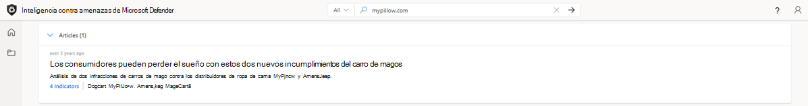
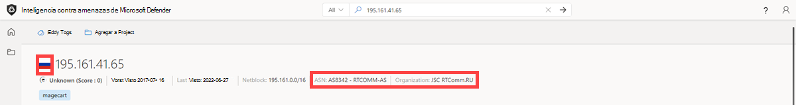
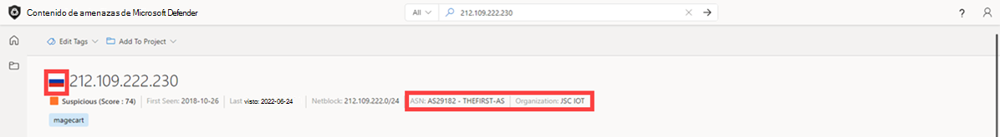

# Tutorial: Recopilación de inteligencia sobre amenazas y encadenamiento de infraestructura

En este tutorial, aprenderá a:
- Realizar varios tipos de búsquedas de indicadores y recopilar inteligencia de amenazas y adversarios

  

## Requisitos previos

- Una cuenta de Azure Active Directory o microsoft personal. [Iniciar sesión o crear una cuenta](https://signup.microsoft.com/)
- Una licencia Premium de Inteligencia contra amenazas de Microsoft Defender (Defender TI).

    > [!NOTE]
    > Los usuarios sin una licencia de Defender TI Premium seguirán siendo capaces de iniciar sesión en el portal de Inteligencia sobre amenazas de Defender y acceder a nuestra oferta gratuita de TI de Defender.

## Aviso de declinación de responsabilidades

Inteligencia contra amenazas de Microsoft Defender (Ti de Defender) puede incluir observaciones en tiempo real e indicadores de amenazas, incluida la infraestructura malintencionada y las herramientas de amenazas adversarias. Las búsquedas de ip y dominio dentro de nuestra plataforma de TI de Defender son seguras para buscar.

Microsoft compartirá recursos en línea (por ejemplo, direcciones IP, nombres de dominio) que deben considerarse amenazas reales que representan un peligro claro y presente.

Se pide a los usuarios que usen su mejor criterio y minimicen el riesgo innecesario al interactuar con sistemas malintencionados al realizar el tutorial siguiente. Tenga en cuenta que Microsoft ha trabajado para minimizar el riesgo mediante la desafangación de direcciones IP malintencionadas, hosts y dominios.

## Antes de empezar
Como indica la declinación de responsabilidades anterior, los indicadores sospechosos y malintencionados se han desafiado por su seguridad. Quite los corchetes de direcciones IP, dominios y hosts al buscar en TI de Defender. No busque estos indicadores directamente en su navegador.

## Realizar varios tipos de búsquedas de indicadores y recopilar inteligencia de amenazas y adversarios

En este tutorial, realizará una serie de pasos para [encadenar la infraestructura](infrastructure-chaining.md) juntos indicadores de riesgo (IOC) relacionados con una vulneración de Magecart y recopilar inteligencia de amenazas y adversarios a lo largo del camino. El encadenamiento de infraestructura aprovecha la naturaleza altamente conectada de Internet para expandir un IOC en muchos en función de los detalles superpuestos o las características compartidas. La creación de cadenas de infraestructura permite a los cazadores de amenazas o respondedores de incidentes generar perfiles de la presencia digital de un adversario, lo que les permite pivotar rápidamente en estos conjuntos de datos para crear contexto en torno a un incidente o una investigación, lo que permite una evaluación más eficaz de las alertas y la acción de los incidentes dentro de una organización.

**Personas relevantes:** Analista de inteligencia sobre amenazas, cazador de amenazas, respondedor de incidentes, analista de operaciones de seguridad

### Vulneración de Magecart

Microsoft ha estado generando perfiles y siguiendo las actividades de Magecart, un sindicato de cibergrupos criminales detrás de cientos de infracciones de las plataformas comerciales en línea mediante la colocación de skimmers digitales en sitios de comercio electrónico comprometidos.

Para ello, insertan un script diseñado para robar datos confidenciales que los consumidores entran en formularios de pago en línea en sitios web de comercio electrónico directamente o a través de proveedores de terceros en peligro de los que pueden depender los sitios web para que sus sitios funcionen.

En octubre de 2018, se infiltraron en el sitio web en línea de MyPillow, mypillow.com, para robar información de pago mediante la inyección de un script en su tienda web que se hospedaba en un dominio tipográfico que contiene el skimmer, mypiltow.com.

La infracción de MyPillow fue un ataque en dos fases, con el primer skimmer solo activo durante un breve tiempo antes de ser identificado como ilícito y eliminado, pero los atacantes todavía tenían acceso a la red de MyPillow y el 26 de octubre de 2018, Microsoft observó que registraron un nuevo dominio, livechatinc[.] Org

Los actores de Magecart normalmente registrarán una infracción de dominio para que parezca lo más parecido posible al dominio legítimo, de modo que si examina el código JavaScript, a menos que tenga un aspecto muy cuidadoso, es posible que no observe que han insertado su propio script que captura la información de pago de la tarjeta de crédito y la inserta en su propia infraestructura,  como una manera de ocultarse esencialmente.
Pero como nuestros usuarios virtuales capturan el DOM y encuentran todos los vínculos dinámicos y los cambios realizados por JavaScript desde los rastreos en el back-end, hemos podido detectar esa actividad y identificar ese dominio falso que hospedaba el script insertado en el almacén web MyPillow.

1. Acceda al [portal de Inteligencia sobre amenazas de Defender](https://ti.defender.microsoft.com/).
2. Complete la autenticación de Microsoft para acceder al portal.
3. Busque "mypillow.com" en la página principal de Inteligencia sobre amenazas de Defender TI.
    a. ¿Qué artículos están asociados con este dominio?
    - Los consumidores pueden perder el sueño por estas dos infracciones de Magecart

      

4. Seleccione el artículo "Los consumidores pueden perder el sueño por estas dos infracciones de Magecart".
    a. ¿Qué información está disponible sobre esta campaña relacionada?
      - Este artículo se publicó el 20 de marzo de 2019 y proporciona información sobre cómo myPillow fue violada por el grupo de actores de amenazas de Magecart en octubre de 2018. En el artículo se detalla cómo se ejecutó el ataque.
5. Seleccione la pestaña Indicadores públicos. a. ¿Qué IOC se enumeran relacionados con esta campaña?
      - amerisleep.github[.] Io
      - cmytuok[.] Arriba
      - livechatinc[.] Org
      - mypiltow[.] COM
6. Seleccione Todo en la lista desplegable de la barra de búsqueda y consulte "mypillow.com". A continuación, vaya a la pestaña Datos. a . ¿Qué conjunto de datos puede ser útil para encontrar pruebas de una inyección de scripts?
     - Los pares de host revelan conexiones entre sitios web que los orígenes de datos tradicionales no aparecen (pDNS, Whois) y le permiten ver dónde se usan los recursos y viceversa.
7. Seleccione la hoja Datos de pares de host, ordene por primera vez y filtre por script.src como causa. Page over hasta que encuentre las relaciones de par de hosts que tuvieron lugar en octubre de 2018.
    a. ¿Observa algún dominio de mypillow tipográfico?
      - Observe que mypillow[.] com está extraendo contenido a través de un script del typosquat, mypiltow.com (3-5 oct) como evidencia de la infracción de inyección de scripts

          
8. Pivote en 'mypiltow[.] com'.
    a. A primera vista, ¿qué parece diferente de este dominio en comparación con el dominio de mypillow.com?
      - Reputación: Malintencionada, mientras que la reputación de mypillow.com es desconocida

        

        
9. Vaya a la pestaña Datos y, en los resultados de Resoluciones, dinamizar la dirección IP que mypiltow[.] a lo largo de octubre de 2018. Repita este paso también para mypillow.com.
    a. ¿Qué observa sobre las diferencias en las direcciones IP entre mypillow.com y mypiltow[.] com durante octubre de 2018?
      - Dirección IP, 195.161.41[.] 65, mypiltow[.] com había resuelto, se hospeda en Rusia.
      - Asn diferente usado.

          

          
10. Desplácese hasta la sección Artículos.
    a. ¿Qué otros artículos se han publicado relacionados con mypiltow.com?
    - RiskIQ: Direcciones URL inyectadas de Magecart y dominios C2, del 3 al 14 de junio de 2022
    - RiskIQ: Direcciones URL inyectadas de Magecart y dominios C2, del 20 al 27 de mayo de 2022
    - Desnatado de mercancías & Tendencias de Magecart en el primer trimestre de 2022
    - RiskIQ: Actividad de Magecart Group 8 a principios de 2022
    - Magecart Group 8 Bienes raíces: Patrones de hospedaje asociados con el grupo Skimming
    - Kit inter skimming usado en ataques de homoglifo
    - Magecart Group 8 se mezcla en NutriBullet.com agregar a su creciente lista de víctimas

     
11. Revise cada uno de los artículos adicionales del paso 9.
    a. ¿Qué información adicional puede encontrar sobre el grupo de actores de amenazas de Magecart? (destinos, TTP, IOC adicionales, etc.)
12. Vaya a la pestaña Datos y seleccione la hoja Whois Data y compare la información de Whois entre "mypillow.com" y "mypiltow[.] com'a. ¿En qué se diferencian los valores de Whois?
      - mypillow.com
        1. Si selecciona el registro whois de octubre de 2011, verá que el dominio es claramente propiedad de My Pillow Inc.

            
        2. mypiltow[.] COM
        3. Si selecciona el registro whois de octubre de 2018, encontrará que mypiltow[.] com se registró en Hong Kong, China y está protegido por la protección de la privacidad por el Servicio escudo de id. de dominio CO.
        4. mypiltow[.] el registrador de com es OnlineNIC, Inc.

            

    b. Lo que parece sospechoso hasta ahora sobre mypiltow[.] com dados los registros A y los detalles de Whois que hemos analizado?
      - Al evaluar si mypiltow[.] com puede ser una infraestructura de empresa legítima, un analista debe encontrar extraño que una dirección IP rusa está principalmente protegida por un servicio de privacidad chino para una empresa con sede en Estados Unidos.
13. Buscar 'livechatinc[.] org' en la página principal de Inteligencia sobre amenazas de Defender TI.
    a. ¿Qué artículos nuevos están asociados a este dominio que no vimos al buscar mypillow.com en la parte 1?
      - Magecart Group 8 se mezcla en NutriBullet.com agregar a su creciente lista de víctimas
14. Seleccione magecart group 8 blends into NutriBullet.com adding to their growing list of victims article.
    a. ¿Qué información está disponible sobre esta campaña relacionada?
      - El artículo "Magecart Group 8 Blends into NutriBullet.com Adding To Their Growing List of Victims" fue publicado el 18 de marzo de 2020. En este artículo, nos enteramos de que Nutribullet, Amerisleep, ABS-CBN también fueron víctimas del grupo de actores de amenazas magecart.
15. Seleccione la pestaña Indicadores públicos. a. ¿Qué IOC se enumeran relacionados con esta campaña?
      - Direcciones URL
        1. hxxps://coffemokko[.] com/tr/, hxxps://freshdepor[.] com/tr/, hxxps://prodealscenter[.] com/tr/, hxxps://scriptoscript[.] com/tr/, hxxps://swappastore[.] com/tr/
        2. Dominios
            - 3lift[.] org, abtasty[.] net, adaptivecss[.] org, adorebeauty[.] org, zapatillas de deporte[.] org, amerisleep.github[.] io, ar500arnor[.] com, authorizecdn[.] com, bannerbuzz[.] info, battery-force[.] org, batterynart[.] com, blackriverimaging[.] org, braincdn[.] org, btosports[.] net, cdnassels[.] com, cdnmage[.] com, polluelosaddlery[.] net, childsplayclothing[.] org, christohperward[.] org, citywlnery[.] org, closetlondon[.] org, cmytuok[.] top, coffemokko[.] com, coffetea[.] org, configsysrc[.] info, dahlie[.] org, davidsfootwear[.] org, dobell[.] su, elegrina[.] com, energycoffe[.] org, energytea[.] org, etradesupply[.] org, exrpesso[.] org, foodandcot[.] com, freshchat[.] info, freshdepor[.] com, greatfurnituretradingco[.] org, info-js[.] link, jewsondirect[.] com, js-cloud[.] com, kandypens[.] net, kikvape[.] org, labbe[.] biz, lamoodbighats[.] net, link js[.] link, livechatinc[.] org, londontea[.] net, mage-checkout[.] org, magejavascripts[.] com, magescripts[.] pw, magesecuritys[.] com, majsurplus[.] com, map-js[.] link, mcloudjs[.] com, mechat[.] info, melbounestorm[.] com, misshaus[.] org, mylrendyphone[.] com, mypiltow[.] com, nililotan[.] org, oakandfort[.] org, ottocap[.] org, parks[.] su, paypaypay[.] org, pmtonline[.] su, prodealscenter[.] com, replacemyremote[.] org, sagecdn[.] org, scriptoscript[.] com, security-payment[.] su, shop-rnib[.] org, slickjs[.] org, slickmin[.] com, smart-js[.] link, swappastore[.] com, teacoffe[.] net, top5value[.] com, track-js[.] link, ukcoffe[.] com, verywellfitnesse[.] com, walletgear[.] org, webanalyzer[.] net, zapaljs[.] com, zoplm[.] COM

16. Busque mypillow.com en la página principal de Inteligencia sobre amenazas de Defender TI y seleccione la pestaña Datos. Seleccione la hoja Datos de pares de host. Ordene por primera vez y busque las relaciones de par de host que se produjeron en octubre de 2018.

    a. ¿Observa una relación de script similar entre mypillow.com y secure.livechatinc[.]. que refleja la misma relación que mypillow.com tuvo con mypiltow[.] ¿COM?
      - Observe cómo se observó por primera vez www.mypillow.com llegar a secure.livechatinc[.] org el 26/10/2018, porque se observó una solicitud GET de script de www.mypillow.com a secure.livechatinc[.] Org. Esa relación duró hasta el 19/11/2018.

            ii. Además, secure.livechatinc[.] la organización se ha puesto en contacto con www.mypillow.com para acceder al servidor de www.mypillow.com (xmlhttprequest).
17. Revise las relaciones de par de host de mypillow.com más adelante.
    a. ¿mypillow.com tiene alguna relación de par de host con un nombre de dominio similar a secure.livechatinc[.] ¿Org?
      - Sí. Hay varios tipos de relaciones observadas mypillow.com hosts tenían con los dominios siguientes:
        1. cdn.livechatinc[.] com, secure.livechatinc[.] com, api.livechatinc[.] COM
     - Entre las causas de la relación se incluyen:
        1. script.src
        2. iframe.src
        3. desconocido
        4. topLevelRedirect
        5. img.src
        6. xmlhttprequest
      - Livechat es un servicio de chat de soporte en vivo que los minoristas en línea pueden agregar a sus sitios web, por lo que es un recurso de terceros y lo usan muchas plataformas de comercio electrónico, incluido MyPillow. Este dominio falso es un poco más interesante porque su sitio oficial es realmente livechatinc.com. Por lo tanto, en este caso, usaron un error tipográfico de dominio de nivel superior para ocultar el hecho de que colocaron un segundo skimmer en el sitio web de MyPillow.
18. Volver y encontrar una relación de par de host con 'secure.livechatinc[.] y dinamizar ese nombre de host.
    a. ¿A qué dirección IP resolvió este host durante octubre de 2018?
      - 212.109.222[.] 230

        
      - Observe cómo esta dirección IP también se hospeda en Rusia y la organización ASN es JSC IOT.

        
19. Buscar 'secure.livechatinc[.] org' en la página principal de Inteligencia sobre amenazas de Defender TI, seleccione la pestaña Datos y haga clic en la hoja Whois. Seleccione el registro del 25/12/2018.
    a. ¿Qué registrador se usó para este registro?
      - OnlineNIC Inc.
            1. Este es el mismo registrador que se usó para registrar mypiltow[.] com durante la misma campaña.
                2. Si selecciona el registro del 25/12/2018, observará que el dominio también usaba el mismo servicio de protección de privacidad chino, Domain ID Shield Service, que mypiltow[.] com también había usado.
    b. ¿Qué servidores de nombres se usaron para este registro?
      - ns1.jino.ru
      - ns2.jino.ru
      - ns3.jino.ru
      - ns4.jino.ru
        1. Estos eran los mismos servidores de nombres usados en el registro 10/01/2018 para mypiltow[.] COM. Los adversarios suelen usar los mismos servidores de nombres para segmentar su infraestructura.

            

            
20. Seleccione la hoja Datos de pares de host.
    a. ¿Qué relaciones de par de hosts ve de octubre y noviembre de 2018?
      - secure.livechatinc[.] la organización redirigió a los usuarios a secure.livechatinc.com el 11/19/2022. Es más que probable que se trate de una técnica de ofuscación para eludir la detección.
      - www.mypillow.com estaba tirando de un script hospedado en secure.livechatinc[.] org (el sitio web de LiveChat falso) del 10/26/2018 al 11/19/2022. Durante este período de tiempo, las compras de usuarios de www.mypillow.com se vieron potencialmente comprometidas.
      - secure.livechatinc[.] org solicitaba datos del servidor, www.mypillow.com, que hospedaba el sitio web real de MyPillow (xmlhttprequest) entre el 10/27/2018 y el 10/29/2018.

           b. ¿Qué crees que significan estas relaciones?

## Limpie los recursos
No hay recursos para limpiar en esta sección.

## Pasos siguientes
En este tutorial, ha aprendido a recopilar la inteligencia sobre amenazas y la cadena de infraestructura juntos indicadores de riesgo.