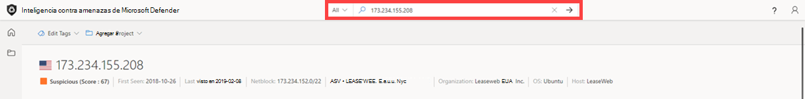

# Tutorial: Recopilación de información sobre vulnerabilidades

## En este tutorial, aprenderá a:

- Más información sobre las características de la página principal de Inteligencia sobre amenazas de Inteligencia contra amenazas de Microsoft Defender (Ti de Defender)
- Realizar varios tipos de búsquedas de indicadores para recopilar información sobre vulnerabilidades

## Requisitos previos

- Una cuenta de Azure Active Directory o microsoft personal. [Iniciar sesión o crear una cuenta](https://signup.microsoft.com/)
- Una licencia Premium de Inteligencia contra amenazas de Microsoft Defender (Defender TI).

    > [!NOTE]
    > Los usuarios sin una licencia de Defender TI Premium seguirán siendo capaces de iniciar sesión en el portal de Inteligencia sobre amenazas de Defender y acceder a nuestra oferta gratuita de TI de Defender.

## Aviso de declinación de responsabilidades

Inteligencia contra amenazas de Microsoft Defender (Ti de Defender) puede incluir observaciones en tiempo real e indicadores de amenazas, incluida la infraestructura malintencionada y las herramientas de amenazas adversarias. Las búsquedas de ip y dominio dentro de nuestra plataforma de TI de Defender son seguras para buscar.
Microsoft compartirá recursos en línea (por ejemplo, direcciones IP, nombres de dominio) que deben considerarse amenazas reales que representan un peligro claro y presente.
Se pide a los usuarios que usen su mejor criterio y minimicen el riesgo innecesario al interactuar con sistemas malintencionados al realizar el tutorial siguiente. Tenga en cuenta que Microsoft ha trabajado para minimizar el riesgo mediante la desafangación de direcciones IP malintencionadas, hosts y dominios.

## Antes de empezar

Como indica la declinación de responsabilidades anterior, los indicadores sospechosos y malintencionados se han desafiado por su seguridad. Quite los corchetes de direcciones IP, dominios y hosts al buscar en TI de Defender. No busque estos indicadores directamente en su navegador.

## Abrir la página principal de Inteligencia sobre amenazas de Defender TI

- Acceda al [portal de Inteligencia sobre amenazas de Defender](https://ti.defender.microsoft.com/).
- Complete la autenticación de Microsoft para acceder al portal.

## Más información sobre las características de la página principal de Inteligencia sobre amenazas de Defender TI

1. Revise las opciones de la barra de búsqueda seleccionando la barra de búsqueda y haciendo clic en la opción desplegable Todo.

    

2. Revise los artículos y artículos destacados de la página principal de Inteligencia sobre amenazas.

    

## Realizar varios tipos de búsquedas de indicadores para recopilar información sobre vulnerabilidades

1. Busque "CVE-2020-1472" y revise el artículo de vulnerabilidad asociado, "CVE-2020-1472".   

    

2. La pestaña "Artículos relacionados" muestra el artículo titulado "RiskIQ detections into components and indicators related to FireEye's breach disclosure and countermeasures". Haga clic en el artículo para investigar. 

    

3. Revise los indicadores públicos del artículo.

    

4. Buscar en '173.234.155[.] 208' Dirección IP en la barra de búsqueda de Inteligencia sobre amenazas.

      

5. Revise los resultados de la pestaña Resumen que devuelven: reputación, información de analistas, artículos, servicios, resoluciones, certificados y proyectos.

      

6. Vaya a la pestaña Datos y revise los conjuntos de datos e inteligencia: resoluciones, Whois, certificados, rastreadores, componentes, cookies, servicios, dns y artículos.

    

    

7. Vuelva a la hoja de datos Resoluciones y dinamícela en 'myaeroplan[.] com'.

    

8. Vaya a la pestaña Datos y revise las resoluciones, Whois, certificados, subdominios, rastreadores, componentes, cookies, DNS y conjuntos de datos DNS inversos.

    

9. Tome nota de los siguientes artefactos de los pasos 5 y 7:

    |&nbsp;|&nbsp;|
    | --- | --- |
    | Whois Address | 1928 E. Highland Ave. Ste F104 PMB# 255 |
    | Whois City | fénix |
    | Estado whois | Az |
    | Whois Código postal | 85016 |
    | Whois Country | Estados Unidos |
    | Whois Phone | 13478717726 |
    | Whois Nameserver | ns0.1984[.] Es |
    | Whois Nameserver | ns1.1984[.] Es |
    | Whois Nameserver | ns2.1984[.] Es |
    | Whois Nameserver | ns1.1984hosting[.] Com |
    | Whois Nameserver | ns2.1984hosting[.] Com |
    | Certificado Sha1 | [ead5b033ed4fd342261f389f0930aa7de1fba33d](https://ti.defender.microsoft.com/search/certificates?query=ead5b033ed4fd342261f389f0930aa7de1fba33d&field=sha1) |
    | Número de serie del certificado | 236976486488328334603103229327145294996 |
    | Nombre común del emisor de certificados | COMODO RSA Domain Validation Secure Server CA |
    | Nombre común del firmante del certificado | myaeroplan[.] Com |
    | Nombre alternativo del firmante del certificado | [myaeroplan[.] Com](https://ti.defender.microsoft.com/search/trackers/hosts?query=www.aeroplan.com&field=MarkOfTheWebSourceHost) |
    | Nombre alternativo del firmante del certificado | www.myaeroplan[.] Com |
    | Tipo de seguimiento | MarkOfTheWebSourceHost |
    | Valor de seguimiento | [www.aeroplan.com](https://ti.defender.microsoft.com/search/trackers/hosts?field=MarkOfTheWebSourceHost&query=www.aeroplan.com) |
    | Nombre del componente + Versión | [Apache (v2.4.29)](https://ti.defender.microsoft.com/search/components/hosts?category=Server&query=Apache&version=2.4.29) |
    | Nombre de cookie | [PHPSESSID](https://ti.defender.microsoft.com/search/cookies/hosts?query=PHPSESSID&field=name) |
    | Dominio de cookies | [myaeroplan[.] Com](https://ti.defender.microsoft.com/search/cookies/hosts?query=myaeroplan.com&field=domain) |
    | Artículos sobre amenazas | [Tipos de puntos: Campaña de recolección de credenciales del Programa de viajero frecuente de Aeroplan](https://ti.defender.microsoft.com/articles/99527909)|

10. Realice las búsquedas de artefactos correspondientes desde el paso 8. Nota: Querrá hacer referencia a las opciones de búsqueda que aprendió en la sección Características de la página principal de Inteligencia sobre amenazas de Defender TI.

## Limpie los recursos

No hay recursos para limpiar en esta sección.
