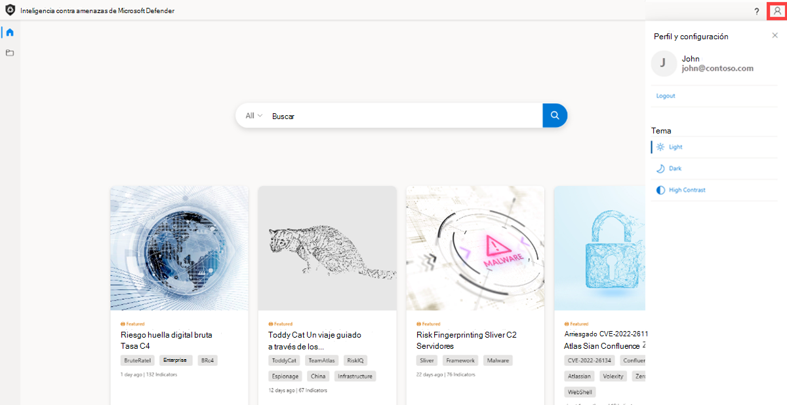
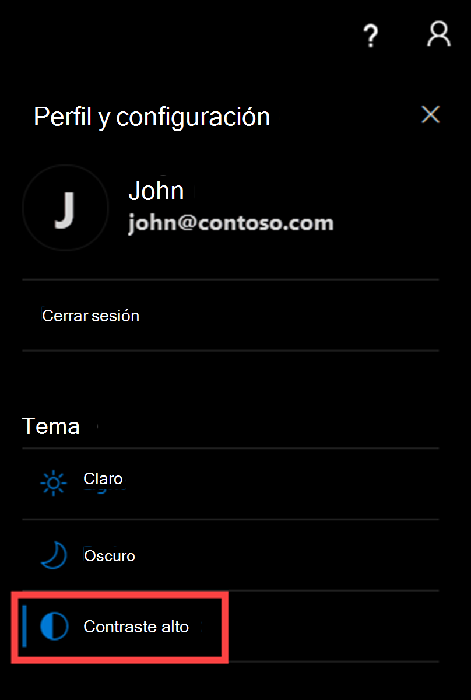
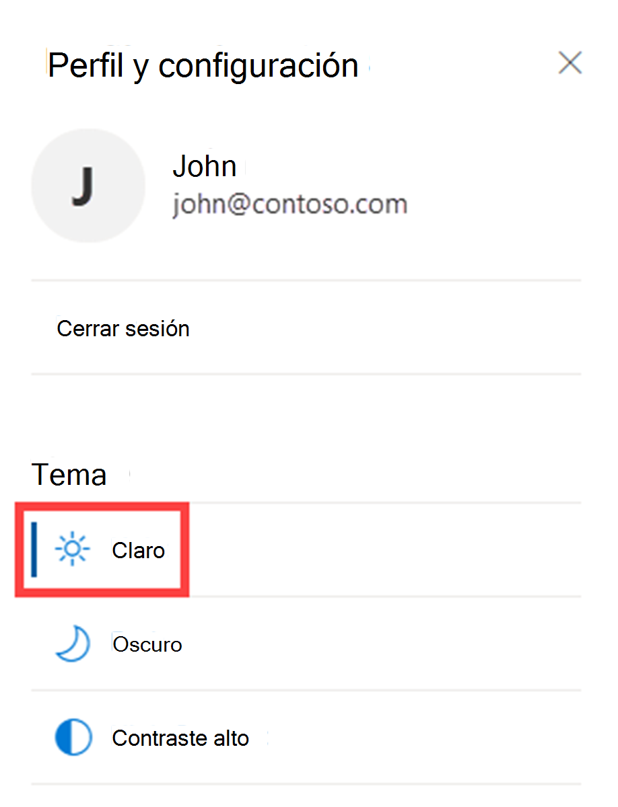
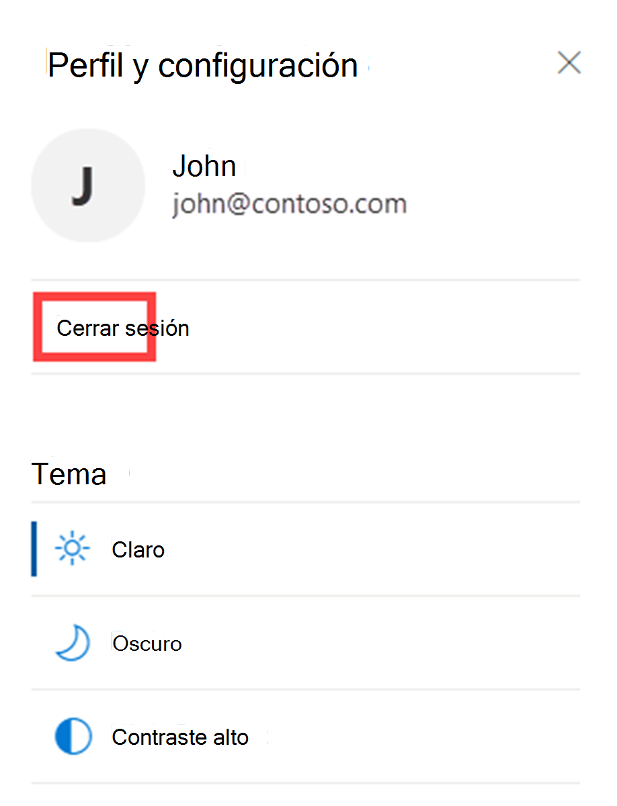

# Inicio rápido: Obtenga información sobre cómo acceder a Inteligencia contra amenazas de Microsoft Defender y realizar personalizaciones en el portal.

Comprender cómo ajustar el tema en el portal de Inteligencia contra amenazas de Microsoft Defender (Defender TI) hará que sea más fácil para los ojos al usar nuestra plataforma. Además, esta guía le guiará a través de cómo habilitar los orígenes para el enriquecimiento, para que pueda ver más resultados al realizar búsquedas en nuestra plataforma. También aprenderá a iniciar sesión y cerrar sesión correctamente de Defender TI.

## Requisitos previos

- Una cuenta de Azure Active Directory o microsoft personal. [Iniciar sesión o crear una cuenta](https://signup.microsoft.com/)
- Una licencia Premium de Inteligencia contra amenazas de Microsoft Defender (Defender TI).

    > [!NOTE]
    > Los usuarios sin una licencia de Defender TI Premium seguirán siendo capaces de iniciar sesión en el portal de Inteligencia sobre amenazas de Defender y acceder a nuestra oferta gratuita de TI de Defender.

## Abrir la página principal de Inteligencia sobre amenazas de Defender TI

- Acceda al [portal de Inteligencia sobre amenazas de Defender](https://ti.defender.microsoft.com/).
- Complete la autenticación de Microsoft para acceder al portal.

## Acceso al perfil y las preferencias de TI de Access Defender para ajustar el tema

1. Haga clic en el icono "Perfil y preferencias" en la esquina superior derecha del Portal de inteligencia sobre amenazas de Defender.

    

2. Seleccione tema "Oscuro". Observe cómo 'Light' es el tema predeterminado.

    

3. Repita el paso 1 y seleccione el tema "Contraste alto".

    

4. Repita el paso 1 y seleccione el tema "Claro".

    

## Icono "Ayuda" de Access Defender TI para obtener información sobre los recursos de ti de Defender Soporte técnico de Microsoft

1. Haga clic en el icono "Ayuda" en la esquina superior derecha a la izquierda del icono "Perfil y preferencias".

    

2. Revise los recursos de Soporte técnico de Microsoft de TI de Defender.

      - Aquí encontrará la dirección de correo electrónico de soporte técnico de Defender TI, así como un vínculo a nuestra Declaración de privacidad.

## Acceso al perfil y las preferencias de TI de Defender para cerrar sesión en el Portal de inteligencia sobre amenazas de Defender

1. Haga clic en el icono "Perfil y preferencias" en la esquina superior derecha del Portal de inteligencia sobre amenazas de Defender.

2. Seleccione "Cerrar sesión".

    

## Limpie los recursos
No hay recursos para limpiar en esta sección.

## Siguientes pasos

Para más información, vea:

[¿Qué es Inteligencia contra amenazas de Microsoft Defender (TI de Defender)?"](what-is-microsoft-defender-threat-intelligence-defender-tI.md)