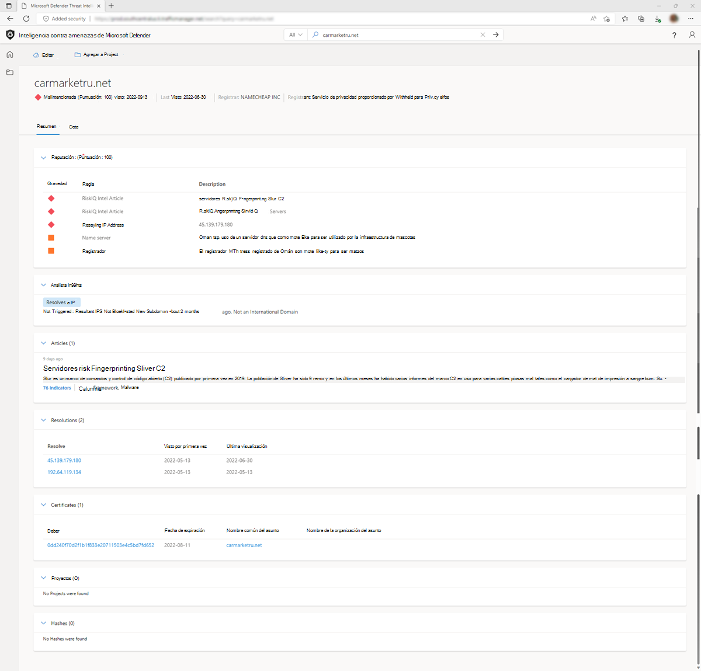

# Puntuación de reputación

Inteligencia contra amenazas de Microsoft Defender (TI de Defender) proporciona puntuaciones de reputación propias para cualquier host, dominio o dirección IP. Si se valida la reputación de una entidad conocida o desconocida, esta puntuación ayuda a los usuarios a comprender rápidamente los vínculos detectados a una infraestructura malintencionada o sospechosa. La plataforma proporciona información rápida sobre la actividad de estas entidades (por ejemplo, marcas de tiempo first y last seen, ASN, infraestructura asociada) y una lista de reglas que afectan a la puntuación de reputación cuando corresponda.

Los datos de reputación son importantes para comprender la confiabilidad de su propia superficie expuesta a ataques y también es útil al evaluar hosts, dominios o direcciones IP desconocidos que aparecen en las investigaciones. Estas puntuaciones descubrirán cualquier actividad malintencionada o sospechosa anterior que afecte a la entidad, u otros indicadores conocidos de riesgo que se deben tener en cuenta.

## Descripción de las puntuaciones de reputación

Las puntuaciones de reputación se determinan mediante una serie de algoritmos diseñados para cuantificar rápidamente el riesgo asociado a una entidad. Desarrollamos puntuaciones de reputación basadas en nuestros datos propietarios aprovechando nuestra infraestructura de rastreo, así como la información de IP recopilada de orígenes externos.

## Métodos de detección
Las puntuaciones de reputación se determinan mediante una serie de factores, incluidas las asociaciones conocidas para las entidades en lista de bloqueados y una serie de reglas de aprendizaje automático que se usan para evaluar el riesgo.

## Corchetes de puntuación
Las puntuaciones de reputación se muestran como una puntuación numérica con un intervalo de 0 a 100. Una entidad con una puntuación de "0" no tiene asociaciones conocidas a actividades sospechosas o indicadores conocidos de riesgo; una puntuación de "100" indica que la entidad es malintencionada. Los hosts, dominios y direcciones IP se agrupan en las categorías siguientes en función de su puntuación numérica:

|     Puntuación             |     Categoría              |     Descripción                                                                                                                                                                          |
|-----------------------|---------------------------|------------------------------------------------------------------------------------------------------------------------------------------------------------------------------------------|
|     75+               |     Malintencionado             |     La entidad ha confirmado asociaciones a una infraestructura malintencionada conocida que aparece en nuestra lista de bloqueos y coincide con las reglas de aprendizaje automático que detectan actividad sospechosa.      |
|     50   – 74         |     Sospechoso            |     Es probable que la entidad esté asociada a una infraestructura sospechosa en función de las coincidencias con tres o más reglas de aprendizaje automático.                                                           |
|     25   – 49         |     Neutro               |     La entidad coincide con al menos dos reglas de aprendizaje automático.                                                                                                                            |
|     0   – 24          |     Desconocido (verde)     |     Si la puntuación es "Desconocido" y verde, la entidad ha devuelto al menos una regla coincidente.                                                                                          |
|     0   – 24          |     Desconocido (gris)      |     Si la puntuación es "Desconocido" y gris, la entidad no ha devuelto ninguna coincidencia de regla.                                                                                                |  

## Reglas de detección

Las puntuaciones de reputación se basan en muchos factores a los que un analista puede hacer referencia para determinar la calidad relativa de un dominio o dirección. Estos factores se reflejan en las reglas de aprendizaje automático que componen las puntuaciones de reputación. Por ejemplo, los dominios de nivel superior (TLD) ".xyz" o ".cc" suelen ser más sospechosos que los TLD ".com" o ".org". Es más probable que un ASN (número de sistema autónomo) hospedado por un proveedor de hospedaje gratuito o de bajo costo esté asociado a actividades malintencionadas, al igual que un certificado SSL autofirmado. Este modelo de reputación se desarrolló examinando las repeticiones relativas de estas características entre indicadores malintencionados y benignos para puntuar la reputación general de una entidad.

Consulte la lista siguiente para ver ejemplos de reglas usadas para determinar la sospecha de un host, dominio o dirección IP. Tenga en cuenta que esta lista no es completa y está cambiando constantemente; nuestra lógica de detección y las funcionalidades consiguientes son dinámicas, ya que reflejan el panorama de amenazas en constante evolución. Por este motivo, no publicamos una lista completa de las reglas de aprendizaje automático que se usan para evaluar la reputación de una entidad.

Consulte las reglas de puntuación de reputación de ejemplo siguientes:

|     Nombre de regla                    |     Descripción                                                                                        |
|------------------------------------|--------------------------------------------------------------------------------------------------------|
|     SSL-Certificate Self-Signed    |     Los certificados autofirmados pueden indicar un comportamiento malintencionado                                         |
|     Etiquetado como malintencionado            |     Etiquetado como malintencionado por un miembro de la organización                                         |
|     Componentes web observados        |     El número de componentes web observados puede indicar malintencion                                 |
|     Servidor de nombres                    |     El dominio usa un servidor de nombres que es más probable que lo use la infraestructura malintencionada.         |
|     Registrador                      |     Es más probable que los dominios registrados en este registrador sean malintencionados.                           |
|     Proveedor de correo electrónico registrador      |     El dominio está registrado con un proveedor de correo electrónico que tiene más probabilidades de registrar dominios malintencionados.    |

Es importante recordar que estos factores deben evaluarse holísticamente para realizar una evaluación precisa de la reputación de una entidad. La combinación específica de indicadores, en lugar de cualquier indicador individual, puede predecir si es probable que una entidad sea malintencionada o sospechosa.

## Severity

Al crear reglas para el sistema de detección de aprendizaje automático, se le aplica una clasificación de gravedad. A cada regla se le asigna la gravedad "Alta", "Media" o "Baja" en función del nivel de riesgo asociado a la regla.

## Casos de uso

### Clasificación de incidentes, respuesta y búsqueda de amenazas
La puntuación de reputación, la clasificación, las reglas y la descripción de las reglas de Defender TI se pueden usar para evaluar rápidamente si una dirección IP o un indicador de dominio es bueno, sospechoso o malintencionado. Otras veces, es posible que no hayamos observado suficiente infraestructura asociada a una dirección IP o dominio para deducir si el indicador es bueno o malo. Si un indicador tiene una clasificación desconocida o neutra, se anima a los usuarios a realizar una investigación más profunda revisando nuestros conjuntos de datos para deducir si el indicador es bueno o malo. Si la reputación de un indicador incluye una asociación de artículos, se anima a los usuarios a revisar los artículos enumerados para obtener más información sobre cómo está vinculado el indicador a la campaña de un posible actor de amenazas, a qué sectores o naciones pueden dirigirse, a los TTPs asociados e identificar otros indicadores relacionados de compromiso para ampliar el ámbito de la respuesta y los esfuerzos de búsqueda del incidente.

### Recopilación de inteligencia

Los artículos asociados se pueden compartir con el equipo de inteligencia sobre ciberamenazas del analista, por lo que tienen una comprensión más clara de quién puede dirigirse a su organización.

## Pasos siguientes
Para obtener más información, consulte [Información del analista](analyst-insights.md).
