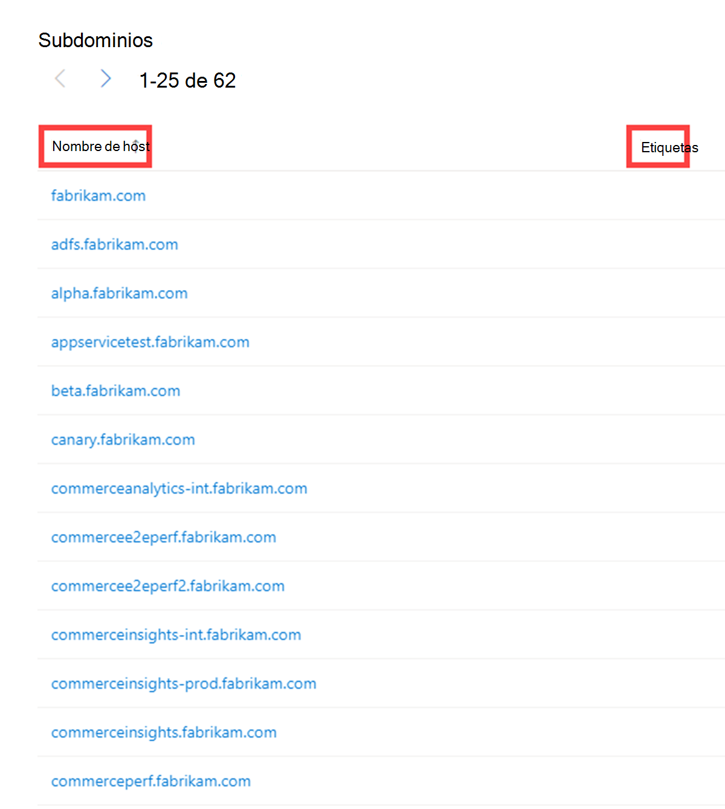
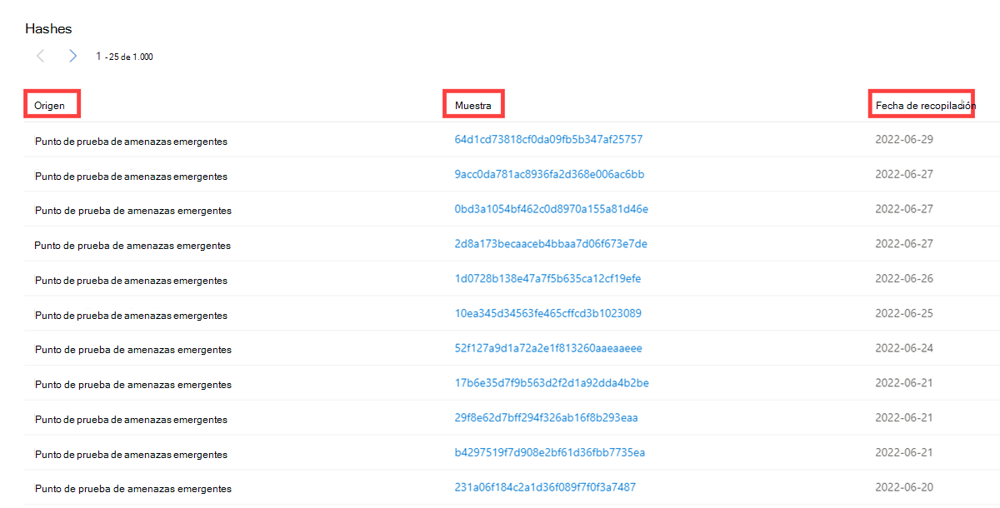
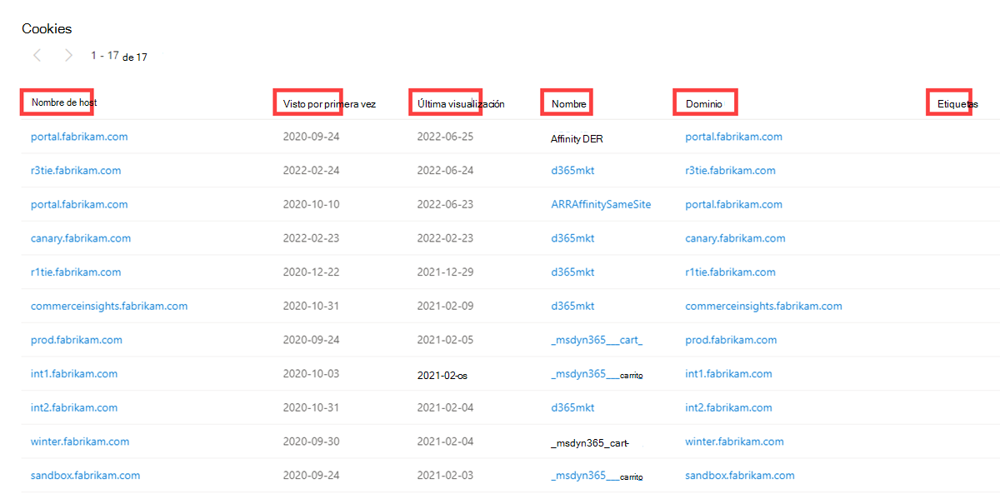
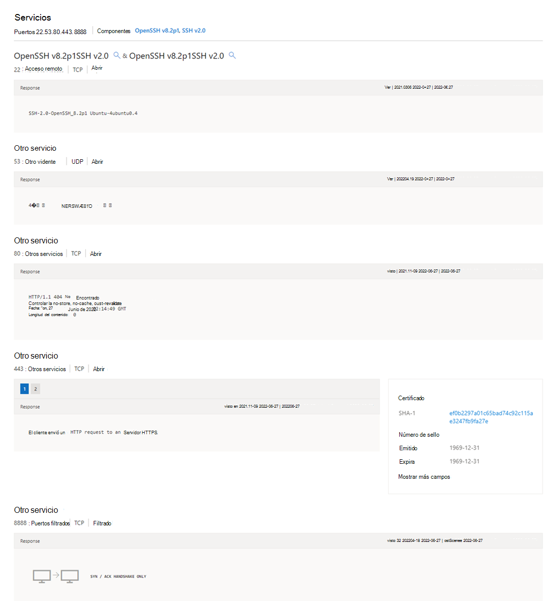

# Búsqueda y dinamización

Inteligencia contra amenazas de Microsoft Defender (Ti de Defender) ofrece un motor de búsqueda sólido y flexible para simplificar el proceso de investigación. La plataforma está diseñada para permitir a los usuarios dinamizar una amplia variedad de indicadores de diferentes orígenes de datos, lo que facilita más que nunca la detección de relaciones entre infraestructuras dispares. Este artículo ayudará a los usuarios a comprender cómo realizar una búsqueda y una dinámica en distintos conjuntos de datos para detectar relaciones entre distintos artefactos.

## Requisitos previos

- Una cuenta de Azure Active Directory o microsoft personal. [Iniciar sesión o crear una cuenta](https://signup.microsoft.com/)
- Una licencia Premium de Inteligencia contra amenazas de Microsoft Defender (Defender TI).
    > [!Note]
    > Los usuarios sin una licencia de Defender TI Premium seguirán siendo capaces de iniciar sesión en el portal de Inteligencia sobre amenazas de Defender y acceder a nuestra oferta gratuita de TI de Defender.

## Abrir la página principal de Inteligencia sobre amenazas de Defender TI

1. Acceda al [portal de Inteligencia sobre amenazas de Defender](https://defender.microsoft.com/).
2. Complete la autenticación de Microsoft para acceder al portal.

## Realización de búsquedas y dinámicas de inteligencia sobre amenazas

La búsqueda de inteligencia sobre amenazas de Defender TI es sencilla y eficaz, diseñada para exponer información clave inmediata, al tiempo que permite a los usuarios interactuar directamente con los conjuntos de datos que componen esta información. La barra de búsqueda admite una amplia variedad de entradas diferentes; los usuarios pueden buscar artefactos específicos, así como nombres de artículo o proyecto.

### Buscar tipos de artefactos
1. **Dirección IP:** Buscar en '195.161.141[.] 65' en la barra de búsqueda de inteligencia sobre amenazas. Esta acción da como resultado una búsqueda de direcciones IP.

    

2. **Dominio:** Busque `fabrikam.com` en la barra de búsqueda de Inteligencia sobre amenazas. Esta acción da como resultado una búsqueda de dominio.

    

3. **Anfitrión:** Busque `canary.fabrikam.com` en la barra de búsqueda de Inteligencia sobre amenazas. Esta acción da como resultado una búsqueda de host.

    

4. **Palabra clave:** Busque 'apt29' en la barra de búsqueda de Inteligencia sobre amenazas. Esta acción da como resultado una búsqueda de palabras clave. Las búsquedas de palabras clave cubren cualquier tipo de palabra clave, que puede incluir un término, una dirección de correo electrónico, etc. Las búsquedas de palabras clave dan como resultado asociaciones con artículos, proyectos y conjuntos de datos.

    

5. **CVE-ID:** Busque "CVE-2021-40444" en la barra de búsqueda de inteligencia sobre amenazas. Esta acción da como resultado una búsqueda de palabras clave de CVE-ID.

6. **Artículo:** Busque "Commodity Skimming & Magecart Trends in First Quarter of 2022" (Tendencias de Magecart en el primer trimestre de 2022) en la barra de búsqueda de inteligencia sobre amenazas. Esta acción da como resultado una búsqueda de artículo.

    

7. **Etiqueta:** Seleccione "Etiqueta" en la lista desplegable Búsqueda de inteligencia sobre amenazas y escriba "magecart" en la barra de búsqueda de Inteligencia sobre amenazas. Presione Entrar o seleccione la flecha derecha para realizar la búsqueda. Esta acción da como resultado una búsqueda de etiquetas.

    > [!NOTE]
    > Esto no devuelve artículos que comparten ese valor de etiqueta.

    

8. **Componente:** Seleccione "Componente" en la lista desplegable Búsqueda de inteligencia sobre amenazas y escriba "ataque de cobalto" en la barra de búsqueda de inteligencia sobre amenazas. Presione Entrar o seleccione la flecha derecha para realizar la búsqueda. Esta acción da como resultado una búsqueda de componentes.

    

9. **Rastreador:** Seleccione "Trackers" en la lista desplegable Threat Intelligence Search y escriba "07d14d16d21d21d00042d41d00041d47e4e4e17960b2a5b4fd6107fbb0926" en la barra de búsqueda de inteligencia sobre amenazas. Presione Entrar o seleccione la flecha derecha para realizar la búsqueda. Esta acción da como resultado una búsqueda de seguimiento. Nota: En este ejemplo, este era un tipo de rastreador jarmHash.

    > [!NOTE]
    > En este ejemplo, se trataba de un tipo De seguimiento de JarmHash.

    

10. **WHOIS Email:** seleccione "WHOIS" > "Email" en la lista desplegable Búsqueda de inteligencia sobre amenazas y escriba domains@microsoft.com en la barra búsqueda de inteligencia sobre amenazas. Presione Entrar o seleccione la flecha derecha para realizar la búsqueda. Esta acción da como resultado una búsqueda de whois Email.

    

11. **Nombre de WHOIS:** Seleccione "WHOIS" > "Name" (Nombre) en la lista desplegable Threat Intelligence Search (Búsqueda de inteligencia sobre amenazas) y escriba "MSN Hostmaster" en la barra de búsqueda de inteligencia sobre amenazas. Presione Entrar o seleccione la flecha derecha para realizar la búsqueda. Esta acción da como resultado una búsqueda de nombre de WHOIS.

    

12. **Organización WHOIS:** Seleccione "WHOIS" > "Organización" en la lista desplegable Búsqueda de inteligencia sobre amenazas y escriba "Microsoft Corporation" en la barra de búsqueda de inteligencia sobre amenazas. Presione Entrar o seleccione la flecha derecha para realizar la búsqueda. Esta acción da como resultado una búsqueda de la organización WHOIS.

    

13. **Dirección de WHOIS:** Seleccione "WHOIS" > "Address" (Dirección) en la lista desplegable Threat Intelligence Search (Búsqueda de inteligencia sobre amenazas) y escriba "One Microsoft Way" en la barra de búsqueda de Inteligencia sobre amenazas. Presione Entrar o seleccione la flecha derecha para realizar la búsqueda. Esta acción da como resultado una búsqueda de direcciones WHOIS.

    

14. **CIUDAD DE WHOIS:** Seleccione "WHOIS" > "City" en la lista desplegable Búsqueda de inteligencia sobre amenazas y escriba "Redmond" en la barra de búsqueda de inteligencia sobre amenazas. Presione Entrar o seleccione la flecha derecha para realizar la búsqueda. Esta acción da como resultado una búsqueda de WHOIS City.

    

15. **Estado de WHOIS:** Seleccione "WHOIS" > "State" en la lista desplegable Búsqueda de inteligencia sobre amenazas y escriba "WA" en la barra de búsqueda de Inteligencia sobre amenazas. Presione Entrar o seleccione la flecha derecha para realizar la búsqueda. Esta acción da como resultado una búsqueda de estado de WHOIS.

    

16. **Código postal de WHOIS:** Seleccione "WHOIS" > "Código postal" en la lista desplegable Búsqueda de inteligencia sobre amenazas y escriba "98052" en la barra de búsqueda de inteligencia sobre amenazas. Presione Entrar o seleccione la flecha derecha para realizar la búsqueda. Esta acción da como resultado una búsqueda de código postal de WHOIS.

    

17. **País de WHOIS:** Seleccione "WHOIS" > "País" en la lista desplegable Búsqueda de inteligencia sobre amenazas y escriba "US" en la barra de búsqueda de Inteligencia sobre amenazas. Presione Entrar o seleccione la flecha derecha para realizar la búsqueda. Esta acción da como resultado una búsqueda de whois country.

    

18. **Teléfono WHOIS:** Seleccione "WHOIS" > "Phone" en la lista desplegable Búsqueda de inteligencia sobre amenazas y escriba "+1.425882808080" en la barra de búsqueda de inteligencia sobre amenazas. Presione Entrar o seleccione la flecha derecha para realizar la búsqueda. Esta acción da como resultado una búsqueda de WHOIS Phone.

    

19. **WHOIS Nameserver:** Seleccione "WHOIS" > "Nameserver" en la lista desplegable Búsqueda de inteligencia sobre amenazas y escriba en la barra de búsqueda de inteligencia sobre `ns1-03.azure-dns.com` amenazas. Presione Entrar o seleccione la flecha derecha para realizar la búsqueda. Esta acción da como resultado una búsqueda de WHOIS Nameserver.

    

20. **Certificado SHA-1:** Seleccione "Certificado" > "SHA-1" en la lista desplegable Búsqueda de inteligencia sobre amenazas y escriba "35cd04a03ef86664623581cbd56e456e45ed07729678" en la barra de búsqueda de inteligencia sobre amenazas. Presione Entrar o seleccione la flecha derecha para realizar la búsqueda. Esta acción da como resultado una búsqueda sha-1 de certificado.

    

21. **Número de serie del certificado:** Seleccione "Certificado" > "Número de serie" en la lista desplegable Búsqueda de inteligencia sobre amenazas y escriba "1137354899731266880939192213383415094395905558" en la barra búsqueda de inteligencia sobre amenazas. Presione Entrar o seleccione la flecha derecha para realizar la búsqueda. Esta acción da como resultado una búsqueda de número de serie de certificado.

    

22. **Nombre común del emisor de certificados:** Seleccione "Certificado" > "Nombre común del emisor" en la lista desplegable Búsqueda de inteligencia sobre amenazas y escriba "Microsoft Azure TLS Issuing CA 05" (Microsoft Azure TLS Issuing CA 05) en la barra De búsqueda de inteligencia sobre amenazas. Presione Entrar o seleccione la flecha derecha para realizar la búsqueda. Esta acción da como resultado una búsqueda de nombre común del emisor de certificados.

    

23. **Nombre alternativo del emisor de certificados:** Seleccione "Certificado" > "Nombre alternativo del emisor" en la lista desplegable Búsqueda de inteligencia sobre amenazas y escriba un nombre alternativo de emisor de certificados en la barra de búsqueda de Inteligencia sobre amenazas. Presione Entrar o seleccione la flecha derecha para realizar la búsqueda. Esta acción da como resultado una búsqueda de nombre alternativo del emisor de certificados.

24. **Nombre común del firmante del certificado:** Seleccione "Certificado" > "Nombre común del firmante" en la lista desplegable Búsqueda de inteligencia sobre amenazas y escriba en la barra búsqueda de inteligencia sobre `*.oneroute.microsoft.com` amenazas. Presione Entrar o seleccione la flecha derecha para realizar la búsqueda. Esta acción da como resultado una búsqueda de nombre común del firmante de certificado.

    

25. **Nombre alternativo del firmante del certificado:** Seleccione "Certificado" > "Nombre alternativo del firmante" en la lista desplegable Búsqueda de inteligencia sobre amenazas y escriba en la barra búsqueda de inteligencia sobre `oneroute.microsoft.com` amenazas. Presione Entrar o seleccione la flecha derecha para realizar la búsqueda. Esta acción da como resultado una búsqueda de nombre alternativo de firmante de certificado.

    

26. **Nombre de cookie:** Seleccione "Cookie" > "Name" (Nombre) en la lista desplegable Threat Intelligence Search (Búsqueda de inteligencia sobre amenazas) y escriba "ARRAffinity" en la barra de búsqueda de Inteligencia sobre amenazas. Presione Entrar o seleccione la flecha derecha para realizar la búsqueda. Esta acción da como resultado una búsqueda de nombre de cookie.

    

27. **Dominio de cookies:** Seleccione "Cookie" > "Domain" (Dominio) en la lista desplegable Threat Intelligence Search (Búsqueda de inteligencia sobre amenazas) y escriba en `portal.fabrikam.com` la barra de búsqueda de Inteligencia sobre amenazas. Presione Entrar o seleccione la flecha derecha para realizar la búsqueda. Esta acción da como resultado una búsqueda de dominio de cookies.

    

28. **Pivotes:** Para cualquiera de las búsquedas realizadas en los pasos anteriores, hay artefactos con hipervínculos que puede dinamizar para detectar resultados enriquecidos adicionales asociados a esos indicadores. No dude en experimentar con esto por su cuenta.

## Resultados de la búsqueda

### Información clave

En la parte superior de la página, la plataforma proporciona información básica sobre el artefacto. Esta información puede incluir lo siguiente, en función del tipo de artefacto:  

- **País:** la marca situada junto a la dirección IP indica el país de origen del artefacto, lo que puede ayudar a determinar su reputabilidad o posición de seguridad. Esta dirección IP se hospeda en la infraestructura dentro de la Estados Unidos.
- **Reputación:** en este ejemplo, la dirección IP se etiqueta con "Malintencionada", lo que indica que la plataforma ha detectado conexiones entre este artefacto y la infraestructura de asesoramiento conocida. Los artefactos también se pueden etiquetar como "Sospechoso", "Neutral" o "Desconocido".
- **Primeramente visto:** esta marca de tiempo indica cuándo el sistema de detección de la plataforma observó por primera vez el artefacto. Comprender la duración de un artefacto puede ayudar a determinar su reputabilidad.
- **Última vista:** esta marca de tiempo indica cuándo el sistema de detección de la plataforma observó por última vez el artefacto. Esto ayuda a determinar si el artefacto se sigue usando activamente.
- **Bloque IP:** el bloque DE IP que incluye el artefacto de dirección IP consultada.
- **Registrador:** el registrador asociado al registro WHOIS para el artefacto de dominio consultado.
- **Registrante:** nombre del solicitante de registro dentro de los datos whois de un artefacto.
- **ASN:** el ASN asociado al artefacto.
- **Sistema operativo:** el sistema operativo asociado al artefacto.
- **Host:** el proveedor de hospedaje para el artefacto. Algunos proveedores de hospedaje son más confiables que otros, por lo que este valor puede ayudar a indicar la validez de un artefacto.

En esta sección también se muestran las etiquetas aplicadas al artefacto o a cualquier proyecto que lo incluya. Los usuarios también pueden agregar una etiqueta o agregar el artefacto a un proyecto.

## Pestaña Resumen

### Información general

Los resultados de una búsqueda de Inteligencia sobre amenazas se agrupan en dos pestañas: "Resumen" y "Datos". La pestaña Resumen proporciona información clave sobre un artefacto que la plataforma ha derivado de nuestros amplios conjuntos de datos. Esta sección está diseñada para exponer conclusiones clave que pueden ayudar a iniciar una investigación.

### Reputación

Defender TI proporciona puntuaciones de reputación propias para cualquier host, dominio o dirección IP. Tanto si se valida la reputación de una entidad conocida como desconocida, esta puntuación ayuda a los usuarios a comprender rápidamente los vínculos detectados con una infraestructura malintencionada o sospechosa. Las puntuaciones de reputación se muestran como una puntuación numérica con un intervalo de 0 a 100. Una entidad con una puntuación de "0" no tiene asociaciones conocidas a actividades sospechosas o indicadores conocidos de riesgo; una puntuación de "100" indica que la entidad es malintencionada. La plataforma proporciona una lista de reglas con una descripción y una clasificación de gravedad. En el ejemplo siguiente, vemos cuatro reglas de "gravedad alta" que se aplican a este dominio.

Para obtener más información, consulte [Puntuación de reputación](reputation-scoring.md).

### Conclusiones de analistas

La sección Analyst Insights proporciona información rápida sobre el artefacto que puede ayudar a determinar el siguiente paso de una investigación. En esta sección se enumeran las conclusiones que se aplican al artefacto y las que no se aplican para obtener visibilidad adicional. En el ejemplo siguiente, podemos determinar rápidamente que la dirección IP es enrutable, hospeda un servidor web y tenía un puerto abierto en los últimos cinco días. Además, el sistema muestra reglas que no se desencadenaron, lo que puede ser igual de útil al iniciar una investigación.

Para obtener más información, consulte [Conclusiones de analistas](analyst-insights.md).

### Artículos

En la sección Artículos se muestran los artículos que pueden proporcionar información sobre cómo investigar mejor y, en última instancia, desarmar el artefacto afectado. Estos artículos están escritos por investigadores que estudian el comportamiento de los actores de amenazas conocidos y su infraestructura, con conclusiones clave que pueden ayudar a otros usuarios a mitigar el riesgo para su organización. En este ejemplo, la dirección IP buscada se ha identificado como una COI relacionada con los resultados del artículo.

Para obtener más información, consulte [¿Qué es Inteligencia contra amenazas de Microsoft Defender (TI de Defender)?](what-is-microsoft-defender-threat-intelligence-defender-tI.md)

### Servicios

En esta sección se enumeran los servicios detectados que se ejecutan en el artefacto de dirección IP. Esto resulta útil al intentar comprender el uso previsto de la entidad. Al investigar la infraestructura malintencionada, esta información puede ayudar a determinar las capacidades de un artefacto, lo que permite a los usuarios defender proactivamente su organización en función de esta información.

### Soluciones

Las resoluciones son registros DNS individuales capturados mediante sensores pasivos distribuidos por todo el mundo. Estos valores revelan un historial de cómo un dominio o dirección IP cambia la infraestructura a lo largo del tiempo. Se pueden usar para detectar infraestructuras adicionales y medir el riesgo en función de los niveles de conexión. Para cada resolución, proporcionamos marcas de tiempo "primeras vistas" y "vistas por última vez" para mostrar el ciclo de vida de las resoluciones.

### Certificados

Además de proteger los datos, los certificados SSL son una manera fantástica de que los usuarios conecten una infraestructura de red dispare. Los certificados SSL pueden realizar conexiones que los datos pasivos de DNS o WHOIS pueden perder. Esto significa más formas de correlacionar una posible infraestructura malintencionada e identificar posibles errores de seguridad operativos de los actores. Para cada certificado SSL, se proporciona el nombre del certificado, la fecha de expiración, el nombre común del firmante y el nombre de la organización del firmante.

### Projects

La plataforma de TI de Defender permite a los usuarios crear proyectos para organizar indicadores de interés o compromiso a partir de una investigación. Los proyectos también se crean para supervisar la conexión de artefactos para mejorar la visibilidad. Los proyectos contienen una lista de todos los artefactos asociados y un historial detallado que conserva los nombres, descripciones, colaboradores y perfiles de supervisión.

Cuando un usuario busca una dirección IP, dominio o host, si ese indicador aparece en un proyecto al que el usuario tiene acceso, puede seleccionar la pestaña Proyectos y navegar a los detalles del proyecto para obtener más contexto sobre el indicador antes de revisar los demás conjuntos de datos para obtener más información.

Para obtener más información, consulte [Uso de proyectos](using-projects.md).

### Hashes

Microsoft se asocia con varios repositorios comerciales y de código abierto de datos de malware para emparejarlo con la infraestructura consultada para rellenar el conjunto de datos hash. Actualmente, los repositorios de malware incluyen las amenazas emergentes de Proofpoint, el análisis híbrido y VirusTotal. Estos datos ayudan a los usuarios a comprender las capacidades, la intención y los motivos de un atacante, a la vez que ayudan a conectar la infraestructura juntos. Cada resultado contiene un hash único. Nuestros datos hash incluyen el origen de detección, el ejemplo y la fecha de recopilación.

## Pestaña Datos

### Información general

La pestaña Datos ayuda a los usuarios a profundizar en las conexiones tangibles observadas por la plataforma de TI de Defender. Aunque la pestaña Resumen muestra los resultados clave para proporcionar contexto inmediato sobre un artefacto, la pestaña Datos permite a los analistas estudiar estas conexiones de forma mucho más granular. Los usuarios pueden hacer clic en cualquier valor devuelto para dinamizar los metadatos relacionados.

### Tipos de datos

Los siguientes conjuntos de datos están disponibles en TI de Defender:

- Soluciones
- WHOIS
- Certificados
- Seguidores
- Subdominios
- Componentes
- Pares de host
- Hashes
- Cookies
- Servicios
- DNS
- DNS inverso

Estos conjuntos de datos independientes aparecerán en pestañas independientes después de enviar una búsqueda. Los resultados se pueden hacer clic, lo que permite a un usuario pivotar rápidamente en la infraestructura relacionada para revelar información que puede haberse perdido con los métodos de investigación tradicionales.

### Soluciones

DNS pasivo es un sistema de registro que almacena datos de resolución DNS para una ubicación, un registro y un período de tiempo determinados. Este conjunto de datos de resolución histórica permite a los usuarios ver qué dominios se han resuelto en una dirección IP y viceversa. Este conjunto de datos permite una correlación basada en el tiempo en función de la superposición de dominio o IP.

PDNS puede habilitar la identificación de la infraestructura de actor de amenazas anteriormente desconocida o recién puesta en pie. La adición proactiva de indicadores a listas de bloqueos puede cortar las rutas de comunicación antes de que se realicen las campañas. Los usuarios encontrarán datos de resolución de registros en la pestaña Conjunto de datos resoluciones y encontrarán más tipos de registros DNS en la pestaña Conjunto de datos DNS.

Nuestros datos de resolución de PDNS incluyen lo siguiente:
- **Resolver:** el nombre de la entidad que resuelve (una dirección IP o un dominio)
- **Ubicación:** ubicación en la que se hospeda la dirección IP.
- **Red:** bloque de red o subred asociado a la dirección IP.
- **ASN:** número del sistema autónomo y nombre de la organización
- **Primera vista:** marca de tiempo que muestra la fecha en que observamos por primera vez esta resolución.
- **Última vista:** marca de tiempo que muestra la fecha en la que se observó por última vez esta resolución.
- **Origen:** origen que habilitó la detección de la relación.
- **Etiquetas:** todas las etiquetas aplicadas a este artefacto en el sistema de TI de Defender.

### WHOIS

WHOIS es un protocolo que permite a cualquier usuario consultar información sobre la propiedad de un dominio, una dirección IP o una subred. Una de las funciones más comunes de WHOIS en la investigación de infraestructura de amenazas es identificar o conectar entidades dispares basadas en datos únicos compartidos dentro de los registros whois.

Cada registro whois tiene varias secciones diferentes, todas las cuales podrían incluir información diferente. Entre las secciones más comunes se incluyen "registrador", "registrante", "administrador" y "técnico", cada una de las cuales podría corresponder a un contacto diferente para el registro. Gran parte del tiempo que estos datos se duplican en las secciones, pero en algunos casos, puede haber ligeras discrepancias, especialmente si un actor cometió un error. Al ver la información de WHOIS en Ti de Defender, verá un registro condensado que desduplica los datos y nota parte del registro del que procede.

Los usuarios también pueden ver registros whois históricos para comprender cómo han cambiado los datos de registro a lo largo del tiempo.

Nuestros datos whois incluyen lo siguiente:

- **Registro actualizado:** marca de tiempo que indica el día en que se actualizó por última vez un registro WHOIS.
- **Último análisis:** la fecha en que el sistema de TI de Defender examinó por última vez el registro.
- **Expiración:** la fecha de expiración del registro, si está disponible.
- **Creado:** la antigüedad del registro WHOIS actual.
- **Servidor WHOIS:** el servidor está configurado por un registrador acreditado por la ICANN para adquirir información actualizada sobre los dominios que están registrados en él.
- **Registrador:** el servicio de registrador que se usa para registrar el artefacto.
- **Estado del dominio:** el estado actual del dominio. Un dominio "activo" está activo en Internet.
- **Email:** todas las direcciones de correo electrónico que se encuentran en el registro whois y el tipo de contacto con cada una de ellas están asociadas (por ejemplo, administrador, tecnología).
- **Nombre:** el nombre de los contactos dentro del registro y el tipo de contacto al que está asociado cada uno.
- **Organización:** el nombre de cualquier organización dentro del registro y el tipo de contacto al que está asociada cada una.
- **Calle:** todas las direcciones callejeras asociadas al registro y el tipo de contacto al que está asociado.
- **Ciudad:** cualquier ciudad que aparezca en una dirección asociada al registro y el tipo de contacto al que esté asociado.
- **Estado:** todos los estados enumerados en una dirección asociada al registro y el tipo de contacto al que está asociado.
- **Código postal:** los códigos postales enumerados en una dirección asociada al registro y el tipo de contacto al que está asociado.
- **País:** todos los países enumerados en una dirección asociada al registro y el tipo de contacto al que está asociado.
- **Teléfono:** cualquier número de teléfono que aparezca en el registro y el tipo de contacto al que está asociado.
- **Servidores de nombres:** cualquier servidor de nombres asociado a la entidad registrada.

### Certificados

Además de proteger los datos, los certificados SSL son una manera fantástica de que los usuarios conecten una infraestructura de red dispare. Las técnicas de examen modernas nos permiten realizar solicitudes de datos en cada nodo de Internet en cuestión de horas, lo que significa que podemos asociar fácilmente un certificado a una dirección IP que lo hospeda de forma periódica.

Al igual que un registro WHOIS, los certificados SSL requieren que el usuario proporcione información para generar el producto final. Aparte del dominio, el usuario puede crear el certificado SSL para (a menos que se autofirme), cualquier información adicional. Donde los usuarios ven el mayor valor de los certificados SSL no son necesariamente los datos únicos que alguien puede usar al generar el certificado, sino donde se hospedan.

Lo que hace que los certificados SSL sean más valiosos es que pueden hacer conexiones que los datos pasivos de DNS o WHOIS pueden perder. Esto significa más formas de correlacionar una posible infraestructura malintencionada e identificar posibles errores de seguridad operativos de los actores. Microsoft ha recopilado más de 30 millones de certificados desde 2013 hasta la actualidad y proporciona a los usuarios las herramientas para realizar correlaciones en el contenido y el historial de certificados.

Nuestros datos de certificado incluyen lo siguiente:

- **Sha1:** Hash del algoritmo SHA1 para un recurso de certificado SSL.
- **Primero visto:** marca de tiempo que muestra la fecha en la que se observó por primera vez este certificado en un artefacto.
- **Última vista:** marca de tiempo que muestra la fecha en que se observó por última vez este certificado en un artefacto.
- **Infraestructura:** cualquier infraestructura relacionada asociada al certificado.

Cuando un usuario hace clic en un hash Sha1, el usuario podrá ver detalles sobre el certificado en el panel derecho, que incluye:

- **Número de serie:** Número de serie asociado a un certificado SSL.
- **Emitido:** Fecha en que se emitió un certificado.
- **Expira:** Fecha en la que expirará un certificado.
- **Nombre común del firmante:** Nombre común del firmante para los certificados SSL asociados.
- **Nombre común del emisor:** Nombre común del emisor para los certificados SSL asociados.
- **Nombres alternativos del firmante:** Cualquier nombre común alternativo para el certificado SSL.
- **Nombres alternativos del emisor:** Cualquier nombre adicional del emisor.
- **Nombre de la organización del firmante:** La organización vinculada al registro de certificados SSL.
- **Nombre de la organización del emisor:** Nombre de la organización que orquestó el problema de un certificado.
- **Versión SSL:** Versión de SSL con la que se registró el certificado.
- **Unidad de organización del sujeto:** Metadatos opcionales que indican el departamento de una organización responsable del certificado.
- **Unidad de organización del emisor:** Información adicional sobre la organización que emite el certificado.
- **Dirección de la calle del sujeto:** Dirección de la calle donde se encuentra la organización.
- **Dirección de la calle del emisor:** Dirección de calle donde se encuentra la organización del emisor.
- **Localidad del asunto:** La ciudad donde se encuentra la organización.
- **Localidad del emisor:** La ciudad donde se encuentra la organización del emisor.
- **Estado o provincia del asunto:** Estado o provincia en el que se encuentra la organización.
- **Estado o provincia del emisor:** Estado o provincia en el que se encuentra la organización del emisor.
- **País sujeto:** País donde se encuentra la organización.
- **País emisor:** País donde se encuentra la organización del emisor.
- **Infraestructura relacionada:** cualquier infraestructura relacionada asociada al certificado.

### Subdominios

Un subdominio es un dominio de Internet, que forma parte de un dominio principal. Los subdominios también se conocen como "hosts". Por ejemplo, `docs.microsoft.com` es un subdominio de `microsoft.com`. Para cada subdominio, podría haber un nuevo conjunto de direcciones IP en las que el dominio se resuelve y esto puede ser un excelente origen de datos para buscar la infraestructura relacionada.

Nuestros datos de subdominio incluyen lo siguiente:

- **Nombre de host:** subdominio asociado al dominio en el que se ha buscado.
- **Etiquetas:** todas las etiquetas aplicadas a este artefacto en el sistema de TI de Defender.

### Seguidores

Los rastreadores son códigos o valores únicos que se encuentran en las páginas web y, a menudo, se usan para realizar un seguimiento de la interacción del usuario. Estos códigos se pueden usar para correlacionar un grupo dispare de sitios web con una entidad central. A menudo, los actores copian el código fuente del sitio web de una víctima que buscan suplantar para una campaña de phishing. Rara vez los actores se tomarán el tiempo para quitar estos identificadores que permiten a los usuarios identificar estos sitios fraudulentos mediante nuestros conjuntos de datos trackers.

El conjunto de datos de Seguimiento de Microsoft incluye identificadores de proveedores como Google, Yandex, Mixpanel, New Relic, Clicky y sigue creciendo de forma regular.

Nuestros datos de seguimiento incluyen lo siguiente:

- **Nombre de host:** el nombre de host que hospeda la infraestructura donde se detectó el seguimiento.
- **Primera vista:** marca de tiempo que muestra la fecha en la que se observó por primera vez este seguimiento en el artefacto.
- **Última vista:** marca de tiempo que muestra la fecha en la que se observó por última vez este seguimiento en el artefacto.
- **Tipo:** el tipo de seguimiento que se detectó (por ejemplo, GoogleAnalyticsID, JarmHash).
- **Valor:** el valor de identificación del rastreador.
- **Etiquetas:** todas las etiquetas aplicadas a este artefacto en el sistema de TI de Defender.

### Componentes

Los componentes web son detalles que describen una página web o una infraestructura de servidor obtenida de Microsoft que realiza un rastreo o examen web. Estos componentes permiten a un usuario comprender la composición de una página web o la tecnología y los servicios que impulsan una parte específica de la infraestructura.

La dinamización de componentes únicos puede encontrar la infraestructura de los actores u otros sitios en peligro. Los usuarios también pueden comprender si un sitio web puede ser vulnerable a un ataque específico o a un riesgo en función de las tecnologías que se ejecuten.

Nuestros datos de componentes incluyen lo siguiente:

- **Nombre de host:** el nombre de host que hospeda la infraestructura donde se detectó el componente.
- **Primero visto:** marca de tiempo de la fecha en la que observamos por primera vez este componente en el artefacto.
- **Última vista:** marca de tiempo de la fecha en la que se observó por última vez este componente en el artefacto.
- **Categoría:** el tipo de componente que se detectó (por ejemplo, sistema operativo, marco de trabajo, acceso remoto, servidor).
- **Nombre y versión:** el nombre del componente y la versión que se ejecuta en el artefacto (por ejemplo, Microsoft IIS (v8.5).
- **Etiquetas:** todas las etiquetas aplicadas a este artefacto en el sistema de TI de Defender.

### Pares de host

Los pares de host son dos partes de infraestructura (un elemento primario y un elemento secundario) que comparten una conexión observada desde el rastreo web de un usuario virtual de Microsoft. La conexión podría oscilar entre un redireccionamiento de nivel superior (HTTP 302) y algo más complejo como una referencia de origen de script o iframe.

Nuestros datos de par de host incluyen lo siguiente:

- **Nombre de host primario:** el nombre de host que redirige o se conecta a cualquier nombre de host secundario.
- **Nombre de host secundario:** el nombre de host que se conecta al nombre de host primario. Este valor es el resultado de una redirección u otra conexión más compleja.
- **Primera vista:** la fecha en que observamos por primera vez esta relación de par de host en el artefacto.
- **Última vista:** la fecha en que observamos por última vez esta relación de par de host en el artefacto.
- **Causa:** el tipo de conexión entre el nombre de host primario y secundario. Entre las posibles causas se incluyen las redirecciones, las conexiones img.src, css.import o script.src.
- **Etiquetas:** todas las etiquetas aplicadas a este artefacto en el sistema de TI de Defender.

### Hashes

Microsoft se asocia con varios repositorios comerciales y de código abierto de datos de malware para emparejarlo con la infraestructura consultada para rellenar el conjunto de datos hash. Actualmente, los repositorios de malware incluyen las amenazas emergentes de Proofpoint, el análisis híbrido y VirusTotal. Estos datos ayudan a los usuarios a comprender las capacidades, la intención y los motivos de un atacante, a la vez que ayudan a conectar la infraestructura juntos. Cada resultado contiene un hash único.

Nuestros datos hash incluyen lo siguiente:

1. **Origen:** el origen usado para detectar el hash.
2. **Ejemplo:** el código de identificación único para el hash detectado.
3. **Fecha de recopilación:** el día en que el origen designado recopiló el ejemplo hash.

### Cookies

Las cookies son pequeños fragmentos de datos enviados desde un servidor a un cliente a medida que el usuario navega por Internet. Estos valores a veces contienen un estado para la aplicación o pequeños bits de datos de seguimiento. Resaltamos e indexamos los nombres de cookies observados al rastrear un sitio web y permitimos a los usuarios profundizar en todas partes en las que el sistema haya observado nombres de cookies específicos en su rastreo y recopilación de datos.

Nuestros datos de cookies incluyen lo siguiente:

- **Nombre de host:** la infraestructura de host asociada a la cookie.
- **Primero visto:** marca de tiempo de la fecha en que observamos por primera vez esta cookie en el artefacto.
- **Última vista:** marca de tiempo de la fecha en la que se observó por última vez esta cookie en el artefacto.
- **Nombre:** nombre de la cookie (por ejemplo, JSESSIONID, SEARCH_NAMESITE).
- **Dominio:** dominio asociado a la cookie.
- **Etiquetas:** todas las etiquetas aplicadas a este artefacto en el sistema de TI de Defender.

### Servicios
Los nombres de servicio y los números de puerto se usan para distinguir entre diferentes servicios que se ejecutan a través de protocolos de transporte como TCP, UDP, DCCP y SCTP. Los números de puerto pueden sugerir qué tipo de aplicación se ejecuta en un puerto determinado. Pero las aplicaciones o servicios se pueden cambiar para usar un puerto diferente para ofuscar u ocultar el servicio o la aplicación en una dirección IP. Conocer la información de puerto y encabezado o banner puede identificar la verdadera aplicación o servicio y la combinación de puertos que se usan. Defender TI muestra 14 días de historial en la pestaña Servicios, que muestra la última respuesta de banner asociada a un puerto observado.

Los datos de nuestros servicios incluyen lo siguiente:

- Puertos abiertos observados
- Números de puerto
- Componentes
- Número de veces que se observó el servicio
- La última vez que se examinó el puerto
- Conexión de protocolo
- Estado del puerto
   - Abrir
   - Filtered
   - Cerrado
- Respuesta de banner

### DNS

Microsoft ha estado recopilando registros DNS a lo largo de los años, proporcionando a los usuarios información sobre los registros de intercambio de correo (MX), registros de servidor de nombres (NS), registros de texto (TXT), registros de inicio de autoridad (SOA), registros de nombre canónico (CNAME) y registros de puntero (PTR). La revisión de registros DNS puede ser útil para identificar la infraestructura compartida que usan los actores en los dominios que poseen. Por ejemplo, los grupos de actores tienden a usar los mismos servidores de nombres para segmentar su infraestructura o los mismos servidores de intercambio de correo para administrar su comando y control. 

Nuestros datos DNS incluyen lo siguiente:

- **Valor:** el valor del registro DNS.
- **Primera vista:** marca de tiempo de la fecha en la que se observó por primera vez este registro en el artefacto.
- **Última vista:** marca de tiempo de la fecha en la que se observó por última vez este registro en el artefacto.
- **Tipo:** el tipo de infraestructura asociada al registro. Entre las opciones posibles se incluyen servidores de correo (MX), archivos de texto (TXT), servidores de nombres (NS), CNAMES y registros de inicio de autoridad (SOA).
- **Etiquetas:** todas las etiquetas aplicadas a este artefacto en el sistema de TI de Defender.

### DNS inverso

Mientras una búsqueda DNS directa consulta la dirección IP de un nombre de host determinado, una búsqueda inversa de DNS consulta un nombre de host específico de una dirección IP. Este conjunto de datos mostrará resultados comparables como el conjunto de datos DNS. La revisión de registros DNS puede ser útil para identificar la infraestructura compartida que usan los actores en los dominios que poseen. Por ejemplo, los grupos de actores tienden a usar los mismos servidores de nombres para segmentar su infraestructura o los mismos servidores de intercambio de correo para administrar su comando y control.

Nuestros datos dns inversos incluyen lo siguiente:

- **Valor:** el valor del registro DNS inverso.
- **Primera vista:** marca de tiempo de la fecha en la que se observó por primera vez este registro en el artefacto.
- **Última vista:** marca de tiempo de la fecha en la que se observó por última vez este registro en el artefacto.
- **Tipo:** el tipo de infraestructura asociada al registro. Entre las opciones posibles se incluyen servidores de correo (MX), archivos de texto (TXT), servidores de nombres (NS), CNAMES y registros de inicio de autoridad (SOA).
- **Etiquetas:** todas las etiquetas aplicadas a este artefacto en el sistema de TI de Defender.

### Intelligence

En la sección de inteligencia se resalta cualquier información seleccionada en la plataforma de Ti de Defender, ya sea derivada de nuestro equipo de investigación a través de artículos o de su propio equipo a través de proyectos. La sección Inteligencia ayuda a los usuarios a comprender el contexto adicional clave detrás de un artefacto consultado; los analistas pueden aprender de los esfuerzos de investigación de la comunidad de seguridad más grande para iniciar sus propios.

### Artículos

En la sección Artículos se muestran los artículos que pueden proporcionar información sobre cómo investigar mejor y, en última instancia, desarmar el artefacto afectado. Estos artículos están escritos por investigadores que estudian el comportamiento de los actores de amenazas conocidos y su infraestructura, con conclusiones clave que pueden ayudar a otros usuarios a mitigar el riesgo para su organización. En este ejemplo, la dirección IP buscada se ha identificado como una COI relacionada con los resultados del artículo.

Para obtener más información, consulte [¿Qué es Inteligencia contra amenazas de Microsoft Defender (TI de Defender)?](what-is-microsoft-defender-threat-intelligence-defender-tI.md)

### Projects

Uno de los principales subproductos del análisis de infraestructura es casi siempre un conjunto de indicadores que se vinculan a un actor de amenazas o a un grupo de actores. Estos indicadores sirven como una manera de identificar a los actores de amenazas cuando inician una campaña de ataque. Desarrollar información sobre las tácticas, técnicas y procedimientos (TTP) del adversario sobre cómo funcionan los actores de amenazas. Los proyectos proporcionan un método para identificar adversarios por sus TTP y realizar un seguimiento de cómo cambia la infraestructura del adversario con el tiempo.

Cuando un usuario busca una dirección IP, un dominio o un host en Defender TI, si ese indicador aparece dentro de un proyecto al que el usuario tiene acceso, puede seleccionar la hoja Proyectos dentro de la sección Inteligencia y navegar a los detalles del proyecto para obtener más contexto sobre el indicador antes de revisar los demás conjuntos de datos para obtener más información.

Al visitar los detalles de un proyecto se muestra una lista de todos los artefactos asociados y un historial detallado que conserva todo el contexto descrito anteriormente. Los usuarios de la misma organización ya no necesitan dedicar tiempo a comunicarse de un lado a otro. Los perfiles de actor de amenazas se pueden compilar dentro de Ti de Defender y servir como un conjunto "vivo" de indicadores. A medida que se detecta o encuentra nueva información, se puede agregar a ese proyecto.

La plataforma de TI de Defender permite a los usuarios desarrollar varios tipos de proyecto para organizar indicadores de interés e indicadores de riesgo a partir de una investigación.

Para obtener más información, consulte [Uso de proyectos](using-projects.md).

## Siguientes pasos

Para más información, vea:

- [Ordenación, filtrado y descarga de datos](sorting-filtering-and-downloading-data.md)
- [Conjuntos de datos](data-sets.md)
- [Puntuación de reputación](reputation-scoring.md)
- [Conclusiones de analistas](analyst-insights.md)
- [¿Qué es Inteligencia contra amenazas de Microsoft Defender (TI de Defender)?](what-is-microsoft-defender-threat-intelligence-defender-tI.md)
- [Uso de proyectos](using-projects.md)