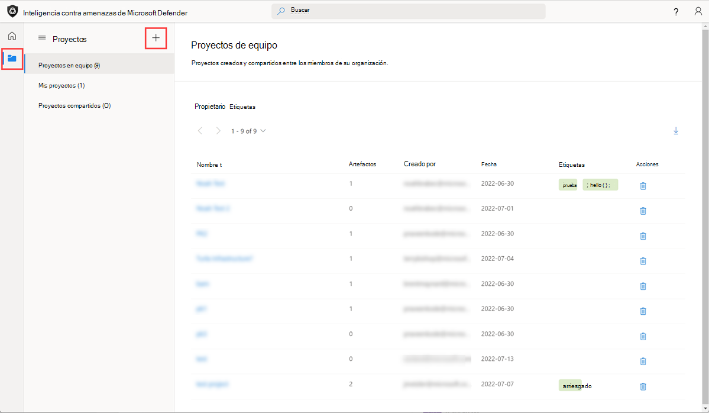
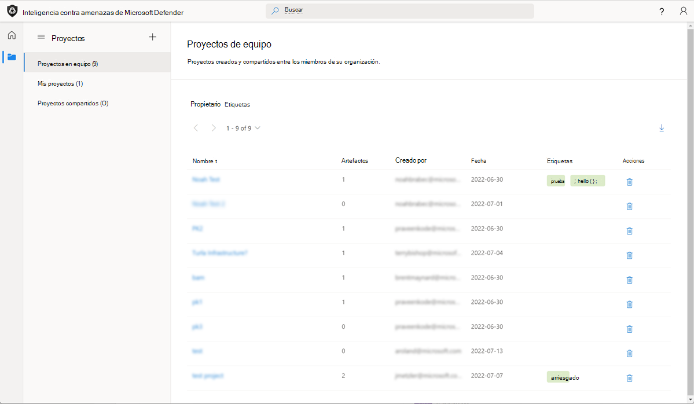

# Uso de proyectos

La plataforma Inteligencia contra amenazas de Microsoft Defender (Defender TI) permite a los usuarios desarrollar tipos de proyectos personales o de equipo privados para organizar indicadores de interés e indicadores de riesgo a partir de una investigación. Los proyectos contienen una lista de todos los artefactos asociados y un historial detallado que conserva los nombres, descripciones, colaboradores y perfiles de supervisión.

Cuando un usuario busca una dirección IP, un dominio o un host en Defender TI, si ese indicador aparece dentro de un proyecto al que el usuario tiene acceso, puede seleccionar la hoja Proyectos dentro de la sección Inteligencia y navegar a los detalles del proyecto para obtener más contexto sobre el indicador antes de revisar los demás conjuntos de datos para obtener más información. Como alternativa, los usuarios pueden ver sus proyectos de equipo privado seleccionando el icono Proyectos en el panel de menús izquierdo.

Al visitar los detalles de un proyecto se muestra una lista de todos los artefactos asociados y un historial detallado que conserva todo el contexto descrito anteriormente. Los usuarios de la misma organización ya no necesitan dedicar tiempo a comunicarse de un lado a otro. Los perfiles de actor de amenazas se pueden compilar dentro de Ti de Defender y servir como un conjunto "vivo" de indicadores. A medida que se detecta o encuentra nueva información, se puede agregar a ese proyecto.

La plataforma de TI de Defender permite a los usuarios desarrollar varios tipos de proyecto para organizar indicadores de interés e indicadores de riesgo a partir de una investigación.

El propietario de un proyecto puede agregar colaboradores (usuarios que aparecen en su inquilino de Azure con una licencia de Defender TI Premium). Esto concede a los colaboradores permisos para realizar cambios en el proyecto como si fueran el propietario del proyecto. La excepción es que los colaboradores no pueden eliminar proyectos. Los colaboradores verán los proyectos que se han compartido con ellos en la sección Proyectos compartidos de la página principal de proyectos.

Los usuarios también pueden descargar artefactos dentro de un proyecto seleccionando el icono de descarga. Esta es una excelente manera de que los equipos de búsqueda de amenazas usen sus conclusiones de una investigación para bloquear los indicadores de riesgo o crear reglas de detección adicionales dentro de su SIEM.

**Preguntas que los proyectos pueden ayudar a responder:**

- ¿Ha creado uno de mis compañeros un proyecto de equipo que incluye este indicador?

   - Si es así, ¿qué otros indicadores relacionados de riesgo ha capturado este miembro del equipo y qué descripción y etiquetas incluyeron para describir el tipo de investigación?

- ¿Cuándo editó por última vez este miembro del equipo el proyecto?

    

## Requisitos previos

- Una cuenta de Azure Active Directory o microsoft personal. [Iniciar sesión o crear una cuenta](https://signup.microsoft.com/)
- Una licencia Premium de Inteligencia contra amenazas de Microsoft Defender (Defender TI).
    > [!NOTE]
    > Los usuarios sin una licencia de Defender TI Premium seguirán siendo capaces de iniciar sesión en el portal de Inteligencia sobre amenazas de Defender y acceder a nuestra oferta gratuita de TI de Defender.

## Abrir la página principal de Inteligencia sobre amenazas de Defender TI

1. Acceda al [portal de Inteligencia sobre amenazas de Defender](https://ti.defender.microsoft.com/).
2. Complete la autenticación de Microsoft para acceder al portal.

## Creación de un proyecto

Los usuarios pueden crear un proyecto de dos maneras diferentes, a través de la página principal de proyectos o mientras investigan los resultados.

Al iniciar sesión en la página principal de proyectos de TI de Defender, los usuarios se presentan con un panel que muestra los proyectos que poseen o que se han compartido con otros usuarios de TI de Defender en su inquilino. Directamente desde esta vista, los usuarios pueden decidir crear un proyecto, simplemente seleccionando el icono "+" o visitando la página del proyecto mediante el menú de cajón izquierdo.

1. Para crear un proyecto desde la página principal del proyecto, vaya al icono "Proyectos" y seleccione el icono "Agregar nuevo proyecto" en la página principal de proyectos.

    

    Al realizar búsquedas en Ti de Defender, los usuarios pueden seleccionar "Agregar al proyecto" para agregar el artefacto (indicador de peligro) a un proyecto existente o crear un nuevo proyecto al que agregar el artefacto.

2. Para crear un proyecto a través de una investigación, realice una búsqueda de indicadores en la barra de búsqueda de Inteligencia sobre amenazas y haga clic en el icono "Agregar al proyecto".

3. Si crea un nuevo proyecto, seleccione el vínculo "Agregar nuevo proyecto", rellene los campos necesarios y "Guardar" el nuevo proyecto. Si ya tiene un proyecto existente al que desea agregar el artefacto, seleccione o desplácese hacia abajo y seleccione el proyecto que desee.

    

## Administración de proyectos

Una vez que un usuario ha creado proyectos, puede administrarlos dentro de la parte Proyectos de la plataforma. La página principal inicial del proyecto resalta todos los proyectos que el usuario puede ver y proporciona métodos de filtrado basados en las propiedades del proyecto. La página Inicio del proyecto tiene como valor predeterminado los proyectos de equipo asociados a los usuarios de TI de Defender en su inquilino. Tienen la opción de seleccionar los proyectos personales que han creado, así como los proyectos que se han compartido con ellos para contribuir.

1. Los usuarios pueden ver los detalles de un proyecto simplemente haciendo clic en el nombre del proyecto.
2. En función del nivel de acceso, los usuarios pueden realizar cambios en el proyecto directamente haciendo clic en el botón editar de la esquina superior derecha.
3. Los usuarios también pueden eliminar un proyecto si son propietarios del proyecto. También pueden elegir agregar artefactos manualmente mediante el botón "Agregar artefactos" en la esquina superior derecha.

## Procedimientos recomendados

Cuando se trata de usar Defender TI para investigar posibles amenazas, se recomienda ejecutar los siguientes flujos de trabajo, ya que estos pasos le permitirán recopilar inteligencia estratégica y operativa antes de profundizar en la inteligencia táctica.

Los usuarios pueden realizar varios tipos de búsquedas en Ti de Defender. Por lo tanto, es importante abordar el método de recopilación de inteligencia de una manera que le presente resultados amplios antes de profundizar en la investigación de indicadores específicos. Por ejemplo, si busca una dirección IP en la página principal de Defender TI, ¿qué artículos tienen una asociación con esa dirección IP? ¿Qué información presentan estos artículos sobre la dirección IP que, de lo contrario, no encontraría navegando directamente a la pestaña Datos de la dirección IP para el enriquecimiento del conjunto de datos? Por ejemplo, ¿se ha identificado esta dirección IP como un posible C2, quién es el actor de amenazas, qué otros indicadores relacionados de peligro se enumeran en el artículo, qué TTP es el actor de amenazas que usa y a quién se dirige?

Además de realizar varios tipos de búsquedas con Ti de Defender, los usuarios pueden colaborar en investigaciones conjuntamente. Dicho esto, se anima a los usuarios a crear proyectos, agregar indicadores relacionados con una investigación a un proyecto y agregar colaboradores a un proyecto si más de una persona está trabajando en la misma investigación. Esto ayuda a reducir el tiempo dedicado al análisis de las mismas IOC y debería dar lugar a un flujo de trabajo más rápido observado.