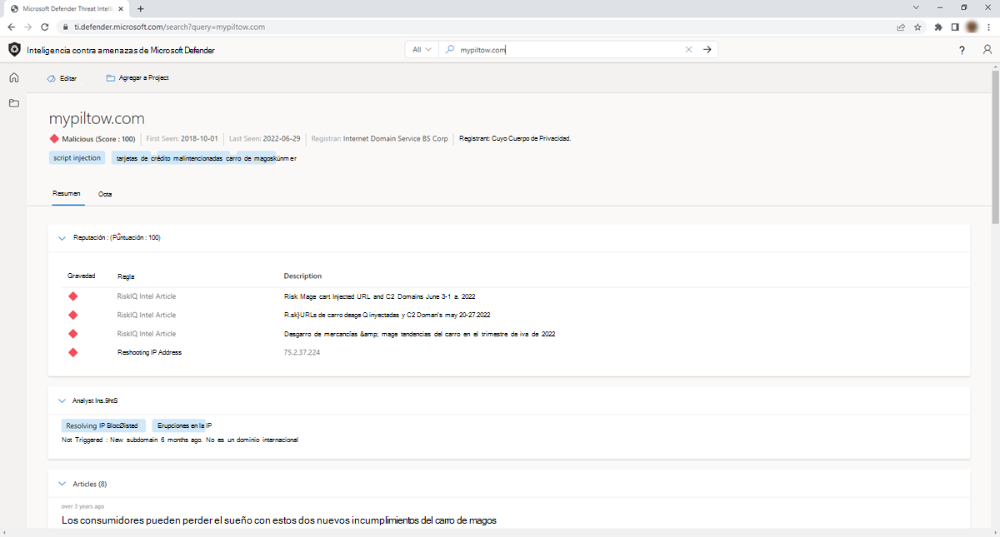
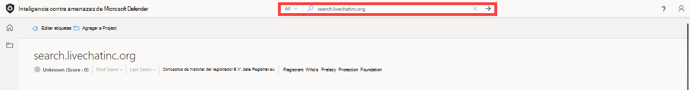
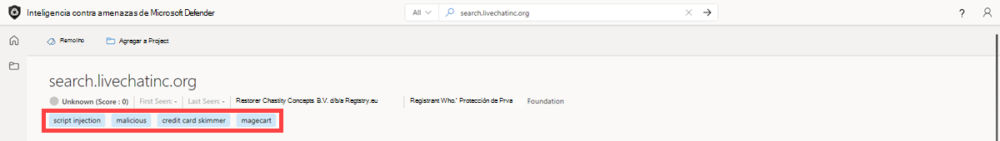

# Uso de etiquetas
las etiquetas Inteligencia contra amenazas de Microsoft Defender (TI de Defender) se usan para proporcionar información rápida sobre un artefacto, ya sea derivado por el sistema o generado por otros usuarios. Las etiquetas ayudan a los analistas a conectar los puntos entre incidentes e investigaciones actuales y su contexto histórico para mejorar el análisis.

La plataforma de TI de Defender ofrece dos tipos de etiquetas: etiquetas personalizadas y del sistema.

## Requisitos previos

- Una cuenta de Azure Active Directory o microsoft personal. [Iniciar sesión o crear una cuenta](https://signup.microsoft.com/)
- Una licencia Premium de Inteligencia contra amenazas de Microsoft Defender (Defender TI).
    > [!NOTE]
    > Los usuarios sin una licencia de Defender TI Premium seguirán siendo capaces de iniciar sesión en el portal de Inteligencia sobre amenazas de Defender y acceder a nuestra oferta gratuita de TI de Defender.

## Etiquetas del sistema

La plataforma genera automáticamente estas etiquetas para que los usuarios guíen su análisis y no requieran ninguna entrada ni esfuerzo por parte del usuario.

Las etiquetas del sistema pueden incluir:

- **Enrutable:** indica que el artefacto es accesible.
- **ASN:** extrae una parte abreviada de una descripción de ASN de dirección IP en una etiqueta para proporcionar contexto a los analistas a quién pertenece la dirección IP.
- **Dinámico:** indica si un dominio es propiedad de un servicio DNS dinámico, como No-IP o Change IP.
- **Sinkhole:** indica que una dirección IP es un receptor de investigación que usan las organizaciones de seguridad para investigar las campañas de ataque y, por lo tanto, los dominios asociados no se conectarán directamente entre sí.

## Etiquetas personalizadas

Etiquetas personalizadas dentro de Defender TI para poner contexto a los indicadores de riesgo (IOC) y simplificar aún más el análisis mediante la identificación de los dominios que se conocen como incorrectos de los informes públicos o que han sido clasificados por los analistas de la empresa. Los usuarios crean manualmente estas etiquetas en función de sus propias investigaciones. Estas etiquetas permiten a los usuarios compartir información clave sobre un artefacto con otros usuarios de licencia de Defender TI Premium dentro de su inquilino.

## Agregar, modificar y quitar etiquetas

Los usuarios pueden agregar sus propias etiquetas personalizadas al clúster de etiquetas si las escriben en la barra de etiquetas. Estas etiquetas se pueden ver para el usuario individual y los miembros del equipo del usuario si su organización es un cliente de Ti de Defender. Las etiquetas introducidas en el sistema son privadas y no compartidas con la comunidad más grande.

Al igual que los usuarios pueden agregar etiquetas, también pueden modificarlas o quitarlas. Una vez que un usuario agrega una etiqueta, ese mismo usuario o otro usuario con licencia de pago puede modificarla o quitarla dentro de su organización enterprise. Esto permite una colaboración sencilla entre el equipo de seguridad.

1. Acceda al [portal de Inteligencia sobre amenazas de Defender](https://ti.defender.microsoft.com/) .
2. Complete la autenticación de Microsoft para acceder al portal.
3. Busque un indicador en la barra de búsqueda de Inteligencia sobre amenazas para el que desea agregar etiquetas.

    

4. Seleccione la lista desplegable "Editar etiquetas" en la esquina superior izquierda del portal de Ti de Defender.

    

5. Agregue las etiquetas que quiera asociar a este indicador.

    > [!Note]
    > Presione la tecla Tab para agregar un nuevo indicador.

    

6. Una vez agregadas todas las etiquetas, guarde los cambios seleccionando el botón Guardar.

    

7. Para editar etiquetas, repita el paso 3. Para quitar las etiquetas, seleccione la "X" al final del nombre de la etiqueta o agregue nuevas etiquetas como hizo en el paso 4.

8. Guarde los cambios.

    

## Visualización y búsqueda de etiquetas

Los usuarios pueden ver las etiquetas agregadas por ellos mismos u otros usuarios dentro de su inquilino después de buscar un artefacto de ip, dominio o host.

1. Acceda al [portal de Inteligencia sobre amenazas de Defender](https://ti.defender.microsoft.com/).
2. Complete la autenticación de Microsoft para acceder al portal.
3. Los usuarios pueden buscar en etiquetas personalizadas a través de la búsqueda de inteligencia sobre amenazas de Defender TI seleccionando el tipo de búsqueda Etiqueta en la barra de búsqueda de Inteligencia sobre amenazas y buscando en el valor de etiqueta para identificar todos los demás indicadores que comparten ese mismo valor de etiqueta.

    

Flujo de trabajo de casos de uso de etiquetas comunes Supongamos que un analista de evaluación de prioridades investiga un incidente y detecta que está relacionado con la suplantación de identidad (phishing). Ese analista puede agregar "phish" como etiqueta a los indicadores de riesgo relacionados con ese incidente. Más adelante, el equipo de búsqueda de amenazas y respuesta a incidentes puede analizar aún más estos indicadores de peligro y trabajar con sus homólogos de inteligencia sobre ciberamenazas para identificar qué grupo de actores fue responsable de su incidente de suplantación de identidad (phishing). A continuación, pueden agregar otra etiqueta "[nombre de actor]" a esos indicadores de riesgo o qué infraestructura se usó que los conectó a otros indicadores relacionados de peligro, como una etiqueta personalizada "[SHA-1 hash]".

## Siguientes pasos

Para más información, vea:

- [¿Qué es Inteligencia contra amenazas de Microsoft Defender (TI de Defender)?](what-is-microsoft-defender-threat-intelligence-defender-tI.md)
- [Conjuntos de datos](data-sets.md)
- [Ordenación, filtrado y descarga de datos](sorting-filtering-and-downloading-data.md)
- [Puntuación de reputación](reputation-scoring.md)
- [Conclusiones de analistas](analyst-insights.md)
- [Uso de proyectos](using-projects.md)