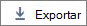

# Microsoft 365 Reports en el centro de administración: usuarios activosMicrosoft 365 Reports in the admin center - Active Users

El panel de **informes** de Microsoft 365 muestra la información general de la actividad en todos los productos de la organización.The Microsoft 365 **Reports** dashboard shows you the activity overview across the products in your organization. Le permite explorar informes individuales de nivel de producto para proporcionarle información más pormenorizada sobre la actividad dentro de cada producto.It enables you to drill in to individual product level reports to give you more granular insight about the activities within each product. Consulte [el tema de información general de los informes](activity-reports.md).Check out [the Reports overview topic](activity-reports.md).
  
Por ejemplo, puede usar el informe **Usuarios activos** para conocer cuántas licencias de productos están en uso por usuarios de la organización y explorar en profundidad la información sobre los productos que usa cada usuario. Este informe puede ayudar a los administradores a identificar productos no usados o usuarios que pueden necesitar aprendizaje o información adicional.For example, you can use the **Active Users** report to find out how many product licenses are being used by individuals in your organization, and drill down for information about which users are using what products. This report can help administrators identify underutilized products or users that might need additional training or information. 
  
> [!NOTE]
> Debe ser administrador global, lector global o lector de informes en Microsoft 365 o un administrador de Exchange, SharePoint, Teams, Team Communications o Skype empresarial para ver los informes.You must be a global administrator, global reader or reports reader in Microsoft 365 or an Exchange, SharePoint, Teams Service, Teams Communications, or Skype for Business administrator to see reports.  

## Obtener acceso al informe Usuarios activosHow to get to the Active Users report

1. En el centro de administración de, vaya a **Informes** \> <a href="https://go.microsoft.com/fwlink/p/?linkid=2074756" target="_blank">página</a> uso.In the admin center, go to the **Reports** \> <a href="https://go.microsoft.com/fwlink/p/?linkid=2074756" target="_blank">Usage</a> page.

2. Seleccione **Office 365** \> **usuarios activos** de Office 365 de la lista desplegable.Select **Office 365** \> **Active users** from the drop-down. 

## Interpretar el informe Usuarios activosInterpret the Active Users report

  
|||
|:-----|:-----|
|1.1.    |El informe **Usuarios activos** permite ver las tendencias de los últimos 7 días, 30 días, 90 días o 180 días.The **Active Users** report can be viewed for trends over the last 7 days, 30 days, 90 days, or 180 days. Sin embargo, si ve un día concreto en el informe, la tabla (7) mostrará los datos de hasta 28 días a partir de la fecha actual (no la fecha en que se generó el informe).However, if you view a particular day in the report, the table (7) will show data for up to 28 days from the current date (not the date the report was generated).    |
|2.2.    |Los datos de cada informe normalmente cubren hasta las últimas 24 a 48 horas.The data in each report usually covers up to the last 24 to 48 hours.    |
|3.3.    |En el gráfico **Usuarios activos** se muestran los usuarios activos diarios en el período de informe separados por producto.The **Active Users** chart shows you daily active users in the reporting period separated by product.    El gráfico **Servicios** se muestra el número de usuarios por tipo de actividad y servicio.The **Services** chart shows you count of users by activity type and Service.    |
|4.4.    | En el gráfico **Usuarios activos**, en el eje x se muestra el período de informe seleccionado y en el eje y se muestran los usuarios activos diarios separados y codificados por colores según el tipo de licencia.On the **Active Users** chart, the x axis shows the selected reporting time period and the y axis displays the daily active users separated and color coded by licence type.     En el gráfico de actividad **Servicios**, en el eje X se muestran los servicios individuales habilitados para los usuarios en el período especificado y en el eje Y se muestra el número de usuarios por estado de actividad, codificados por colores según el estado de la actividad.On the **Services** activity chart, the X axis displays the individual services your users are enabled for in the given time period and the Y axis is the Count of users by activity status, color coded by activity status.    |
|5.5.    |Puede filtrar la serie que ve en el gráfico seleccionando un elemento de la leyenda.You can filter the series you see on the chart by selecting an item in the legend. Si cambia esta selección, no cambiará la información en la tabla de cuadrícula.Changing this selection doesn't change the info in the grid table.    |
|6.6.    |También puede exportar los datos del informe a un archivo. csv de Excel; para ello, seleccione el vínculo **exportar**  .You can also export the report data into an Excel .csv file, by selecting the **Export**  link. Se exportarán los datos de todos los usuarios y podrá efectuar una ordenación y un filtrado sencillos para un análisis más detallado.This exports data of all users and enables you to do simple sorting and filtering for further analysis. Si tiene menos de 2000 usuarios, puede ordenar y filtrar en la tabla en el propio informe.If you have less than 2000 users, you can sort and filter within the table in the report itself. Si tiene más de 2000 usuarios, para poder filtrar y ordenar, tendrá que exportar los datos.If you have more than 2000 users, in order to filter and sort, you will need to export the data.    |
|7.7.    |Puede cambiar la información que se muestra en la tabla de cuadrícula con controles de columna.You can change what information is displayed in the grid table with column controls.    Si la suscripción se ha operado por 21Vianet, no verá Yammer.If your subscription is operated by 21Vianet, then you will not see Yammer.     |
|||

Si las directivas de la organización le impiden ver los informes en los que la información del usuario es identificable, puede cambiar la configuración de privacidad de todos estos informes.If your organization's policies prevents you from viewing reports where user information is identifiable, you can change the privacy setting for all these reports. Consulte la sección **cómo ocultar los detalles del nivel de usuario** en [informes de actividad en el centro de administración de Microsoft 365](activity-reports.md).Check out the **How do I hide user level details?** section in [Activity Reports in the Microsoft 365 admin center](activity-reports.md).  
