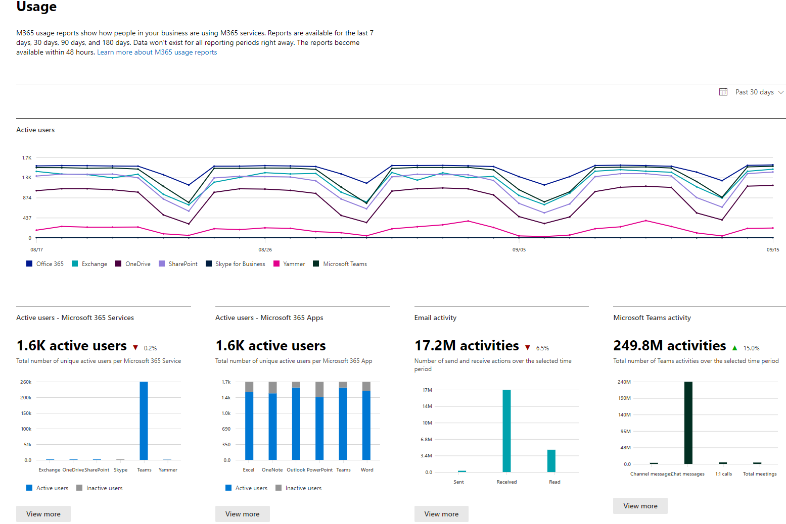

# Informes de Microsoft 365 en el centro de administraciónMicrosoft 365 Reports in the admin center

Puede ver de forma fácil el uso que hacen los usuarios de su empresa de los servicios de Microsoft 365. Por ejemplo, puede identificar quién usa mucho un servicio y ha alcanzado la cuota de este o quién puede no necesitar para nada una licencia de Microsoft 365.You can easily see how people in your business are using Microsoft 365 services. For example, you can identify who is using a service a lot and reaching quotas, or who may not need an Microsoft 365 license at all.
  
Los informes están disponibles para los últimos 7, 30, 90 o 180 días. Los datos no estarán disponibles para todos los períodos de informes al instante. Los informes están disponibles en 48 horas.Reports are available for the last 7 days, 30 days, 90 days, and 180 days. Data won't exist for all reporting periods right away. The reports become available within 48 hours.
  
Vea este vídeo para obtener información general sobre cómo puede usar los informes:Watch this video for on overview: on how you can use the reports:
  
> [!VIDEO https://www.microsoft.com/videoplayer/embed/fb726f8e-aead-43b2-ba0f-53ba5b886bf7?autoplay=false]
  
## Cómo obtener acceso al panel de informesHow to get to the Reports dashboard

::: moniker range="o365-worldwide"

1. En el centro de administración de, vaya a **Informes** \> <a href="https://go.microsoft.com/fwlink/p/?linkid=2074756" target="_blank">página</a> uso.In the admin center, go to the **Reports** \> <a href="https://go.microsoft.com/fwlink/p/?linkid=2074756" target="_blank">Usage</a> page.

::: moniker-end

::: moniker range="o365-germany"

1. En el <a href="https://go.microsoft.com/fwlink/p/?linkid=848041" target="_blank">centro de administración</a> de vaya a la página **informes** \> **uso** .In the <a href="https://go.microsoft.com/fwlink/p/?linkid=848041" target="_blank">admin center</a>, go to the **Reports** \> **Usage** page.

::: moniker-end

::: moniker range="o365-21vianet"

1. En el <a href="https://go.microsoft.com/fwlink/p/?linkid=850627" target="_blank">centro de administración</a> de vaya a la página **informes** \> **uso** .In the <a href="https://go.microsoft.com/fwlink/p/?linkid=850627" target="_blank">admin center</a>, go to the **Reports** \> **Usage** page.

::: moniker-end

2. Haga clic en el botón **Ver más** en la tarjeta de vista rápida de actividad de un servicio (como el correo electrónico o OneDrive) para ver la página de detalles del informe.Click on the **View more** button from the at-a-glance activity card for a service (such as email or OneDrive) to see the report detail page. En las pestañas, se proporcionan diferentes informes para el servicio.In there different reports for the service are provided in tabs.   

## Quién puede ver los informesWho can see reports

Usuarios que tengan los permisos siguientes:People who have the following permissions:
  
- Administradores globales: le recomendamos que solo unos pocos usuarios de su empresa tengan este rol.Global admins: We recommend that only a few people in your company have this role. Esto reduce los posibles riesgos para su empresa.It reduces the risk to your business.
    
- Administradores de ExchangeExchange admins
    
- Administradores de SharePointSharePoint admins
    
- Administradores de Skype EmpresarialSkype for Business admins

- Lector globalGlobal reader
    
- Lector de informesReports reader

- Administrador de servicios de TeamsTeams Service Administrator

- Administrador de comunicaciones de TeamsTeams Communications Administrator
    
Para obtener más información, vea[sobre los roles de administrador de](../add-users/about-admin-roles.md) y [asignar roles de administrador](../add-users/assign-admin-roles.md).To learn more, see [About admin roles](../add-users/about-admin-roles.md) and [Assign admin roles](../add-users/assign-admin-roles.md).
  
## Qué informes de actividad están disponibles en el centro de administración deWhich activity reports are available in the admin center

Según la suscripción, estos son los informes disponibles.Depending on your subscription, here are the available reports.
  
- [Actividad de correo electrónicoEmail activity](email-activity.md)
    
- [Uso del buzónMailbox usage](mailbox-usage.md)
    
- [Activaciones de OfficeOffice activations](microsoft-office-activations.md)

- [Usuarios activosActive Users](active-users.md)
  
- [Uso de aplicaciones de correo electrónicoEmail apps usage](email-apps-usage.md)

- [Actividad de formulariosForms activity](forms-activity.md)

- [Actividad de Forms ProForms Pro activity](forms-pro-activity.md)
  
- [Grupos de Microsoft 365Microsoft 365 groups](office-365-groups.md)
  
- [Actividad de los usuarios de OneDrive para la EmpresaOneDrive for Business user activity](onedrive-for-business-activity-ww.md)

- [Actividad de usuarios de OneDrive para la Empresa para el gobierno de Estados UnidosOneDrive for Business user activity for US Government](onedrive-for-business-activity.md)

- [Uso de OneDrive para la EmpresaOneDrive for Business usage](onedrive-for-business-usage-ww.md)

- [Uso de OneDrive para la Empresa para el gobierno de Estados UnidosOneDrive for Business usage for US Government](onedrive-for-business-usage.md)

- [Uso de las aplicaciones de Microsoft 365Microsoft 365 Apps usage](microsoft365-apps-usage.md)
  
- [Uso del sitio de SharePointSharePoint site usage](sharepoint-site-usage-ww.md)

- [Uso del sitio de SharePoint para el gobierno de Estados UnidosSharePoint site usage for US Government](sharepoint-site-usage.md)
  
- [Actividad de SharePointSharePoint activity](sharepoint-activity-ww.md)

- [Actividad de SharePoint para el gobierno de Estados UnidosSharePoint activity for US Government](sharepoint-activity.md)
  
- [Actividad de Skype Empresarial OnlineSkype for Business Online activity](https://docs.microsoft.com/SkypeForBusiness/skype-for-business-online-reporting/activity-report)
  
- [Actividad de conferencias organizada de Skype Empresarial OnlineSkype for Business Online conference organized activity](https://docs.microsoft.com/SkypeForBusiness/skype-for-business-online-reporting/conference-organizer-activity-report)
  
- [Actividad de participantes de conferencias de Skype Empresarial OnlineSkype for Business Online conference participant activity](https://docs.microsoft.com/SkypeForBusiness/skype-for-business-online-reporting/conference-participant-activity-report)
  
- [Actividad punto a punto de Skype Empresarial OnlineSkype for Business Online peer-to-peer activity](https://docs.microsoft.com/SkypeForBusiness/skype-for-business-online-reporting/peer-to-peer-activity-report)
  
::: moniker range="o365-worldwide"

- [Actividad de YammerYammer activity](yammer-activity-report-ww.md)

::: moniker-end

::: moniker range="o365-worldwide"

- [Actividad de Yammer para el gobierno de Estados UnidosYammer activity for US Government](yammer-activity-report.md)

::: moniker-end

::: moniker range="o365-worldwide"

- [Uso de dispositivos en YammerYammer device usage](yammer-device-usage-report-ww.md)

::: moniker-end

::: moniker range="o365-worldwide"

- [Uso de dispositivos de Yammer para el gobierno de EE. UU.Yammer device usage for US Government](yammer-device-usage-report.md)

::: moniker-end

::: moniker range="o365-worldwide"

- [Informe de actividad de los grupos de YammerYammer groups activity report](yammer-groups-activity-report-ww.md)

::: moniker-end

::: moniker range="o365-worldwide"

- [Informe de actividad de los grupos de Yammer para el gobierno de EE. UU.Yammer groups activity report for US Government](yammer-groups-activity-report.md)

::: moniker-end

::: moniker range="o365-worldwide"

- [Actividad de los usuarios de Microsoft TeamsMicrosoft Teams user activity](microsoft-teams-user-activity-preview.md)

::: moniker-end

::: moniker range="o365-worldwide"

- [Actividad de usuario de Microsoft Teams para el gobierno de EE. UU.Microsoft Teams user activity for US Government](microsoft-teams-user-activity.md)

::: moniker-end

::: moniker range="o365-worldwide"

- [Uso de dispositivos de Microsoft TeamsMicrosoft Teams device usage](microsoft-teams-device-usage-preview.md)

::: moniker-end

::: moniker range="o365-worldwide"

- [Uso de dispositivos de Microsoft Teams para el gobierno de EE. UU.Microsoft Teams device usage for US Government](microsoft-teams-device-usage.md)

::: moniker-end

## Cómo ver la información de las licenciasHow to view licensing information

- Para ver el número de licencias asignadas y sin asignar, en el centro de administración de, vaya a la **de facturación** \> <a href="https://go.microsoft.com/fwlink/p/?linkid=842264" target="_blank">licencias</a> de la página.To see how many licenses you have assigned and unassigned, in the admin center, go to the **Billing** \> <a href="https://go.microsoft.com/fwlink/p/?linkid=842264" target="_blank">Licenses</a> page.
    
- Para ver quién tiene una licencia, sin licencia o como invitado, en el centro de administración, vaya a la **usuarios** \> <a href="https://go.microsoft.com/fwlink/p/?linkid=834822" target="_blank">usuarios activos</a> página.To see who is licensed, unlicensed, or guest, in the admin center, go to the **Users** \> <a href="https://go.microsoft.com/fwlink/p/?linkid=834822" target="_blank">Active users</a> page. 
  
## Cómo ver la información de uso de un usuario en concretoHow to view usage information for a specific user

Use los informes de servicio para buscar cuánto utiliza un servicio un usuario en concreto. Por ejemplo, para ver cuánto espacio de almacenamiento del buzón ha consumido un usuario en concreto, abra el informe de uso del buzón y ordene los usuarios por nombre. Si tiene miles de usuarios, exporte el informe a Excel para filtrar la lista rápidamente.Use the service reports to research how much a specific user is using the service. For example, to find out how much mailbox storage a specific user has consumed, open the Mailbox usage report, and sort the users by name. If you have thousands of users, export the report to Excel so you filter through the list quickly.
  
No puede generar un informe en el que especifique una cuenta de usuario y, a continuación, obtener una lista de los servicios que están utilizando y la cuota de uso.You can't generate a report where you enter a user's account and then get a list which services they are using and how much.
  
## Ocultar detalles de usuario en los informesHide user details in the reports

Si desea ocultar la información de nivel de usuario cuando está generando sus informes, rápidamente puede realizar ese cambio en el centro de administración.If you want to hide user level information when you're generating your reports, you can quickly make that change in the admin center.
  
1. En el centro de administración, vaya a la página **Configuración** \><a href="https://go.microsoft.com/fwlink/p/?linkid=2053743" target="_blank">de servicios &amp;complementos</a>.In the admin center, go to the **Settings** \> <a href="https://go.microsoft.com/fwlink/p/?linkid=2053743" target="_blank">Services &amp; add-ins</a> page.

2. Select **Informes**Select **Reports** . 
  
3. En el panel **informes** , seleccione las opciones que desee y, a continuación, guarde los cambios.In the **Reports** pane, select the options you want, and then save your changes.
  
La lista de usuarios será similar a la siguiente:Your user list will look like this:
  

  
Aplicar estos cambios a los informes del panel Informes puede tardar unos minutos. Esta configuración también se aplica a la API de informes.It'll take a few minutes for these changes to take effect on the reports in the reports dashboard. This setting also applies to the reports API.
  
## ¿Qué ocurre con los datos de uso cuando se cierra una cuenta de usuario?What happens to usage data when a user account is closed?

Siempre que cierre una cuenta de usuario, Microsoft eliminará los datos de uso de ese usuario en un plazo de 30 días.Whenever you close a user's account, Microsoft will delete that user's usage data within 30 days. Este usuario se incluirá en el gráfico de actividad totales (ver número 1) para los períodos en los que estaba activo, pero no aparecerá en la tabla detalles del usuario (ver número 2).That user will still be included in the Activity chart totals (see number 1) for the periods she was active in, but will not appear in the User Details table (see number 2).
  
Sin embargo, si selecciona un día concreto (ver número 3), hasta 28 días después de la fecha actual, el informe mostrará el uso que el usuario hace a ese día en la tabla detalles del usuario (ver número 2).However, when you select a particular day (see number 3), up to 28 days from the current date, the report show the user's usage for that day in the User Details table (see number 2).
  
## Artículos relacionadosRelated articles

[Informes del centro de cumplimiento de seguridad &amp;Reports in the Security &amp; Compliance Center](https://docs.microsoft.com/microsoft-365/compliance/reports-in-security-and-compliance)
  
