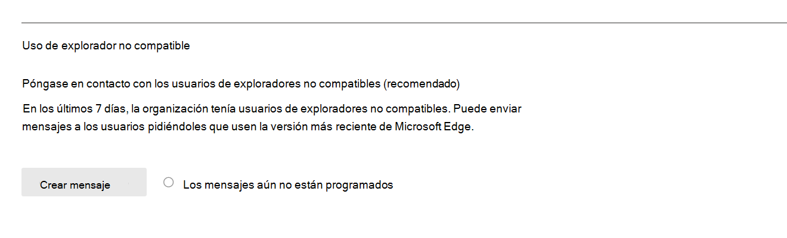

# Microsoft 365 Informes en el Centro de administración: uso del explorador de Microsoft

El panel Microsoft 365 **informes le** muestra una introducción a la actividad en todos los productos de la organización. Le permite profundizar en informes de nivel de producto individuales para ofrecer información más detallada sobre las actividades dentro de cada producto. Consulte [el tema de información general sobre los informes](activity-reports.md). En el informe de uso del explorador de Microsoft, puede obtener información sobre Internet Explorer, Microsoft Edge (versión anterior) y el nuevo uso Microsoft Edge explorador. Los informes de uso se basan Microsoft 365 los servicios en línea a los que se accede mediante un explorador de Microsoft.

 > [!NOTE]
 > Debe ser un administrador global, un lector global o un lector de informes en Microsoft 365 o un administrador Exchange, SharePoint o Skype Empresarial para ver informes.

## Cómo obtener acceso al informe de uso del explorador de Microsoft

1. En el centro de administración de, vaya a **Informes** \> <a href="https://go.microsoft.com/fwlink/p/?linkid=2074756" target="_blank">página</a> uso. 
2. En la página principal del panel, haga clic en **el botón Ver más** en la tarjeta de uso del explorador de Microsoft.

## Cómo notificar a los usuarios que actualicen su explorador

Los administradores globales pueden participar en el envío de mensajes a usuarios mediante servicios Microsoft 365 en Edge Legacy (no admitido) e Internet Explorer (pronto no se admite). Este mensaje dirigido notifica a los usuarios que la compatibilidad con estos exploradores finalizará pronto y se vincula a un artículo de soporte técnico con información sobre Microsoft Edge y pasos sencillos a seguir para cambiar de explorador. 

Puede encontrar esta característica en la página de informe. Una vez creado el mensaje, se notifica a los usuarios con la frecuencia especificada hasta el 17 de agosto de 2021. Puedes desactivar esta característica en cualquier momento para dejar de enviar notificaciones a los usuarios. Para empezar a enviar notificaciones de nuevo, vuelve a activar la característica.

Para obtener más información, [vea Microsoft Edge ayuda para & aprendizaje](https://support.microsoft.com/microsoft-edge).

## Interpretar el informe de uso del explorador de Microsoft

|Elemento|Descripción|
 |:-----|:-----|
 |1.   |El **informe de uso del** explorador de Microsoft se puede ver para ver las tendencias de los últimos 7 días, 30 días, 90 días o 180 días.    |
 |2.   |Los datos de cada informe suelen abarcar hasta los últimos siete días.   |
 |3.   |El **gráfico Usuarios activos** diarios muestra el recuento diario de usuarios para Microsoft Edge, Microsoft Edge (versión anterior) e Internet Explorer cuando se usa para acceder a Microsoft 365 servicios.   |
 |4. |El **gráfico Usuarios activos** muestra el número total de usuarios que usan Microsoft Edge, Microsoft Edge (versión anterior) e Internet Explorer cuando se usan para acceder Microsoft 365 servicios durante el período de tiempo seleccionado. |
 |5. |En la tabla, se muestra un desglose de los datos en el nivel de usuario. Puede agregar o quitar columnas de la tabla.    **Username** es la dirección de correo electrónico del usuario que se conectó a Microsoft 365 con exploradores de Microsoft.  **La Microsoft Edge** muestra una marca de graduación si el usuario Microsoft Edge para conectarse a Microsoft 365 servicios.  **El Microsoft Edge (versión anterior)** muestra una marca de graduación si el usuario Microsoft Edge (versión anterior) para conectarse a Microsoft 365 servicios.  **Internet Explorer usado** muestra una marca de graduación si el usuario usó Internet Explorer para conectarse a Microsoft 365 servicios. |
 |6. |Seleccione el **icono Elegir columnas** para agregar o quitar columnas del informe.|
 |7. |También puede exportar los datos del informe a un archivo Excel .csv seleccionando el **vínculo** Exportar. Esto exporta datos para todos los usuarios y permite realizar una agregación, ordenación y filtrado simples para un análisis posterior. Si tiene menos de 100 usuarios, puede ordenar y filtrar dentro de la tabla en el propio informe. Si tiene más de 100 usuarios, para filtrar y ordenar, tendrá que exportar los datos.|
