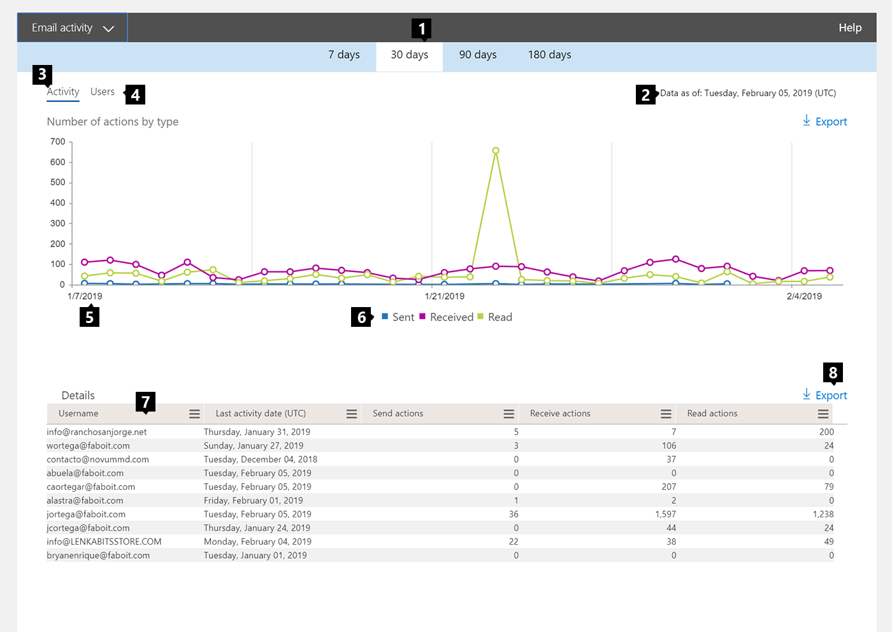

# Informes de Microsoft 365 en el centro de administración: actividad de correo electrónico

El panel de **informes** de Microsoft 365 muestra la información general de la actividad en todos los productos de la organización. Le permite explorar informes individuales de nivel de producto para proporcionarle información más pormenorizada sobre la actividad dentro de cada producto. Consulte [el tema de información general de los informes](activity-reports.md).
  
Por ejemplo, puede obtener una vista de alto nivel del tráfico de correo electrónico de su organización desde la página Informes. Luego, puede desplazarse al widget Actividad de correo electrónico para consultar las tendencias y los detalles de nivel de usuario de la actividad de correo electrónico de su organización.
  
> [!NOTE]
> Debe ser administrador global, lector global o lector de informes en Microsoft 365 o un administrador de Exchange, SharePoint o Skype empresarial para ver los informes. 

## Obtener acceso al informe de actividad de correo electrónico

1. En el centro de administración de, vaya a **Informes** \> <a href="https://go.microsoft.com/fwlink/p/?linkid=2074756" target="_blank">página</a> uso.

    
2. En la lista desplegable **seleccionar un informe** , seleccione **** \> **actividad de correo electrónico**de Exchange.
  
## Interpretar el informe de actividad de correo electrónico

Puede obtener una vista de la actividad de correo electrónico de su usuario consultando los gráficos **Actividad** y **Usuarios**. 
  

  
|||
|:-----|:-----|
|1.    |El informe **Actividad de correo electrónico** se puede visualizar para las tendencias de los últimos 7 días, 30 días, 90 días o 180 días. Sin embargo, si selecciona un día concreto en el informe, la tabla (7) mostrará los datos de hasta 28 días a partir de la fecha actual (no la fecha en que se generó el informe).    |
|2.    |Los datos de cada informe normalmente cubren hasta las últimas 24 a 48 horas.    |
|3.    |El gráfico **Actividad** le permite consultar la tendencia de la actividad de correo electrónico presente en su organización. Puede analizar la división de las actividades de envío, lectura o recepción de correo electrónico.    |
|4.    |El gráfico **Usuario** le permite consultar la tendencia de la cantidad de usuarios únicos que generan las actividades de correo electrónico. Puede consultar la tendencia de los usuarios que llevan a cabo actividades de envío, lectura o recepción de correo electrónico.    |
|5.    | En el gráfico **Actividad**, el eje Y es el número de actividades de los tipos de correo electrónico enviado, recibido y leído.     En el gráfico de actividad **Usuarios**, el eje Y es la actividad que lleva a cabo el usuario de los tipos de correo electrónico enviado, recibido y leído.     En ambos gráficos, el eje X es el intervalo de fechas seleccionado para este informe específico.    |
|6.    |Puede filtrar la serie que ve en el gráfico seleccionando un elemento de la leyenda. Por ejemplo, en el gráfico **actividad** , seleccione gráficos de filtro de **envío**, **recepción**o **lectura**  relacionados específicos para ver solo la información relacionada con cada uno de ellos. Si cambia esta selección, no cambiará la información en la tabla de cuadrícula.    |
|7.    | En la tabla se muestra un desglose de las actividades de correo electrónico en el nivel de usuario. Se muestran todos los usuarios que tienen asignado un producto de Exchange y sus actividades de correo electrónico.     **Nombre de usuario** es la dirección de correo electrónico de los usuarios.    **Nombre para mostrar** es el nombre completo del usuario.    **Eliminado** se refiere al usuario cuyo actual estado se ha eliminado, pero que estaba activo durante parte del período de informes del informe.    **Fecha de eliminación** es la fecha en que se eliminó el usuario.    **Fecha de última actividad** hace referencia a la última vez que el usuario realizó una actividad de lectura o envío de correo electrónico.    **Acciones de envío** es el número de veces que se registra una acción de envío de correo electrónico para el usuario.    **Acciones de recepción** es el número de veces que se registra una acción de recepción de correo electrónico para el usuario.    **Acciones de lectura** es el número de veces que se registra una acción de lectura de correo electrónico para el usuario.    **Producto asignado** son los productos que se asignan a este usuario.     Si las directivas de la organización le impiden ver los informes en los que la información del usuario es identificable, puede cambiar la configuración de privacidad de todos estos informes. Consulte la sección **cómo ocultar los detalles del nivel de usuario** en los [informes de actividades del centro de administración de Microsoft 365](activity-reports.md).    |
|8.    |También puede exportar los datos del informe a un archivo. csv de Excel; para ello ****  vínculo exportar botón exportar. Se exportarán los datos de todos los usuarios y podrá efectuar una ordenación y un filtrado sencillos para un análisis más detallado. Si tiene menos de 2000 usuarios, puede ordenar y filtrar en la tabla en el propio informe. Si tiene más de 2000 usuarios, para poder filtrar y ordenar, tendrá que exportar los datos.    |
|||
   
Nota: el informe de actividad de correo electrónico solo está disponible para los buzones que están asociados a usuarios que tienen licencias.
