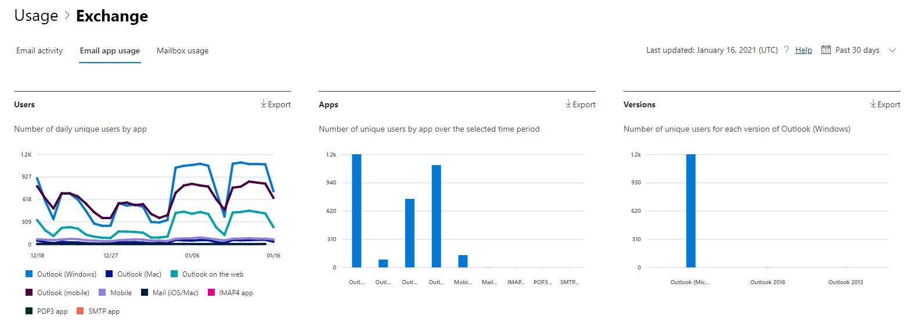

# Informes de Microsoft 365 en el centro de administración: uso de aplicaciones de correo electrónicoMicrosoft 365 Reports in the admin center - Email apps usage

El panel informes  de Microsoft 365 muestra la información general sobre la actividad en todos los productos de la organización.The Microsoft 365 **Reports** dashboard shows you the activity overview across the products in your organization. Le permite explorar informes individuales de nivel de producto para proporcionarle información más pormenorizada sobre la actividad dentro de cada producto.It enables you to drill in to individual product level reports to give you more granular insight about the activities within each product. Consulte [el tema de información general sobre los informes](activity-reports.md).Check out [the Reports overview topic](activity-reports.md). En el informe de uso de aplicaciones de correo electrónico, puede ver cuántas aplicaciones de correo electrónico se conectan a Exchange Online.In the email apps usage report, you can see how many email apps are connecting to Exchange Online. También puede ver la información de versión de las aplicaciones de Outlook que usan los usuarios, lo que le permitirá realizar un seguimiento de aquellos que usan versiones no compatibles para instalar versiones compatibles de Outlook.You can also see the version information of Outlook apps that users are using, which will allow you to follow up with those who are using unsupported versions to install supported versions of Outlook.
  
> [!NOTE]
> Debe ser un administrador global, un lector global o un lector de informes en Microsoft 365 o un administrador de Exchange, SharePoint, Teams Service, Teams Communications o Skype Empresarial para ver informes.You must be a global administrator, global reader or reports reader in Microsoft 365 or an Exchange, SharePoint, Teams Service, Teams Communications, or Skype for Business administrator to see reports.  
 
## Cómo obtener acceso al informe de aplicaciones de correo electrónicoHow to get to the email apps report

1. En el centro de administración de, vaya a **Informes** \> <a href="https://go.microsoft.com/fwlink/p/?linkid=2074756" target="_blank">página</a> uso.In the admin center, go to the **Reports** \> <a href="https://go.microsoft.com/fwlink/p/?linkid=2074756" target="_blank">Usage</a> page.
2. Seleccione **Ver más en** Actividad de correo **electrónico.**Select **View More** under **Email activity**. 
3. En la **lista desplegable Actividad** de correo electrónico, seleccione Uso de aplicaciones de correo electrónico de **Exchange.** \> From the **Email activity** drop-down list, select **Exchange** \> **Email apps usage**.
  
## Interpretar el informe de aplicaciones de correo electrónicoInterpret the email apps report

Puede obtener una vista de la actividad de las aplicaciones de correo electrónico consultando los **gráficos** usuarios **y** clientes.You can get a view into email apps activity by looking at the **Users** and **Clients** charts. 
  

  
|ItemItem|DescripciónDescription|
|:-----|:-----|
|1.1.    |El **informe de uso de** aplicaciones de correo electrónico se puede ver para ver las tendencias de los últimos 7, 30, 90 o 180 días.The **Email apps usage** report can be viewed for trends over the last 7 days, 30 days, 90 days, or 180 days. Sin embargo, si selecciona un día determinado en el informe, la tabla (7) mostrará datos de hasta 28 días a partir de la fecha actual (no la fecha en que se generó el informe).However, if you select a particular day in the report, the table (7) will show data for up to 28 days from the current date (not the date the report was generated).    |
|2.2.    |Los datos de cada informe suelen abarcar hasta las últimas 24 a 48 horas.The data in each report usually covers up to the last 24 to 48 hours.    |
|3.3.    |La vista **Usuarios** muestra el número de usuarios únicos que se han conectado a Exchange Online mediante cualquier aplicación de correo electrónico.The **Users** view shows you the number of unique users that connected to Exchange Online using any email app.    |
|4.4.    |La vista **Aplicaciones** muestra el número de usuarios únicos por aplicación durante el período de tiempo seleccionado.The **Apps** view shows you the number of unique users by app over the selected time period.    |
|5.5.    |La **vista** Versiones muestra el número de usuarios únicos para cada versión de Outlook en Windows.The **Versions** view shows you the number of unique users for each version of Outlook in Windows.    |
|6.6.    | En el gráfico **Usuarios**, el eje Y es el recuento total de usuarios únicos que se han conectado a una aplicación en cualquier día del período de informe.On the **Users** chart, the Y axis is the total count of unique users that connected to an app on any day of the reporting period.     En el gráfico **Usuarios**, el eje X es el número de usuarios únicos que han usado la aplicación durante el período de informe.On the **Users** chart, the X axis is number of unique users that used the app for that reporting period.     En el gráfico **Aplicaciones**, el eje Y es el recuento total de usuarios únicos que han usado una aplicación específica durante el período de informe.On the **Apps** chart, the Y axis is the total count of unique users who used a specific app during the reporting period.     En el gráfico **Aplicaciones**, el eje X es la lista de aplicaciones de su organización.On the **Apps** chart, the X axis is the list of apps in your organization.     En el gráfico **Versiones**, el eje Y es el recuento total de los usuarios únicos que utilizan una versión específica de escritorio de Outlook.On the **Versions** chart, the Y axis is the total count of unique users using a specific version of Outlook desktop. Si el informe no puede resolver el número de versión de Outlook, la cantidad se mostrará como **Undetermined**.If the report can't resolve the version number of Outlook, the quantity will show as **Undetermined**.     En el gráfico **Versiones**, el eje X es la lista de aplicaciones de su organización.On the **Versions** chart, the X axis is the list of apps in your organization.    |
|7.7.    |Puede filtrar la serie que ve en el gráfico seleccionando un elemento de la leyenda.You can filter the series you see on the chart by selecting an item in the legend.    |
|8.8.    | Es posible que no vea todos los elementos de las columnas en la lista siguiente hasta que los agregue.You might not see all the items in the list below in the columns until you add them.  **El** nombre de usuario es el nombre del propietario de la aplicación de correo electrónico.**Username** is the name of the email app's owner.    **La fecha de la última** actividad es la última fecha en la que el usuario leyó o envió un mensaje de correo electrónico.**Last activity date** is the latest date the user read or sent an email message.    **Mail de Mac**, **Outlook para Mac**, **Outlook**, **Outlook móvil** y **Outlook en la web**, son ejemplos de aplicaciones de correo electrónico que es posible que tenga en su organización.**Mac mail**, **Mac Outlook** and **Outlook**, **Outlook mobile** and **Outlook on the web** are examples of email apps you may have in your organization.     Si las directivas de la organización le impiden ver los informes en los que la información del usuario es identificable, puede cambiar la configuración de privacidad de todos estos informes.If your organization's policies prevents you from viewing reports where user information is identifiable, you can change the privacy setting for all these reports. Consulte la sección **¿Cómo ocultar los** detalles del nivel de usuario? en los informes de actividad en el Centro de administración de Microsoft [365.](activity-reports.md)Check out the **How do I hide user level details?** section in the [Activity Reports in the Microsoft 365 admin center](activity-reports.md).    |
|9.9.    |Seleccione **Elegir columnas** para agregar o quitar columnas del informe.Select **Choose columns** to add or remove columns from the report.    |
|10.10.    |También puede exportar los datos del informe a un archivo .csv de Excel seleccionando el **vínculo** Exportar.You can also export the report data into an Excel .csv file, by selecting the **Export** link. Se exportarán los datos de todos los usuarios y podrá efectuar una ordenación y un filtrado sencillos para un análisis más detallado.This exports data of all users and enables you to do simple sorting and filtering for further analysis. Si tiene menos de 2000 usuarios, puede ordenar y filtrar en la tabla en el propio informe.If you have less than 2000 users, you can sort and filter within the table in the report itself. Si tiene más de 2000 usuarios, para poder filtrar y ordenar, tendrá que exportar los datos.If you have more than 2000 users, in order to filter and sort, you will need to export the data.    |
|||
   
