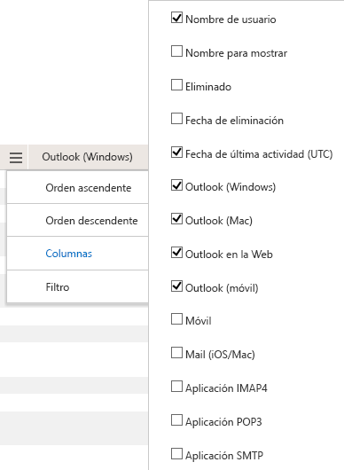

# Informes de Microsoft 365 en el Centro de administración: uso de aplicaciones de correo electrónico

El panel informes  de Microsoft 365 muestra la información general sobre la actividad en todos los productos de su organización. Le permite explorar informes individuales de nivel de producto para proporcionarle información más pormenorizada sobre la actividad dentro de cada producto. Consulte [el tema de información general sobre los informes](activity-reports.md). En el informe de uso de aplicaciones de correo electrónico, puede ver cuántas aplicaciones de correo electrónico se conectan a Exchange Online. También puede ver la información de versión de las aplicaciones de Outlook que usan los usuarios, lo que le permitirá realizar un seguimiento de aquellos que usan versiones no compatibles para instalar versiones compatibles de Outlook.
  
> [!NOTE]
> Debe ser un administrador global, un lector global o un lector de informes en Microsoft 365 o un administrador de Exchange, SharePoint, Teams Service, Teams Communications o Skype Empresarial para ver informes.  
 
## Cómo obtener acceso al informe de aplicaciones de correo electrónico

1. En el centro de administración de, vaya a **Informes** \> <a href="https://go.microsoft.com/fwlink/p/?linkid=2074756" target="_blank">página</a> uso.

    
2. En la **lista desplegable Seleccionar** un informe, seleccione Uso de la aplicación Correo electrónico de **Exchange.** \> 
  
## Interpretar el informe de aplicaciones de correo electrónico

Puede obtener una vista de la actividad de las aplicaciones de correo electrónico consultando los **gráficos** usuarios **y** clientes. 
  

  
|Elemento|Description|
|:-----|:-----|
|1.    |El **informe de uso de** aplicaciones de correo electrónico se puede ver para ver las tendencias de los últimos 7, 30, 90 o 180 días. Sin embargo, si selecciona un día determinado en el informe, la tabla (7) mostrará datos de hasta 28 días a partir de la fecha actual (no la fecha en que se generó el informe).    |
|2.    |Los datos de cada informe suelen abarcar hasta las últimas 24 a 48 horas.    |
|3.    |La vista **Usuarios** muestra el número de usuarios únicos que se han conectado a Exchange Online mediante cualquier aplicación de correo electrónico.    |
|4.    |La vista **Aplicaciones** muestra el número de usuarios únicos por aplicación durante el período de tiempo seleccionado.    |
|5.    |La **vista** Versiones muestra el número de usuarios únicos para cada versión de Outlook en Windows.    |
|6.    | En el gráfico **Usuarios**, el eje Y es el recuento total de usuarios únicos que se han conectado a una aplicación en cualquier día del período de informe.     En el gráfico **Usuarios**, el eje X es el número de usuarios únicos que han usado la aplicación durante el período de informe.     En el gráfico **Aplicaciones**, el eje Y es el recuento total de usuarios únicos que han usado una aplicación específica durante el período de informe.     En el gráfico **Aplicaciones**, el eje X es la lista de aplicaciones de su organización.     En el gráfico **Versiones**, el eje Y es el recuento total de los usuarios únicos que utilizan una versión específica de escritorio de Outlook. Si el informe no puede resolver el número de versión de Outlook, la cantidad se mostrará como **Undetermined**.     En el gráfico **Versiones**, el eje X es la lista de aplicaciones de su organización.    |
|7.    |Puede filtrar la serie que ve en el gráfico seleccionando un elemento de la leyenda. Por ejemplo, en el gráfico **Usuarios,** seleccione Correo **mac** o **Lista de outlook** de clientes de correo  para ver solo la información relacionada con cada uno. Al cambiar esta selección, no se cambia la información de la tabla de cuadrícula. Mail de Mac, Outlook para Mac, Outlook móvil, Outlook de escritorio y Outlook en la web, son ejemplos de aplicaciones de correo electrónico que es posible que tenga en su organización.    |
|8.    | Es posible que no vea todos los elementos de las columnas en la lista siguiente hasta que los agregue.  **El** nombre de usuario es el nombre del propietario de la aplicación de correo electrónico.    **La fecha de la última** actividad es la última fecha en la que el usuario leyó o envió un mensaje de correo electrónico.    **Mail de Mac**, **Outlook para Mac**, **Outlook**, **Outlook móvil** y **Outlook en la web**, son ejemplos de aplicaciones de correo electrónico que es posible que tenga en su organización.     Si las directivas de la organización le impiden ver los informes en los que la información del usuario es identificable, puede cambiar la configuración de privacidad de todos estos informes. Consulte la sección **¿Cómo se ocultan los** detalles del nivel de usuario? en los informes de actividades del Centro de administración [de Microsoft 365.](activity-reports.md)    |
|9.    |Seleccione **Administrar columnas** para agregar o quitar columnas del informe.    |
|10.    |También puede exportar los datos del informe a un archivo .csv de Excel seleccionando el **vínculo** Exportar. Se exportarán los datos de todos los usuarios y podrá efectuar una ordenación y un filtrado sencillos para un análisis más detallado. Si tiene menos de 2000 usuarios, puede ordenar y filtrar en la tabla en el propio informe. Si tiene más de 2000 usuarios, para poder filtrar y ordenar, tendrá que exportar los datos.    |
|||
   
