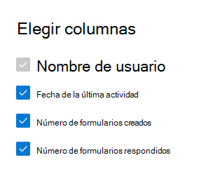

# Informes de Microsoft 365 en el centro de administración: actividad de formularios

El panel de **informes** de Microsoft 365 muestra la información general de la actividad en todos los productos de la organización. Le permite explorar informes individuales de nivel de producto para proporcionarle más información pormenorizada acerca de las actividades dentro de cada producto. Consulte [el tema de información general de los informes](activity-reports.md).
  
Por ejemplo, puede comprender la actividad de cada usuario con licencia para usar Microsoft Forms examinando su interacción con los formularios. También le ayuda a comprender el nivel de colaboración en el que se encuentra al mirar el número de formularios creados y los formularios a los que respondió el usuario.
  
> [!NOTE]
> Debe ser administrador global, lector global o lector de informes en Microsoft 365 o un administrador de Exchange, SharePoint, Teams, Team Communications o Skype empresarial para ver los informes.  
 
## Obtener acceso al informe de actividad de formularios

1. En el centro de administración de, vaya a **Informes** \> <a href="https://go.microsoft.com/fwlink/p/?linkid=2074756" target="_blank">página</a> uso. 
2. En la Página principal del panel, haga clic en el botón **Ver más** de la tarjeta de formularios.
  
## Interpretar el informe de actividad de formularios

Puede ver las actividades en el informe de formularios eligiendo la ficha **actividad** . 

Seleccione **elegir columnas** para agregar o quitar columnas del informe.    

También puede exportar los datos del informe a un archivo. csv de Excel; para ello, seleccione el vínculo **exportar** . Se exportarán los datos de todos los usuarios y podrá efectuar una ordenación y un filtrado sencillos para un análisis más detallado. Si tiene menos de 2000 usuarios, puede ordenar y filtrar en la tabla en el propio informe. Si tiene más de 2000 usuarios, para poder filtrar y ordenar, tendrá que exportar los datos. 
  
|Elemento|Description|
|:-----|:-----|
|**Métrica**|**Definición**|
|Nombre de usuario    |La dirección de correo electrónico del usuario que realizó la actividad en Microsoft Forms.    |
|Fecha de la última actividad (UTC)    |Última fecha en que el usuario ha realizado una actividad de formulario para el intervalo de fechas seleccionado. Para ver las actividades realizadas en una fecha específica, seleccione la fecha directamente en el gráfico.  Esto filtrará la tabla para mostrar los datos de actividad de archivo solo para los usuarios que realizaron la actividad en ese día específico.    |
|Número de formularios creados    |El número de formularios que ha creado el usuario.     |
|Número de formularios respondidos    |El número de formularios a los que el usuario ha enviado respuestas.|
|||
