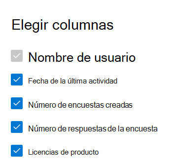

# Microsoft 365 Informes en el centro de administración: actividad de Dynamics 365 Customer VoiceMicrosoft 365 Reports in the admin center - Dynamics 365 Customer Voice activity

El panel Microsoft 365 **informes le** muestra la introducción a la actividad en todos los productos de la organización.The Microsoft 365 **Reports** dashboard shows you the activity overview across the products in your organization. Le permite explorar informes individuales de nivel de producto para proporcionarle más información pormenorizada acerca de las actividades dentro de cada producto.It lets you drill in to individual product level reports to give you more granular insight about the activities within each product. Consulte [el tema de información general de los informes](activity-reports.md).Check out [the Reports overview topic](activity-reports.md).
  
Por ejemplo, puede comprender la actividad de todos los usuarios con licencia para usar Microsoft Dynamics 365 Customer Voice al ver sus interacciones con Dynamics 365 Customer Voice.For example, you can understand the activity of every user licensed to use Microsoft Dynamics 365 Customer Voice by looking at their interactions with Dynamics 365 Customer Voice. También le ayuda a comprender el nivel de colaboración que se está creando al ver el número de encuestas de Pro creadas y las encuestas Pro a las que respondieron los usuarios.It also helps you to understand the level of collaboration going on by looking at the number of Pro Surveys created and Pro Surveys to which the users responded to. 
  
> [!NOTE]
> Debe ser administrador global, lector global o lector de informes en Microsoft 365 o un administrador de Exchange, SharePoint, servicio de Teams, comunicaciones de Teams o administrador Skype Empresarial para ver informes.You must be a global administrator, global reader or reports reader in Microsoft 365 or an Exchange, SharePoint, Teams Service, Teams Communications, or Skype for Business administrator to see reports.  
 
## Cómo obtener acceso al informe de actividad de Dynamics 365 Customer VoiceHow to get to the Dynamics 365 Customer Voice activity report

1. En el centro de administración de, vaya a **Informes** \> <a href="https://go.microsoft.com/fwlink/p/?linkid=2074756" target="_blank">página</a> uso.In the admin center, go to the **Reports** \> <a href="https://go.microsoft.com/fwlink/p/?linkid=2074756" target="_blank">Usage</a> page. 
2. En la página principal del panel, haga clic en el botón **Ver más** de la tarjeta De voz del cliente de Dynamics 365.From the dashboard homepage, click on the **View more** button on the Dynamics 365 Customer Voice card.
  
## Interpretar el informe de actividad de Dynamics 365 Customer VoiceInterpret the Dynamics 365 Customer Voice activity report

Puede ver las actividades en el informe de Voz del cliente de Dynamics 365 seleccionando la **pestaña** Actividad.You can view the activities in the Dynamics 365 Customer Voice report by choosing the **Activity** tab. 

Seleccione **Elegir columnas** para agregar o quitar columnas del informe.Select **Choose columns** to add or remove columns from the report.    

También puede exportar los datos del informe a un archivo Excel .csv seleccionando el **vínculo** Exportar.You can also export the report data into an Excel .csv file by selecting the **Export** link. Se exportarán los datos de todos los usuarios y podrá efectuar una ordenación y un filtrado sencillos para un análisis más detallado.This exports data of all users and enables you to do simple sorting and filtering for further analysis. Si tiene menos de 2000 usuarios, puede ordenar y filtrar en la tabla en el propio informe.If you have less than 2000 users, you can sort and filter within the table in the report itself. Si tiene más de 2000 usuarios, para poder filtrar y ordenar, tendrá que exportar los datos.If you have more than 2000 users, in order to filter and sort, you will need to export the data. 
  
|ElementoItem|DescripciónDescription|
|:-----|:-----|
|**Métrica****Metric**|**Definición****Definition**|
|Nombre de usuarioUsername    |La dirección de correo electrónico del usuario que realizó la actividad en Microsoft Forms.The email address of the user who performed the activity on Microsoft Forms.    |
|Fecha de última actividad (UTC)Last activity date (UTC)    |La fecha más reciente en la que el usuario realizó una actividad de formulario para el intervalo de fechas seleccionado.The latest date a form activity was performed by the user for the selected date range. Para ver las actividades realizadas en una fecha específica, seleccione la fecha directamente en el gráfico.To see activity that occurred on a specific date, select the date directly in the chart. Esto filtrará la tabla para mostrar datos de actividad de archivos solo para los usuarios que realizaron la actividad en ese día específico.This will filter the table to display file activity data only for users who performed the activity on that specific day.    |
|Número de encuestas creadasNumber of surveys created    |Número de encuestas que creó el usuario.The number of surveys that the user created.     |
|Número de respuestas a encuestasNumber of survey responses    |Número de respuestas de los respondedores a los que se distribuyó la encuesta.The number of responses from responders to whom the survey was distributed to.|
|||