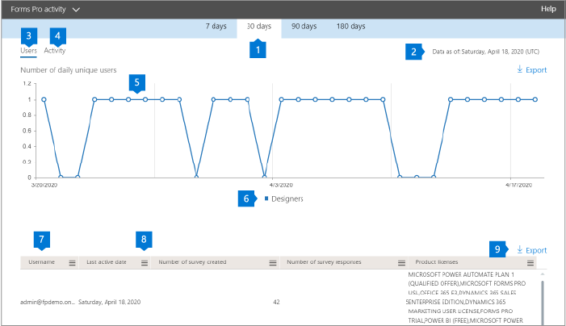

# Informes de Microsoft 365 en el centro de administración: actividad de Voz del cliente de Dynamics 365Microsoft 365 Reports in the admin center - Dynamics 365 Customer Voice activity

El panel informes  de Microsoft 365 muestra la información general sobre la actividad en todos los productos de la organización.The Microsoft 365 **Reports** dashboard shows you the activity overview across the products in your organization. Le permite explorar informes individuales de nivel de producto para proporcionarle información más pormenorizada sobre la actividad dentro de cada producto.It enables you to drill in to individual product level reports to give you more granular insight about the activities within each product. Consulte [el tema de información general sobre los informes](activity-reports.md).Check out [the Reports overview topic](activity-reports.md).
  
Por ejemplo, puede comprender la actividad de cada usuario con licencia para usar Microsoft Dynamics 365 Customer Voice observando sus interacciones con Dynamics 365 Customer Voice.For example, you can understand the activity of every user licensed to use Microsoft Dynamics 365 Customer Voice by looking at their interactions with Dynamics 365 Customer Voice. También le ayuda a comprender el nivel de colaboración que va a seguir observando el número de encuestas pro creadas y las encuestas profesionales a las que respondieron los usuarios.It also helps you to understand the level of collaboration going on by looking at the number of Pro Surveys created and Pro Surveys to which the users responded to. 
  
> [!NOTE]
> Debe ser administrador global, lector global o lector de informes en Microsoft 365 o un administrador de Exchange, SharePoint, Teams Service, Teams Communications o Skype Empresarial para ver informes.You must be a global administrator, global reader or reports reader in Microsoft 365 or an Exchange, SharePoint, Teams Service, Teams Communications, or Skype for Business administrator to see reports. 

## Cómo obtener acceso al informe de actividad de Forms ProHow to get to the Forms Pro activity report

1. En el centro de administración de, vaya a **Informes** \> <a href="https://go.microsoft.com/fwlink/p/?linkid=2074756" target="_blank">página</a> uso.In the admin center, go to the **Reports** \> <a href="https://go.microsoft.com/fwlink/p/?linkid=2074756" target="_blank">Usage</a> page.

    
2. En la **lista desplegable Seleccionar** un informe, seleccione Actividad de Voz del cliente de Dynamics **365.** \> From the **Select a report** drop-down, select **Dynamics 365 Customer Voice** \> **activity**.

## Interpretar el informe de actividad de Voz del cliente de Dynamics 365Interpret the Dynamics 365 Customer Voice activity report

Puede obtener una vista de la actividad de Dynamics 365 Customer Voice de su usuario consultando los gráficos **Actividad** **y** Usuarios.You can get a view into your user's Dynamics 365 Customer Voice activity by looking at the **Activity** and **Users** charts. 

|ElementoItem|DescriptionDescription|
|:-----|:-----|
|1.1.    |El informe de actividad de Voz del cliente de **Dynamics 365** se puede ver para ver las tendencias de los últimos 7, 30, 90 o 180 días.The **Dynamics 365 Customer Voice** activity report can be viewed for trends over the last 7 days, 30 days, 90 days, or 180 days. Sin embargo, si selecciona un día determinado en el informe, la tabla (7) mostrará datos de hasta 28 días a partir de la fecha actual (no la fecha en que se generó el informe).However, if you select a particular day in the report, the table (7) will show data for up to 28 days from the current date (not the date the report was generated).     |
|2.2.    |Los datos de cada informe suelen ser tan recientes como en las últimas 48 horas.The data in each report is usually as recent as the last 48 hours.    |
|3.3.    |La **vista** Usuarios le ayuda a comprender la tendencia en el número de usuarios activos de Dynamics 365 Customer Voice.The **Users** view helps you to understand the trend in the number of active Dynamics 365 Customer Voice users. Un usuario se considera activo si ha ejecutado una actividad en torno a una encuesta profesional (crear, editar, ver, etc.) dentro del período de tiempo específico.A user is considered active if they have executed an activity around a Pro Survey (create, edit, view, etc.) within the specific time period.    |
|4.4.    |La **vista** Actividad le ayuda a comprender la tendencia en el número de usuarios activos.The **Activity** view helps you to understand the trend in the number of active users. Un usuario se considera activo si ha ejecutado una actividad de archivo (guardar, sincronizar, modificar o compartir) o ha visitado una página dentro del período de tiempo especificado.A user is considered active if he or she has executed a file activity (save, sync, modify, or share) or visited a page within the specific time period.  NOTA: Una actividad puede producirse varias veces para una sola encuesta, pero solo se contará como una encuesta activa.NOTE: An activity can occur multiple times for a single survey, but will count only as one active Survey. Por ejemplo, puede crear una encuesta pro y seguir editando la misma encuesta varias veces durante un período de tiempo especificado, solo se contará como una sola encuesta.For example, you can create a Pro Survey and continue to edit the same Survey multiple times over a specified time period, it will count only as one single Survey.  |
|5.5. |En el **gráfico Usuarios,** el eje Y es el número de usuarios únicos.On the **Users** chart, the Y axis is the number of unique users. El eje X es la fecha en la que los usuarios únicos están activos.X axis is the date that the unique users are active on. Las leyendas son:The legends are:  **Diseñadores** significa que el usuario ha creado o editado una encuesta de voz del cliente de Dynamics 365.**Designers** means the user has created or edited a Dynamics 365 Customer Voice Survey.  En el **gráfico Actividad,** el eje Y es el recuento de respuestas de Voz del cliente de Dynamics 365 por encuesta.On the **Activity** chart, the Y axis is the count of Dynamics 365 Customer Voice responses per survey. El eje X es la fecha en la que se produjo la actividad encuesta o respuesta.X axis is the date that the Survey or Response activity occurred. Las leyendas son:The legends are:  **Encuestas creadas** es el recuento de encuestas únicas de Dynamics 365 Customer Voice que los usuarios han creado**Surveys created** is the count of unique Dynamics 365 Customer Voice surveys that the users have created **Las respuestas** son el recuento de respuestas anónimas o no anónimas que han enviado los usuarios que recibieron la encuesta.**Responses** is the count of anonymous or non-anonymous responses that the users who received the survey have submitted. |
|6.6. |Puede filtrar la serie que ve en el gráfico seleccionando un elemento de la leyenda.You can filter the series you see on the chart by selecting an item in the legend. Por ejemplo, en el gráfico Usuarios, seleccione diseñadores, respondedores o usuarios totales para ver solo la información relacionada con cada uno de ellos.For example, on the Users chart, select designers, responders, or total users to see only the info related to each one. Cambiar esta selección no cambia la información de la tabla de cuadrícula debajo de ella.Changing this selection doesn't change the info in the grid table below it.|
|7.7. |En la tabla se muestra un desglose de las actividades en el nivel por usuario.The table shows you a breakdown of the activities at the per-user level. Las leyendas son:The legends are:  **Username** es la dirección de correo electrónico del usuario que realizó la actividad en Microsoft Forms.**Username** is the email address of the user who performed the activity on Microsoft Forms. La fecha de la última actividad **(UTC)** es la última fecha en que el usuario realizó una actividad de formulario para el intervalo de fechas seleccionado.**Last activity date (UTC)** is the latest date a form activity was performed by the user for the selected date range. Para ver las actividades realizadas en una fecha específica, seleccione la fecha directamente en el gráfico.To see activity that occurred on a specific date, select the date directly in the chart. Esto filtrará la tabla para mostrar los datos de actividad de archivo solo para los usuarios que realizaron la actividad en ese día específico.This will filter the table to display file activity data only for users who performed the activity on that specific day.  **El número de encuestas creadas** es el número de encuestas que creó el usuario.**Number of surveys created** is the number of surveys that the user created.  **El número de respuestas a la** encuesta es el número de respuestas de los respondedores a los que se distribuyó la encuesta.**Number of survey responses** is the number of responses from responders to whom the survey was distributed to.|
|8.8. |Seleccione el **icono Administrar columnas** para agregar o quitar columnas del informe.Select the **Manage columns** icon to add or remove columns from the report.|
|9.9. |También puede exportar los datos del informe a un archivo .csv de Excel seleccionando el **vínculo** Exportar.You can also export the report data into an Excel .csv file by selecting the **Export** link. Esto exporta datos para todos los usuarios y permite realizar agregaciones sencillas, ordenar y filtrar para un análisis posterior.This exports data for all users and enables you to do simple aggregation, sorting and filtering for further analysis. Si tiene menos de 100 usuarios, puede ordenar y filtrar dentro de la tabla en el propio informe.If you have less than 100 users, you can sort and filter within the table in the report itself. Si tiene más de 100 usuarios, para filtrar y ordenar, tendrá que exportar los datos.If you have more than 100 users, in order to filter and sort, you will need to export the data.|