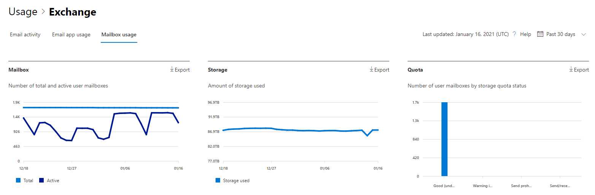

# Microsoft 365 Informes en el Centro de administración: uso del buzón

El  informe de uso de buzones de correo proporciona información sobre los usuarios con un buzón de usuario y el nivel de actividad de cada uno en función del envío de correo electrónico, lectura, creación de citas, envío de reunión, aceptación de reuniones, declinación de reuniones y cancelación de la actividad de la reunión. También proporciona información sobre cuánto almacenamiento ha consumido cada buzón de usuario y cuántos de ellos se acercan a las cuotas de almacenamiento. 
  
> [!NOTE]
> Debe ser administrador global, lector global o lector de informes en Microsoft 365 o un administrador de Exchange, SharePoint, servicio de Teams, comunicaciones de Teams o administrador Skype Empresarial para ver informes. 
 
## Cómo obtener el informe de uso del buzón

1. En el centro de administración de, vaya a **Informes** \> <a href="https://go.microsoft.com/fwlink/p/?linkid=2074756" target="_blank">página</a> uso.
2. Seleccione **Ver más en** Actividad de correo **electrónico**. 
3. En la **lista desplegable Actividad** de correo electrónico, seleccione **Exchange** uso del buzón de \> **correo**.

## Interpretar el informe de uso del buzón

Para obtener una vista del **Uso del buzón** de la organización, consulte los gráficos **Buzón**, **Almacenamiento** y **Cuota**. 
  

|Elemento|Descripción|
|:-----|:-----|
|1.    |Puede visualizar el informe **Uso del buzón** para ver las tendencias de los últimos 7, 30, 90 o 180 días. Sin embargo, si selecciona un día determinado en el informe, la tabla mostrará datos hasta 28 días a partir de la fecha actual (no la fecha en que se generó el informe).    |
|2.    |Los datos de cada informe suelen abarcar hasta las últimas 24 a 48 horas.    |
|3.    |El gráfico Buzón muestra el número total de buzones de usuario de la organización y el número total de buzones que están activos en cualquier día del período de notificación. Un buzón de usuario se considera activo si tenía un correo electrónico enviar, leer, crear cita, enviar reunión, aceptar reunión, rechazar reunión y cancelar la actividad de la reunión.    |
|4.    |El gráfico **Almacenamiento** muestra la cantidad de almacenamiento usado en su organización. Storage El gráfico no incluye buzones de archivo. Para obtener más información sobre el archivado de expansión automática, vea [Overview of unlimited archiving in Microsoft 365](../../compliance/unlimited-archiving.md).  |
|5.    | El gráfico **Cuota** muestra el número de buzones de usuario en cada categoría de cuota. Hay cuatro categorías de cuota:     Buena: número de usuarios con un uso de almacenamiento por debajo de la cuota de emisión de advertencia.     Advertencia: número de usuarios con un uso de almacenamiento igual o superior a la emisión de advertencia, pero inferior a la cuota de prohibición de envío     No se puede enviar: número de usuarios con un uso de almacenamiento igual o superior a la cuota de prohibición de envío, pero inferior a la cuota de prohibición de envío y recepción     No se puede enviar ni recibir: número de usuarios con un uso de almacenamiento igual o superior a la cuota de prohibición de envío y recepción    |
|6.    | En el gráfico **Buzón**, el eje Y es el número de buzones de usuario.     En el gráfico **Almacenamiento**, el eje Y es la cantidad de almacenamiento que usan los buzones de usuario de la organización.     En el gráfico **Cuota**, el eje Y es el número de buzones de usuario en cada cuota de almacenamiento.     El eje X de los gráficos Buzón y Almacenamiento es el intervalo de fechas seleccionado para este informe específico.     El eje X del gráfico Cuota es la categoría de cuota.    |
|7.    |Puede filtrar los gráficos que ve seleccionando un elemento en la leyenda.    |
|8.    | En la tabla se muestra un desglose del uso del buzón en el nivel de usuario. Puede agregar columnas adicionales a la tabla.    **Nombre de usuario** es la dirección de correo electrónico del usuario.    **Nombre para mostrar** es el nombre completo del usuario.    **Eliminado** hace referencia al buzón con un estado actual de eliminado, pero que ha estado activo durante alguna parte del período de notificación del informe.    **Fecha de eliminación** es la fecha en que se eliminó el buzón.    **Fecha de creación** es la fecha en que se creó el buzón.    **Fecha de última actividad** hace referencia a la fecha en que el buzón tuvo una actividad de envío o lectura de correo electrónico.    **Recuento de elementos** hace referencia al número total de elementos del buzón.    **Almacenamiento utilizado (MB)** hace referencia al almacenamiento total usado.    **Número de elementos eliminados** hace referencia al número total de elementos eliminados en el buzón.   **El tamaño del elemento eliminado (MB)** hace referencia al tamaño total de todos los elementos eliminados en el buzón.   **Cuota de emisión de advertencia (MB)** hace referencia al límite de almacenamiento cuando el propietario del buzón recibirá una advertencia que le indica que está a punto de alcanzar la cuota de almacenamiento.    **Cuota de prohibición de envío (MB)** hace referencia al límite de almacenamiento cuando el buzón ya no puede enviar correos electrónicos.    **Cuota de prohibición de envío y recepción (MB)** hace referencia al límite de almacenamiento cuando el buzón ya no puede enviar ni recibir correos electrónicos.     Si las directivas de la organización le impiden ver los informes en los que la información del usuario es identificable, puede cambiar la configuración de privacidad de todos estos informes. Consulte la sección **Ocultar detalles de usuario** en la sección Informes de actividad del Centro de administración de [Microsoft 365.](activity-reports.md)    |
|9.    |Seleccione **Elegir columnas** para agregar o quitar columnas del informe.    |
|10.    |También puede exportar los datos del informe a un Excel .csv, seleccionando el **vínculo** Exportar.    |
|||
