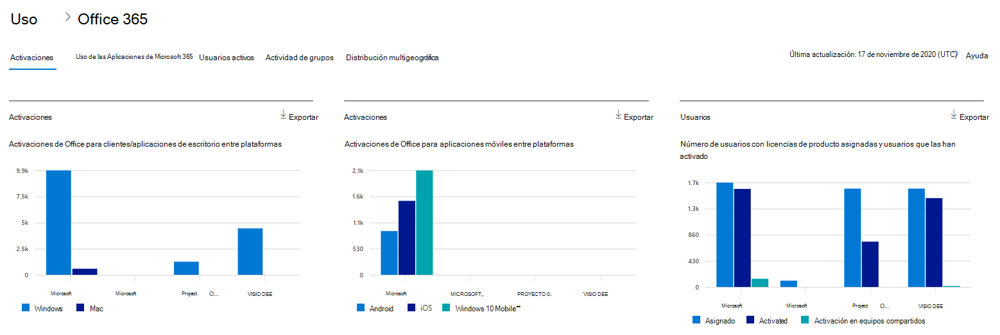
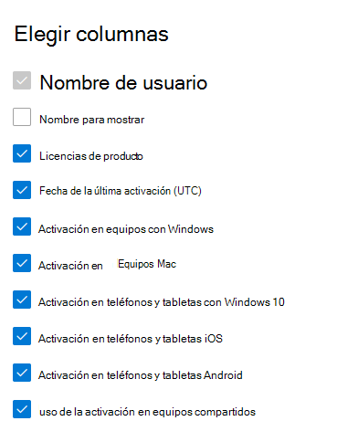

# Microsoft 365 Informes en el Centro de administración: Microsoft Office activaciones

El panel Microsoft 365 **informes le** muestra la introducción a la actividad en todos los productos de la organización. Le permite explorar informes individuales de nivel de producto para proporcionarle información más pormenorizada sobre la actividad dentro de cada producto. Consulte [el tema de información general de los informes](activity-reports.md).
  
El informe de activación de Office le proporciona una vista de los usuarios que han activado su suscripción de Office en al menos un dispositivo. Proporciona un desglose de las Aplicaciones Microsoft 365 para empresas, Project y Visio Pro para Office 365 de suscripción, así como el desglose de las activaciones en dispositivos y escritorio. Este informe puede ser útil para ayudarle a identificar los usuarios que quizás necesiten ayuda y soporte técnico adicional para activar su suscripción de Office.
  
> [!NOTE]
> Debe ser administrador global, lector global o lector de informes en Microsoft 365 o un administrador de Exchange, SharePoint, servicio de Teams, comunicaciones de Teams o administrador Skype Empresarial para ver informes.  
  
## Cómo obtener el informe de activaciones de Office

1. En el centro de administración de, vaya a **Informes** \> <a href="https://go.microsoft.com/fwlink/p/?linkid=2074756" target="_blank">página</a> uso. 
2. En la página principal del panel, haga clic en el botón **Ver más** en la tarjeta Office activaciones.
  
## Interpretar el informe de activaciones de Office
  
Puede ver las activaciones en el informe Office 365 seleccionando la **pestaña Activaciones.** 

Seleccione **Elegir columnas** para agregar o quitar columnas del informe.    

También puede exportar los datos del informe a un archivo Excel .csv seleccionando el **vínculo** Exportar. Se exportarán los datos de todos los usuarios y podrá efectuar una ordenación y un filtrado sencillos para un análisis más detallado. Si tiene menos de 2000 usuarios, puede ordenar y filtrar en la tabla en el propio informe. Si tiene más de 2000 usuarios, para poder filtrar y ordenar, tendrá que exportar los datos. 

|Elemento|Descripción|
|:-----|:-----|
|**Métrica**|**Definición**|
|Nombre de usuario    |La dirección de correo electrónico del usuario.    |
|Nombre para mostrar    |Nombre completo del usuario.    |
|Licencias de productos    |Los productos que se asignan a este usuario.    |
|Fecha de última activación(UTC)    |La fecha en que el usuario Office en un escritorio o un dispositivo.    |
|Activación en Windows equipos    |El número de Windows escritorios en los que un usuario Office activado.    |
|Activación en equipos Mac   |El número de escritorios mac en los que un usuario Office activado.|
|Activación en Windows 10 teléfonos y tabletas    |Número de dispositivos Windows 10 dispositivos móviles activados por Office usuario.    |
|Activación en teléfonos y tabletas iOS    |El número de dispositivos iOS en los que un usuario Office activado.|
|Activación en teléfonos y tabletas Android    |El número de dispositivos Android en los que un usuario Office activado.    |
|Activación de equipo compartido usada |Esto es así si el usuario usó Office a través de la activación del equipo compartido.|
|||
   