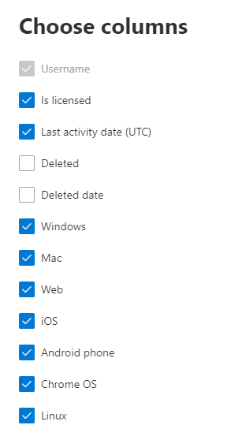

# Informes de Microsoft 365 en el centro de administración: uso de dispositivos de Microsoft TeamsMicrosoft 365 Reports in the admin center - Microsoft Teams device usage

El panel de **informes** de Microsoft 365 muestra la información general de la actividad en todos los productos de la organización.The Microsoft 365 **Reports** dashboard shows you the activity overview across the products in your organization. Le permite explorar informes individuales de nivel de producto para proporcionarle información más pormenorizada sobre la actividad dentro de cada producto.It enables you to drill in to individual product level reports to give you more granular insight about the activities within each product. Consulte [el tema de información general sobre los informes](activity-reports.md).Check out [the Reports overview topic](activity-reports.md). En el informe de uso de aplicaciones de Microsoft Teams puede obtener estadísticas sobre las aplicaciones de Microsoft Teams que se usan en su organización.In the Microsoft Teams app usage report, you can gain insights into the Microsoft Teams apps that are used in your organization.
  
> [!NOTE]
> Debe ser administrador global, lector global o lector de informes en Microsoft 365 o un administrador de Exchange, SharePoint, Teams, Team Communications o Skype empresarial para ver los informes.You must be a global administrator, global reader or reports reader in Microsoft 365 or an Exchange, SharePoint, Teams Service, Teams Communications, or Skype for Business administrator to see reports.  
 
## Cómo obtener el informe de uso de aplicaciones de Microsoft TeamsHow to get to the Microsoft Teams app usage report

1. En el centro de administración de, vaya a **Informes** \> <a href="https://go.microsoft.com/fwlink/p/?linkid=2074756" target="_blank">página</a> uso.In the admin center, go to the **Reports** \> <a href="https://go.microsoft.com/fwlink/p/?linkid=2074756" target="_blank">Usage</a> page. 
2. En la Página principal del panel, haga clic en el botón **Ver más** de la tarjeta de actividad de Microsoft Teams.From the dashboard homepage, click on the **View more** button on the Microsoft Teams activity card.
  
## Interpretar el informe de uso de aplicaciones de Microsoft TeamsInterpret the Microsoft Teams app usage report

Puede ver el uso del dispositivo en el informe de Microsoft Teams eligiendo la pestaña **uso de dispositivo** .You can view the device use in the Teams report by choosing the **Device usage** tab. 

Seleccione **elegir columnas** para agregar o quitar columnas del informe.Select **Choose columns** to add or remove columns from the report.    

También puede exportar los datos del informe a un archivo. csv de Excel; para ello, seleccione el vínculo **exportar** .You can also export the report data into an Excel .csv file by selecting the **Export** link. Se exportarán los datos de todos los usuarios y podrá efectuar una ordenación y un filtrado sencillos para un análisis más detallado.This exports data of all users and enables you to do simple sorting and filtering for further analysis. Si tiene menos de 2000 usuarios, puede ordenar y filtrar en la tabla en el propio informe.If you have less than 2000 users, you can sort and filter within the table in the report itself. Si tiene más de 2000 usuarios, para poder filtrar y ordenar, tendrá que exportar los datos.If you have more than 2000 users, in order to filter and sort, you will need to export the data. 
  
|ItemItem|DescripciónDescription|
|:-----|:-----|
|**Métrica****Metric**|**Definición****Definition**|
|Nombre de usuarioUser name    |El nombre para mostrar del usuario.The display name of the user.    |
|WindowsWindows    |Se selecciona si el usuario estuvo activo en el cliente de escritorio de Microsoft Teams en un equipo basado en Windows.Selected if the user was active in the Teams desktop client on a Windows-based computer.    |
|MacMac    |Se selecciona si el usuario estuvo activo en el cliente de escritorio de Microsoft Teams en un equipo con macOS.Selected if the user was active in the Teams desktop client on a macOS computer.    |
|iOSiOS    |Se selecciona si el usuario estuvo activo en el cliente móvil de Microsoft Teams para iOS.Selected if the user was active on the Teams mobile client for iOS.    |
|Teléfono AndroidAndroid phone    | Se selecciona si el usuario estuvo activo en el cliente móvil de Microsoft Teams para Android.Selected if the user was active on the Teams mobile client for Android.    |
|Sistema operativo ChromeChrome OS    |Se selecciona si el usuario estuvo activo en el cliente de escritorio de Microsoft Teams en un equipo de Chrome.Selected if the user was active in the Teams desktop client on a ChromeOS computer.|
|LinuxLinux    | Se selecciona si el usuario estuvo activo en el cliente de escritorio de Microsoft Teams en un equipo con Linux.Selected if the user was active in the Teams desktop client on a Linux computer.    |
|WebWeb    |Se selecciona si el usuario estuvo activo en el cliente web de Microsoft Teams en dispositivos.Selected if the user was active in the Teams web client on devices.|
|Fecha de la última actividad (UTC)Last activity date (UTC)    |La última fecha (UTC) que el usuario participó en una actividad de Microsoft Teams.The last date (UTC) that the user participated in a Teams activity .    |
|Tiene licenciaIs licensed|Seleccionado si el usuario tiene licencia para usar Teams.Selected if the user is licensed to use Teams.|
|Actividad total de TeamsTotal Teams activity|Número total de actividades de Microsoft Teams durante el período de tiempo seleccionado.Total number of Teams activities over the selected time period. |
|||