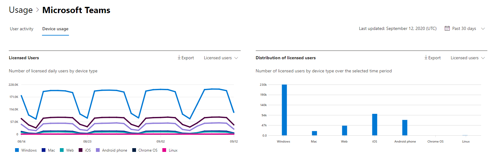

# informes de Microsoft 365 en el centro de administración: Microsoft Teams uso del dispositivo

En el panel informes de Microsoft 365 se muestra la información general sobre la actividad en los productos de la organización. Le permite explorar informes individuales de nivel de producto para proporcionarle información más pormenorizada sobre la actividad dentro de cada producto. Consulte [el tema de información general sobre los informes](activity-reports.md). En el informe de uso de aplicaciones de Microsoft Teams puede obtener estadísticas sobre las aplicaciones de Microsoft Teams que se usan en su organización.
  
## Cómo obtener el informe de uso de aplicaciones de Microsoft Teams

1. En el centro de administración de, vaya a **Informes** \> <a href="https://go.microsoft.com/fwlink/p/?linkid=2074756" target="_blank">página</a> uso. 
2. En la página principal del panel, haga clic en el botón **Ver más** de la tarjeta de actividad Microsoft Teams.
  
## Interpretar el informe de uso de aplicaciones de Microsoft Teams

Para ver el uso del dispositivo en el informe de Teams, elija la pestaña **Uso del** dispositivo. 

Seleccione **Elegir columnas** para agregar o quitar columnas del informe.    

También puede exportar los datos del informe a un archivo Excel .csv seleccionando el vínculo **Exportar**. Se exportarán los datos de todos los usuarios y podrá efectuar una ordenación y un filtrado sencillos para un análisis más detallado. Si tiene menos de 2000 usuarios, puede ordenar y filtrar en la tabla en el propio informe. Si tiene más de 2000 usuarios, para poder filtrar y ordenar, tendrá que exportar los datos. 

Puede visualizar el informe **Uso de dispositivos de Microsoft Teams** para ver las tendencias de los últimos 7, 30, 90 o 180 días. Sin embargo, si selecciona un día determinado en el informe, la tabla mostrará los datos durante un máximo de 28 días a partir de la fecha actual (no la fecha en que se generó el informe).
  
|Item|Descripción|
|:-----|:-----|
|**Métrica**|**Definición**|
|Nombre de usuario    |El nombre para mostrar del usuario.    |
|Windows    |Seleccionado si el usuario estaba activo en el cliente de escritorio de Teams en un equipo basado en Windows.    |
|Mac    |Seleccionado si el usuario estaba activo en el cliente de escritorio de Teams en un equipo macOS.    |
|iOS    |Se ha seleccionado si el usuario estaba activo en el cliente móvil de Teams para iOS.    |
|Teléfono Android    | Seleccionado si el usuario estaba activo en el cliente móvil de Teams para Android.    |
|Chrome OS    |Seleccionado si el usuario estaba activo en el cliente de escritorio de Teams en un equipo ChromeOS.|
|Linux    | Seleccionado si el usuario estaba activo en el cliente de escritorio de Teams en un equipo Linux.    |
|Web    |Se ha seleccionado si el usuario estaba activo en el cliente web de Teams en los dispositivos.|
|Fecha de la última actividad (UTC)    |La última fecha (UTC) en la que el usuario participó en una actividad de Teams.    |
|Tiene licencia|Se selecciona si el usuario tiene licencia para usar Teams.|

## Vea también
[Informe de actividad de usuario de Microsoft Teams](../activity-reports/microsoft-teams-user-activity-preview.md) 

[Microsoft Teams informe de actividad de uso](../activity-reports/microsoft-teams-usage-activity.md) 
