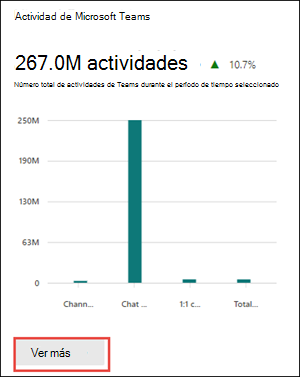

# Informes de Microsoft 365 en el Centro de administración: actividad de uso de Microsoft Teams

En el panel Informes de Microsoft 365 se muestra la información general sobre la actividad en los productos de su organización. Le permite explorar informes individuales de nivel de producto para proporcionarle información más pormenorizada sobre la actividad dentro de cada producto. Consulte [el tema de información general sobre los informes](activity-reports.md).

El **nuevo informe de uso de Teams** proporciona información general sobre la actividad de uso en Teams, incluido el número de usuarios activos, canales y mensajes para que pueda ver rápidamente cuántos usuarios de toda la organización usan Teams para comunicarse y colaborar.  También incluye otras actividades específicas de Teams, como el número de invitados activos, reuniones y mensajes.

## Cómo acceder al informe de actividad de uso de Microsoft Teams

1. En el centro de administración, vaya a **Informes** y, a continuación, seleccione **Uso**.
2. En la página principal del panel, haga clic en el botón **Ver más** de la tarjeta de **actividad de Microsoft Teams** .

    

3. En la página Informes de **Microsoft Teams** , seleccione la pestaña **Uso de Teams** .

## Interpretación del informe de actividad de uso de Microsoft Teams

Para ver la actividad del usuario en el informe de Teams, elija la pestaña **Uso de Teams** . Se mostrarán los siguientes gráficos:

- **Uso del canal**: realiza un seguimiento del número de usos del canal, por tipo de actividad, a lo largo del tiempo.

  

- **Uso del equipo**: realiza un seguimiento del número de equipos, por tipo y actividad, a lo largo del tiempo.

  

Además, el gráfico incluye detalles de uso para equipos individuales, como la fecha de la última actividad, los usuarios activos, los canales activos y otros datos.

En la tabla, seleccione **Elegir columnas** para agregar o quitar columnas del informe.

También puede exportar los datos del informe a un archivo de excel .csv seleccionando el vínculo **Exportar** . Se exportarán los datos de todos los usuarios y podrá efectuar una ordenación y un filtrado sencillos para un análisis más detallado.  El formato exportado para **el tiempo de audio**, **el tiempo de vídeo** y el **tiempo de uso compartido de pantalla** sigue el formato de duración ISO8601.

El informe de **actividad de uso de Microsoft Teams** se puede ver para ver las tendencias de los últimos 7 días, 30 días, 90 días o 180 días. Sin embargo, si selecciona un día determinado en el informe, la tabla mostrará los datos durante un máximo de 28 días a partir de la fecha actual (no la fecha en que se generó el informe).

Para garantizar la calidad de los datos, realizamos comprobaciones diarias de validación de datos durante los últimos tres días y rellenaremos las brechas detectadas. Es posible que observe diferencias en los datos históricos durante el proceso.

> [!Important]
> Los datos de un día determinado se mostrarán en un plazo de 48 horas. Por ejemplo, los datos del 10 de enero deben aparecer en el informe antes del 12 de enero.

### Métricas de uso del canal

El gráfico uso del canal muestra los datos de las métricas siguientes.

|Elemento|Descripción|
|:-----|:-----|
|**Métrica**|**Definición**|
|Usuarios del canal activo|Este es el total de usuarios activos internos, invitados activos y usuarios activos externos.     **Usuarios activos internos** : usuarios que tienen al menos una acción de panel en el período de tiempo especificado. Esto excluye a los invitados.     **Invitados activos** : invitados que tienen al menos una acción de panel en el período de tiempo especificado. Un invitado es una persona de fuera de la organización que accede a recursos compartidos iniciando sesión en una cuenta de invitado en mi directorio.    **Usuario activo externo** : participantes externos que tienen al menos una acción de panel en el período de tiempo especificado. Un participante externo es una persona de fuera de la organización que participa en un recurso(por ejemplo, un canal compartido) que usa su propia identidad y no una cuenta de invitado en el directorio.|
|Canales activos|Canales válidos en equipos activos que tienen al menos un usuario activo en el período de tiempo especificado. Esto incluye canales públicos, privados o compartidos.|
|Mensajes del canal|Número de mensajes únicos que el usuario publicó en un chat privado durante el período de tiempo especificado.|

### Métricas de uso del equipo

El gráfico de uso de Teams muestra datos sobre las métricas siguientes.

|Elemento|Descripción|
|:-----|:-----|
|**Métrica**|**Definición**|
|Equipos privados|Un equipo privado que está activo o inactivo.|
|Equipos públicos|Un equipo público que está activo o inactivo.|
|Equipos privados activos|Un equipo privado y activo.|
|Equipos públicos activos|Un equipo público y activo.|

### Detalles de Teams

Los datos de las siguientes métricas están disponibles para equipos individuales.

|Elemento|Descripción|
|:-----|:-----|
|**Métrica**|**Definición**|
|Id. de equipo|Identificador de equipo|
|Usuarios activos internos|Usuarios que tienen al menos una acción de panel en el período de tiempo especificado, incluidos los invitados.     Usuarios internos e invitados que residen en el mismo inquilino. Los usuarios internos excluyen invitados.|
|Invitados activos|Invitados que tienen al menos una acción de panel en el período de tiempo especificado.     Un invitado se define como personas de fuera de la organización que acceden a recursos compartidos iniciando sesión en una cuenta de invitado en mi directorio.|
|Usuarios activos externos|Participantes externos que tienen al menos una acción de panel en el período de tiempo especificado.   Un participante externo se define como una persona de fuera de la organización que participa en un recurso(por ejemplo, un canal compartido) que usa su propia identidad y no una cuenta de invitado en el directorio.|
|Canales activos|Canales válidos en equipos activos que tienen al menos un usuario activo en el período de tiempo especificado. Esto incluye canales públicos, privados o compartidos.|
|Canales compartidos activos|Canales compartidos válidos en equipos activos que tienen al menos un usuario activo en el tiempo especificado.    Un canal compartido se define como un canal de Teams que se puede compartir con personas ajenas al equipo. Estas personas pueden estar dentro de su organización o de otras organizaciones de Azure AD.|
|Total de reuniones organizadas|La suma de reuniones programadas, periódicas, ad hoc y no clasificadas de un usuario organizadas durante el período de tiempo especificado.|
|Posts|Recuento de todos los mensajes de publicación en canales en el período de tiempo especificado.|
|Responde|Recuento de todos los mensajes de respuesta en canales en el período de tiempo especificado.|
|Menciones|Recuento de todas las menciones realizadas en el período de tiempo especificado.|
|Reacciones|Número de reacciones realizadas por un usuario activo en el período de tiempo especificado.|
|Mensajes urgentes|Recuento de mensajes urgentes en el período de tiempo especificado.|
|Mensajes del canal|Número de mensajes únicos que el usuario publicó en un chat de equipo durante el período de tiempo especificado.|
|Fecha de la última actividad|La última fecha en la que cualquier miembro del equipo ha confirmado una acción.|

## Hacer anónimos los datos específicos del usuario

Para que los datos del informe de actividad de usuario de Teams sean anónimos, debe ser administrador global. Esto ocultará la información de identificación (mediante hashes MD5), como el nombre para mostrar, el correo electrónico y el identificador de objeto de Azure Active Directory en el informe y su exportación.

1. En Centro de administración de Microsoft 365, vaya a **Configuración** > **de la organización** y, en la pestaña **Servicios**, elija **Informes**.

2. Seleccione **Informes** y, a continuación, elija **Mostrar identificadores anónimos**. Esta configuración se aplica tanto a los informes de uso de Centro de administración de Microsoft 365 como al Centro de administración de Teams.

3. Seleccione **Guardar cambios**.

## Vea también

[Informe de uso de dispositivos de Microsoft Teams](../activity-reports/microsoft-teams-device-usage-preview.md)

[Informe de actividad de usuario de Microsoft Teams](../activity-reports/microsoft-teams-user-activity-preview.md)
