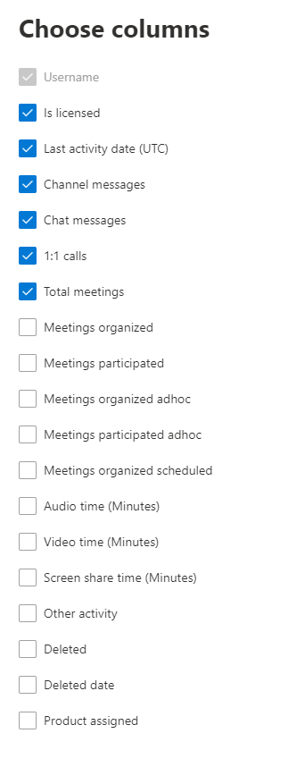

# Informes de Microsoft 365 en el centro de administración: actividad de los usuarios de Microsoft TeamsMicrosoft 365 Reports in the admin center - Microsoft Teams user activity

El panel de **informes** de Microsoft 365 muestra la información general de la actividad en todos los productos de la organización.The Microsoft 365 **Reports** dashboard shows you the activity overview across the products in your organization. Le permite explorar informes individuales de nivel de producto para proporcionarle información más pormenorizada sobre la actividad dentro de cada producto.It enables you to drill in to individual product level reports to give you more granular insight about the activities within each product. Consulte [el tema de información general sobre los informes](activity-reports.md).Check out [the Reports overview topic](activity-reports.md). En el informe de actividad de los usuarios de Microsoft Teams puede obtener estadísticas sobre la actividad de Microsoft Teams en su organización.In the Microsoft Teams user activity report, you can gain insights into the Microsoft Teams activity in your organization.
  
> [!NOTE]
> Debe ser administrador global, lector global o lector de informes en Microsoft 365 o un administrador de Exchange, SharePoint, Teams, Team Communications o Skype empresarial para ver los informes.You must be a global administrator, global reader or reports reader in Microsoft 365 or an Exchange, SharePoint, Teams Service, Teams Communications, or Skype for Business administrator to see reports.  
 
## Cómo obtener el informe de actividad de los usuarios de Microsoft TeamsHow to get to the Microsoft Teams user activity report

1. En el centro de administración de, vaya a **Informes** \> <a href="https://go.microsoft.com/fwlink/p/?linkid=2074756" target="_blank">página</a> uso.In the admin center, go to the **Reports** \> <a href="https://go.microsoft.com/fwlink/p/?linkid=2074756" target="_blank">Usage</a> page.
2. En la Página principal del panel, haga clic en el botón **Ver más** de la tarjeta de actividad de Microsoft Teams.From the dashboard homepage, click on the **View more** button on the Microsoft Teams activity card.

## Interpretar el informe de actividad de los usuarios de Microsoft TeamsInterpret the Microsoft Teams user activity report

Puede ver la actividad de usuario en el informe de Microsoft Teams seleccionando la ficha **actividad de usuario** .You can view the user activity in the Teams report by choosing the **User activity** tab.  

Seleccione **elegir columnas** para agregar o quitar columnas del informe.Select **Choose columns** to add or remove columns from the report.    

También puede exportar los datos del informe a un archivo. csv de Excel; para ello, seleccione el vínculo **exportar** .You can also export the report data into an Excel .csv file by selecting the **Export** link. Se exportarán los datos de todos los usuarios y podrá efectuar una ordenación y un filtrado sencillos para un análisis más detallado.This exports data of all users and enables you to do simple sorting and filtering for further analysis. Si tiene menos de 2000 usuarios, puede ordenar y filtrar en la tabla en el propio informe.If you have less than 2000 users, you can sort and filter within the table in the report itself. Si tiene más de 2000 usuarios, para poder filtrar y ordenar, tendrá que exportar los datos.If you have more than 2000 users, in order to filter and sort, you will need to export the data. El formato exportado para **tiempo de audio**, **tiempo de vídeo** y **tiempo de uso compartido de pantalla** sigue el formato de duración ISO8601.The exported format for **audio time**, **video time**, and **screen share time** follows ISO8601 duration format.

Para garantizar la calidad de los datos, se realizan comprobaciones de validación de datos diarias para los últimos tres días y se rellenarán los huecos detectados.To ensure data quality, we perform daily data validation checks for the past three days and will be filling any gaps detected. Es posible que observe diferencias en los datos históricos durante el proceso.You may notice differences in historical data during the process.

|ElementoItem|DescripciónDescription|
|:-----|:-----|
|**Métrica****Metric**|**Definición****Definition**|
|Nombre de usuarioUser name    |La dirección de correo electrónico del usuario.The email address of the user. Puede mostrar la dirección de correo electrónico real o hacer que este campo sea anónimo.You can display the actual email address or make this field anonymous.     |
|Mensajes del canalChannel messages     |El número de mensajes únicos que el usuario ha publicado en un chat de grupo durante el período de tiempo especificado.The number of unique messages that the user posted in a team chat during the specified time period.    |
|Mensajes de chatChat messages     |El número de mensajes únicos que el usuario ha publicado en un chat privado durante el período de tiempo especificado.The number of unique messages that the user posted in a private chat during the specified time period.    |
|Total de reunionesTotal meetings     |Número de reuniones en línea en las que el usuario participó durante el período de tiempo especificado.The number of online meetings that the user participated in during the specified time period.    |
|1:1 llamadas1:1 calls     | Número de llamadas de 1:1 en las que el usuario participó durante el período de tiempo especificado.The number of 1:1 calls that the user participated in during the specified time period.    |
|Fecha de la última actividad (UTC)Last activity date (UTC)    |La última fecha en la que el usuario participó en una actividad de Microsoft Teams.The last date that the user participated in a Microsoft Teams activity.  |
|Ad participó de reunionesMeetings participated adhoc     | Número de reuniones no programadas en el calendario en el que el usuario participó durante el período de tiempo especificado.The number of meetings not scheduled on the calendar that the user participated in during the specified time period.    |
|Reuniones organizadas por ad hocMeetings organized adhoc   |Número de reuniones no programadas en el calendario que el usuario organizó durante el período de tiempo especificado.The number of meetings not scheduled on the calendar that the user organized during the specified time period.  |
|Reuniones organizadas programadasMeetings organized scheduled    |Número de reuniones programadas que un usuario organizó durante el período de tiempo especificado.The number of scheduled meetings  a user organized during the specified time period.    |
|Tiene licenciaIs licensed |Seleccionado si el usuario tiene licencia para usar Teams.Selected if the user is licensed to use Teams.|
|Otra actividadOther activity|El usuario está activo, pero ha realizado otras actividades que los tipos de acción expuestos que se ofrecen en el informe (envío o respuesta a mensajes de canal y mensajes de chat, programación o participación en llamadas y reuniones de 1:1).The User is active but has performed other activities than exposed action types offered in the report (sending or replying to channel messages and chat messages, scheduling or participating in 1:1 calls and meetings). Las acciones de ejemplo son cuando un usuario cambia el estado de los equipos o el mensaje de estado de Teams o abre una entrada de mensaje de canal pero no responde.Examples actions are when a user changes the Teams status or the Teams status message or opens a Channel Message post but does not reply. |
|||