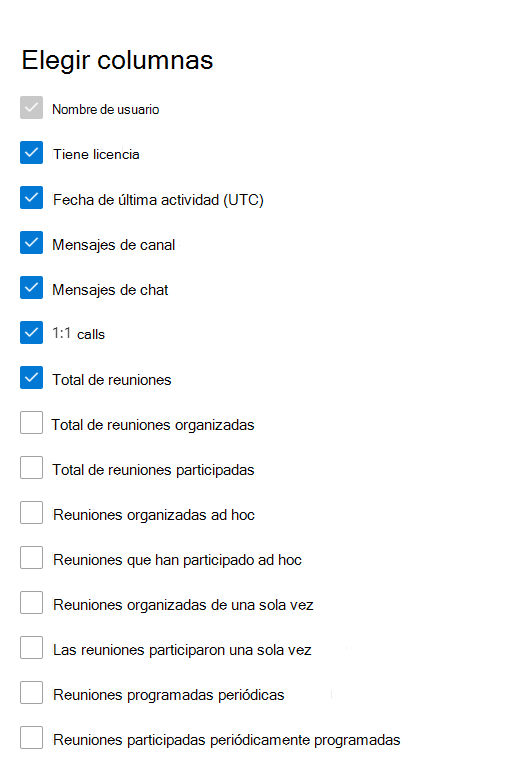

# Informes de Microsoft 365 en el centro de administración: actividad de usuario de Microsoft Teams

El panel informes  de Microsoft 365 muestra la introducción a la actividad en todos los productos de la organización. Le permite explorar informes individuales de nivel de producto para proporcionarle información más pormenorizada sobre la actividad dentro de cada producto. Consulte [el tema de información general sobre los informes](activity-reports.md). En el informe de actividad de los usuarios de Microsoft Teams puede obtener estadísticas sobre la actividad de Microsoft Teams en su organización.
  
> [!NOTE]
> Debe ser un administrador global, un lector global o un lector de informes en Microsoft 365 o un administrador de Exchange, SharePoint, Teams Service, Teams Communications o Skype Empresarial para ver informes.  
 
## Cómo obtener el informe de actividad de los usuarios de Microsoft Teams

1. En el centro de administración de, vaya a **Informes** \> <a href="https://go.microsoft.com/fwlink/p/?linkid=2074756" target="_blank">página</a> uso.
2. En la página principal del panel, haga clic en el **botón Ver más** de la tarjeta de actividad de Microsoft Teams.

## Interpretar el informe de actividad de los usuarios de Microsoft Teams

Puede ver la actividad del usuario en el informe de Teams seleccionando la **pestaña Actividad de** usuario.  

Seleccione **Elegir columnas** para agregar o quitar columnas del informe.    

También puede exportar los datos del informe a un archivo .csv de Excel seleccionando el **vínculo** Exportar. Se exportarán los datos de todos los usuarios y podrá efectuar una ordenación y un filtrado sencillos para un análisis más detallado. Si tiene menos de 2000 usuarios, puede ordenar y filtrar en la tabla en el propio informe. Si tiene más de 2000 usuarios, para poder filtrar y ordenar, tendrá que exportar los datos. El formato exportado para **tiempo de audio,** **tiempo de vídeo** y tiempo de uso compartido de pantalla sigue el formato de duración ISO8601. 

Puede visualizar el informe **Actividad de los usuarios en Microsoft Teams** para ver las tendencias de los últimos 7, 30, 90 o 180 días. Sin embargo, si selecciona un día determinado en el informe, la tabla (7) mostrará datos hasta 28 días a partir de la fecha actual (no la fecha en que se generó el informe).

Para garantizar la calidad de los datos, llevamos a cabo comprobaciones diarias de validación de datos durante los últimos tres días y se rellenarán los vacíos detectados. Es posible que observe diferencias en los datos históricos durante el proceso.

|Item|Descripción|
|:-----|:-----|
|**Métrica**|**Definición**|
|Nombre de usuario    |La dirección de correo electrónico del usuario. Puede mostrar la dirección de correo electrónico real o hacer que este campo sea anónimo.     |
|Mensajes de canal     |Número de mensajes únicos que el usuario publicó en un chat de grupo durante el período de tiempo especificado.    |
|Mensajes de chat     |El número de mensajes únicos que el usuario publicó en un chat privado durante el período de tiempo especificado.    |
|Total de reuniones     |Número de reuniones en línea en las que el usuario participó durante el período de tiempo especificado.    |
|Llamadas 1:1     | Número de llamadas 1:1 en las que el usuario participó durante el período de tiempo especificado.    |
|Fecha de última actividad (UTC)    |La última fecha en la que el usuario participó en una actividad de Microsoft Teams.  |
|Reuniones que han participado ad hoc     | El número de reuniones ad hoc en las que participó un usuario durante el período de tiempo especificado.    |
|Reuniones organizadas ad hoc   |Número de reuniones ad hoc que organizó un usuario durante el período de tiempo especificado.  |
|Total de reuniones organizadas    |La suma de reuniones programadas únicas, periódicas, ad hoc y sin clasificar que organizó un usuario durante el período de tiempo especificado.    |
|Total de reuniones participadas    |La suma de las reuniones programadas, periódicas, ad hoc y sin clasificar únicas en las que participó un usuario durante el período de tiempo especificado.    |
|Reuniones organizadas de una sola vez    |Número de reuniones programadas de una sola vez que un usuario organizó durante el período de tiempo especificado.    |
|Reuniones programadas periódicas    |Número de reuniones periódicas que organizó un usuario durante el período de tiempo especificado.    |
|Las reuniones participaron una sola vez    |El número de reuniones programadas únicas en las que participó un usuario durante el período de tiempo especificado.    |
|Reuniones participadas periódicamente programadas    |Número de reuniones periódicas en las que participó un usuario durante el período de tiempo especificado.    |
|Tiene licencia    |Se selecciona si el usuario tiene licencia para usar Teams.  |
|Otra actividad   |El usuario está activo, pero ha realizado otras actividades que no son los tipos de acción expuestos ofrecidos en el informe (enviar o responder a mensajes de canal y mensajes de chat, programar o participar en llamadas y reuniones 1:1). Las acciones de ejemplo son cuando un usuario cambia el estado de Teams o el mensaje de estado de Teams o abre una publicación de mensaje de canal, pero no responde.   |
|reuniones sin clasificar  |La que no se puede clasificar como programación, periódica o ad hoc. Son números cortos y, en su mayoría, no se pueden identificar debido a la información de telemetría manipulada. |
|||