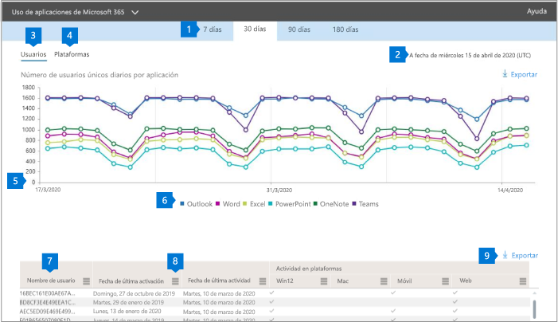

# Informes de Microsoft 365 en el Centro de administración: uso de aplicaciones de Microsoft 365Microsoft 365 Reports in the admin center - Microsoft 365 Apps usage

El panel informes  de Microsoft 365 muestra la información general sobre la actividad en todos los productos de la organización.The Microsoft 365 **Reports** dashboard shows you the activity overview across the products in your organization. Le permite explorar informes individuales de nivel de producto para proporcionarle información más pormenorizada sobre la actividad dentro de cada producto.It enables you to drill in to individual product level reports to give you more granular insight about the activities within each product. Consulte [el tema de información general sobre los informes](activity-reports.md).Check out [the Reports overview topic](activity-reports.md).

 Por ejemplo, puede comprender la actividad de cada usuario con licencia para usar aplicaciones de Aplicaciones de Microsoft 365 si observa su actividad en todas las aplicaciones y cómo se usan en las distintas plataformas.For example, you can understand the activity of each user licensed to use Microsoft 365 Apps apps by looking at their activity across the apps and how they are utilized across platforms.

 > [!NOTE]
 > Debe ser administrador global, lector global o lector de informes en Microsoft 365 o administrador de Exchange, SharePoint o Skype Empresarial para ver informes.You must be a global administrator, global reader or reports reader in Microsoft 365 or an Exchange, SharePoint, or Skype for Business administrator to see reports.

## Cómo obtener acceso al informe de uso de Aplicaciones de Microsoft 365How to get to the Microsoft 365 Apps usage report

1. En el centro de administración de, vaya a **Informes** \> <a href="https://go.microsoft.com/fwlink/p/?linkid=2074756" target="_blank">página</a> uso.In the admin center, go to the **Reports** \> <a href="https://go.microsoft.com/fwlink/p/?linkid=2074756" target="_blank">Usage</a> page.

 2. En la **lista desplegable Seleccionar** un informe, seleccione Uso de Aplicaciones de Microsoft **365 de Office 365.**   \>  \*\*\*\*From the **Select a report** drop-down, select **Office 365** \> **Microsoft 365 Apps usage** .

## Interpretar el informe de uso de Aplicaciones de Microsoft 365Interpret the Microsoft 365 Apps usage report

Puede obtener una vista de la actividad de Aplicaciones de Microsoft  365 de su usuario consultando los gráficos de usuarios **y plataformas.**You can get a view into your user's Microsoft 365 Apps activity by looking at the **Users** and **Platform** charts.

|ElementoItem|DescriptionDescription|
 |:-----|:-----|
 |1.1.   |El informe de uso de Aplicaciones de **Microsoft 365** se puede ver para ver las tendencias de los últimos 7, 30, 90 o 180 días.The **Microsoft 365 Apps usage** report can be viewed for trends over the last 7 days, 30 days, 90 days, or 180 days. Sin embargo, si selecciona un día determinado en el informe, la tabla (7) mostrará datos de hasta 28 días a partir de la fecha actual (no la fecha en que se generó el informe).However, if you select a particular day in the report, the table (7) will show data for up to 28 days from the current date (not the date the report was generated).   |
 |2.2.   |Los datos de cada informe suelen abarcar hasta los últimos siete días.The data in each report usually covers up to the last seven days.   |
 |3.3.   |La **vista** Usuarios muestra la tendencia en el número de usuarios activos para cada aplicación: Outlook, Word, Excel, PowerPoint, OneNote y Teams.The **Users** view shows the trend in the number of active users for each app – Outlook, Word, Excel, PowerPoint, OneNote, and Teams. Los "usuarios activos" son aquellos que realizan acciones intencionales dentro de estas aplicaciones."Active users" are any who perform any intentional actions within these apps.   |
 |4.4.   |La **vista** Plataformas muestra la tendencia de los usuarios activos en todas las aplicaciones de cada plataforma: Windows, Mac, Web y Mobile.The **Platforms** view shows the trend of active users across all apps for each platform – Windows, Mac, Web, and Mobile.   |
 |5.5. |En el **gráfico Usuarios,** el eje Y es el número de usuarios activos únicos para la aplicación correspondiente.On the **Users** chart, the Y-axis is the number of unique active users for the respective app. En el **gráfico**   Plataformas, el eje Y es el número de usuarios únicos para la plataforma correspondiente.On the **Platforms** chart, the Y-axis is the number of unique users for the respective platform. El eje X de ambos gráficos es la fecha en la que se usó una aplicación en una plataforma determinada.The X-axis on both charts is the date on which an app was used on a given platform. |
 6.6. |Puede filtrar la serie que ve en el gráfico seleccionando un elemento de la leyenda.You can filter the series you see on the chart by selecting an item in the legend. Por ejemplo,  en el gráfico Usuarios, seleccione Outlook, Word, Excel, PowerPoint, OneDrive o Teams para ver solo la información relacionada con cada uno de ellos.For example, on the **Users** chart, select Outlook, Word, Excel, PowerPoint, OneDrive, or Teams to see only the info related to each one. Cambiar esta selección no cambia la información de la tabla de cuadrícula debajo de ella.Changing this selection doesn't change the info in the grid table below it.|
 |7.7. |En la tabla, se muestra un desglose de los datos en el nivel de usuario.The table shows you a breakdown of data at the per-user level. Puede agregar o quitar columnas de la tabla.You can add or remove columns from the table.   **El** nombre de usuario es la dirección de correo electrónico del usuario que realizó la actividad en Aplicaciones de Microsoft.**Username** is the email address of the user who performed the activity on Microsoft Apps.  **La última fecha de activación (UTC)** es la última fecha en la que el usuario activó su suscripción a Aplicaciones de Microsoft 365.**Last activation date (UTC)** is the latest date on which the user activated their Microsoft 365 Apps subscription.  La fecha de la última actividad **(UTC)** es la última fecha en la que el usuario realizó una actividad intencionada.**Last activity date (UTC)** is the latest date an intentional activity was performed by the user. Para ver las actividades realizadas en una fecha específica, seleccione la fecha directamente en el gráfico.To see activity that occurred on a specific date, select the date directly in the chart.  Las siguientes columnas corresponden a cada aplicación que identifica si el usuario estaba activo en esa aplicación en el período seleccionado:The following columns correspond to each app that identifies if the user was active on that app in the period selected:   **Outlook****Outlook**  **Word****Word**  **Excel****Excel** **PowerPoint****PowerPoint**  **OneNote****OneNote**   Las siguientes columnas corresponden a cada plataforma que identifica si el usuario estaba activo en esa plataforma para cualquier aplicación (dentro de Aplicaciones de Microsoft 365) en el período seleccionado:The following columns correspond to each platform that identifies if the user was active on that platform for any app (within Microsoft 365 Apps) in the period selected:  **Outlook (Windows)****Outlook (Windows)** **Outlook (Mac)****Outlook (Mac)** **Outlook (Web)****Outlook (Web)**  **Outlook (Móvil)****Outlook (Mobile)**  **Word (Windows)****Word (Windows)**  **Word (Mac)****Word (Mac)**  **Word (Web)****Word (Web)**  **Word (móvil)****Word (Mobile)**  **Excel (Windows)****Excel (Windows)**  **Excel (Mac)****Excel (Mac)**  **Excel (Web)****Excel (Web)**  **Excel (móvil)****Excel (Mobile)**  **PowerPoint (Windows)****PowerPoint (Windows)**  **PowerPoint (Mac)****PowerPoint (Mac)** **PowerPoint (Web)****PowerPoint (Web)**  **PowerPoint (móvil)****PowerPoint (Mobile)**  **OneNote (Windows)****OneNote (Windows)**  **OneNote (Mac)****OneNote (Mac)**  **OneNote (Web)****OneNote (Web)** **OneNote (móvil)****OneNote (Mobile)**  **Teams (Windows)****Teams (Windows)**  **Teams (Mac)****Teams (Mac)**  **Teams (Web)****Teams (Web)** **Teams (móvil)****Teams (Mobile)** |
 |8.8. |Seleccione el **icono Administrar columnas** para agregar o quitar columnas del informe.Select the **Manage columns** icon to add or remove columns from the report.|
 |9.9. |También puede exportar los datos del informe a un archivo .csv de Excel seleccionando el **vínculo** Exportar.You can also export the report data into an Excel .csv file by selecting the **Export** link. Esto exporta datos para todos los usuarios y le permite realizar una agregación, ordenación y filtrado simples para un análisis posterior.This exports data for all users and enables you to do simple aggregation, sorting, and filtering for further analysis. Si tiene menos de 100 usuarios, puede ordenar y filtrar dentro de la tabla en el propio informe.If you have less than 100 users, you can sort and filter within the table in the report itself. Si tiene más de 100 usuarios, para filtrar y ordenar, tendrá que exportar los datos.If you have more than 100 users, in order to filter and sort, you will need to export the data.|
