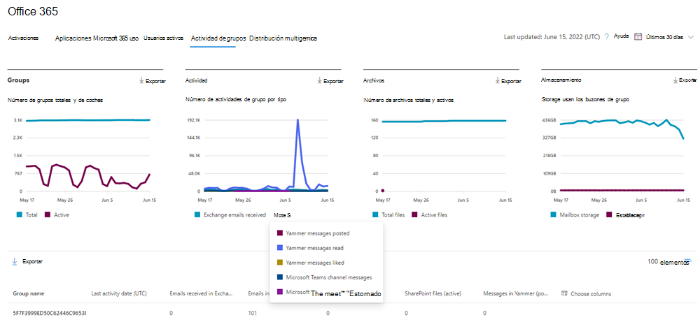
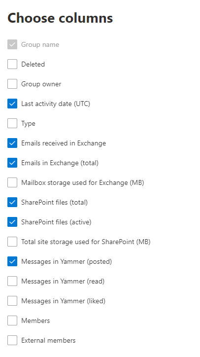

# Microsoft 365 Informes en el Centro de administración: Microsoft 365 grupos

El panel Microsoft 365 **informes le** muestra la introducción a la actividad en todos los productos de la organización. Le permite explorar informes individuales de nivel de producto para proporcionarle información más pormenorizada sobre la actividad dentro de cada producto. Consulte [el tema de información general sobre los informes](activity-reports.md). En el informe Microsoft 365 grupos, puede obtener información sobre la actividad de los grupos de su organización y ver cuántos grupos se crean y usan.
  
> [!NOTE]
> Debe ser administrador global, lector global o lector de informes en Microsoft 365 o un administrador de Exchange, SharePoint, servicio de Teams, comunicaciones de Teams o administrador Skype Empresarial para ver informes.  
  
## Cómo llegar al informe de grupos

1. En el centro de administración de, vaya a **Informes** \> <a href="https://go.microsoft.com/fwlink/p/?linkid=2074756" target="_blank">página</a> uso. 
2. En la página principal  del panel, haga clic en el botón Ver más en los usuarios activos ( Aplicaciones Microsoft 365 o los usuarios activos - tarjeta de servicios Microsoft 365 para llegar a la página Office 365 informe.
  
## Interpretar el informe de grupos

Puede ver las activaciones en el informe de Office 365 seleccionando la **pestaña Actividad grupos.** 

Seleccione **Elegir columnas** para agregar o quitar columnas del informe.    

También puede exportar los datos del informe a un archivo Excel .csv seleccionando el **vínculo** Exportar. Se exportarán los datos de todos los usuarios y podrá efectuar una ordenación y un filtrado sencillos para un análisis más detallado. Si tiene menos de 2000 usuarios, puede ordenar y filtrar en la tabla en el propio informe. Si tiene más de 2000 usuarios, para poder filtrar y ordenar, tendrá que exportar los datos. 

|Elemento|Descripción|
|:-----|:-----|
|**Métrica**|**Definición**|
|Nombre del grupo    |Nombre del grupo.    |
|Eliminada    |Número de grupos eliminados. Si el grupo se elimina, pero tuvo actividad durante el período de presentación de informes, se mostrará en la cuadrícula con esta marca establecida en true.    |
|Propietario del grupo    |Nombre del propietario del grupo.    |
|Fecha de última actividad (UTC)    |La última fecha en la que el grupo recibió un mensaje. Es la última fecha en que hubo actividad en una conversación de correo electrónico, Yammer o el sitio.    |
|Tipo    |Tipo de grupo. Puede ser un grupo público o privado.    |
|Correos electrónicos recibidos en Exchange    |El número de mensajes recibidos por el grupo.|
|Correos electrónicos en Exchange (total)    |El número total de elementos en el buzón del grupo.    |
|Almacenamiento de buzones usado para Exchange (MB)    |El almacenamiento usado por el buzón del grupo.  |
|SharePoint (total)    |El número de archivos almacenados en SharePoint de grupo.    |
|SharePoint (activo)    |Número de archivos del sitio de grupo SharePoint que se actuaron (vistos o modificados, sincronizados, compartidos interna o externamente) durante el período de informes.    |
|Almacenamiento total del sitio usado para SharePoint (MB)    |La cantidad de almacenamiento en MB usada durante el período de informes.    |
|Mensajes en Yammer (publicado)    |Número de mensajes publicados en el grupo Yammer durante el período de informes.    |
|Mensajes en Yammer (lectura)    |Número de conversaciones leídas en el grupo Yammer durante el período de informes.    |
|Mensajes en Yammer (me gusta)    |El número de mensajes que le gustaron en el grupo Yammer durante el período de informes.    |
|Members    |El número de miembros del grupo.    |
|Miembros externos |El número de usuarios externos del grupo.|
|||

## Contenido relacionado

[Microsoft 365 informes en](activity-reports.md) el Centro de administración (artículo) Informes en el Centro de seguridad [& cumplimiento](../../compliance/reports-in-security-and-compliance.md) (artículo) informes Microsoft 365 en el centro de administración [- Usuarios](../../admin/activity-reports/active-users-ww.md) activos (artículo)

