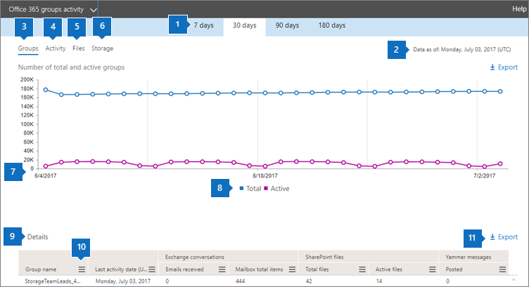

# Informes de Microsoft 365 en el centro de administración: grupos de Microsoft 365Microsoft 365 Reports in the admin center - Microsoft 365 groups

El panel informes  de Microsoft 365 muestra la introducción a la actividad en todos los productos de la organización.The Microsoft 365 **Reports** dashboard shows you the activity overview across the products in your organization. Le permite explorar informes individuales de nivel de producto para proporcionarle información más pormenorizada sobre la actividad dentro de cada producto.It enables you to drill in to individual product level reports to give you more granular insight about the activities within each product. Consulte [el tema de información general sobre los informes](activity-reports.md).Check out [the Reports overview topic](activity-reports.md). En el informe grupos de Microsoft 365, puede obtener información sobre la actividad de los grupos de su organización y ver cuántos grupos se crean y usan.In the Microsoft 365 groups report, you can gain insights into the activity of groups in your organization and see how many groups are being created and used.
  
> [!NOTE]
> Debe ser un administrador global, un lector global o un lector de informes en Microsoft 365 o un administrador de Exchange, SharePoint, Teams Service, Teams Communications o Skype Empresarial para ver informes.You must be a global administrator, global reader or reports reader in Microsoft 365 or an Exchange, SharePoint, Teams Service, Teams Communications, or Skype for Business administrator to see reports.  
  
## Cómo llegar al informe de gruposHow to get to the groups report

1. En el centro de administración de, vaya a **Informes** \> <a href="https://go.microsoft.com/fwlink/p/?linkid=2074756" target="_blank">página</a> uso.In the admin center, go to the **Reports** \> <a href="https://go.microsoft.com/fwlink/p/?linkid=2074756" target="_blank">Usage</a> page.

2. En las opciones, seleccione **Ver más en** Usuarios activos - Servicios de Microsoft **365**.From the options, select **View more** under **Active users - Microsoft 365 Services**.
3. En la **lista desplegable** Seleccionar un informe, seleccione Actividad grupos de **Office 365** \> .From the **Select a report** drop-down, select **Office 365** \> **Groups activity**.
  
## Interpretar el informe de gruposInterpret the groups report

Para obtener una vista de la actividad de grupos, consulte los gráficos **Grupos,** **Actividad,** **Archivos** **y** Almacenamiento.You can get a view into groups activity by looking at the **Groups**, **Activity**, **Files**, and **Storage** charts. 
  

  
|ItemItem|DescripciónDescription|
|:-----|:-----|
|1.1.    |El informe de grupos de **Microsoft 365** se puede ver para ver las tendencias de los últimos 7 días, 30 días, 90 días o 180 días.The **Microsoft 365 groups** report can be viewed for trends over the last 7 days, 30 days, 90 days, or 180 days. Sin embargo, si selecciona un día determinado en el informe, la tabla (7) mostrará datos hasta 28 días a partir de la fecha actual (no la fecha en que se generó el informe).However, if you select a particular day in the report, the table (7) will show data for up to 28 days from the current date (not the date the report was generated).    |
|2.2.    |Los datos de cada informe suelen abarcar hasta las últimas 24 a 48 horas.The data in each report usually covers up to the last 24 to 48 hours.    |
|3.3.    |La **vista** Grupos muestra un número total de grupos que existían en un día determinado y grupos activos en ese día en función de las conversaciones de correo electrónico, las publicaciones de Yammer y las actividades de archivos de SharePoint y las páginas de SharePoint vistas.The **Groups** view shows a total number of groups that existed on any given day, and active groups on that day based on Email Conversations, Yammer Posts and SharePoint file activities and SharePoint pages viewed.    |
|4.4.    |La vista **Actividad** muestra el número de actividades de grupo a lo largo de las cargas de trabajo de grupo.The **Activity** view shows you the number of group activities across group workloads. Puede ver los mensajes de Exchange que recibieron los buzones de grupo en todos los grupos, en cualquier día durante el período de notificación.You can view the Exchange emails received by the group mailboxes across all groups, on any day during the reporting period. También puede ver mensajes publicados, leídos y me gustaron en los grupos de Yammer asociados a un grupo.You can also see messages posted, read, and liked across the Yammer groups associated with a group.   |
|5.5.    |La **vista** Archivos muestra el número de archivos totales y activos en todos los sitios de grupo asociados a un grupo.The **Files** view shows you the number of total and active files across all group sites associated with a group.    |
|6.6.    |La vista **Almacenamiento** muestra el total de almacenamiento usado entre todos los buzones y sitios de grupo.The **Storage** view shows you the total storage used across all group mailboxes and group sites.    |
|7.7.    | En el gráfico **Grupos**, el eje Y es el número de grupos (que puede verse como totales o activos).On the **Groups** chart, Y-axis is the number of groups (which can be seen as total vs active).     En el **gráfico Actividad,** el eje Y es el número de veces que se realizó una actividad en grupos.On the **Activity** chart, Y-axis is the number of times an activity was performed in groups.     En el gráfico **Archivos**, el eje Y es el número de archivos totales o activos.On the **Files** chart, the Y axis is the number of either total or active files.     En el gráfico **Almacenamiento**, el eje Y es el almacenamiento total usado por el sitio o buzón de grupo.On the **Storage** chart, the Y axis is total storage used by the group mailbox or site.     En los tres gráficos, el eje X es el intervalo de fechas seleccionado para el informe específico.The X axis on all three charts is the selected date range for the specific report.    |
|8.8.    |Puede filtrar la serie que ve en el gráfico seleccionando un elemento en la leyenda.You can filter the series you see on the chart by selecting an item in the legend. Por ejemplo, en el **gráfico Grupos,** seleccione **Total** **o** Total activo y Número activo de grupos para ver solo la  ellos.For example, on the **Groups** chart, select **Total** or **Active**  to see only the info related to each one. Si cambia esta selección, no cambiará la información en la tabla de cuadrícula.Changing this selection doesn't change the info in the grid table.    |
|9.9.    | La lista de los grupos mostrados depende de la configuración de todos los grupos que existieron (y que no se eliminaron) a lo largo del plazo para la creación de informes más extenso (180 días). El recuento de actividades (conversaciones de correo electrónico, publicaciones de Yammer y actividades de archivos de SharePoint) variará según la selección de fecha.  The list of groups shown is determined by the set of all groups that existed (weren't deleted) across the widest (180-day) reporting time frame. The activity count (email conversations, Yammer posts and SharePoint file activities) will vary according to the date selection.    NOTA: Es posible que no vea todos los elementos de la lista siguiente en las columnas hasta que los agregue.NOTE: You might not see all the items in the list below in the columns until you add them. **Nombre del grupo** es el nombre del grupo.**Group name** is the name of the group.    **Eliminados** es el número de grupos eliminados. Si el grupo se elimina, pero tuvo actividad durante el período de presentación de informes, se mostrará en la cuadrícula con esta marca establecida en true.  **Deleted** is the number of deleted groups. If the group is deleted, but had activity in the reporting period it will show up in the grid with this flag set to true.    **Propietario del grupo** es el nombre del propietario del grupo.**Group owner** is the name of the group owner.    **La última fecha de actividad** es la última fecha en la que el grupo recibió un mensaje.**Last activity date** is the latest date a message was received by the group. Es la última fecha en que hubo actividad en una conversación de correo electrónico, Yammer o el sitio.- This is the latest date an activity happened in an email conversation, Yammer, or the Site.    **Tipo** es el tipo de grupo. Puede ser un grupo público o privado.  **Type** is the type of group. This can be private or public group.    **Miembros** es el número de miembros del grupo.**Members** is the number of members in the group.    **Miembros externos** es el número de usuarios externos en el grupo.**External members** is the number of external users in the group.    **Exchange****Exchange**   **Correos electrónicos recibidos** es el número de mensajes que ha recibido el grupo.**Emails received** is the number of messages received by the group.    **Elementos totales del buzón** es el número total de elementos en el buzón del grupo.**Mailbox total items** is the total number of items in the group's mailbox.    **Almacenamiento de buzón usado** es el almacenamiento utilizado en el buzón del grupo.**Mailbox storage used** is the storage used by the group's mailbox.    **Archivos de SharePoint****SharePoint Files**   **Total de archivos** es el número de archivos almacenados en los sitios del grupo de SharePoint.**Total files** is the number of files stored in SharePoint group sites.    **Archivos activos** es el número de archivos en el sitio del grupo de SharePoint (vistos o modificados, sincronizados, compartidos internamente o externamente) que se hayan comprendidos en el período de notificación.**Active files** is the number of files in the SharePoint group site that were acted on (viewed or modified, synched , shared internally or externally) during the reporting period    **Almacenamiento usado (MB) del sitio** es la cantidad de almacenamiento en MB que se ha usado durante el período de notificación.**Site storage used (MB)** is the amount of storage in MB used during the reporting period.    **Mensajes de Yammer****Yammer Messages**   **Publicados** es el número de mensajes publicados en el grupo de Yammer durante el período de creación de informes.**Posted** is the number of messages posted in the Yammer group over the reporting period.    **Leídos** es el número de conversaciones leídas en el grupo de Yammer durante el período de creación de informes.**Read** is the number of conversations read in the Yammer group over the reporting period.    **Lo que gusta** es el número de mensajes que han gustado en el grupo de Yammer durante el período de creación de informes.**Liked** is the number of messages liked in the Yammer group over the reporting period.     Si las directivas de la organización le impiden ver los informes en los que la información del usuario es identificable, puede cambiar la configuración de privacidad de todos estos informes.If your organization's policies prevents you from viewing reports where user information is identifiable, you can change the privacy setting for all these reports. Consulte la sección **¿Cómo ocultar los** detalles del nivel de usuario? en informes de actividad en el Centro de administración [de Microsoft 365](activity-reports.md).Check out the **How do I hide user level details?** section in the [Activity Reports in the Microsoft 365 admin center](activity-reports.md).    |
|10,10,    |Seleccione o **puntee el botón Más** acciones OWA móvil Más acciones junto a un encabezado de columna para agregar o quitar columnas del  informe.Select or tap **More Actions** button  next to a column heading to add or remove columns from the report.    |
|11,11,    |También puede exportar los datos del informe a un archivo .csv de Excel seleccionando el **vínculo** Exportar.You can also export the report data into an Excel .csv file by selecting the **Export** link. Se exportarán los datos de todos los usuarios y podrá efectuar una ordenación y un filtrado sencillos para un análisis más detallado.This exports data of all users and enables you to do simple sorting and filtering for further analysis. Si tiene menos de 2000 usuarios, puede ordenar y filtrar en la tabla en el propio informe.If you have less than 2000 users, you can sort and filter within the table in the report itself. Si tiene más de 2000 usuarios, para poder filtrar y ordenar, tendrá que exportar los datos.If you have more than 2000 users, in order to filter and sort, you will need to export the data.    |
|||

