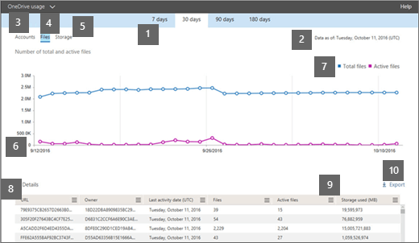

# Informes de Microsoft 365 en el centro de administración: uso de OneDrive para la EmpresaMicrosoft 365 Reports in the admin center - OneDrive for Business usage

El panel informes  de Microsoft 365 muestra la introducción a la actividad en todos los productos de la organización.The Microsoft 365 **Reports** dashboard shows you the activity overview across the products in your organization. Le permite explorar informes individuales de nivel de producto para proporcionarle información más pormenorizada sobre la actividad dentro de cada producto.It enables you to drill in to individual product level reports to give you more granular insight about the activities within each product. Consulte [el tema de información general de los informes](activity-reports.md).Check out [the Reports overview topic](activity-reports.md).
  
Por ejemplo, la tarjeta de OneDrive en el panel le ofrece una vista general del valor que obtiene de OneDrive para la Empresa en cuanto al número total de archivos y almacenamiento que se usa en su organización. Después, puede explorarlo en profundidad para comprender las tendencias de las cuentas activas de OneDrive, con cuántos archivos interactúan los usuarios, así como el almacenamiento usado. También le ofrece los detalles de cada usuario de OneDrive.For example, the OneDrive card on the dashboard gives you a high-level view of the value you are getting from OneDrive for Business in terms of the total number of files and storage used across your organization. You can then drill into it to understand the trends of active OneDrive accounts, how many files are users interacting with as well as the storage used. It also gives you details for each user's OneDrive.
  
> [!NOTE]
> Debe ser un administrador global, un lector global o un lector de informes en Microsoft 365 o un administrador de Exchange, SharePoint, Teams Service, Teams Communications o Skype Empresarial para ver informes.You must be a global administrator, global reader or reports reader in Microsoft 365 or an Exchange, SharePoint, Teams Service, Teams Communications, or Skype for Business administrator to see reports.  
 
## ¿Cómo puedo tener acceso al informe de uso de OneDrive?How do I get to the OneDrive Usage Report?

1. En el Centro de administración, vaya a **Informes** \> <a href="https://go.microsoft.com/fwlink/p/?linkid=2074756" target="_blank">de uso</a>.In the admin center, go to **Reports** \> <a href="https://go.microsoft.com/fwlink/p/?linkid=2074756" target="_blank">Usage</a>.

    
2. En la **lista desplegable** Seleccionar un informe, seleccione Uso **de** \> **OneDrive**.From the **Select a report** drop-down, select **OneDrive** \> **Usage**. 
  
## Interpretar el informe de uso de OneDriveInterpret the OneDrive usage report

Puede obtener una vista del uso de OneDrive para la Empresa consultando las vistas **Cuentas**, **Archivos** y **Almacenamiento**.You can get a view into OneDrive for Business usage by looking at the **Accounts**, **Files**, and **Storage** views. 
  

  
|ItemItem|DescripciónDescription|
|:-----|:-----|
|1.1.    |Consulte el informe **Uso de OneDrive** para ver las tendencias de los últimos 7, 30, 90 o 180 días.The **OneDrive usage** report shows trends over the last 7 days, 30 days, 90 days, or 180 days. Sin embargo, si selecciona un día determinado en el informe, la tabla (7) mostrará datos hasta 28 días a partir de la fecha actual (no la fecha en que se generó el informe).However, if you select a particular day in the report, the table (7) will show data for up to 28 days from the current date (not the date the report was generated).    |
|2.2.    |Los datos de cada informe suelen abarcar hasta las últimas 24 a 48 horas.The data in each report usually covers up to the last 24 to 48 hours.  |
|3.3.    |La vista **Cuentas** muestra la tendencia en el número de cuentas de OneDrive totales y activas. Las "Cuentas activas" son las que los usuarios usan para ver, modificar, cargar, descargar, compartir o sincronizar archivos.  The **Accounts** view shows the trend in the number of total and active OneDrive accounts. "Active accounts" are any in which users view, modify, upload, download, share, or sync files.    |
|4.4.    |La **vista** Archivos muestra el número de archivos totales y activos.The **Files** view shows the number of total and active files. Un archivo se considera activo si se ha guardado, sincronizado, modificado o compartido en un período de tiempo específico.A file is considered active if it has been saved, synced, modified, or shared within a specific time period.    NOTA: Una actividad de archivo puede producirse varias veces para un solo archivo, pero solo contará como un archivo activo.NOTE: A file activity can occur multiple times for a single file, but will count only as one active file. Por ejemplo, puede guardar y sincronizar el mismo archivo varias veces durante un período de tiempo especificado, pero solo contará como un único archivo activo y como un único archivo sincronizado en los datos.For example, you can save and sync the same file multiple times over a specified time period, but it will count only as one single active file and one single synced file in the data.           |
|5.5.    |La vista **Almacenamiento** muestra la tendencia de la cantidad de almacenamiento que esté usando en OneDrive.The **Storage** view shows the trend in the amount of OneDrive storage you're using. Si desea comprobar los límites de almacenamiento, consulte Comprobar si un usuario tiene el límite de almacenamiento predeterminado [o un límite específico](/onedrive/set-default-storage-space#check-if-a-user-has-the-default-storage-limit-or-a-specific-limit).If you want to check the storage limits, see [Check if a user has the default storage limit or a specific limit](/onedrive/set-default-storage-space#check-if-a-user-has-the-default-storage-limit-or-a-specific-limit).    NOTA: El tamaño incluye cualquier versión y metadatos asociados con los archivos.NOTE: The size includes any versions and metadata associated with the files.           |
|6.6.    | En el gráfico **Cuentas**, el eje Y es el número de cuentas de OneDrive.On the **Accounts** chart, the Y axis is the number of OneDrive accounts.     En el gráfico **Archivos**, el eje Y es el número de archivos almacenados en OneDrive.On the **Files** chart, the Y axis is the number of files stored in OneDrive.     En el gráfico **Almacenamiento**, el eje Y es la cantidad de almacenamiento que se usa para las cuentas de OneDrive.On the **Storage** chart, the Y axis is the amount of OneDrive storage used.     En todos los gráficos, el eje X es el intervalo de fechas seleccionado para este informe específico.The X axis on all charts is the selected date range for this specific report.    |
|7.7.    |Puede filtrar la serie que ve en el gráfico seleccionando un elemento en la leyenda.You can filter the series you see on the chart by selecting an item in the legend. Por ejemplo, en el gráfico **Archivos,** seleccione **Archivos totales** o **Archivos activos.**For example, on the **Files** chart, select **Total files** or **Active files**. En el **gráfico Cuentas,** seleccione **Cuentas totales** o **Cuentas activas.**On the **Accounts** chart, select **Total accounts** or **Active accounts**. O en el **gráfico Almacenamiento,** seleccione **Almacenamiento usado**.Or on the **Storage** chart, select **Storage used**. Si cambia su selección, no se modificará la información de la tabla.Changing your selection doesn't change the information in the table.    |
|8.8.    | En la tabla se muestra un desglose de los datos de cada OneDrive de usuario. Para que un usuario aparezca en la tabla, debe tener asignada una licencia de producto que incluya OneDrive y la opción SharePoint Online activada. El usuario también debe haber iniciado sesión con en cliente de sincronización de OneDrive o haber consultado su OneDrive con un explorador web.  The table shows you a breakdown of data for each user's OneDrive. To appear in the table, a user needs to have been assigned a product license that includes OneDrive, and they need to have SharePoint Online turned on. The user also needed to either sign in to the OneDrive sync client, or browse to their OneDrive using a web browser.     Si la cuenta de OneDrive ha tenido actividad de archivos, tendrá la última fecha en la que se ha realizado la actividad de archivos. Las filas de la tabla se ordenan por el valor **Fecha de última actividad** para que las OneDrive con la actividad de archivos más reciente se muestran en la parte superior de la lista.  If the OneDrive has had file activity, it will have the latest date that the file activity was performed. The rows in the table are sorted by **Last activity date** so the OneDrive with the most recent file activity appears at the top of the list.     Puede agregar o quitar columnas de la tabla.You can add or remove columns from the table.        **La** dirección URL es la dirección web del OneDrive del usuario.**URL** is the web address for the user's OneDrive.    **Eliminada** es el estado de eliminación de la OneDrive. Pueden pasar al menos 7 días hasta que las cuentas se marquen como eliminadas.  **Deleted** is the deletion status of the OneDrive. It takes at least 7 days for accounts to be marked as deleted.    **Propietario** es el nombre de usuario del administrador principal del OneDrive.**Owner** is the username of the primary administrator of the OneDrive.    **El nombre principal del propietario** es la dirección de correo electrónico del propietario de OneDrive.**Owner principal name** is the email address of the owner of the OneDrive.    **Fecha de última actividad (UTC)** es la última fecha en que se ha realizado una actividad de archivos en la OneDrive. Si la OneDrive no ha tenido actividad de archivos, el valor se mostrará en blanco.  **Last activity date (UTC)** is the latest date a file activity was performed in the OneDrive. If the OneDrive has had no file activity, the value will be blank.    **Archivos** es el número de archivos que hay en el OneDrive.**Files** is the number of files in the OneDrive.    **Archivos activos** es el número de archivos activos que hay en el período de tiempo.**Active files** is the number of active files within the time period.  NOTA: Si los archivos se quitaron durante el período de tiempo especificado para el informe, el número de archivos activos que se muestran en el informe puede ser mayor que el número actual de archivos en OneDrive.NOTE: If files were removed during the specified time period for the report, the number of active files shown in the report may be larger than the current number of files in the OneDrive. Los usuarios eliminados seguirán apareciendo en los informes durante 180 días.Deleted users will continue to appear in reports for 180 days. **Almacenamiento usado (MB)** es la cantidad de almacenamiento que el OneDrive usa en MB.**Storage used (MB)** is the amount of storage the OneDrive uses in MB.    Si las directivas de la organización le impiden ver los informes en los que la información del usuario es identificable, puede cambiar la configuración de privacidad de todos estos informes.If your organization's policies prevent you from viewing reports where user information is identifiable, you can change the privacy setting for all these reports. Consulte la sección **¿Cómo ocultar los** detalles del nivel de usuario? en informes de actividad en el Centro de administración [de Microsoft 365](activity-reports.md).Check out the **How do I hide user level details?** section in the [Activity Reports in the Microsoft 365 admin center](activity-reports.md).    |
|9.9.    |Seleccione el **icono Administrar columnas** Administrar columnas para agregar o quitar columnas del  informe.Select the **Manage columns** icon  to add or remove columns from the report.    |
|10.10.    |También puede exportar los datos del informe a un archivo .csv de Excel seleccionando el **vínculo** Exportar.You can also export the report data into an Excel .csv file, by selecting the **Export** link. Se exportarán los datos de todos los OneDrive y podrá efectuar una ordenación y un filtrado sencillos para llevar a cabo análisis posteriores.This exports the date for each OneDrive and allows you to do simple sorting and filtering for further analysis. Si tiene menos de 2000 OneDrive de usuarios, puede ordenar y filtrar en la tabla en el propio informe.If you have less than 2000 OneDrive accounts, you can sort and filter within the table in the report itself. Si tiene más de 2000 OneDrive de usuarios, para poder filtrar y ordenar, tendrá que exportar los datos.If you have more than 2000 OneDrive accounts, you need to export the data to filter and sort.    NOTA: Cuando los datos se exportan a un archivo de Excel, la fecha en que se generó el informe de contenido se refleja en el archivo en la columna Datos a partir **de** la columna.NOTE: When the data is exported to an Excel file, the date the content report was generated is reflected in the file in the **Data as of** column.    |
|||
