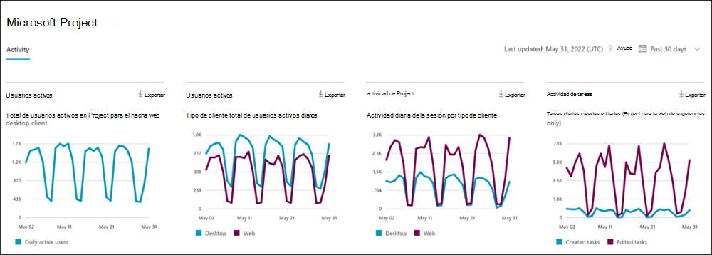

# Informes de Microsoft 365 en el Centro de administración: actividad del proyecto

En el panel Informes de Microsoft 365 se muestra la información general sobre la actividad en los productos de su organización. Le permite explorar informes individuales de nivel de producto para proporcionarle información más pormenorizada sobre la actividad dentro de cada producto. Consulte [el tema de información general sobre los informes](activity-reports.md).

En el **informe de actividad de Project**, puede comprender la actividad de cada usuario con licencia para usar Microsoft Project examinando su interacción con Project. También le ayuda a comprender el nivel de colaboración que se está realizando examinando el número de proyectos visitados y las tareas creadas o editadas.

## Cómo llegar al informe de actividad del proyecto

1. En el centro de administración de, vaya a **Informes** \> <a href="https://go.microsoft.com/fwlink/p/?linkid=2074756" target="_blank">página</a> uso.
2. En la página principal del panel, haga clic en el botón **Ver más** de la tarjeta Proyecto.

## Interpretación del informe de actividad del proyecto

Puede usar este informe para ver la actividad y el uso de Project en su entorno. Verá cuatro gráficos de resumen en este informe:   

- **Usuarios activos** : muestra los usuarios activos diarios de cada día a lo largo del tiempo. Actualmente, esto solo incluye Project for the Web y Project Online cliente de escritorio.
- **Usuarios activos (por cliente):** muestra los usuarios activos diarios de cada día a lo largo del tiempo, desglosados por el cliente (Project for the Web frente a Project Online desktop client).
- **Actividad del proyecto**: muestra el número de sesiones diarias de Project a lo largo del tiempo para cada cliente (Project para web y Project Online cliente de escritorio).
- **Actividad de tarea** : muestra el número diario de tareas creadas o editadas a lo largo del tiempo en Project for the Web

El informe también tiene una tabla que muestra la actividad de cada usuario del proyecto en su entorno.

Seleccione **Elegir columnas** para agregar o quitar columnas de la tabla.

También puede exportar los datos del informe a un archivo de excel .csv seleccionando el vínculo **Exportar** . Se exportarán los datos de todos los usuarios y podrá efectuar una ordenación y un filtrado sencillos para un análisis más detallado.

El informe **de actividad del proyecto** se puede ver para ver las tendencias de los últimos 7 días, 30 días, 90 días o 180 días. Si selecciona un día determinado en el informe, la tabla de datos por usuario se actualizará en consecuencia para mostrar el uso de los usuarios ese día. Sin embargo, esta característica solo funciona durante los últimos 28 días.

### Impacto en la configuración de privacidad en el panel

Si los usuarios o administradores tienen su configuración de privacidad establecida en **Ninguno**, no tenemos métricas precisas para el gráfico de **actividad de Project** para el cliente de escritorio Project Online. Los números mostrados serán infracuestados. Para obtener más información sobre la configuración de privacidad, consulte Uso de la [configuración de directivas para administrar controles de privacidad para Aplicaciones Microsoft 365 para empresas](/deployoffice/privacy/manage-privacy-controls.md).

## Tabla de actividad de usuario

A continuación se muestran las definiciones de cada métrica de la tabla de actividad del usuario.

|Item|Descripción|
|:-----|:-----|
|**Métrica**|**Definición**|
|Nombre de usuario|El nombre principal del usuario.|
|Nombre para mostrar|Nombre completo del usuario.|
|Fecha de la última actividad|La fecha más reciente en la que el usuario de esa fila tenía actividad en Project, incluidas las actividades de los informes de resumen.|
|Proyectos visitados (escritorio)|Número de proyectos abiertos por el usuario en el Project Online cliente de escritorio durante el intervalo de tiempo seleccionado en la parte superior derecha de la página.|
|Proyectos visitados (Web)| Número de tareas creadas por el usuario en Project for the Web durante el intervalo de tiempo seleccionado en la parte superior derecha de la página.|
|Tareas creadas (Web)|Número de tareas creadas por el usuario en Project for the Web durante el intervalo de tiempo seleccionado en la parte superior derecha de la página.|
|Tareas editadas (Web)|Número de tareas editadas por el usuario en Project for the Web durante el intervalo de tiempo seleccionado en la parte superior derecha de la página.|
|Otros|Este valor es true si el usuario ha realizado una actividad en Project Online cliente de escritorio o en Project for the Web (que no está cubierto por las demás columnas) en el intervalo de tiempo seleccionado en la parte superior derecha de la página. Si el usuario no lo ha hecho, este valor es false.|
