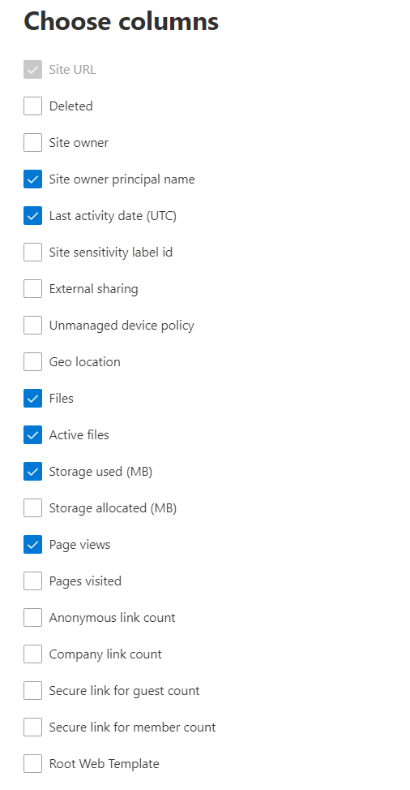

# Microsoft 365 Informes en el Centro de administración: SharePoint de sitioMicrosoft 365 Reports in the admin center - SharePoint site usage

Como administrador Microsoft 365, el panel **Informes** le muestra la información general sobre la actividad en varios productos de su organización.As a Microsoft 365 admin, the **Reports** dashboard shows you the activity overview across various products in your organization. Le permite explorar para obtener una visión más detallada de las actividades específicas de cada producto.It enables you to drill in to get more granular insight about the activities specific to each product. Por ejemplo, puede obtener una vista de alto nivel del valor que se genera desde SharePoint en cuanto al número total de archivos que almacenan los usuarios en sitios de SharePoint, el número de archivos que se usan de manera activa y el almacenamiento consumido en todos estos sitios.For example, you can get a high level view of the value you are getting from SharePoint in terms of the total number of files that users store in SharePoint sites, how many files are actively being used, and the storage consumed across all these sites. Luego, puede explorar el informe de uso del sitio de SharePoint para analizar las tendencias y los detalles de nivel de cada sitio.Then, you can drill into the SharePoint site usage report to understand the trends and per site level details for all sites. 
  
> [!NOTE]
> Debe ser administrador global, lector global o lector de informes en Microsoft 365 o un administrador de Exchange, SharePoint, servicio de Teams, comunicaciones de Teams o administrador Skype Empresarial para ver informes.You must be a global administrator, global reader or reports reader in Microsoft 365 or an Exchange, SharePoint, Teams Service, Teams Communications, or Skype for Business administrator to see reports.
Microsoft 365 Los informes en el Centro de administración no se admiten GCC inquilinos de Alto y DoD.Microsoft 365 Reports in the admin center is not supported for GCC High and DoD tenants.
 
## Obtener acceso al informe de uso del sitio de SharePointHow to get to the SharePoint site usage report

1. En el centro de administración de, vaya a **Informes** \> <a href="https://go.microsoft.com/fwlink/p/?linkid=2074756" target="_blank">página</a> uso.In the admin center, go to the **Reports** \> <a href="https://go.microsoft.com/fwlink/p/?linkid=2074756" target="_blank">Usage</a> page. 
2. En la página principal del panel, haga clic en el botón **Ver más** en la SharePoint panel.From the dashboard homepage, click on the **View more** button on the SharePoint card.
  
## Interpretar el informe SharePoint uso del sitioInterpret the SharePoint site usage report

Puede ver el uso del sitio en el informe SharePoint mediante la pestaña **Uso del** sitio.You can view the site usage in the SharePoint report by choosing the **Site usage** tab. 

Seleccione **Elegir columnas** para agregar o quitar columnas del informe.Select **Choose columns** to add or remove columns from the report.    

También puede exportar los datos del informe a un archivo Excel .csv seleccionando el **vínculo** Exportar.You can also export the report data into an Excel .csv file by selecting the **Export** link. Se exportarán los datos de todos los usuarios y podrá efectuar una ordenación y un filtrado sencillos para un análisis más detallado.This exports data of all users and enables you to do simple sorting and filtering for further analysis. Si tiene menos de 2000 usuarios, puede ordenar y filtrar en la tabla en el propio informe.If you have less than 2000 users, you can sort and filter within the table in the report itself. Si tiene más de 2000 usuarios, para poder filtrar y ordenar, tendrá que exportar los datos.If you have more than 2000 users, in order to filter and sort, you will need to export the data. 
  
|ElementoItem|DescripciónDescription|
|:-----|:-----|
|**Métrica****Metric**|**Definición****Definition**|
|Dirección URL del sitioSite URL    |La dirección URL completa del sitio.The full URL of the site.   |
|DeletedDeleted    |El estado de eliminación del sitio.The deletion status of the site. Se tarda como mínimo siete días para que los sitios se marquen como eliminados.It takes at least 7 days for sites to be marked as deleted.    |
|Propietario del sitioSite owner    |Nombre de usuario del propietario principal del sitio.The username of the primary owner of the site.     |
|Nombre principal del propietario del sitioSite owner principal name    |La dirección de correo electrónico del propietario del sitio.The email address of the owner of the site.   |
|Fecha de última actividad (UTC)Last activity date (UTC)    | La fecha de la última vez que se detectó la actividad del archivo o una página se visualizó en el sitio.The date of the last time file activity was detected or a page was viewed on the site.    |
|Id. de etiqueta de confidencialidad del sitioSite sensitivity label id    | La etiqueta de confidencialidad del sitio.The sensitivity label on the site.    |
|Uso compartido externoExternal sharing    | La configuración externa que se puede compartir en el sitio.The external sharable settings on the site.    |
|Directiva de dispositivos no administradosUnmanaged device policy    | La directiva de acceso al sitio para dispositivos no administrados.The site access policy for unmanaged devices.    |
|Ubicación geográficaGeo location    | Ubicación geográfica del sitio.The Geo location of the site.    |
|ArchivosFiles    |El número de archivos del sitio.The number of files on the site.  |
|Archivos activosActive files    | Número de archivos activos en el sitio.The number of active files on the site.  NOTA: Si los archivos se quitaron durante el período de tiempo especificado para el informe, el número de archivos activos que se muestran en el informe puede ser mayor que el número actual de archivos en el sitio.NOTE: If files were removed during the specified time period for the report, the number of active files shown in the report may be larger than the current number of files on the site.    |
|Storage usado (MB)Storage used (MB)    |La cantidad de almacenamiento que se usa actualmente en el sitio.The amount of storage currently being used on the site.   |
|Storage asignado (MB)Storage allocated (MB)    |La cantidad máxima de almacenamiento asignada al sitio.The maximum amount of storage allocated for the site.   |
|Vistas de páginaPage views    |El número de veces que se han visto las páginas en el sitio.The number of times pages were viewed on the site.   |
|Páginas visitadasPages visited    |El número de páginas únicas que se visitaron en el sitio.The number of unique pages that were visited on the site.   |
|Recuento de vínculos anónimosAnonymous link count    |El número de veces que se comparten documentos o carpetas con "Cualquiera con el vínculo" en el sitio.The number of times documents or folders are shared using "Anyone with the link" on the site.   |
|Recuento de vínculos de empresaCompany link count    |El número de veces que se comparten documentos o carpetas con "Personas de la organización con el vínculo" en el sitio.The number of times documents or folders are shared using "People in org with the link" on the site.   |
|Vínculo seguro para el recuento de invitadosSecure link for guest count    |El número de veces que se comparten documentos o carpetas con "personas específicas" en el sitio.The number of times documents or folders are shared using "specific people" on the site.   |
|Vínculo seguro para el recuento de miembrosSecure link for member count    |El número de veces que se comparten documentos o carpetas con "personas específicas" en el sitio.The number of times documents or folders are shared using "specific people" on the site.   |
|Plantilla de web raízRoot Web Template    |Plantilla usada para crear el sitio.The template used for creating the site.    NOTA: Si desea filtrar los datos por diferentes tipos de sitio, exporte los datos y use la columna Plantilla web raíz.NOTE: If you want to filter the data by different site types, then export the data and use the Root Web Template column. |
|||