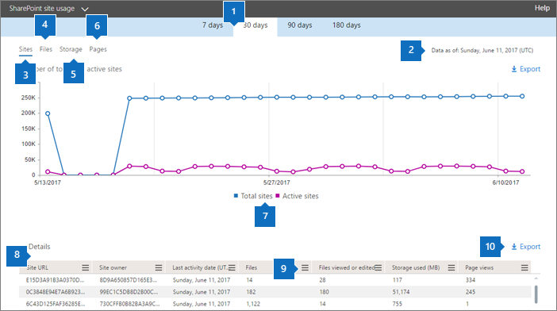

# Informes de Microsoft 365 en el centro de administración: uso del sitio de SharePoint

Como administrador de Microsoft 365, el panel **informes** muestra la información general de la actividad en varios productos de la organización. Le permite explorar para obtener una visión más detallada de las actividades específicas de cada producto. Por ejemplo, puede obtener una vista de alto nivel del valor que se genera desde SharePoint en cuanto al número total de archivos que almacenan los usuarios en sitios de SharePoint, el número de archivos que se usan de manera activa y el almacenamiento consumido en todos estos sitios. Luego, puede explorar el informe de uso del sitio de SharePoint para analizar las tendencias y los detalles de nivel de cada sitio. 
  
> [!NOTE]
> Debe ser administrador global, lector global o lector de informes en Microsoft 365 o un administrador de Exchange, SharePoint, Teams, Team Communications o Skype empresarial para ver los informes.
Los informes de Microsoft 365 en el centro de administración no son compatibles con los inquilinos de GCC High y DoD.
 
## Obtener acceso al informe de uso del sitio de SharePoint

1. En el centro de administración, vaya a uso de **informes** \> <a href="https://go.microsoft.com/fwlink/p/?linkid=2074756" target="_blank">Usage</a>.

    
2. En la lista desplegable **seleccionar un informe** , seleccione **SharePoint** \> **uso del sitio**de SharePoint.
  
## Interpretar el informe de uso del sitio de SharePoint

  
|||
|:-----|:-----|
|1.    |Puede visualizar el informe **Uso del sitio de SharePoint** para ver las tendencias de los últimos 7, 30, 90 o 180 días. Sin embargo, si selecciona un día concreto en el informe, la tabla (7) mostrará los datos de hasta 28 días a partir de la fecha actual (no la fecha en que se generó el informe).    |
|2.    |Los datos de cada informe normalmente cubren hasta las últimas 24 a 48 horas.   |
|3.    |El gráfico **sitios** muestra el número de sitios totales y activos, incluido cualquier sitio en el que los usuarios hayan visto, modificado, cargado, descargado, compartido o sincronizado un archivo o visto una página dentro del período del informe.    |
|4.    |En el gráfico **Archivos** se muestra el número de archivos que hay en todos los sitios y el número de archivos activos. El número total de archivos incluye los archivos de usuario y de sistema. Un archivo se considera activo si se ha guardado, sincronizado, modificado o compartido durante el período de tiempo determinado.  |
|5.    |En el gráfico **Almacenamiento** se muestra la tendencia del almacenamiento asignado y consumido durante el período de informe.    |
|6.    |El gráfico **Páginas** muestra el número de páginas que se han visto en todos los sitios.    |
|7.    |Puede filtrar los gráficos que ve seleccionando un elemento de la leyenda. Por ejemplo, en el gráfico **archivos** , seleccione **archivos** o **archivos activos**. En el gráfico **sitios** , puede seleccionar **total de sitios** o **sitios activos**. En el gráfico **almacenamiento** , puede seleccionar **almacenamiento asignado** o el **almacenamiento consumido.** El hecho de cambiar esta selección no cambia la información de la tabla de cuadrícula.    |
|8.    | En la tabla se muestra un desglose de las actividades en el nivel de cada sitio.                 **Dirección URL del sitio** es la dirección URL completa del sitio.    **Eliminado** es el estado de eliminación del sitio. Se tarda como mínimo siete días para que los sitios se marquen como eliminados.    **Propietario del sitio** es el nombre de usuario del propietario principal del sitio.   **Nombre principal del propietario del sitio** es la dirección de correo electrónico del propietario del sitio.    **Fecha de la última actividad (UTC)** hace referencia a la fecha de la última vez que se detectó actividad de archivos o páginas vistas en el sitio.    **Archivos** es el número de archivos que hay en el sitio.    **Archivos activos** es el número de archivos activos en el sitio.  Nota: si los archivos se quitaron durante el período de tiempo especificado para el informe, el número de archivos activos que se muestran en el informe puede ser mayor que el número actual de archivos en el sitio. **Almacenamiento usado (MB)** es la cantidad de almacenamiento usado actualmente en el sitio.    **Almacenamiento asignado (MB)** es la cantidad máxima de almacenamiento asignado para el sitio.    **Vistas de página** es el número de veces que las páginas se han visto en el sitio.    **Páginas visitadas** es el número de páginas únicas que se han visitado en el sitio.    **Plantilla web raíz** es la plantilla utilizada para crear el sitio.    Nota: Si desea filtrar los datos por distintos tipos de sitio, exporte los datos y use la columna raíz Web Template.  Si las directivas de la organización le impiden ver los informes en los que la información del usuario es identificable, puede cambiar la configuración de privacidad de todos estos informes. Consulte la sección **cómo ocultar los detalles del nivel de usuario** en los [informes de actividades del centro de administración de Microsoft 365](activity-reports.md).    |
|9.    |Seleccione **administrar**columnas  para agregar o quitar columnas del informe.      |
|10.    |También puede exportar los datos del informe a un archivo. csv de Excel; para ello, seleccione el vínculo **exportar**  . Se exportarán los datos de todos los sitios y podrá efectuar una ordenación y un filtrado sencillos para un análisis más detallado. Si tiene menos de 2000 sitios, puede ordenar y filtrar en la tabla en el propio informe. Si tiene más de 2000 sitios, para poder filtrar y ordenar, tendrá que exportar los datos.    Nota: cuando los datos se exportan a un archivo de Excel, tenga en cuenta que la fecha en la que se generó el informe de contenido se refleja en el archivo en la columna **datos a partir de** .          |
|||
