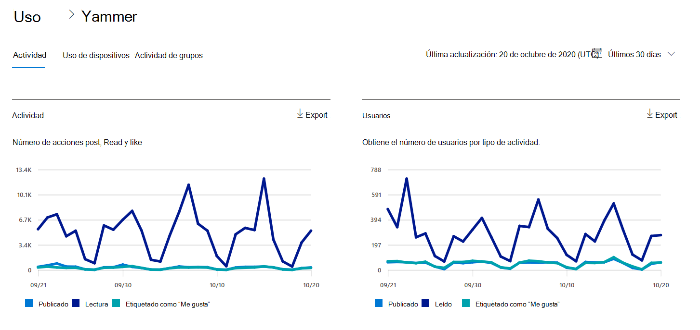
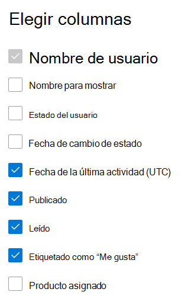

# Informes de Microsoft 365 en el centro de administración: informe de actividad de Yammer

Como administrador de Microsoft 365, el panel **informes** muestra datos sobre el uso de los productos dentro de la organización. Consulte los [informes de actividad en el Centro de administración.](activity-reports.md) Con el **informe de actividad de Yammer**, podrá comprender el nivel de participación de la organización con Yammer consultando el número de usuarios únicos que usan Yammer para publicar, leer o indicar que les gusta un mensaje, y la cantidad de actividad generada en toda la organización. 
  
> [!NOTE]
> Debe ser un administrador global, un lector global o un lector de informes en Microsoft 365 o un administrador de Exchange, SharePoint, Teams Service, Teams Communications o Skype Empresarial para ver informes.  
 
## ¿Cómo puedo llegar al informe de actividad de Yammer?

1. En el centro de administración de, vaya a **Informes** \> <a href="https://go.microsoft.com/fwlink/p/?linkid=2074756" target="_blank">página</a> uso. 
2. En la página principal del panel, haga clic en el **botón Ver más** de la tarjeta Yammer.

  
## Interpretar el informe de actividad de Yammer

Puede ver las actividades en el informe de Yammer seleccionando la **pestaña** Actividad. 

Seleccione **Elegir columnas** para agregar o quitar columnas del informe.    

También puede exportar los datos del informe a un archivo .csv de Excel seleccionando el **vínculo** Exportar. Se exportarán los datos de todos los usuarios y podrá efectuar una ordenación y un filtrado sencillos para un análisis más detallado. Si tiene menos de 2000 usuarios, puede ordenar y filtrar en la tabla en el propio informe. Si tiene más de 2000 usuarios, para poder filtrar y ordenar, tendrá que exportar los datos. 
  
|Item|Descripción|
|:-----|:-----|
|**Métrica**|**Definición**|
|Nombre de usuario    |La dirección de correo electrónico del usuario. Puede mostrar la dirección de correo electrónico real o hacer que este campo sea anónimo. Esta cuadrícula muestra los usuarios que iniciaron sesión en Yammer con la cuenta de Microsoft 365 o que iniciaron sesión en la red mediante el inicio de sesión único.   |
|Nombre para mostrar    |Nombre completo del usuario. Puede mostrar la dirección de correo electrónico real o hacer que este campo sea anónimo.    |
|Estado del usuario    |Uno de tres valores: Activado, Eliminado o Suspendido. En estos informes se muestran datos para usuarios activos, suspendidos y eliminados. No reflejan usuarios pendientes, porque los usuarios pendientes no publican, leen o indican que les gusta un mensaje.    |
|Fecha de cambio de estado (UTC)    |La fecha en la que se cambió el estado del usuario en Yammer.    |
|Fecha de última actividad (UTC)    | La última fecha en la que el usuario publicó, leyó o le gustó un mensaje.    |
|Publicado    |El número de mensajes que el usuario publicó durante el período de tiempo especificado.  |
|Lectura    |El número de conversaciones que el usuario leyó durante el período de tiempo especificado.    |
|Etiquetado como “Me gusta”    |El número de mensajes que el usuario ha gustado durante el período de tiempo especificado.   |
|Producto asignado    |Los productos que se asignan a este usuario.|
|||