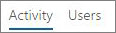

# Informes de Microsoft 365 en el centro de administración: informe de actividad de YammerMicrosoft 365 Reports in the admin center - Yammer activity report

Como administrador de Microsoft 365, el panel **informes** muestra datos sobre el uso de los productos dentro de la organización.As Microsoft 365 admin, the **Reports** dashboard shows you data on the usage of the products within your organization. Consulte los [informes de actividad en el Centro de administración.](activity-reports.md)Check out [activity reports in the admin center](activity-reports.md). Con el **informe de actividad de Yammer**, podrá comprender el nivel de participación de la organización con Yammer consultando el número de usuarios únicos que usan Yammer para publicar, leer o indicar que les gusta un mensaje, y la cantidad de actividad generada en toda la organización.With the **Yammer Activity report**, you can understand the level of engagement of your organization with Yammer by looking at the number of unique users using Yammer to post, like or read a message and the amount of activity generated across the organization. 
  
> [!NOTE]
> Debe ser un administrador global, un lector global o un lector de informes en Microsoft 365 o un administrador de Exchange, SharePoint, Teams Service, Teams Communications o Skype Empresarial para ver informes.You must be a global administrator, global reader or reports reader in Microsoft 365 or an Exchange, SharePoint, Teams Service, Teams Communications, or Skype for Business administrator to see reports. 
 
## Obtener acceso al informe de actividad de YammerHow to get to the Yammer activity report

1. En el centro de administración de, vaya a **Informes** \> <a href="https://go.microsoft.com/fwlink/p/?linkid=2074756" target="_blank">página</a> uso.In the admin center, go to the **Reports** \> <a href="https://go.microsoft.com/fwlink/p/?linkid=2074756" target="_blank">Usage</a> page.

    
2. En la **lista desplegable** Seleccionar un informe, seleccione Actividad **de Yammer** \> .From the **Select a report** drop-down, select **Yammer** \> **Activity**.
  
## Interpretar el informe de actividad de YammerInterpret the Yammer activity report

Puede obtener una vista de la actividad de Yammer del usuario consultando los gráficos Actividad y Usuarios.You can get a view into your user's Yammer activity by looking at the Activity and Users charts.
  

  
El informe de actividad contiene la siguiente información.The activity report contains the following information.
  
- Use las pestañas de los días para ver las tendencias del informe de **actividades de Yammer** de los últimos 7 días, 30 días, 90 días o 180 días.Use the day tabs to view the **Yammer activity** report trends over the last 7 days, 30 days, 90 days, or 180 days. Sin embargo, si selecciona un día determinado en el informe, la tabla mostrará datos hasta 28 días a partir de la fecha actual (no la fecha en que se generó el informe).However, if you select a particular day in the report, the table will show data for up to 28 days from the current date (not the date the report was generated). 
    
- Cada informe tiene la fecha del momento en que se generó. Normalmente, el informe refleja una latencia de 24 a 48 horas desde el momento de actividad.Each report has a date for when the report was generated. The reports usually reflect a 24 to 48 hour latency from time of activity.
    
- Puede ver el gráfico **Actividad** para comprender la tendencia de la cantidad de actividad de Yammer en su organización. Podrá comprender la división de mensajes publicados, leídos o que han gustado.You can view the **Activity** chart to understand the trend of the amount of Yammer activity going on in your organization. You can understand the split of messages posted, read, or liked. 
    
    
  
  - En el gráfico **Actividad**, el eje Y es el recuento de las actividades de los mensajes que se han publicado, leído o que han gustado.On the **Activity** chart, the Y axis is the count of activity of the messages posted, read, or liked. 
    
- Puede ver el gráfico **Usuario** para comprender la tendencia de la cantidad de usuarios únicos que generan las actividades de Yammer. Puede consultar la tendencia de los usuarios que publican, leen o a quienes les gustan mensajes de Yammer.You can view the **User** chart to understand the trend of the amount of unique users who are generating the Yammer activities. You can look at the trend of users posting, reading, or liking Yammer messages. 
    
    
  
  - En el gráfico de actividad **Usuarios**, el eje Y es el usuario que publica, lee o le gustan mensajes de Yammer.On the **Users** activity chart, the Y axis is the user posting, reading, or liking Yammer messages. 
    
  - En ambos gráficos, el eje X es el intervalo de fechas seleccionado para este informe específico.The X axis on both charts is the selected date range for this specific report.
    
- Puede filtrar la serie que ve en el gráfico seleccionando un elemento en la leyenda.You can filter the series you see on the chart by selecting an item in the legend. Por ejemplo, en el **gráfico Actividad,** seleccione **Publicado,** **Leído** **o** Me gusta para ver solo la información relacionada con cada uno.For example, on the **Activity** chart, select **Posted**, **Read**, or **Liked** to see only the info related to each one. 
    
    
  
    Al cambiar esta selección, no se cambia la información de la tabla de cuadrícula.Changing this selection doesn't change the info in the grid table.
    
- En la tabla del gráfico se muestra un desglose de las actividades de Yammer en el nivel de usuario.The table under the graph shows you a breakdown of the Yammer activities at the per-user level.
    
    Puede usar el menú para filtrar y ordenar los datos.You can use the menu to filter and sort the data.
    
    
  
    También puede agregar y quitar columnas.You can also add and remove columns. Las columnas disponibles son:The available columns are:
    
  - **Nombre de usuario** es la dirección de correo electrónico de los usuarios.**Username** is the email address of the user. Puede mostrar la dirección de correo electrónico real o hacer que este campo sea anónimo.You can display the actual email address or make this field anonymous. 
    
    Esta cuadrícula muestra los usuarios que iniciaron sesión en Yammer con la cuenta de Microsoft 365 o que iniciaron sesión en la red mediante el inicio de sesión único.This grid shows users who logged into Yammer using the Microsoft 365 account or who logged into the network using single sign-on.
    
  - **Nombre para mostrar** es el nombre completo del usuario. Puede mostrar la dirección de correo electrónico real o hacer que este campo sea anónimo.**Display name** is the full name of the user. You can display the actual email address or make this field anonymous. 
    
  - **Estado del usuario** es uno de estos tres valores: Activado, Eliminado o Suspendido.**User state** is one of three values: Activated, Deleted, or Suspended. 
    
    En estos informes se muestran datos para usuarios activos, suspendidos y eliminados. No reflejan usuarios pendientes, porque los usuarios pendientes no publican, leen o indican que les gusta un mensaje.These reports show data for active, suspended, and deleted users. They do not reflect pending users, because pending users cannot post, read, or like a message.
    
  - **Fecha de cambio de estado (UTC)** es la fecha en la que se cambió el estado del usuario en Yammer.**State change date (UTC)** is the date on which the user's state was changed in Yammer. 
    
  - **Última fecha de actividad (UTC)** hace referencia a la última fecha en la que el usuario publicó, leyó o indicó que le gustaba un mensaje.**Last activity date (UTC)** refers to the last date that the user posted, read, or liked a message. 
    
  - **Publicado** es el número de mensajes que el usuario publicó durante el período de tiempo especificado.**Posted** is the number of messages the user posted during the time period you specified. 
    
  - **Leído** es el número de conversaciones que el usuario leyó durante el período de tiempo especificado.**Read** is the number of conversations that the user read during the time period you specified. 
    
  - **Me gusta** es el número de mensajes que le gustaron al usuario durante el período de tiempo especificado.**Liked** is the number of messages that the user liked during the time period you specified. 
    
  - **El producto asignado** es los productos que se asignan a este usuario.**Product assigned** is the products that are assigned to this user. 
    
    Si las directivas de la organización le impiden ver los informes en los que la información del usuario es identificable, puede cambiar la configuración de privacidad de todos estos informes.If your organization's policies prevents you from viewing reports where user information is identifiable, you can change the privacy setting for all these reports. Consulte la sección **¿Cómo ocultar los** detalles del nivel de usuario? en Informes de actividad en el Centro de administración de Microsoft [365](activity-reports.md).Check out the **How do I hide user level details?** section in [Activity reports in the Microsoft 365 admin center](activity-reports.md).
    
- También puede exportar los datos del informe a un archivo .csv de Excel seleccionando el **vínculo** Exportar.You can also export the report data into an Excel .csv file, by selecting the **Export** link. Se exportarán los datos de todos los usuarios y podrá efectuar una ordenación y un filtrado sencillos para un análisis más detallado.This exports data of all users and enables you to do simple sorting and filtering for further analysis. Si tiene menos de 2000 usuarios, puede ordenar y filtrar en la tabla en el propio informe.If you have less than 2000 users, you can sort and filter within the table in the report itself. Si tiene más de 2000 usuarios, para poder filtrar y ordenar, tendrá que exportar los datos.If you have more than 2000 users, in order to filter and sort, you will need to export the data. 
    
## ¿Qué datos se incluyen en estos informes?What data is in these reports?

- **Todos los clientes** Estos informes agregan datos entre todos los clientes, incluido el uso de Yammer en un explorador o en una aplicación para Android o iOS.**All clients** These reports aggregate data across all clients, including using Yammer in a browser or on an iOS or Android app. 
    
- **No hay datos de la red externa** Los datos de la red externa no se incluyen en estos informes.**No external network data** External network data is not included in these reports. 
    
- **Redes activadas** Estos informes muestran los datos de la red de Yammer que forma parte de su suscripción a Microsoft 365.**Activated networks** These reports show data for the Yammer network that is part of your Microsoft 365 subscription. El gráfico agrega el uso de todos los usuarios que iniciaron sesión en la red de Yammer, independientemente de si usaron Microsoft 365 o Yammer para iniciar sesión.The chart aggregates usage of all users who logged into the Yammer network, irrespective of whether they used Microsoft 365 or Yammer to log in. 
    

