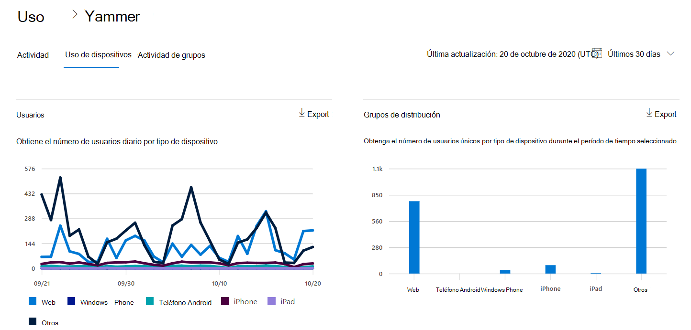
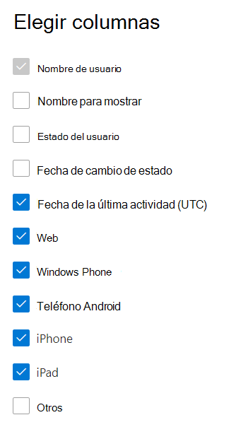

# Informes de Microsoft 365 en el centro de administración: informe de uso de dispositivos de Yammer

El panel de **informes** de Microsoft 365 muestra la información general de la actividad en todos los productos de la organización. Le permite explorar informes individuales de nivel de producto para proporcionarle información más pormenorizada sobre la actividad dentro de cada producto. Consulte [el tema de información general de los informes](activity-reports.md).
  
Los informes de uso de dispositivos de Yammer proporcionan información sobre los dispositivos en los que los usuarios utilizan Yammer. Puede ver el número de usuarios, tanto diarios como en general, por tipo de dispositivo. Además, puede consultar ambos valores un período de tiempo determinado. Asimismo, también puede ver los detalles de cada usuario.
  
> [!NOTE]
> Debe ser administrador global, lector global o lector de informes en Microsoft 365 o un administrador de Exchange, SharePoint, Teams, Team Communications o Skype empresarial para ver los informes.  
 
## ¿Cómo puedo tener acceso al informe de uso de dispositivos de Yammer?

1. En el centro de administración de, vaya a **Informes** \> <a href="https://go.microsoft.com/fwlink/p/?linkid=2074756" target="_blank">página</a> uso. 
2. En la Página principal del panel, haga clic en el botón **Ver más** de la tarjeta de Yammer.
  
## Interpretar el informe de uso de dispositivos de Yammer

Puede ver el uso en el informe de OneDrive eligiendo la pestaña **uso de dispositivo** . 

Seleccione **elegir columnas** para agregar o quitar columnas del informe.    

También puede exportar los datos del informe a un archivo. csv de Excel; para ello, seleccione el vínculo **exportar** . Se exportarán los datos de todos los usuarios y podrá efectuar una ordenación y un filtrado sencillos para un análisis más detallado. Si tiene menos de 2000 usuarios, puede ordenar y filtrar en la tabla en el propio informe. Si tiene más de 2000 usuarios, para poder filtrar y ordenar, tendrá que exportar los datos. 
  
|Item|Descripción|
|:-----|:-----|
|**Métrica**|**Definición**|
|Nombre de usuario    |La dirección de correo electrónico del usuario. Puede mostrar la dirección de correo electrónico real o hacer que este campo sea anónimo. Esta cuadrícula muestra a los usuarios que iniciaron sesión en Yammer con la cuenta de Microsoft 365 o que iniciaron sesión en la red con el inicio de sesión único.   |
|Nombre para mostrar    |El nombre completo del usuario. Puede mostrar la dirección de correo electrónico real o hacer que este campo sea anónimo.    |
|Estado del usuario    |Uno de estos tres valores: activo, eliminado o suspendido. En estos informes se muestran datos para usuarios activos, suspendidos y eliminados. No reflejan usuarios pendientes, porque los usuarios pendientes no publican, leen o indican que les gusta un mensaje.     |
|Fecha de cambio de estado (UTC)    |La fecha en la que se modificó el estado del usuario en Yammer.    |
|Fecha de la última actividad (UTC)    |La última fecha (UTC) en la que el usuario participó en una actividad de Yammer.    |
|Web    |Indica si el usuario ha utilizado Yammer en la Web.    |
|Windows Phone    | Indica si el usuario ha utilizado Yammer en un Windows Phone.    |
|Teléfono Android    |Indica si el usuario ha utilizado Yammer en un teléfono Android.  |
|dispositivo   | Indica si el usuario ha utilizado Yammer en un iPhone.    |
|dispositivos    |Indica si el usuario ha utilizado Yammer en un iPad.  |
|otro    |Indica si el usuario ha utilizado Yammer en otro dispositivo, pero no se ha mostrado anteriormente.  |
|||