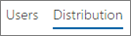

# Informes de Microsoft 365 en el centro de administración: informe de uso de dispositivos de YammerMicrosoft 365 Reports in the admin center - Yammer device usage report

El panel de **informes** de Microsoft 365 muestra la información general de la actividad en todos los productos de la organización.The Microsoft 365 **Reports** dashboard shows you the activity overview across the products in your organization. Le permite explorar informes individuales de nivel de producto para proporcionarle información más pormenorizada sobre la actividad dentro de cada producto.It enables you to drill in to individual product level reports to give you more granular insight about the activities within each product. Consulte [el tema de información general de los informes](activity-reports.md).Check out [the Reports overview topic](activity-reports.md).
  
Los informes de uso de dispositivos de Yammer proporcionan información sobre los dispositivos en los que los usuarios utilizan Yammer. Puede ver el número de usuarios, tanto diarios como en general, por tipo de dispositivo. Además, puede consultar ambos valores un período de tiempo determinado. Asimismo, también puede ver los detalles de cada usuario.The Yammer device usage reports give you information about which devices your users are using Yammer on. You can view the number of daily users by device type, and number of users by device type. You can view both over a selected time period. You can also view details per user.
  
> [!NOTE]
> Debe ser administrador global, lector global o lector de informes en Microsoft 365 o un administrador de Exchange, SharePoint, Teams, Team Communications o Skype empresarial para ver los informes.You must be a global administrator, global reader or reports reader in Microsoft 365 or an Exchange, SharePoint, Teams Service, Teams Communications, or Skype for Business administrator to see reports. 
  
## ¿Cómo puedo tener acceso al informe de uso de dispositivos de Yammer?How do I get to the Yammer device usage report?

1. En el centro de administración de, vaya a **Informes** \> <a href="https://go.microsoft.com/fwlink/p/?linkid=2074756" target="_blank">página</a> uso.In the admin center, go to the **Reports** \> <a href="https://go.microsoft.com/fwlink/p/?linkid=2074756" target="_blank">Usage</a> page.

    
2. En la lista desplegable **seleccionar un informe** , seleccione **Yammer** \> **uso de dispositivos**de Yammer.From the **Select a report** drop-down, select **Yammer** \> **Device usage**.
  
## Interpretar el informe de actividad de YammerInterpret the Yammer activity report

Para obtener información sobre el uso de dispositivos de Yammer de sus usuarios, consulte los gráficos **Usuarios** y **Distribución**.You can get a view into your users' Yammer device usage by looking at the **Users** and **Distribution** charts. 
  
El informe de uso de dispositivos contiene la siguiente información.The device usage report contains the following information.
  
- Use las pestañas de día para ver las tendencias del informe de actividad de **uso de dispositivos de Yammer** en los últimos 7 días, 30 días, 90 días o 180 días.Use the day tabs to view the **Yammer device usage** activity report trends over the last 7 days, 30 days, 90 days, or 180 days. Sin embargo, si selecciona un día concreto en el informe, la tabla mostrará los datos de hasta 28 días a partir de la fecha actual (no la fecha en que se generó el informe).However, if you select a particular day in the report, the table will show data for up to 28 days from the current date (not the date the report was generated). 
    
- Cada informe tiene la fecha del momento en que se generó. Normalmente, el informe refleja una latencia de 24 a 48 horas desde el momento de actividad.Each report has a date for when the report was generated. The reports usually reflect a 24 to 48 hour latency from time of activity.
    
- Para ver el número de usuarios diarios por tipo de dispositivo, consulte el gráfico **Usuarios**.You can view the **Users** chart to see the number of daily users by device type.  
  
- Para ver el número de usuarios por tipo de dispositivo, consulte el gráfico **Distribución**.You can view the **Distribution** chart to see the number of users by device type.  
  
- En la tabla **Detalles** que encontrará debajo del gráfico, se muestra un desglose del uso de dispositivos de Yammer en el nivel de usuario.The **Details** table under the graph shows you a breakdown of the Yammer device usage at the per-user level. 
    
    También puede agregar y quitar columnas. Las columnas disponibles son:You can also add and remove columns. The available columns are:
    
  - **Nombre de usuario** es la dirección de correo electrónico de los usuarios.**Username** is the email address of the user. Puede mostrar la dirección de correo electrónico real o hacer que este campo sea anónimo.You can display the actual email address or make this field anonymous. 
    
    Esta cuadrícula muestra a los usuarios que iniciaron sesión en Yammer con la cuenta de Microsoft 365 o que iniciaron sesión en la red con el inicio de sesión único.This grid shows users who logged into Yammer using the Microsoft 365 account or who logged into the network using single sign-on.
    
  - **Nombre para mostrar** corresponde al nombre completo del usuario. Puede mostrar la dirección de correo electrónico real o hacer que este campo sea anónimo.**Display name** is the full name of the user. You can display the actual email address or make this field anonymous. 
    
  - **Estado del usuario** corresponde a uno de estos tres valores: Activo, Eliminado o Suspendido.**User state** is one of three values: Active, Deleted, or Suspended. 
    
    En estos informes se muestran datos para usuarios activos, suspendidos y eliminados. No reflejan usuarios pendientes, porque los usuarios pendientes no publican, leen o indican que les gusta un mensaje.These reports show data for active, suspended, and deleted users. They do not reflect pending users, because pending users cannot post, read, or like a message.
    
  - **Web** indica si el usuario ha utilizado Yammer en la Web.**Web** indicates if the user has used Yammer on the web. 
    
  - **Teléfono Windows** indica si el usuario ha utilizado Yammer en un teléfono Windows.**Windows phone** indicates if the user has used Yammer on a Windows phone 
    
  - **Teléfono Android** indica si el usuario ha utilizado Yammer en un teléfono Android.**Android phone** indicates if the user has used Yammer on an Android phone. 
    
  - **iPhone** indica si el usuario ha utilizado Yammer en un iPhone.**iPhone** indicates if the user has used Yammer on an iPhone. 
    
  - **iPad** indica si el usuario ha utilizado Yammer en un iPad.**iPad** indicates if the user has used Yammer on an iPad. 
    
  - **Otro** indica si el usuario ha utilizado Yammer en otro dispositivo no mencionado anteriormente.**Other** indicates if the user has used Yammer on another device, not listed previously. 
    
    Si las directivas de la organización le impiden ver los informes en los que la información del usuario es identificable, puede cambiar la configuración de privacidad de todos estos informes.If your organization's policies prevents you from viewing reports where user information is identifiable, you can change the privacy setting for all these reports. Consulte la sección **cómo ocultar los detalles del nivel de usuario** en los [informes de actividades del centro de administración de Microsoft 365](activity-reports.md).Check out the **How do I hide user level details?** section in the [Activity Reports in the Microsoft 365 admin center](activity-reports.md).
    
- También puede exportar los datos del informe a un archivo. csv de Excel; para ello, seleccione el vínculo **exportar** .You can also export the report data into an Excel .csv file, by selecting the **Export** link. Se exportarán los datos de todos los usuarios y podrá efectuar una ordenación y un filtrado sencillos para un análisis más detallado.This exports data of all users and enables you to do simple sorting and filtering for further analysis. Si tiene menos de 2000 usuarios, puede ordenar y filtrar en la tabla en el propio informe.If you have less than 2000 users, you can sort and filter within the table in the report itself. Si tiene más de 2000 usuarios, para poder filtrar y ordenar, tendrá que exportar los datos.If you have more than 2000 users, in order to filter and sort, you will need to export the data. 
    

