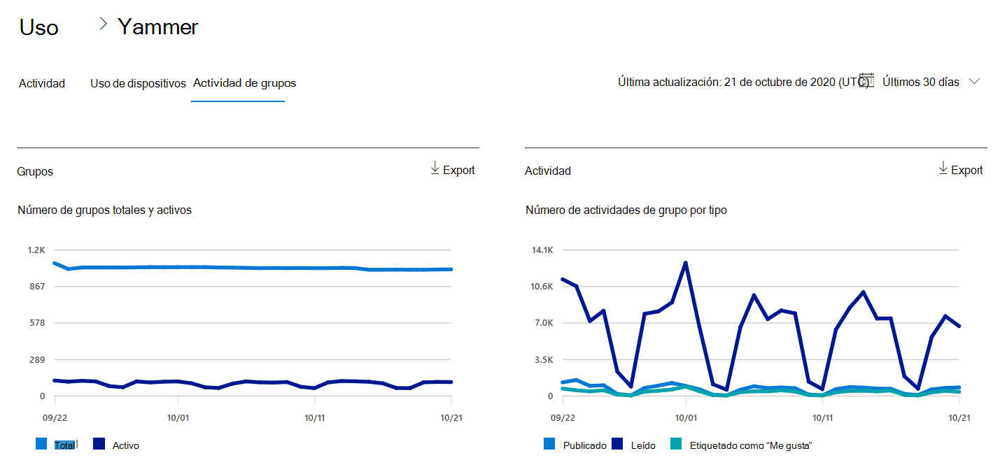
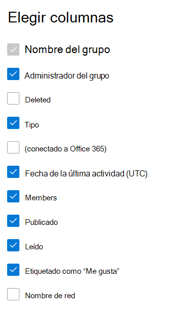

# Informes de Microsoft 365 en el Centro de administración: informe de actividad de grupos de Yammer

El panel informes  de Microsoft 365 muestra la información general sobre la actividad en todos los productos de la organización. Le permite explorar informes individuales de nivel de producto para proporcionarle información más pormenorizada sobre la actividad dentro de cada producto. Consulte [el tema de información general de los informes](activity-reports.md). En el informe de actividad de grupos de Yammer puede obtener estadísticas sobre la actividad de grupos de Yammer en su organización y consultar cuántos grupos de Yammer se crean y utilizan.
  
> [!NOTE]
> Debe ser administrador global, lector global o lector de informes en Microsoft 365 o un administrador de Exchange, SharePoint, Teams Service, Teams Communications o Skype Empresarial para ver informes.  
 
## ¿Cómo puedo obtener acceso al informe de actividad de grupos de Yammer?

1. En el centro de administración de, vaya a **Informes** \> <a href="https://go.microsoft.com/fwlink/p/?linkid=2074756" target="_blank">página</a> uso. 
2. En la página principal del panel, haga clic en el botón **Ver más** en la tarjeta de Yammer.

  
## Interpretar el informe de actividad de grupos de Yammer

Puede ver las actividades de grupos en el informe de Yammer seleccionando la **pestaña Actividad de** grupos. 

Seleccione **Elegir columnas** para agregar o quitar columnas del informe.    

También puede exportar los datos del informe a un archivo .csv de Excel seleccionando el **vínculo** Exportar. Se exportarán los datos de todos los usuarios y podrá efectuar una ordenación y un filtrado sencillos para un análisis más detallado. Si tiene menos de 2000 usuarios, puede ordenar y filtrar en la tabla en el propio informe. Si tiene más de 2000 usuarios, para poder filtrar y ordenar, tendrá que exportar los datos. 
  
|Elemento|Description|
|:-----|:-----|
|**Métrica**|**Definición**|
|Nombre del grupo    |Nombre del grupo.   |
|Administrador de grupo    |Nombre del administrador o propietario del grupo.    |
|Deleted    |El número de grupos de Yammer eliminados. Si el grupo se elimina, pero tuvo actividad durante el período de presentación de informes, se mostrará en la cuadrícula con esta marca establecida en true.    |
|Tipo    |El tipo de grupo, público o privado.   |
|Conectado a Office 365    |Indica si el grupo de Yammer también es un grupo de Microsoft 365.   |
|Fecha de la última actividad (UTC)    | La última fecha en la que el grupo leyó, publicó o gradó un mensaje.    |
|Miembros    | El número de miembros del grupo.    |
|Publicado    |El número de mensajes publicados en el grupo de Yammer durante el período de informe.  |
|Lectura    |El número de conversaciones leen en el grupo de Yammer durante el período de presentación de informes.    |
|Etiquetado como “Me gusta”    |El número de mensajes que gustaron en el grupo de Yammer durante el período de informe.  |
|Nombre de red    |Nombre completo de la red a la que pertenece el grupo. |
|||