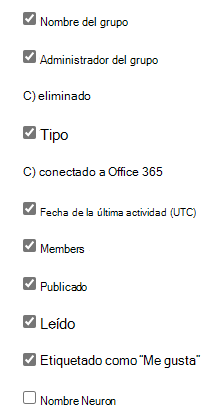

# Informes de Microsoft 365 en el centro de administración: informe de actividad de grupos de YammerMicrosoft 365 Reports in the admin center - Yammer groups activity report

El panel informes  de Microsoft 365 muestra la información general sobre la actividad en todos los productos de la organización.The Microsoft 365 **Reports** dashboard shows you the activity overview across the products in your organization. Le permite explorar informes individuales de nivel de producto para proporcionarle información más pormenorizada sobre la actividad dentro de cada producto.It enables you to drill in to individual product level reports to give you more granular insight about the activities within each product. Consulte [el tema de información general de los informes](activity-reports.md).Check out [the Reports overview topic](activity-reports.md). En el informe de actividad de grupos de Yammer puede obtener estadísticas sobre la actividad de grupos de Yammer en su organización y consultar cuántos grupos de Yammer se crean y utilizan.In the Yammer groups activity report, you can gain insights into the activity of Yammer groups in your organization and see how many Yammer groups are being created and used.
  
> [!NOTE]
> Debe ser administrador global, lector global o lector de informes en Microsoft 365 o un administrador de Exchange, SharePoint, Teams Service, Teams Communications o Skype Empresarial para ver informes.You must be a global administrator, global reader or reports reader in Microsoft 365 or an Exchange, SharePoint, Teams Service, Teams Communications, or Skype for Business administrator to see reports.  

## Obtener acceso al informe de actividad de grupos de YammerHow to get to the Yammer groups activity report

1. En el centro de administración de, vaya a **Informes** \> <a href="https://go.microsoft.com/fwlink/p/?linkid=2074756" target="_blank">página</a> uso.In the admin center, go to the **Reports** \> <a href="https://go.microsoft.com/fwlink/p/?linkid=2074756" target="_blank">Usage</a> page.

    
2. En la **lista desplegable Seleccionar** un informe, seleccione Actividad de grupos de **Yammer.** \> From the **Select a report** drop-down, select **Yammer** \> **Groups activity**.
  
## Interpretar el informe de actividad de grupos de YammerInterpret the Yammer groups activity report

Puede obtener una vista de la actividad de grupos de Yammer consultando los gráficos **Grupos** y **Actividad**.You can get a view into Yammer groups activity by looking at the **Groups** and **Activity** charts. 
  
|ElementoItem|DescriptionDescription|
|:-----|:-----|
|1.1.    |Puede visualizar el informe **Actividad de grupos de Yammer** para ver las tendencias de los últimos 7, 30, 90 o 180 días.The **Yammer groups activity** report can be viewed for trends over the last 7 days, 30 days, 90 days, or 180 days. Sin embargo, si selecciona un día determinado en el informe, la tabla (7) mostrará datos de hasta 28 días a partir de la fecha actual (no la fecha en que se generó el informe).However, if you select a particular day in the report, the table (7) will show data for up to 28 days from the current date (not the date the report was generated).    |
|2.2.    |Los datos de cada informe suelen abarcar hasta las últimas 24 a 48 horas.The data in each report usually covers up to the last 24 to 48 hours.   |
|3.3.    |En la vista **Grupos** se muestra el número total de grupos que ha habido y cuántos llevaron a cabo actividades de conversación en grupo.The **Groups** view shows a total number of groups that existed , and how many performed group conversation activity.    |
|4.4.    |En la vista **Actividad** se muestra el número de mensajes de Yammer publicados, leídos y aquellos que las personas han indicado que les gustan en el grupo.The **Activity** view shows you the number Yammer messages posted, read, and liked in groups.    |
|5.5.    | En el gráfico **Grupos**, el eje Y es el número de grupos totales o activos.On the **Groups** chart, the Y axis is the count of total or active groups.     En el gráfico **Actividad**, el eje Y es el número especificado de actividades para grupos de Yammer.On the **Activity** chart, the Y axis is the count of specified activity for Yammer groups.     En los tres gráficos, el eje X es el intervalo de fechas seleccionado para el informe específico.The X axis on all three charts is the selected date range for the specific report.    |
|6.6.    |Puede filtrar la serie que ve en el gráfico seleccionando un elemento de la leyenda.You can filter the series you see on the chart by selecting an item in the legend. Por ejemplo, en el gráfico  **Grupos,** selecciona Los iconos **Total** o Total activo y Activo para ver solo la  ellos.  For example, on the **Groups** chart, select **Total** or **Active**   to see only the info related to each one. Si cambia esta selección, no cambiará la información en la tabla de cuadrícula.Changing this selection doesn't change the info in the grid table.    |
|7.7.    | La lista de los grupos que mostrar depende de la configuración de todos los grupos que existieron (y que no se eliminaron) a lo largo del plazo para la creación de informes más extenso (180 días). El recuento de actividades (mensajes recibidos) variará según la selección de fecha.  The list of groups to show is determined by the set of all groups that existed (weren't deleted) across the widest (180-day) reporting time frame. The activity count (messages received) will vary according to the date selection.    NOTA: Es posible que no vea todos los elementos de la lista siguiente en las columnas hasta que los agregue.NOTE: You might not see all the items in the list below in the columns until you add them. **Nombre del grupo** es el nombre del grupo.**Group name** is the name of the group.    **Administrador del grupo** es el nombre del administrador o propietario del grupo.**Group admin** is the name of the group administrator, or owner.    **Eliminados** es el número de grupos de Yammer eliminados. Si el grupo se elimina, pero tuvo actividad durante el período de presentación de informes, se mostrará en la cuadrícula con esta marca establecida en true.  **Deleted** is the number of deleted Yammer groups. If the group is deleted, but had activity in the reporting period it will show up in the grid with this flag set to true.    **Tipo** es el tipo de grupo: público o privado.**Type** is the type of group, public or private.    **Conectado a Office 365** indica si el grupo de Yammer también es un grupo de Microsoft 365.**Connected to Office 365** indicates whether the Yammer group is also an Microsoft 365 group.    **La fecha de la última** actividad es la última fecha en la que el grupo leyó, publicó o gradó un mensaje.**Last activity date** is the latest date a message was read, posted or liked by the group.    **Miembros** es el número de miembros del grupo.**Members** is the number of members in the group.    **Publicados** es el número de mensajes publicados en el grupo de Yammer durante el período de creación de informes.**Posted** is the number of messages posted in the Yammer group over the reporting period.    **Leídos** es el número de conversaciones leídas en el grupo de Yammer durante el período de creación de informes.**Read** is the number of conversations read in the Yammer group over the reporting period.    **Lo que gusta** es el número de mensajes que han gustado en el grupo de Yammer durante el período de creación de informes.**Liked** is the number of messages liked in the Yammer group over the reporting period.   **El nombre de** red es el nombre completo de la red a la que pertenece el grupo.**Network name** is the full name of the network that the group belongs to.    Si las directivas de la organización le impiden ver los informes en los que la información del usuario es identificable, puede cambiar la configuración de privacidad de todos estos informes.If your organization's policies prevents you from viewing reports where user information is identifiable, you can change the privacy setting for all these reports. Consulte la sección **¿Cómo ocultar los** detalles del nivel de usuario? en Informes de actividad en el Centro de administración de Microsoft [365.](activity-reports.md)Check out the **How do I hide user level details?** section in [Activity reports in the Microsoft 365 admin center](activity-reports.md).    |
|8.8.    |Seleccione **Columnas** para agregar o quitar columnas del informe.Select **Columns** to add or remove columns from the report.    |
|9.9.    |También puede exportar los datos del informe a un archivo .csv de Excel seleccionando el **vínculo** Exportar.You can also export the report data into an Excel .csv file, by selecting the **Export** link. Se exportarán los datos de todos los usuarios y podrá efectuar una ordenación y un filtrado sencillos para un análisis más detallado.This exports data of all users and enables you to do simple sorting and filtering for further analysis. Si tiene menos de 2000 usuarios, puede ordenar y filtrar en la tabla en el propio informe.If you have less than 2000 users, you can sort and filter within the table in the report itself. Si tiene más de 2000 usuarios, para poder filtrar y ordenar, tendrá que exportar los datos.If you have more than 2000 users, in order to filter and sort, you will need to export the data.    |
|||
   

