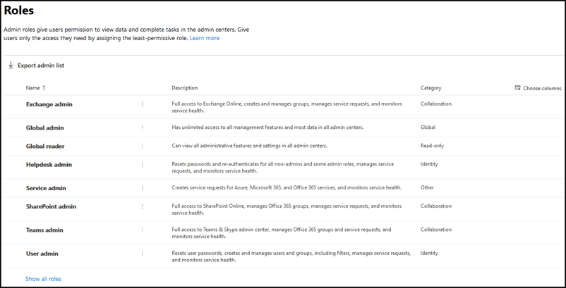

# Introducción a la página de roles

En la página Roles, puede conceder a los usuarios permisos para realizar tareas en los centros de administración. Esto ayuda a su organización a difundir tareas a las personas adecuadas y a mantener la seguridad de los datos.

> [!TIP]
> ¿Busca las descripciones detalladas de los roles? Consulte Permisos de [roles de administrador en Azure Active Directory](https://docs.microsoft.com/azure/active-directory/users-groups-roles/directory-assign-admin-roles#available-roles) y Acerca de los roles de [administrador.](https://docs.microsoft.com/office365/admin/add-users/about-admin-roles)

## Acerca de la página de roles de administrador

Puede exportar la lista de administradores, así como buscar y filtrar por rol.

|||
|:-----|:-----|
|    |Use **exportar la lista de** administradores para obtener una lista completa de todos los usuarios administradores de su organización. La lista se almacena en un archivo .csv de Excel.     |
|    |Use **La** búsqueda para buscar un rol de administrador y ver los usuarios que están asignados a ese rol.     |
|    |Use **Filter** para cambiar la vista de los roles de administrador mostrados.     |

## Sacar el máximo partido de los roles

Lea el contenido siguiente para obtener información sobre los diferentes roles de administrador y las tareas que los roles pueden realizar en su organización.

> [!NOTE]
Esta no es una lista exhaustiva de todos los permisos que tienen estos roles. Seleccione el **vínculo Más información** para obtener más información sobre cada rol.

### Administrador de Exchange

Asigne el rol de administrador de Exchange a los usuarios que necesiten ver y administrar los buzones de correo de su usuario, los grupos de Microsoft 365 y Exchange Online. También pueden abrir y administrar solicitudes de servicio para el soporte técnico de Microsoft. [Más información](https://docs.microsoft.com/office365/admin/add-users/about-exchange-online-admin-role)

### Administrador global

Asigne el rol de administrador global a los usuarios que necesitan acceso global a la mayoría de los datos y características de administración en los servicios en línea de Microsoft. Otorgar acceso global a un gran número de usuarios es un riesgo para la seguridad y le recomendamos que solo tenga entre 2 y 4 administradores globales. Solo los administradores globales pueden restablecer las contraseñas de todos los usuarios y agregar y administrar dominios. También pueden abrir y administrar solicitudes de servicio al soporte técnico de Microsoft. La persona que se suscribió a los servicios en línea de Microsoft se convierte automáticamente en administrador global. [Obtenga más información](https://docs.microsoft.com/office365/admin/add-users/about-admin-roles#roles-available-in-the-microsoft-365-admin-center)

### Lector global

Asigna el rol de administrador del lector global a los usuarios que necesiten ver las características y la configuración de administración en todos los centros de administración que pueda ver el administrador global. El rol de administrador del lector global no puede editar ninguna configuración. [Más información](https://docs.microsoft.com/office365/admin/add-users/about-admin-roles#roles-available-in-the-microsoft-365-admin-center)

### Administrador del departamento de soporte técnico

Asigne el rol de administrador del departamento de soporte técnico a los usuarios que quieran restablecer contraseñas y forzar a los usuarios a cerrar sesión en caso de problemas de seguridad. También pueden abrir y administrar solicitudes de servicio para el soporte técnico de Microsoft. El administrador del departamento de soporte técnico solo puede ayudar a los usuarios que no son administradores y a los usuarios que tienen asignados estos roles: lector de directorio, invitador de invitado, administrador del departamento de soporte técnico, lector del centro de mensajes y lector de informes. [Más información](https://docs.microsoft.com/office365/admin/add-users/about-admin-roles#roles-available-in-the-microsoft-365-admin-center)

### Administrador de servicios

Asigne el rol de administrador del servicio a los usuarios que necesiten crear solicitudes de servicio para los servicios de Azure, Microsoft 365 y Office 365. [Más información](https://docs.microsoft.com/office365/admin/add-users/about-admin-roles#roles-available-in-the-microsoft-365-admin-center)

### Administrador de SharePoint

Al comprar una suscripción a Microsoft 365, se crea automáticamente un sitio de grupo y el administrador global se establece como administrador de la colección de sitios principal. Asigne el rol de administrador de SharePoint a los usuarios a los que desea acceder al Centro de administración de SharePoint. Los usuarios con el rol de administrador de SharePoint pueden crear y administrar colecciones de sitios, designar administradores de colecciones de sitios y administrar perfiles de usuario. Los usuarios con el rol de administrador de SharePoint también pueden administrar grupos de Microsoft 365 y abrir solicitudes de servicio a través del soporte técnico de Microsoft. [Más información](https://docs.microsoft.com/sharepoint/sharepoint-admin-role)

### Administrador de servicios de Teams

Asigne el rol de administrador de Teams a los usuarios a los que desea acceder y administrar el Centro de administración de Teams & Skype. Los usuarios con el rol de administrador de Teams también pueden administrar grupos de Microsoft 365 y abrir solicitudes de servicio a través del soporte técnico de Microsoft. [Más información](https://docs.microsoft.com/MicrosoftTeams/using-admin-roles)

### Administrador de usuarios

Asigne el rol de administrador de usuario a los usuarios a los que desee obtener acceso y administrar restablecimientos de contraseña de usuario y administrar usuarios y grupos. También pueden abrir y administrar solicitudes de servicio para el soporte técnico de Microsoft. [Más información](https://docs.microsoft.com/office365/admin/add-users/about-admin-roles#roles-available-in-the-microsoft-365-admin-center)

::: moniker range="o365-worldwide"

## Comparar roles

Ahora puede comparar los permisos de hasta 3 roles a la vez para que pueda encontrar el rol menos permisivo que asignar.

En el centro de administración:

- Seleccione hasta 3 roles y elija **Comparar roles** para ver los permisos que tiene cada rol.

::: moniker-end

## Temas relacionados

[Acerca de los roles de administración de Microsoft 365](about-admin-roles.md)

[Asignar roles de administrador](assign-admin-roles.md)