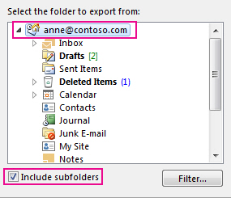

# Obtener acceso y realizar una copia de seguridad de los datos de un antiguo usuario

::: moniker range="o365-21vianet"

> [!NOTE]
> El Centro de administración está cambiando. Si su experiencia no coincide con los detalles presentados aquí, consulte [Acerca del nuevo Centro de administración de Microsoft 365](https://docs.microsoft.com/microsoft-365/admin/microsoft-365-admin-center-preview?view=o365-21vianet).

::: moniker-end

Cuando un empleado deja la organización, es probable que desee tener acceso a sus datos (documentos y correos electrónicos) y revisarlos, realizar una copia de seguridad o asignarlos a un nuevo empleado.
  
    
## Obtener acceso a los documentos de OneDrive del usuario anterior

Si quita la licencia de un usuario pero no la elimina, puede conceder acceso al contenido del OneDrive del usuario. Si elimina la cuenta de usuario, tiene 30 días de manera predeterminada para obtener acceso a los datos de OneDrive del usuario anterior. [Obtenga información sobre cómo configurar la retención de OneDrive para los usuarios eliminados](/onedrive/set-retention). Si no [restaura una cuenta de usuario](/office365/admin/add-users/restore-user) en este momento, se eliminará su contenido de OneDrive. 

Para conservar los archivos de OneDrive de un usuario anterior, primero se debe conceder acceso a su OneDrive y, a continuación, mover los archivos que desee conservar. 

::: moniker range="o365-worldwide"

> [!NOTE]
> Si no usa el nuevo Centro de administración de Microsoft 365, puede activarlo seleccionando **Probar el nuevo centro de administración** ubicado en la parte superior de la página de inicio.

1. En el centro de administración, vaya a la página **Usuarios** \> <a href="https://go.microsoft.com/fwlink/p/?linkid=834822" target="_blank">Usuarios activos</a>.  
    
2. Seleccione un usuario.

3. En el panel derecho, seleccione **OneDrive**. En **obtener acceso a los archivos**, seleccione **crear vínculo a archivos**.

4. Seleccione el vínculo para abrir la ubicación del archivo. Descargue los archivos en el equipo o seleccione **mover a** o **copiar a** para moverlos o copiarlos en su propio OneDrive o en una biblioteca compartida. 

> [!NOTE]
> Puede mover o copiar hasta 500 MB de archivos y carpetas a la vez. 
> Al mover o copiar documentos que tienen el historial de versiones, solo se mueve la última versión.  

::: moniker-end

::: moniker range="o365-germany"

1. En el centro de administración, vaya a la página **Usuarios** \> <a href="https://go.microsoft.com/fwlink/p/?linkid=847686" target="_blank">Usuarios activos</a>.  

2. Seleccione un usuario.

3. En el panel derecho, expanda **configuración de OneDrive**y, después, junto a **acceso**, seleccione **Access files**.

4. Seleccione el vínculo para abrir la ubicación del archivo. Descargue los archivos en el equipo o seleccione **mover a** o **copiar a** para moverlos o copiarlos en su propio OneDrive o en una biblioteca compartida. 

> [!NOTE]
> Puede mover o copiar hasta 500 MB de archivos y carpetas a la vez. 
> Al mover o copiar documentos que tienen el historial de versiones, solo se mueve la última versión.  

::: moniker-end

::: moniker range="o365-21vianet"

1. En el centro de administración, vaya a la página **Usuarios** \> <a href="https://go.microsoft.com/fwlink/p/?linkid=850628" target="_blank">Usuarios activos</a>. 

2. Seleccione un usuario.

3. En el panel derecho, expanda **configuración de OneDrive**y, después, junto a **acceso**, seleccione **Access files**.

4. Seleccione el vínculo para abrir la ubicación del archivo. Descargue los archivos en el equipo o seleccione **mover a** o **copiar a** para moverlos o copiarlos en su propio OneDrive o en una biblioteca compartida.  

> [!NOTE]
> Puede mover o copiar hasta 500 MB de archivos y carpetas a la vez. 
> Al mover o copiar documentos que tienen el historial de versiones, solo se mueve la última versión.  

::: moniker-end
    

## Revocar el acceso de administrador al OneDrive de un usuario

Como administrador global, puede dar acceso al contenido en el OneDrive de un usuario, pero es posible que quiera quitar el acceso cuando ya no lo necesite. 

::: moniker range="o365-worldwide"

1. Inicie sesión en el <a href="https://go.microsoft.com/fwlink/p/?linkid=2024339" target="_blank">centro de administración</a> como administrador global o administrador de SharePoint. 

    Si recibe un mensaje que indica que no tiene permiso para obtener acceso al centro de administración, no tiene permisos de administrador en la organización.

::: moniker-end

::: moniker range="o365-germany"

1. Inicie sesión en el <a href="https://go.microsoft.com/fwlink/p/?linkid=848041" target="_blank">centro de administración</a> como administrador global o administrador de SharePoint.

    Si recibe un mensaje que indica que no tiene permiso para obtener acceso al centro de administración, no tiene permisos de administrador en la organización.

::: moniker-end

::: moniker range="o365-21vianet"

1. Inicie sesión en el <a href="https://go.microsoft.com/fwlink/p/?linkid=850627" target="_blank">centro de administración</a> como administrador global o administrador de SharePoint.

    Si recibe un mensaje que indica que no tiene permiso para obtener acceso al centro de administración, no tiene permisos de administrador en la organización.

::: moniker-end

2. En el panel izquierdo, seleccione **centros de administración** \> **SharePoint**. (Es posible que deba seleccionar **Mostrar todo** para ver la lista de centros de administración).

3. Si se muestra el Centro de administración de SharePoint clásico, seleccione **Abrirlo ahora** en la parte superior de la página para abrir el nuevo Centro de administración de SharePoint.

4. En el panel izquierdo, seleccione **más características**.

5. En **perfiles de usuario**, seleccione **abrir**.

6. En **personas**, seleccione **administrar perfiles de usuario**.

7. Escriba el nombre del usuario y seleccione **Buscar**.

8. Haga clic con el botón secundario en el usuario y elija **Administrar propietarios**de la colección de sitios.

9. Quite a la persona que ya no necesita acceso a los datos del usuario y, después, seleccione **Aceptar**.

    
## Obtener acceso a los datos de Outlook de un usuario anterior

Para guardar los mensajes de correo electrónico, el calendario, las tareas y los contactos del antiguo empleado, exporte la información a un archivo de datos de Outlook (. pst).
  
1. [Agregue el correo electrónico del antiguo empleado](https://support.office.com/article/6e27792a-9267-4aa4-8bb6-c84ef146101b.aspx) a su Outlook (si [restablece la contraseña del usuario](reset-passwords.md), puede establecerla en algo que solo usted sabrá).
    
2. En Outlook, seleccione **archivo**.
    
    
  
3. Seleccione **abrir &amp; ** \> **importación/exportación**de exportación.
    
    
  
4. Seleccione **exportar a un archivo**y, a continuación, seleccione **siguiente**.
    
    
  
5. Seleccione **archivo de datos de Outlook (. pst)** y, a continuación, seleccione **siguiente**.
    
6. Seleccione la cuenta que desea exportar seleccionando el nombre o la dirección de correo electrónico, como Mailbox-Cecilia Weiler o anne@contoso.com. Si desea exportar todo el en su cuenta, incluido el correo, el calendario, los contactos, las tareas y las notas, asegúrese de que la casilla de verificación **Incluir subcarpetas** está activada. 
    
    > [!NOTE]
    > Puede exportar una cuenta a la vez. Si desea exportar varias cuentas, después de que se exporte una cuenta, repita estos pasos. 
  
    
  
7. Seleccione **Siguiente**.
    
8. Seleccione **examinar** para seleccionar dónde guardar el archivo de datos de Outlook (. pst). Escriba un *nombre de archivo*y, después, haga clic en **Aceptar** para continuar. 
    
    > [!NOTE]
    > Si ha usado exportar antes, aparecerán la ubicación de la carpeta y el nombre de archivo anteriores. Escriba un *nombre de archivo diferente* antes de seleccionar **Aceptar**. 
  
9. Si va a exportar a un Archivo de datos de Outlook (.pst) existente, en **Opciones**, especifique qué desea hacer cuando exporte elementos que ya existen en el archivo.
    
10. Seleccione **Finalizar**.
    
Outlook comienza la exportación inmediatamente a menos que se cree un nuevo archivo de datos de Outlook (. pst) o se use un archivo protegido con contraseña.
  
   - Si va a crear un archivo de datos de Outlook (. pst), una contraseña opcional puede ayudarle a proteger el archivo. Cuando aparezca el cuadro de diálogo **crear archivo de datos de Outlook** , escriba la *contraseña* en los cuadros **contraseña** y **Confirmar contraseña** y, a continuación, seleccione **Aceptar**. En el cuadro de diálogo **contraseña de archivo de datos de Outlook** , escriba la *contraseña*y, después, seleccione **Aceptar**.
    
  - Si está exportando a un archivo de datos de Outlook (. pst) existente que está protegido con contraseña, en el cuadro de diálogo **contraseña de archivo de datos de Outlook** , escriba la *contraseña*y, después, seleccione **Aceptar**.
    
Vea cómo [exportar o hacer una copia de seguridad del correo electrónico, los contactos y el calendario en un archivo. pst de Outlook](https://support.office.com/article/14252b52-3075-4e9b-be4e-ff9ef1068f91.aspx) en Outlook 2010. 
  
  
  > [!NOTE]
  > De forma predeterminada, el correo electrónico está disponible sin conexión durante un período de 12 meses. Si es necesario, vea cómo [aumentar los datos disponibles sin conexión](Https://docs.microsoft.com/outlook/troubleshoot/mailboxes/only-subset-items-synchronized).
 
## Proporcionar a otro usuario acceso al correo electrónico de un usuario anterior 

Para conceder acceso a los mensajes de correo electrónico, el calendario, las tareas y los contactos del antiguo empleado a otro empleado, importe la información a la bandeja de entrada de Outlook de otro empleado.

> [!NOTE]
> También puede [convertir el buzón del usuario anterior en un buzón compartido](https://docs.microsoft.com/office365/admin/email/convert-user-mailbox-to-shared-mailbox) o [reenviar el correo electrónico de un antiguo empleado a otro empleado](https://docs.microsoft.com/office365/admin/add-users/remove-former-employee#forward-a-former-employees-email-to-another-employee-or-convert-to-a-shared-mailbox).

  
1. En Outlook, vaya a **archivo** \> **Open &amp; Export** \> **Import/Export**.
    
    Se iniciará el Asistente para importar y exportar.
    
2. Seleccione **Importar desde otro programa o archivo**y, después, seleccione **siguiente**.
    
    
  
3. Seleccione **archivo de datos de Outlook (. pst)** y, a continuación, seleccione **siguiente**.
    
4. Vaya al archivo. pst que desea importar.
    
5. En **Opciones**, elija cómo desea tratar los duplicados
    
6. Seleccione **Siguiente**.
    
7. Si se asignó una contraseña al archivo de datos de Outlook (. pst), escriba la contraseña y, después, seleccione **Aceptar**.
    
8. Establezca las opciones para importar elementos. Por lo general, no es necesario cambiar la configuración predeterminada.
    
9. Seleccione **Finalizar**.

> [!NOTE]
> Los pasos siguen siendo los mismos para obtener acceso a los datos de OneDrive y correo electrónico de un usuario existente.
    
> [!TIP]
> Si desea importar o restaurar sólo algunos elementos de un archivo de datos de Outlook (. pst), puede abrir el archivo de datos de Outlook. A continuación, en el panel de navegación, arrastre los elementos de las carpetas de archivos de datos de Outlook a las carpetas de Outlook existentes. 
  
  
## Artículos relacionados
[Quitar un antiguo empleado de Office 365](remove-former-employee.md)

[Agregar y quitar administradores en una cuenta de OneDrive](/sharepoint/manage-user-profiles#add-and-remove-admins-for-a-users-onedrive)

[Restaurar un OneDrive eliminado](/onedrive/restore-deleted-onedrive)
  
[Retención y eliminación de OneDrive](/onedrive/retention-and-deletion)
  
