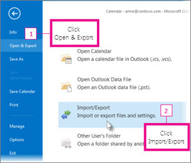

# Obtener acceso y realizar una copia de seguridad de los datos de un antiguo usuarioGet access to and back up a former user's data

::: moniker range="o365-21vianet"

> [!NOTE]
> El Centro de administración está cambiando.The admin center is changing. Si su experiencia no coincide con los detalles presentados aquí, consulte [Acerca del nuevo Centro de administración de Microsoft 365](https://docs.microsoft.com/microsoft-365/admin/microsoft-365-admin-center-preview?view=o365-21vianet).If your experience doesn't match the details presented here, see [About the new Microsoft 365 admin center](https://docs.microsoft.com/microsoft-365/admin/microsoft-365-admin-center-preview?view=o365-21vianet).

::: moniker-end

Cuando un empleado deja la organización, es probable que desee tener acceso a sus datos (documentos y correos electrónicos) y revisarlos, realizar una copia de seguridad o asignarlos a un nuevo empleado.When an employee leaves your organization, you probably want to access their data (documents and emails) and either review it, back it up, or give it to a new employee.
  
    
## Obtener acceso a los documentos de OneDrive del usuario anteriorAccess a former user's OneDrive documents

Si quita la licencia de un usuario pero no la elimina, puede conceder acceso al contenido del OneDrive del usuario.If you remove a user's license but don't delete the account, you can give yourself access to the content in the user's OneDrive. Si elimina la cuenta de usuario, tiene 30 días de manera predeterminada para obtener acceso a los datos de OneDrive del usuario anterior.If you delete the user's account, you have 30 days by default to access the former user's OneDrive data. [Obtenga información sobre cómo configurar la retención de OneDrive para los usuarios eliminados](/onedrive/set-retention).[Learn how to set the OneDrive retention for deleted users](/onedrive/set-retention). Si no [restaura una cuenta de usuario](/office365/admin/add-users/restore-user) en este momento, se eliminará su contenido de OneDrive.If you don't [restore a user account](/office365/admin/add-users/restore-user) within this time, their OneDrive content is deleted. 

Para conservar los archivos de OneDrive de un usuario anterior, primero se debe conceder acceso a su OneDrive y, a continuación, mover los archivos que desee conservar.To preserve a former user's OneDrive files, first give yourself access to their OneDrive, and then move the files you want to keep. 

::: moniker range="o365-worldwide"

> [!NOTE]
> Si no usa el nuevo Centro de administración de Microsoft 365, puede activarlo seleccionando **Probar el nuevo centro de administración** ubicado en la parte superior de la página de inicio.If you're not using the new Microsoft 365 admin center, you can turn it on by selecting the **Try the new admin center** toggle located at the top of the Home page.

1. En el centro de administración, vaya a la página **Usuarios** \> <a href="https://go.microsoft.com/fwlink/p/?linkid=834822" target="_blank">Usuarios activos</a>.In the admin center, go to the **Users** \> <a href="https://go.microsoft.com/fwlink/p/?linkid=834822" target="_blank">Active users</a> page.  
    
2. Seleccione un usuario.Select a user.

3. En el panel derecho, seleccione **OneDrive**.In the right pane, select **OneDrive**. En **obtener acceso a los archivos**, seleccione **crear vínculo a archivos**.Under **Get access to files**, select **Create link to files**.

4. Seleccione el vínculo para abrir la ubicación del archivo.Select the link to open the file location. Descargue los archivos en el equipo o seleccione **mover a** o **copiar a** para moverlos o copiarlos en su propio OneDrive o en una biblioteca compartida.Download the files to your computer, or select **Move to** or **Copy to** to move or copy them to your own OneDrive or to a shared library. 

> [!NOTE]
> Puede mover o copiar hasta 500 MB de archivos y carpetas a la vez.You can move or copy up to 500 MB of files and folders at a time. 
> Al mover o copiar documentos que tienen el historial de versiones, solo se mueve la última versión.When you move or copy documents that have version history, only the latest version is moved.  

::: moniker-end

::: moniker range="o365-germany"

1. En el centro de administración, vaya a la página **Usuarios** \> <a href="https://go.microsoft.com/fwlink/p/?linkid=847686" target="_blank">Usuarios activos</a>.In the admin center, go to the **Users** \> <a href="https://go.microsoft.com/fwlink/p/?linkid=847686" target="_blank">Active users</a> page.  

2. Seleccione un usuario.Select a user.

3. En el panel derecho, expanda **configuración de OneDrive**y, después, junto a **acceso**, seleccione **Access files**.In the right pane, expand **OneDrive Settings**, and then next to **Access**, select **Access files**.

4. Seleccione el vínculo para abrir la ubicación del archivo.Select the link to open the file location. Descargue los archivos en el equipo o seleccione **mover a** o **copiar a** para moverlos o copiarlos en su propio OneDrive o en una biblioteca compartida.Download the files to your computer, or select **Move to** or **Copy to** to move or copy them to your own OneDrive or to a shared library. 

> [!NOTE]
> Puede mover o copiar hasta 500 MB de archivos y carpetas a la vez.You can move or copy up to 500 MB of files and folders at a time. 
> Al mover o copiar documentos que tienen el historial de versiones, solo se mueve la última versión.When you move or copy documents that have version history, only the latest version is moved.  

::: moniker-end

::: moniker range="o365-21vianet"

1. En el centro de administración, vaya a la página **Usuarios** \> <a href="https://go.microsoft.com/fwlink/p/?linkid=850628" target="_blank">Usuarios activos</a>.In the admin center, go to the **Users** \> <a href="https://go.microsoft.com/fwlink/p/?linkid=850628" target="_blank">Active users</a> page. 

2. Seleccione un usuario.Select a user.

3. En el panel derecho, expanda **configuración de OneDrive**y, después, junto a **acceso**, seleccione **Access files**.In the right pane, expand **OneDrive Settings**, and then next to **Access**, select **Access files**.

4. Seleccione el vínculo para abrir la ubicación del archivo.Select the link to open the file location. Descargue los archivos en el equipo o seleccione **mover a** o **copiar a** para moverlos o copiarlos en su propio OneDrive o en una biblioteca compartida.Download the files to your computer, or select **Move to** or **Copy to** to move or copy them to your own OneDrive or to a shared library.  

> [!NOTE]
> Puede mover o copiar hasta 500 MB de archivos y carpetas a la vez.You can move or copy up to 500 MB of files and folders at a time. 
> Al mover o copiar documentos que tienen el historial de versiones, solo se mueve la última versión.When you move or copy documents that have version history, only the latest version is moved.  

::: moniker-end
    

## Revocar el acceso de administrador al OneDrive de un usuarioRevoke admin access to a user's OneDrive

Como administrador global, puede dar acceso al contenido en el OneDrive de un usuario, pero es posible que quiera quitar el acceso cuando ya no lo necesite.As global admin, you can give yourself access to the content in a user's OneDrive, but you may want to remove your access when you no longer need it. 

::: moniker range="o365-worldwide"

1. Inicie sesión en el <a href="https://go.microsoft.com/fwlink/p/?linkid=2024339" target="_blank">centro de administración</a> como administrador global o administrador de SharePoint.Sign in to the <a href="https://go.microsoft.com/fwlink/p/?linkid=2024339" target="_blank">admin center</a> as a global admin or SharePoint admin. 

    Si recibe un mensaje que indica que no tiene permiso para obtener acceso al centro de administración, no tiene permisos de administrador en la organización.If you get a message that you don't have permission to access the admin center, then you don't have administrator permissions in your organization.

::: moniker-end

::: moniker range="o365-germany"

1. Inicie sesión en el <a href="https://go.microsoft.com/fwlink/p/?linkid=848041" target="_blank">centro de administración</a> como administrador global o administrador de SharePoint.Sign in to the <a href="https://go.microsoft.com/fwlink/p/?linkid=848041" target="_blank">admin center</a> as a global admin or SharePoint admin.

    Si recibe un mensaje que indica que no tiene permiso para obtener acceso al centro de administración, no tiene permisos de administrador en la organización.If you get a message that you don't have permission to access the admin center, then you don't have administrator permissions in your organization.

::: moniker-end

::: moniker range="o365-21vianet"

1. Inicie sesión en el <a href="https://go.microsoft.com/fwlink/p/?linkid=850627" target="_blank">centro de administración</a> como administrador global o administrador de SharePoint.Sign in to the <a href="https://go.microsoft.com/fwlink/p/?linkid=850627" target="_blank">admin center</a> as a global admin or SharePoint admin.

    Si recibe un mensaje que indica que no tiene permiso para obtener acceso al centro de administración, no tiene permisos de administrador en la organización.If you get a message that you don't have permission to access the admin center, then you don't have administrator permissions in your organization.

::: moniker-end

2. En el panel izquierdo, seleccione **centros de administración** \> **SharePoint**.In the left pane, select **Admin centers** \> **SharePoint**. (Es posible que deba seleccionar **Mostrar todo** para ver la lista de centros de administración).(You might need to select **Show all** to see the list of admin centers.)

3. Si se muestra el Centro de administración de SharePoint clásico, seleccione **Abrirlo ahora** en la parte superior de la página para abrir el nuevo Centro de administración de SharePoint.If the classic SharePoint admin center appears, select **Open it now** at the top of the page to open the new SharePoint admin center.

4. En el panel izquierdo, seleccione **más características**.In the left pane, select **More features**.

5. En **perfiles de usuario**, seleccione **abrir**.Under **User profiles**, select **Open**.

6. En **personas**, seleccione **administrar perfiles de usuario**.Under **People**, select **Manage User Profiles**.

7. Escriba el nombre del usuario y seleccione **Buscar**.Enter the user's name and select **Find**.

8. Haga clic con el botón secundario en el usuario y elija **Administrar propietarios**de la colección de sitios.Right-click the user, and then choose **Manage site collection owners**.

9. Quite a la persona que ya no necesita acceso a los datos del usuario y, después, seleccione **Aceptar**.Remove the person who no longer needs access to the user's data, and then select **OK**.

    
## Obtener acceso a los datos de Outlook de un usuario anteriorAccess the Outlook data of a former user

Para guardar los mensajes de correo electrónico, el calendario, las tareas y los contactos del antiguo empleado, exporte la información a un archivo de datos de Outlook (. pst).To save the email messages, calendar, tasks, and contacts of the former employee, export the information to an Outlook Data File (.pst).
  
1. [Agregue el correo electrónico del antiguo empleado](https://support.office.com/article/6e27792a-9267-4aa4-8bb6-c84ef146101b.aspx) a su Outlook (si [restablece la contraseña del usuario](reset-passwords.md), puede establecerla en algo que solo usted sabrá).[Add the former employee's email](https://support.office.com/article/6e27792a-9267-4aa4-8bb6-c84ef146101b.aspx) to your Outlook (If you [reset the user's password](reset-passwords.md), you can set it to something only you know.)
    
2. En Outlook, seleccione **archivo**.In Outlook, select **File**.
    
    
  
3. Seleccione \*\*abrir &amp; \*\* \> **importación/exportación**de exportación.Select **Open &amp; Export** \> **Import/Export**.
    
    
  
4. Seleccione **exportar a un archivo**y, a continuación, seleccione **siguiente**.Select **Export to a file**, and then select **Next**.
    
    
  
5. Seleccione **archivo de datos de Outlook (. pst)** y, a continuación, seleccione **siguiente**.Select **Outlook Data File (.pst)**, and then select **Next**.
    
6. Seleccione la cuenta que desea exportar seleccionando el nombre o la dirección de correo electrónico, como Mailbox-Cecilia Weiler o anne@contoso.com.Select the account you want to export by selecting the name or email address, such as Mailbox - Anne Weiler or anne@contoso.com. Si desea exportar todo el en su cuenta, incluido el correo, el calendario, los contactos, las tareas y las notas, asegúrese de que la casilla de verificación **Incluir subcarpetas** está activada.If you want to export everything in your account, including mail, calendar, contacts, tasks, and notes, make sure the **Include subfolders** check box is selected. 
    
    > [!NOTE]
    > Puede exportar una cuenta a la vez.You can export one account at a time. Si desea exportar varias cuentas, después de que se exporte una cuenta, repita estos pasos.If you want to export multiple accounts, after one account is exported, repeat these steps. 
  
    
  
7. Seleccione **Siguiente**.Select **Next**.
    
8. Seleccione **examinar** para seleccionar dónde guardar el archivo de datos de Outlook (. pst).Select **Browse** to select where to save the Outlook Data File (.pst). Escriba un *nombre de archivo*y, después, haga clic en **Aceptar** para continuar.Type a  *file name*, and then select **OK** to continue. 
    
    > [!NOTE]
    > Si ha usado exportar antes, aparecerán la ubicación de la carpeta y el nombre de archivo anteriores.If you've used export before, the previous folder location and file name appear. Escriba un *nombre de archivo diferente* antes de seleccionar **Aceptar**.Type a  *different file name*  before selecting **OK**. 
  
9. Si va a exportar a un Archivo de datos de Outlook (.pst) existente, en **Opciones**, especifique qué desea hacer cuando exporte elementos que ya existen en el archivo.If you are exporting to an existing Outlook Data File (.pst), under **Options**, specify what to do when exporting items that already exist in the file.
    
10. Seleccione **Finalizar**.Select **Finish**.
    
Outlook comienza la exportación inmediatamente a menos que se cree un nuevo archivo de datos de Outlook (. pst) o se use un archivo protegido con contraseña.Outlook begins the export immediately unless a new Outlook Data File (.pst) is created or a password-protected file is used.
  
   - Si va a crear un archivo de datos de Outlook (. pst), una contraseña opcional puede ayudarle a proteger el archivo.If you're creating an Outlook Data File (.pst), an optional password can help protect the file. Cuando aparezca el cuadro de diálogo **crear archivo de datos de Outlook** , escriba la *contraseña* en los cuadros **contraseña** y **Confirmar contraseña** y, a continuación, seleccione **Aceptar**.When the **Create Outlook Data File** dialog box appears, type the  *password*  in the **Password** and **Verify Password** boxes, and then select **OK**. En el cuadro de diálogo **contraseña de archivo de datos de Outlook** , escriba la *contraseña*y, después, seleccione **Aceptar**.In the **Outlook Data File Password** dialog box, type the  *password*, and then select **OK**.
    
  - Si está exportando a un archivo de datos de Outlook (. pst) existente que está protegido con contraseña, en el cuadro de diálogo **contraseña de archivo de datos de Outlook** , escriba la *contraseña*y, después, seleccione **Aceptar**.If you're exporting to an existing Outlook Data File (.pst) that is password protected, in the **Outlook Data File Password** dialog box, type the  *password*, and then select **OK**.
    
Vea cómo [exportar o hacer una copia de seguridad del correo electrónico, los contactos y el calendario en un archivo. pst de Outlook](https://support.office.com/article/14252b52-3075-4e9b-be4e-ff9ef1068f91.aspx) en Outlook 2010.See how to [Export or backup email, contacts, and calendar to an Outlook .pst file](https://support.office.com/article/14252b52-3075-4e9b-be4e-ff9ef1068f91.aspx) in Outlook 2010. 
  
  
  > [!NOTE]
  > De forma predeterminada, el correo electrónico está disponible sin conexión durante un período de 12 meses.By default, your email is available offline for a period of 12 months. Si es necesario, vea cómo [aumentar los datos disponibles sin conexión](Https://docs.microsoft.com/outlook/troubleshoot/mailboxes/only-subset-items-synchronized).If required, see how to [increase the data available offline](Https://docs.microsoft.com/outlook/troubleshoot/mailboxes/only-subset-items-synchronized).
 
## Proporcionar a otro usuario acceso al correo electrónico de un usuario anteriorGive another user access to a former user's email 

Para conceder acceso a los mensajes de correo electrónico, el calendario, las tareas y los contactos del antiguo empleado a otro empleado, importe la información a la bandeja de entrada de Outlook de otro empleado.To give access to the email messages, calendar, tasks, and contacts of the former employee to another employee, import the information to another employee's Outlook inbox.

> [!NOTE]
> También puede [convertir el buzón del usuario anterior en un buzón compartido](https://docs.microsoft.com/office365/admin/email/convert-user-mailbox-to-shared-mailbox) o [reenviar el correo electrónico de un antiguo empleado a otro empleado](https://docs.microsoft.com/office365/admin/add-users/remove-former-employee#forward-a-former-employees-email-to-another-employee-or-convert-to-a-shared-mailbox).You can also [convert the former user's mailbox to a shared mailbox](https://docs.microsoft.com/office365/admin/email/convert-user-mailbox-to-shared-mailbox) or [forward a former employee's email to another employee](https://docs.microsoft.com/office365/admin/add-users/remove-former-employee#forward-a-former-employees-email-to-another-employee-or-convert-to-a-shared-mailbox).

  
1. En Outlook, vaya a **archivo** \> **Open &amp; Export** \> **Import/Export**.In Outlook, go to **File** \> **Open &amp; Export** \> **Import/Export**.
    
    Se iniciará el Asistente para importar y exportar.This starts the Import and Export Wizard.
    
2. Seleccione **Importar desde otro programa o archivo**y, después, seleccione **siguiente**.Select **Import from another program or file**, and then select **Next**.
    
    
  
3. Seleccione **archivo de datos de Outlook (. pst)** y, a continuación, seleccione **siguiente**.Select **Outlook Data File (.pst)**, and select **Next**.
    
4. Vaya al archivo. pst que desea importar.Browse to the .pst file you want to import.
    
5. En **Opciones**, elija cómo desea tratar los duplicadosUnder **Options**, choose how you want to deal with duplicates
    
6. Seleccione **Siguiente**.Select **Next**.
    
7. Si se asignó una contraseña al archivo de datos de Outlook (. pst), escriba la contraseña y, después, seleccione **Aceptar**.If a password was assigned to the Outlook Data File (.pst), enter the password, and then select **OK**.
    
8. Establezca las opciones para importar elementos.Set the options for importing items. Por lo general, no es necesario cambiar la configuración predeterminada.The default settings usually don't need to be changed.
    
9. Seleccione **Finalizar**.Select **Finish**.

> [!NOTE]
> Los pasos siguen siendo los mismos para obtener acceso a los datos de OneDrive y correo electrónico de un usuario existente.The steps remain the same for accessing an existing user's OneDrive and email data.
    
> [!TIP]
> Si desea importar o restaurar sólo algunos elementos de un archivo de datos de Outlook (. pst), puede abrir el archivo de datos de Outlook.If you want to import or restore only a few items from an Outlook Data File (.pst), you can open the Outlook Data File. A continuación, en el panel de navegación, arrastre los elementos de las carpetas de archivos de datos de Outlook a las carpetas de Outlook existentes.Then, in the navigation pane, drag the items from Outlook Data File folders to your existing Outlook folders. 
  
  
## Artículos relacionadosRelated articles
[Quitar un antiguo empleado de Office 365Remove a former employee from Office 365](remove-former-employee.md)

[Agregar y quitar administradores en una cuenta de OneDriveAdd and remove admins on a OneDrive account](/sharepoint/manage-user-profiles#add-and-remove-admins-for-a-users-onedrive)

[Restaurar un OneDrive eliminadoRestore a deleted OneDrive](/onedrive/restore-deleted-onedrive)
  
[Retención y eliminación de OneDriveOneDrive retention and deletion](/onedrive/retention-and-deletion)
  
