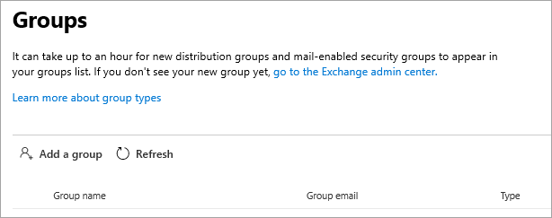

<!-- The following is just placeholder text from Madhura's mail. We need to add images/examples of each -->

# Cómo obtener ayuda en el centro de administración de 365 de MicrosoftHow to get help in the Microsoft 365 admin center

Si es administrador, [admin.Microsoft.com](https://admin.microsoft.com) es su punto de partida para administrar y aprovechar al máximo su suscripción a Microsoft 365.If you're an admin, [admin.microsoft.com](https://admin.microsoft.com) is your go-to place to manage and make the most of your Microsoft 365 subscription. A veces, es posible que no encuentre la tarea correcta, necesite más contexto antes de embarcarse en un flujo de tareas o, sencillamente, que no esté seguro del ámbito y el impacto de las acciones como administrador. Para cubrir esas situaciones, proporcionamos ayuda moderna y asistencia inteligente en el centro de administración de 365 de Microsoft de las siguientes maneras:Sometimes you may not find the right task, need more context before embarking on a task flow, or simply may not be sure of the scope and impact of your actions as an admin. To cover those situations, we provide modern help and intelligent assistance throughout the Microsoft 365 admin center in these ways:
 
## Ayuda integradaIntegrated help
La ayuda está integrada a través del centro de administración, por lo que está allí donde la necesite.Help is integrated throughout the admin center, so it's right there when you need it. En la parte superior de muchas páginas, encontrará el texto de ayuda en línea que proporciona información general informativa sobre la tarea en cuestión, así como vínculos a artículos que le permiten encontrar rápidamente documentación oficial para obtener un aprendizaje en profundidad.At the top of many pages, you'll find inline help text that provides an informational overview of the task at hand, as well as links to articles that let you quickly find official documentation for more in-depth learning.

## Autoayuda moderna con tecnología AIModern self-help powered by AI

Al seleccionar el botón "Necesito ayuda" en el centro de administración de Microsoft 365, se abre nuestra experiencia moderna de autoayuda con tecnología de inteligencia artificial.Selecting the "Need Help" button in the Microsoft 365 admin center opens our modern self-help experience powered by artificial intelligence. Por ejemplo, si busca *comprobar mi dominio*, recibirá los pasos más que considerarán algunos artículos que pensamos que le ayudarán.For example, if you search for *verify my domain*, you'll get the steps plus a few articles we think will help you. Usamos machine learning para exponer la solución más cercana que se haya encontrado como ayuda para otros administradores que han especificado consultas similares.We use machine learning to surface the closest solution that has been found to be of help to other admins who have entered similar queries.

O bien, para esos momentos en los que no sabe cómo realizar alguna acción en su situación específica, use el Asistente de soporte.Or, for those times when you don't quite know how to get something done in your specific situation, use the Support Assistant. Actualmente, esta experiencia solo está disponible en inglés.This experience is currently available only in English. Solo tiene que usar el botón de alternancia en la parte superior del panel "necesita ayuda" para activarla.Just use the toggle at the top of the "Need Help" pane to turn it on. El Asistente de soporte proporciona una interfaz de conversación para obtener ayuda.The Support Assistant provides a conversational interface for getting help. Escriba su consulta y la Chatbot le preguntará a clarificar la respuesta adecuada para su situación específica.Enter your query, and the chatbot will ask clarifying questions to get you to the right answer for your specific situation. Piense en él como ayuda virtual para descubrir soluciones y completar tareas.Think of it as your virtual helper to discover solutions and complete tasks.

Por supuesto, a veces las preguntas son mejor respondidas por los seres humanos.Of course, sometimes questions are best answered by humans. Si nuestra autoayuda moderna no tiene la respuesta, siempre tiene la opción de ponerse en contacto con nuestros agentes de soporte técnico.If our modern self-help doesn't have the answer, you always have the option to contact our support agents.

## Guías y artículosGuides and articles

Además, si está buscando guías de implementación completas, procedimientos rápidos paso a paso o cmdlets de PowerShell, visítenos en la Web.Additionally, if you're looking for comprehensive deployment guides, quick step-by-step procedures, or PowerShell cmdlets, look us up on the web. Actualizamos el contenido con frecuencia y tratamos de proporcionarle la información más reciente.We update content frequently and try to provide you with the latest information. Consulte nuestros artículos y guías en el sitio de [documentación de 365 de Microsoft](https://docs.microsoft.com/microsoft-365/) .Check out our articles and guides at the [Microsoft 365 Documentation](https://docs.microsoft.com/microsoft-365/) site.
