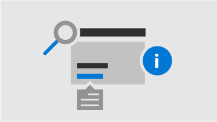

<!-- The following is just placeholder text from Madhura's mail. We need to add images/examples of each -->

# Cómo obtener ayuda en el centro de administración de 365 de Microsoft

Si es administrador, [admin.Microsoft.com](https://admin.microsoft.com) es su punto de partida para administrar y aprovechar al máximo su suscripción a Microsoft 365. A veces, es posible que no encuentre la tarea correcta, necesite más contexto antes de embarcarse en un flujo de tareas o, sencillamente, que no esté seguro del ámbito y el impacto de las acciones como administrador. Para cubrir esas situaciones, proporcionamos ayuda moderna y asistencia inteligente en el centro de administración de 365 de Microsoft de las siguientes maneras:
 

<ul class="panelContent cardsW">
    <li>
        

            

                

                    <a href="what-is-help.md#integrated-help">
                        

                            

                                
                            

                        

                        

                            <h3>Ayuda integrada</h3>
                            
Ayuda en el centro de administración

                        

                    </a>
                

            

        

    </li>
    <li>
        

            

                

                    <a href="what-is-help.md#modern-self-help-powered-by-ai">
                        

                            

                                
                            

                        

                        

                            <h3>Asistencia inteligente</h3>
                            
Autoayuda de la tecnología AI

                        

                    </a>
                

            

        

    </li>
    <li>
        

            

                

                    <a href="what-is-help.md#guides-and-articles">
                        

                            

                                
                            

                        

                        

                            <h3>Guías y artículos</h3>
                            
Contenido exhaustivo en la web

                        

                    </a>
                

            

        

    </li>
</ul>

## Ayuda integrada
La ayuda está integrada a través del centro de administración, por lo que está allí donde la necesite. En la parte superior de muchas páginas, encontrará el texto de ayuda en línea que proporciona información general informativa sobre la tarea en cuestión, así como vínculos a artículos que le permiten encontrar rápidamente documentación oficial para obtener un aprendizaje en profundidad.

## Autoayuda moderna con tecnología AI

Al seleccionar el botón "Necesito ayuda" en el centro de administración de Microsoft 365, se abre nuestra experiencia moderna de autoayuda con tecnología de inteligencia artificial. Por ejemplo, si busca *comprobar mi dominio*, recibirá los pasos más que considerarán algunos artículos que pensamos que le ayudarán. Usamos machine learning para exponer la solución más cercana que se haya encontrado como ayuda para otros administradores que han especificado consultas similares.

O bien, para esos momentos en los que no sabe cómo realizar alguna acción en su situación específica, use el Asistente de soporte. Actualmente, esta experiencia solo está disponible en inglés. Solo tiene que usar el botón de alternancia en la parte superior del panel "necesita ayuda" para activarla. El Asistente de soporte proporciona una interfaz de conversación para obtener ayuda. Escriba su consulta y la Chatbot le preguntará a clarificar la respuesta adecuada para su situación específica. Piense en él como ayuda virtual para descubrir soluciones y completar tareas.

Por supuesto, a veces las preguntas son mejor respondidas por los seres humanos. Si nuestra autoayuda moderna no tiene la respuesta, siempre tiene la opción de ponerse en contacto con nuestros agentes de soporte técnico.

## Guías y artículos

Además, si está buscando guías de implementación completas, procedimientos rápidos paso a paso o cmdlets de PowerShell, visítenos en la Web. Actualizamos el contenido con frecuencia y tratamos de proporcionarle la información más reciente. Consulte nuestros artículos y guías en el sitio de [documentación de 365 de Microsoft](https://docs.microsoft.com/microsoft-365/) .
