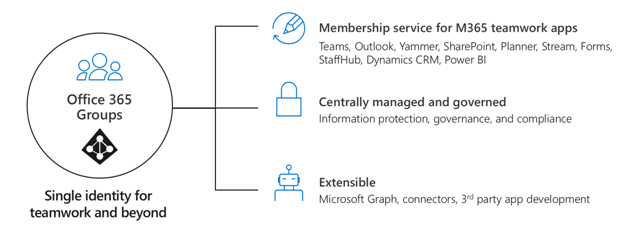
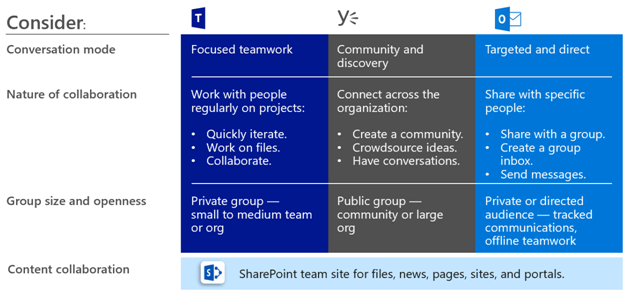

# Planear el gobierno en Grupos de Office 365

Office 365 grupos tiene un amplio conjunto de herramientas para implementar cualquier funcionalidad de gobierno que su organización pueda necesitar. Este artículo Guía a los profesionales de TI para que hagan las preguntas adecuadas para determinar sus requisitos de gobierno y cómo cumplirlos según su perfil de organización.

## ¿Por qué Office 365 grupos?

Sabemos que las organizaciones actuales usan un conjunto de herramientas diverso. Hay un grupo de desarrolladores que usan el chat de equipo, los ejecutivos que envían correo electrónico y toda la organización que se conecta a través de redes sociales empresariales. Hay varias herramientas de colaboración en uso, ya que cada grupo es único y tiene sus propias necesidades funcionales y estilo de responsabilidad. Algunos usarán solo el correo electrónico, mientras que otros vivirán principalmente en chat. 

Si los usuarios piensan que las herramientas proporcionadas por ti no se ajustan a sus necesidades, probablemente descargarán su aplicación de consumidor favorita que admite sus escenarios. Aunque este proceso permite que los usuarios empiecen a trabajar rápidamente, la experiencia del usuario se ve frustrada en toda la organización con varios inicios de sesión, problemas de uso compartido y no existe un solo lugar para ver el contenido. Este concepto se conoce como "sombrearlo" y representa un riesgo significativo para las organizaciones. Reduce la capacidad de administrar de manera uniforme el acceso de los usuarios, garantizar la seguridad y las necesidades de cumplimiento del servicio.

Office 365 grupos habilita a los usuarios y reduce el riesgo de sombrearlos al proporcionar en un solo paso muchas de las herramientas necesarias para colaborar. Office 365 grupos le permite elegir un conjunto de personas con las que desea colaborar y configurar fácilmente una colección de recursos para que las compartan los usuarios. La asignación manual de permisos a los recursos es cosa del pasado, ya que agregar miembros al grupo concede automáticamente los permisos necesarios a todos los activos proporcionados por el grupo.

## Arquitectura técnica

Hay tres modalidades principales de comunicación admitidas por los grupos de Office 365. Se pueden crear grupos dentro de estas experiencias y usarse en todo el conjunto de aplicaciones de Office 365:
- [Outlook](https://support.office.com/article/learn-about-office-365-groups-b565caa1-5c40-40ef-9915-60fdb2d97fa2): colaboración a través del correo electrónico con un grupo compartido bandeja de entrada y calendario
- [Microsoft Teams](https://support.office.com/article/learn-about-office-365-groups-b565caa1-5c40-40ef-9915-60fdb2d97fa2): área de trabajo persistente basada en chat donde puede tener conversaciones informales, en tiempo real, sobre una amplia variedad de temas, organizados por subgrupos específicos
- [Yammer](https://support.office.com/article/learn-about-office-365-groups-b565caa1-5c40-40ef-9915-60fdb2d97fa2): experiencia social de empresa para colaboración

> [!NOTE]
> La creación de un nuevo grupo mediante otras aplicaciones de trabajo en equipo, como SharePoint, Planner o Stream-, creará un grupo con una modalidad de comunicación de Outlook con la capacidad de conectarse a Microsoft Teams.

Según el lugar en el que se cree un grupo, ciertos recursos se aprovisionan automáticamente, por ejemplo:
- [Bandeja de entrada](https://support.office.com/article/have-a-group-conversation-in-outlook-a0482e24-a769-4e39-a5ba-a7c56e828b22) : para las conversaciones de correo electrónico entre los miembros. Esta bandeja de entrada tiene una dirección de correo electrónico y se puede configurar para que acepte mensajes de personas ajenas al grupo e incluso de fuera de la organización, como una lista de distribución tradicional.
 - [Calendario](https://support.office.com/article/schedule-a-meeting-on-a-group-calendar-in-outlook-0cf1ad68-1034-4306-b367-d75e9818376a) : para programar eventos relacionados con el grupo
- [Sitio de grupo de SharePoint](https://support.office.com/article/what-is-a-sharepoint-team-site-75545757-36c3-46a7-beed-0aaa74f0401e) : repositorio central de información, vínculos y contenido relacionado con el grupo
- [Biblioteca de documentos de SharePoint](https://support.office.com/article/share-group-files-749bc73b-90c9-4760-9b6f-9aa1cf01b403) : un punto central para que el grupo almacene y comparta archivos
- [Bloc de notas de OneNote](https://support.office.com/article/get-started-with-onenote-e768fafa-8f9b-4eac-8600-65aa10b2fe97) : para recopilar ideas, investigar e información
- [Planner](https://support.office.com/article/microsoft-planner-help-4a9a13c6-3adf-4a60-a6fc-15c0b15e16fc) : para asignar y administrar tareas de proyecto entre los miembros del grupo
- [Grupo de Yammer](https://support.office.com/article/Learn-about-Office-365-groups-b565caa1-5c40-40ef-9915-60fdb2d97fa2) : un punto común para tener conversaciones y compartir información
- Microsoft Teams: un área de trabajo basada en chat en Office 365

Para obtener más información acerca de los recursos creados para cada grupo, visite [información sobre los grupos de Office 365](https://support.office.com/article/learn-about-office-365-groups-b565caa1-5c40-40ef-9915-60fdb2d97fa2).

> [!NOTE]
> Cuando se crea un nuevo grupo de Office 365 a través de Yammer o Teams, el grupo no es visible en Outlook ni en la libreta de direcciones porque la comunicación principal entre esos usuarios se produce en sus respectivos clientes.

> [!IMPORTANT]
> Cuando se crea un nuevo grupo de Yammer, el grupo de Office 365 no crea un recurso de buzón de grupo o de calendario. Por lo tanto, no se puede conectar un grupo de Yammer a Microsoft Teams. Ver [Yammer y grupos](https://docs.microsoft.com/yammer/manage-yammer-groups/yammer-and-office-365-groups)

## Dónde iniciar una conversación
Hay varios lugares para tener una conversación en Office 365. Comprender dónde iniciar una conversación puede ayudar a las organizaciones a definir una estrategia de comunicación.

- Teams: área de trabajo basada en chat (colaboración en alta velocidad): bucle interno
   - Creado para colaborar con las personas con las que trabaja cada día
  - Pone la información al alcance de los usuarios en una sola experiencia
  - Agregar pestañas, conectores y bots
  - Chat en directo, Conferencia de audio/vídeo, reuniones grabadas.

- Yammer: conectarse a través de la organización (redes sociales de empresa): bucle externo
  - Comunidades de prácticas: grupos de personas con funciones cruzadas de personas que comparten un interés o experiencia comunes, pero que no tienen que trabajar juntos de forma cotidiana.
  - Conexión de liderazgo, comunidades de aprendizaje, comunidades basadas en roles

- Grupos de Outlook: DL moderno (colaboración basada en correo electrónico)
  - Ubicuo para la comunicación dirigida
  - Actualización de las listas de distribución a Office 365 grupos: [¿por qué debería actualizar?](https://support.office.com/article/why-you-should-upgrade-your-distribution-lists-to-groups-in-outlook-7fb3d880-593b-4909-aafa-950dd50ce188)

- SharePoint: experiencia de colaboración de contenido principal para todos los grupos de Office 365
  - Cada grupo obtiene un sitio de grupo de SharePoint conectado
  - Compartir contenido, crear páginas personalizadas y noticias de autor
  - [Conectar](https://docs.microsoft.com/sharepoint/dev/features/groupify/groupify-overview) sitios de grupo de SharePoint existentes a nuevos grupos de Office 365

##  Administración y control de Office 365 a escala

Office 365 grupos tiene un amplio conjunto de herramientas para implementar cualquier funcionalidad de gobierno que su organización pueda necesitar. En la siguiente sección se describen las capacidades, se recomiendan los procedimientos recomendados y se proporciona orientación para hacer las preguntas adecuadas para determinar los requisitos de gobierno y cómo cumplirlos.

**En esta sección**:
- [Controlar quién puede crear grupos de Office 365](https://docs.microsoft.com/office365/admin/create-groups/plan-for-groups-governance#control-who-can-create-office-365-groups)
- [Eliminación y restauración temporal de grupos](https://docs.microsoft.com/office365/admin/create-groups/plan-for-groups-governance#group-soft-delete-and-restore)
- [Directiva de nomenclatura de grupos](https://docs.microsoft.com/office365/admin/create-groups/plan-for-groups-governance#group-naming-policy)
- [Directiva de expiración de grupos](https://docs.microsoft.com/office365/admin/create-groups/plan-for-groups-governance#group-expiration-policy)
- [Acceso de invitado de grupo](https://docs.microsoft.com/office365/admin/create-groups/plan-for-groups-governance#group-guest-access)
- [Directivas de grupo & protección de la información](https://docs.microsoft.com/office365/admin/create-groups/plan-for-groups-governance#group-policies--information-protection)
- [Actualización de herramientas de colaboración tradicional](https://docs.microsoft.com/office365/admin/create-groups/plan-for-groups-governance#upgrade-traditional-collaboration-tools)
- [Informes de grupos](https://docs.microsoft.com/office365/admin/create-groups/plan-for-groups-governance#groups-reporting)

### Controlar quién puede crear grupos de Office 365
Los usuarios finales pueden crear grupos a partir de varios extremos, incluidos Outlook, SharePoint, Microsoft Teams y otros entornos.

> [!Tip]
>- Considere seriamente la posibilidad de autoservicio para conceder a los propietarios del grupo.
>- Documente y comunique cómo se solicita un grupo.
>- Vuelva a visitar quién puede crear grupos durante el trayecto en la nube.
>- Considere la posibilidad de usar la pertenencia dinámica para configurar los miembros del grupo de seguridad para controlar la creación de grupos.
>- Evaluar los escenarios de grupos que pueden administrarse mediante una pertenencia dinámica y permitir el mantenimiento del servicio de autoservicio para el resto.

Hay tres modelos principales de aprovisionamiento en grupos: abierto, dirigido por ti o controlado. En la tabla siguiente se describen las ventajas de cada modelo.

| Model          | Ventajas                                                   |
| -------------- | ------------------------------------------------------------ |
| Abrir (predeterminado) | Los usuarios pueden crear sus propios grupos según sea necesario sin tener que esperar ni molestarse. |
| Dirigido a ti         | Los usuarios solicitan un grupo a partir de él. Puede guiarlas en la selección de las mejores herramientas de colaboración para sus necesidades. |
| Rige     | Creación de grupos restringida a personas, equipos o servicios específicos. Para obtener más información, consulte [Administrar quién puede crear grupos de Office 365](https://support.office.com/article/manage-who-can-create-office-365-groups-4c46c8cb-17d0-44b5-9776-005fced8e618). |

Es posible que su organización tenga requisitos específicos para implementar controles estrictos sobre quién puede crear grupos. Use la siguiente tabla para ayudar a decidir qué modelo de aprovisionamiento se ajusta a su organización.

|         |         |         |
|---------|---------|---------|
||Puntos de decisión|<ul><li>¿Qué modelo de aprovisionamiento se ajusta a los requisitos de su organización?</li><li>¿Su organización requiere la creación de un grupo limitado a los administradores?</li><li>¿Su organización requiere la creación de un grupo limitado a los miembros del grupo de seguridad?</li><li>¿Su organización requiere que se creen grupos de forma dinámica en función de los atributos del usuario, como el Departamento?</li></ul>|
||Pasos siguientes|<ul><li>Documente los requisitos de la organización para la creación de grupos y equipos.</li><li>Planee la implementación de estos requisitos como parte de la implementación de grupos.</li><li>Comunicar y publicar las directivas para informar a los usuarios del comportamiento que pueden esperar</li><li>Planee la implementación de la pertenencia dinámica cuando corresponda.</li></ul>|

> [!Important]
> Limitar la creación de grupos y equipos puede ralentizar la productividad de los usuarios, ya que muchos servicios de Office 365 requieren la creación de grupos para que funcione el servicio. Para obtener más información, consulte [¿por qué controlar quién crea grupos de Office 365?](https://docs.microsoft.com/office365/admin/create-groups/manage-creation-of-groups?view=o365-worldwide%23why-control-who-creates-office-365-groups)

#### *Recursos*
- [Administrar quién puede crear grupos de Office 365](https://docs.microsoft.com/office365/admin/create-groups/manage-creation-of-groups?view=o365-worldwide)
- [Rellenar grupos dinámicamente en función de atributos de objeto](https://docs.microsoft.com/azure/active-directory/active-directory-accessmanagement-groups-with-advanced-rules)
- [Cómo cambiar la configuración predeterminada de los grupos de Office 365 para Outlook, a público o privado](https://support.office.com/article/office-365-groups-in-outlook-private-by-default-36236e39-26d3-420b-b0ac-8072d2d2bedc)
- [Sincronización de grupos de seguridad con pertenencia a equipos](https://techcommunity.microsoft.com/t5/Microsoft-Teams-Blog/Syncing-Security-Groups-with-team-membership/ba-p/241959)

### Eliminación y restauración temporal de grupos
Si ha eliminado un grupo de Office 365, de forma predeterminada se conservará durante 30 días. Este período de 30 días se denomina "eliminación temporal", ya que todavía estará a tiempo de restaurar el grupo. Después de los 30 días, el grupo y el contenido asociado se eliminarán permanentemente y no se podrán restaurar.

> [!Tip]
>- Comunique el proceso de restauración a los usuarios.
>- Entrenar a su equipo de soporte técnico.
>- Realice un seguimiento de los grupos próximos que se eliminarán mediante script de PowerShell.

|         |         |         |
|---------|---------|---------|
||Puntos de decisión|<ul><li>¿Necesita que se archiven determinados activos para el almacenamiento a largo plazo?</li><li>¿Tiene determinados requisitos de retención para su organización?</li></ul>|
||Pasos siguientes|<ul><li>Comunicar y publicar las directivas de eliminación y restauración para informar a los usuarios del comportamiento que pueden esperar </li><li> Documente los requisitos de la organización para supervisar los grupos eliminados.</li><li>Planee la implementación de estos requisitos como parte de la implementación de grupos.</li></ul>|

> [!Important]
>Durante el período de "eliminación temporal", si un usuario intenta acceder al sitio, recibirán un mensaje de acceso prohibido con el código 403. Después de este período, si el usuario intenta acceder al sitio, recibirá un mensaje de sitio no encontrado con el código 404.

#### *Recursos*
- [Restaurar un grupo de Office 365 eliminado](https://support.office.com/article/Restore-a-deleted-Office-365-Group-b7c66b59-657a-4e1a-8aa0-8163b1f4eb54?ui=en-US&rs=en-001&ad=US)
- [Restaurar un grupo de Office 365 eliminado en Azure Active Directory](https://docs.microsoft.com/azure/active-directory/users-groups-roles/groups-restore-deleted)
- [Eliminar grupos mediante el cmdlet Remove-UnifiedGroup](https://technet.microsoft.com/library/mt238270%28v=exchg.160%29.aspx)

### Directiva de nomenclatura de grupos
Una directiva de nomenclatura puede ayudarle a usted y a sus usuarios a identificar la función del grupo, la pertenencia, la región geográfica o el usuario que creó el grupo. La Directiva de nomenclatura también puede ayudar a clasificar los grupos de la libreta de direcciones. Puede usar la Directiva para bloquear palabras específicas para que no se usen en nombres de grupo y alias.

> [!Tip]
> - Use cadenas cortas como sufijo.
> - Use atributos con valores.
> - No ser demasiado creativo, la longitud total del nombre tiene un máximo de 264 caracteres.
> - Cargar las palabras bloqueadas específicas de la organización para restringir el uso.

|         |         |         |
|---------|---------|---------|
||Puntos de decisión|<ul><li>¿Su organización requiere una Convención de nomenclatura específica para los grupos?</li><li>¿Su organización requiere la Convención de nomenclatura en todas las cargas de trabajo?</li><li>¿Su organización tiene palabras específicas de las que desea evitar que los usuarios usen?</li></ul>|
||Pasos siguientes|<ul><li>Documente los requisitos de la organización para los grupos de nombres. </li><li> Planee la implementación de estos requisitos como parte de la implementación de grupos.</li><li> Comunique y publique las políticas y los estándares de nomenclatura para informar a los usuarios.</li></ul>|

> [!Important]
>La Directiva de nomenclatura se aplica a los grupos que se crean en todas las cargas de trabajo de grupos (como Outlook, Microsoft Teams, SharePoint, Planner, Yammer, etc.). Se aplica al nombre del grupo y al alias del grupo. Se aplica cuando un usuario crea un grupo y cuando se modifica el nombre o el alias del grupo para un grupo existente.

#### *Recursos*
- [Directiva de nomenclatura de grupos de Office 365](https://docs.microsoft.com/office365/admin/create-groups/groups-naming-policy)
- [Aplicar una directiva de nomenclatura para los grupos de Office 365 en Azure Active Directory](https://go.microsoft.com/fwlink/?linkid=868340)
- [Cmdlets de Azure Active Directory para configurar configuraciones de grupo](https://go.microsoft.com/fwlink/?linkid=868341)
- [Características de vista previa para nomenclatura de grupos](https://portal.azure.com/#blade/Microsoft_AAD_IAM/GroupsManagementMenuBlade/NamingPolicy)

### Directiva de expiración de grupos
Los administradores pueden especificar un período de expiración y cualquier grupo que llegue al final de ese período y que no se renueve, se eliminará. El período de expiración comienza cuando se crea el grupo o en la fecha en que se renovó por última vez. A los propietarios de grupos se les enviará automáticamente un correo electrónico antes de la expiración que les permite renovar el grupo para otro intervalo de expiración.

Una vez establecido un grupo para que expire:
- Se notifica a los propietarios del grupo que deben renovar el grupo a medida que la expiración se acerca a
- Se elimina cualquier grupo que no se renueve
- Los propietarios del grupo o el administrador pueden restaurar cualquier grupo que se elimine en un plazo de 30 días

> [!Tip]
> - Iniciar la prueba piloto con grupos específicos al principio.
> - Elija grupos inactivos basados en el informe de actividad en el centro de administración de Microsoft 365.
> - Comunicar el proceso de renovación a los propietarios del grupo.
> - Incorpore al equipo de asistencia técnica.
> - Asegúrese de que los grupos tienen varios propietarios y configure el correo electrónico para grupos huérfanos.

|         |         |         |
|---------|---------|---------|
||Puntos de decisión|<ul><li>¿Su organización requiere que se especifique una fecha de expiración para Microsoft Teams?</li><li>¿Determina la estrategia para trabajar con grupos huérfanos?</li></ul>|
||Pasos siguientes|<ul><li>Documente los requisitos de la organización para la expiración de grupos, la retención de datos y el archivado.</li><li>Planee la implementación de estos requisitos como parte de la implementación de grupos.</li><li>Planee la implementación de un trabajo personalizado para informar sobre los grupos que tienen propietarios únicos o que no son propietarios. </li></ul>|

> [!Important]
>Al cambiar la Directiva de expiración, el servicio vuelve a calcular la fecha de caducidad para cada grupo. Siempre comienza a contar desde la fecha en que se creó el grupo y, a continuación, aplica la nueva Directiva de expiración.

#### *Recursos*
- [Directiva de expiración de grupo de Office 365](https://support.office.com/article/Office-365-Group-Expiration-Policy-8d253fe5-0e09-4b3c-8b5e-f48def064733?ui=en-US&rs=en-US&ad=US)
- [Configurar la Directiva de expiración para los grupos de Office 365](https://docs.microsoft.com/azure/active-directory/users-groups-roles/groups-lifecycle)

### Acceso de invitado de grupo
Los administradores pueden controlar si se permite el acceso de invitado a grupos de Office 365 para toda la organización o para grupos de Office 365 individuales. También pueden controlar quién puede permitir que se agreguen invitados a grupos.
>[!Tip]
>- Habilitar el acceso de invitado en el nivel de inquilino. Si es necesario, bloquee grupos específicos.
>- Controle el uso de permitir o bloquear dominios de invitado, el rol de invitador invitado, las revisiones de acceso y las condiciones de uso.
>- Realizar un seguimiento de la actividad de usuario invitado mediante registros de auditoría.

|         |         |         |
|---------|---------|---------|
||Puntos de decisión|<ul><li>¿Necesita restringir la capacidad de agregar invitados a Teams por grupo?</li><li> ¿Su organización necesita presentar avisos de declinación de responsabilidad para requisitos legales o de cumplimiento normativo?</li><li>¿Tiene la organización la necesidad de reducir el encabezamiento de la administración sobre la adición y eliminación de usuarios?</li><li>¿Su organización espera tener controles de auditoría para el acceso de invitado o externo?</li></ul>|
||Pasos siguientes|<ul><li>Documente los requisitos de acceso de invitado/externo para determinados grupos clasificados, incluidos el período de retención y la ocurrencia.</li><li>Documente los requisitos de la organización para los que los grupos requerirán condiciones de uso y revisión de acceso. </li><li>Realizar revisiones para administrar de forma eficaz la pertenencia a grupos para los usuarios internos y los invitados.</li></ul>|

#### *Recursos*
- [Administrar el acceso de invitado en los grupos de Office 365](https://docs.microsoft.com/office365/admin/create-groups/manage-guest-access-in-groups)
- [Acceso de invitado en Office 365 grupos](https://support.office.com/article/Guest-access-in-Office-365-Groups-bfc7a840-868f-4fd6-a390-f347bf51aff6)
- [Acceso de invitado en Office 365 grupos de administración: ayuda para administradores](https://support.office.com/article/Guest-access-to-Office-365-groups-Admin-Help-7c713d74-a144-4eab-92e7-d50df526ff96)
- [Revisiones de acceso de Azure AD](https://docs.microsoft.com/azure/active-directory/active-directory-azure-ad-controls-perform-access-review)
- [Característica de condiciones de uso de Azure Active Directory](https://docs.microsoft.com/azure/active-directory/active-directory-tou)
- [Google Federation](https://docs.microsoft.com/azure/active-directory/b2b/google-federation)
- [Autorizar el acceso de invitado en Microsoft Teams](https://docs.microsoft.com/microsoftteams/teams-dependencies)

### Directivas de grupo & protección de la información
Office 365 grupos se basa en las capacidades avanzadas de seguridad y cumplimiento de Office 365 y es compatible con las clasificaciones, la auditoría y la creación de informes, la búsqueda de contenido de cumplimiento, e-Discovery, la retención legal y las directivas de retención.
>[!Tip]
>- Configure la clasificación, las instrucciones de uso y las etiquetas en consonancia con las necesidades de su organización.
>- Las directivas de retención se pueden definir independientemente de las etiquetas.
>- Actividades de grupos de auditoría: creación, eliminación, etc.
>- Administrar la privacidad de grupo y el acceso de invitado en función de la clasificación.

|         |         |         |
|---------|---------|---------|
||Puntos de decisión|<ul><li>¿Su organización tiene requisitos de uso específicos que deben comunicarse a todos los usuarios?</li><li>¿Su organización requiere clasificaciones de todo el contenido?</li><li>¿Su organización requiere que el contenido se conserve durante un período de tiempo específico?</li><li>¿Su organización requiere directivas de retención de datos específicas ¿es AP-plied a grupos?</li><li>¿Su organización esperará que se requiera la capacidad de archivar grupos inactivos para conservar el contenido?</li><li>¿Los creadores de grupos necesitan poder asignar clasificaciones específicas de la organización a teams?</li></ul>|
||Pasos siguientes|<ul><li>Documentar las instrucciones de uso de la organización para los grupos</li><li>Documente los requisitos de clasificación de la organización.</li><li>Determinar las directivas que deben aplicarse en función de la clasificación, por ejemplo, confidencialidad, retención, acceso de invitados</li><li>Defina las etiquetas de confidencialidad de su organización y la configuración de protección que desea asociar.</li><li>Definir una directiva de etiqueta para controlar qué usuarios y grupos ven dichos rótulos.</li><li>Configure la [vista previa de la etiqueta de confidencialidad de grupos](https://docs.microsoft.com/microsoft-365/compliance/sensitivity-labels-teams-groups-sites) y empiece a clasificar los grupos de la organización.</li><li>Planee la implementación de estos requisitos como parte de la implementación de grupos.</li></ul>|

#### *Recursos*
- [Vínculo a las instrucciones de uso de los grupos de Office 365](https://docs.microsoft.com/office365/enterprise/manage-office-365-groups-with-powershell#link-to-your-office-365-groups-usage-guidelines)
- [Crear clasificaciones para los grupos de Office en su organización](https://docs.microsoft.com/office365/enterprise/manage-office-365-groups-with-powershell#create-classifications-for-office-groups-in-your-organization)
- [Configurar opciones de grupo](https://docs.microsoft.com/azure/active-directory/active-directory-accessmanagement-groups-settings-cmdlets)
- [Información general sobre las directivas de retención](https://docs.microsoft.com/office365/securitycompliance/retention-policies)
- [Información general de etiquetas de confidencialidad](https://docs.microsoft.com/Office365/SecurityCompliance/sensitivity-labels)
- [Introducción a las etiquetas](https://docs.microsoft.com/office365/securitycompliance/labels)
- [Buscar en el registro de auditoría](https://docs.microsoft.com/office365/securitycompliance/search-the-audit-log-in-security-and-compliance)
- [Crear o quitar una retención legal local](https://docs.microsoft.com/exchange/security-and-compliance/create-or-remove-in-place-holds)
- [Crear una directiva de conservación](https://docs.microsoft.com/office365/securitycompliance/retention-policies)
- [Ejecutar una búsqueda de contenido en el Centro de seguridad y cumplimiento de Office 365](https://docs.microsoft.com/Office365/SecurityCompliance/content-search)
- [Crear y publicar etiquetas de retención de forma masiva con PowerShell](https://docs.microsoft.com/office365/securitycompliance/bulk-create-publish-labels-using-powershell)

### Actualización de herramientas de colaboración tradicional
Para los años, las organizaciones han dependido de los grupos de distribución para comunicarse y colaborar con grupos de personas tanto dentro como fuera de la compañía. Sin embargo, ahora los grupos de Office 365 en Outlook ofrecen una solución más eficaz para la colaboración. Además, es importante poder conectar un grupo de Office 365 a un sitio de SharePoint existente si desea modernizar ese sitio.

>[!Tip]
>- Actualice fácilmente todas las listas de distribución elegibles en segundos mediante el centro de administración de Exchange o con cmdlets de PowerShell.
>- Conectar sitios de grupo de SharePoint existentes a nuevos grupos de Office 365.

|         |         |         |
|---------|---------|---------|
||Puntos de decisión|<ul><li>¿Tiene su organización listas de distribución que [no son aptas](https://docs.microsoft.com/office365/admin/manage/upgrade-distribution-lists#how-do-i-check-which-dls-are-eligible-for-upgrade) para la actualización?<li>Determinar qué tipo de grupo es la lista de distribución que mejor se migra a?</li></ul>|
||Pasos siguientes|<ul><li>Identifique las listas de distribución que serían candidatas para actualizar a los grupos de Office 365.</li><li>Analice los sitios de grupo de SharePoint existentes para ver qué sitios están listos para conectarse en grupo.</li><li>Permita que otros equipos de su empresa sepan que ha actualizado su grupo de distribución y qué pasos ha seguido para realizarlo correctamente.</li></ul>|

#### *Recursos*
- [Actualizar listas de distribución (DL) a grupos en Outlook](https://aka.ms/whyupgradedls):
- [Por qué debería actualizar la DL a los grupos de Outlook](https://aka.ms/whyupgradedls)
- Actualizar con un solo clic a través del centro de administración de Exchange o mediante [scripts de PowerShell](https://support.office.com/article/Migrate-distribution-lists-to-Office-365-Groups-Admin-help-787d7a75-e201-46f3-a242-f698162ff09f?ui=en-US&rs=en-US&ad=US)
- [Migrar listas de distribución a Office 365 grupos de aplicaciones: ayuda para administradores](https://docs.microsoft.com/office365/admin/manage/upgrade-distribution-lists)
- [Conectar sitios de SharePoint existentes a Office 365 grupos:](https://docs.microsoft.com/sharepoint/dev/transform/modernize-connect-to-office365-group)
- [Analizar y usar los datos de escáner](https://docs.microsoft.com/sharepoint/dev/transform/modernize-connect-to-office365-group-scanner)
- [Analizador de modernización de SharePoint](https://github.com/SharePoint/sp-dev-modernization/tree/master/Tools/SharePoint.Modernization) (una herramienta ubicada en GitHub)

### Informes de grupos
El panel Informes de Office 365 le muestra la información general de la actividad de los productos de Office 365 de su organización. Le permite explorar informes individuales de nivel de producto para proporcionarle información más pormenorizada sobre la actividad dentro de cada producto.
> [!TIP]
>- Puede usar los informes de actividades de grupos para obtener información sobre la actividad de los grupos de Office 365 en su organización y ver cuántos grupos se crean y se usan.
>-Se puede ver el informe de grupos de Office 365 para ver las tendencias de los últimos 7 días, 30 días, 90 días o 180 días.
>- Supervisar la actividad de grupo en conversaciones de buzones de grupo, la actividad de archivos o sitios de grupo, los detalles sobre la pertenencia a grupos, incluidos los totales de miembros externos.
>- Monitoree con regularidad para llegar a los propietarios de grupos de grupos activos para aprender los casos de uso y reamplificarlos internamente.
>- Aprovechar los paquetes de contenido de Power BI para obtener información adicional.

|         |         |         |
|---------|---------|---------|
||Puntos de decisión|<ul><li>¿Su organización requiere informes periódicos para comprender el uso de los grupos de Office 365?<li>¿Su organización requiere informes de todos los grupos que tienen miembros externos?</li></ul>|
||Pasos siguientes|<ul><li>Documente los requisitos de la organización para revisar periódicamente los informes de actividad de los grupos.</li></ul>|

#### *Recursos*
- [Office 365 Reports en el centro de administración](https://support.office.com/article/Office-365-Reports-in-the-admin-center-Office-365-groups-a27f1a99-3557-4f85-9560-a28e3d822a40)
- [Paquete de contenido de adopción de Office 365](https://support.office.com/article/Office-365-Adoption-Content-Pack-77ff780d-ab19-4553-adea-09cb65ad0f1f)
- [Paquete de contenido de Azure AD](https://docs.microsoft.com/azure/active-directory/active-directory-reporting-power-bi-content-pack-how-to)
- [API de actividad de grupos de Microsoft Graph](https://developer.microsoft.com/graph/docs/api-reference/v1.0/resources/office_365_groups_activity_reports)
- [Informe de grupos de Office 365 (grupos unificados)](https://gallery.technet.microsoft.com/office/Office-365-Groups-Report-7e3e161b)
- [Informes de actividad de auditoría en el portal de Azure Active Directory](https://docs.microsoft.com/azure/active-directory/reports-monitoring/concept-audit-logs)
- [Microsoft Graph: usar la consulta Delta para realizar un seguimiento de los cambios](https://docs.microsoft.com/graph/delta-query-overview)

## Introducción en función del recorrido de adopción en la nube

Office 365 grupos proporciona un amplio conjunto de funcionalidades de control que su organización puede necesitar. Considere los siguientes perfiles de organización como guía para comprender los procedimientos recomendados, formule las preguntas adecuadas para determinar los requisitos de gobierno y cómo cumplirlos.

**Considere los siguientes perfiles de organización:**
- Small Business
- Mediana empresa
- Regulado o empresarial

### Empresa pequeña
Considere una organización que ha implementado Office 365 con al menos licencias de Exchange Online y SharePoint Online que incluye los planes de empresa Essentials y empresa Premium, y los planes Enterprise E1, E3 y E5 sin Azure Active Director Premium licencias.

| Etapa | Descripción |
| --------------- | ------------------------------------------------------------ |
| Instrucciones |<ul><li>Considere un modelo de aprovisionamiento sin servicio</li><li> Los grupos de Outlook & sitios de SharePoint son [privados de forma predeterminada](https://techcommunity.microsoft.com/t5/Office-365-Groups/Groups-in-Outlook-and-Group-connected-team-sites-are-now-private/m-p/186395).</li><li> Los grupos se pueden crear mediante la actualización de listas de distribución existentes (DLs), ya sea una por una o de forma masiva a través de PowerShell. Vea [actualizar listas de distribución a grupos de Office 365](https://support.office.com/article/Upgrade-distribution-lists-to-Office-365-Groups-in-Outlook-787D7A75-E201-46F3-A242-F698162FF09F).</li><li> Habilitar el acceso de invitado pero controlar el uso de dominios de invitado de permitir o bloquear.</li><li> Use los informes de grupo para obtener información sobre cómo los usuarios usan los grupos.</li><li> Considere la posibilidad de crear un equipo para toda la organización Microsoft Teams como una forma de que todos sean parte de un único equipo de colaboración. </li></ul>|
| Pasos siguientes      |<ul><li>Considere la posibilidad de usar [diseños de sitio y scripts de sitio](https://docs.microsoft.com/sharepoint/dev/declarative-customization/site-design-overview) para definir el diseño predeterminado para los controles mediante las acciones definidas en la [Referencia del esquema JSON](https://docs.microsoft.com/sharepoint/dev/declarative-customization/site-design-json-schema).</li><li>Revisión de [informes de grupos](https://support.office.com/article/Office-365-Reports-in-the-admin-center-Office-365-groups-a27f1a99-3557-4f85-9560-a28e3d822a40)</li><li>Seguimiento de grupos totales y grupos inactivos/activos</li><li>Realizar un seguimiento del almacenamiento de Exchange y SharePoint usado</li><li>Ver la actividad de grupo en conversaciones de buzones de grupo, actividad de archivos/sitios de grupo, etc.</li></ul> |

### Empresa mediana
Además de las recomendaciones anteriores, tenga en cuenta lo siguiente para empresas medianas que hayan implementado Office 365 con al menos una empresa E3/E5 con licencias de Azure Active Directory Premium P1.

| Etapa | Descripción |
| --------------- | ------------------------------------------------------------ |
| Instrucciones |<ul><li>Decida un modelo de aprovisionamiento abierto o orientado a ti.</li><li> Considere la posibilidad de crear determinados grupos ligados a [reglas de pertenencia dinámicas](https://docs.microsoft.com/azure/active-directory/users-groups-roles/groups-dynamic-membership) basadas en atributos de Azure ad como Departamento</li><li> Definir clasificaciones dentro de su organización por ejemplo, muy confidencial, confidencial (predeterminado), general.</li><li>  Definir las directivas en función de la clasificación, como la retención y la confidencialidad.</li><li> SharePoint es el servicio de contenido para cada grupo de Office 365. Considere la posibilidad [de diseñar e implementar sitios de SharePoint Online para tres niveles de protección](https://docs.microsoft.com/office365/enterprise/deploy-sharepoint-online-sites-for-three-tiers-of-protection) (base, confidencial y muy confidencial). Para más información sobre estos tres niveles de protección, vea [Proteger sitios y archivos de SharePoint Online](https://docs.microsoft.com/office365/enterprise/secure-sharepoint-online-sites-and-files).</li><li> De forma predeterminada, los grupos públicos y privados se enumeran en la GAL. Determine qué grupos desea que aparezcan en la GAL de forma específica grupos creados fuera de Microsoft Teams.  Usar el cmdlet [set-UnifiedGroup](https://technet.microsoft.com/library/mt238274(v=exchg.160).aspx) "HiddenFromAddressListsEnabled" o "HidefromExchangeClients" para ocultar grupos específicos </li></ul> |
| Pasos siguientes      |<ul><li>Definir [instrucciones de uso](https://docs.microsoft.com/azure/active-directory/active-directory-accessmanagement-groups-settings-cmdlets) para educar a los usuarios sobre procedimientos recomendados que ayuden a mantener sus grupos efectivos y educarlos en las directivas de contenido internas. Por ejemplo, comprender las clasificaciones, las directivas y los procedimientos. </li><li>Definir el período del ciclo de vida de los grupos en los que se deben renovar o se eliminará la Directiva de expiración.</li><li>Considere la posibilidad de crear los siguientes trabajos personalizados para implementar directivas basadas en clasificaciones.</li><li>Establezca privacidad en privado.</li><li>Deshabilitar la pertenencia o uso compartido externo. </li><li>Mensajes de correo electrónico para notificar a los miembros del grupo los grupos [sin propietario](https://support.office.com/article/Assign-a-new-owner-to-an-orphaned-group-86bb3db6-8857-45d1-95c8-f6d540e45732).</li><li>Exigir Directiva de propiedad (propietarios de 2 min.)</li><li> Definir directivas de retención para grupos basados en la clasificación. </li><li>Información general sobre las directivas de retención.</li><li>Uso de PowerShell para identificar los grupos con una clasificación y [set-RetentionCompliancePolicy](https://docs.microsoft.com/powershell/module/exchange/policy-and-compliance-retention/set-retentioncompliancepolicy?view=exchange-ps).</li><li>Considere la posibilidad de usar diseños de sitio y scripts de sitio para definir los controles mediante las acciones definidas en la [Referencia del esquema JSON](https://docs.microsoft.com/sharepoint/dev/declarative-customization/site-design-json-schema).</li><li>Considere la posibilidad de crear [un directorio de sitios simple con un diseño de sitio](https://docs.microsoft.com/sharepoint/dev/declarative-customization/site-design-trigger-flow-tutorial) y Microsoft Flow. Cuando se crea un sitio con este diseño del sitio, los detalles del sitio se capturan y se escriben en una lista. </li></ul>|

### Regulado o empresarial
Además de las recomendaciones anteriores, tenga en cuenta lo siguiente para alta velocidad o alta demanda, como el gobierno, los servicios financieros o el cuidado de la salud que ha implementado Office 365 con al menos una empresa E3/E5 con licencias de Azure Active Directory Premium P1/P2.

| Etapa | Descripción |
| --------------- | ------------------------------------------------------------ |
| Instrucciones |<ul><li> Definir directivas para el gobierno de datos del sitio de SharePoint asociado al grupo en función de la clasificación.</li><li>[Proteja los archivos de SharePoint Online con etiquetas y DLP de Office 365](https://docs.microsoft.com/office365/enterprise/protect-sharepoint-online-files-with-office-365-labels-and-dlp).</li><li>[Proteja los archivos de SharePoint Online con Azure Information Protection](https://docs.microsoft.com/office365/enterprise/protect-sharepoint-online-files-with-azure-information-protection).</li><li> Sitio de grupo aprovisionado en región vinculado a la ubicación de datos preferida del usuario ([multigeográfico](https://docs.microsoft.com/office365/enterprise/multi-geo-capabilities-in-onedrive-and-sharepoint-online-in-office-365)).</li><li> Revisiones de pertenencia para grupos con miembros externos ([revisiones de Access](https://docs.microsoft.com/azure/active-directory/active-directory-azure-ad-controls-access-reviews-overview)).</li><li>Garantizar a los empleados o usuarios invitados que consulten renuncias relevantes para cumplir con los requisitos legales o de cumplimiento antes de obtener acceso. ([condiciones de uso](https://docs.microsoft.com/azure/active-directory/governance/active-directory-tou)).</li><li>Identificar e informar sobre grupos de Office 365 con una [clasificación determinada que también tiene usuarios externos](https://techcommunity.microsoft.com/t5/Office-365-Groups/Sample-Powershell-to-identify-groups-with-HBI-classification-and/m-p/215561).</li><li>Los grupos de secretos en los que es necesario ocultar las pertenencias deben crearse con el cmdlet [New-UnifiedGroup](https://technet.microsoft.com/library/mt219359(v=exchg.160).aspx) (mediante el conmutador HiddenGroup-MembershipEnabled) en la creación de grupos.</li><li>Defina las [etiquetas de confidencialidad](https://docs.microsoft.com/Office365/SecurityCompliance/sensitivity-labels) de la organización para [restringir el acceso al contenido mediante cifrado](https://docs.microsoft.com/Office365/SecurityCompliance/encryption-sensitivity-labels) y publicar en grupos específicos de Office 365.</li><li>Evite que el contenido confidencial abandone la organización en dispositivos que ejecutan Windows mediante [etiquetas de confidencialidad con Windows Information Protection](https://docs.microsoft.com/windows/security/information-protection/windows-information-protection/how-wip-works-with-labels?branch=vsts17546553). |
| Pasos siguientes      | <ul><li> Use el diseño de sitio y los scripts de sitio para definir las [acciones](https://developer.microsoft.com/office/blogs/site-scripts-site-designs-summer-2018-update/) predeterminadas que se producirán cuando se cree un nuevo sitio. Por ejemplo, [Configure el uso compartido externo](https://github.com/SharePoint/sp-dev-site-scripts/tree/master/samples/site-apply-external-sharing-setting) o [desencadene un flujo de Microsoft Flow para llamar a una función de Azure](https://github.com/SharePoint/sp-dev-site-scripts/tree/master/samples/site-azure-function) para aplicar configuraciones que no sean compatibles de forma nativa. </li><li> Documente los requisitos para [proteger los archivos de SharePoint Online con etiquetas de office 365 y DLP](https://docs.microsoft.com/office365/enterprise/protect-sharepoint-online-files-with-office-365-labels-and-dlp) en sitios asociados a grupos de Office 365.</li><li>Documente los requisitos de la organización para [proteger los archivos y sitios de SharePoint Online](https://docs.microsoft.com/office365/securitycompliance/secure-sharepoint-online-sites-and-files) que estén conectados a grupos de Office 365. </li><li>Documente los requisitos de la organización para publicar las [etiquetas de confidencialidad](https://docs.microsoft.com/Office365/SecurityCompliance/sensitivity-labels) en grupos o usuarios específicos para proteger el contenido.</li></ul> |

## Lista de comprobación de planeación de capacidad de administración de grupos

Se pueden administrar varios controles relacionados con los grupos a través de Azure Active Directory. Para obtener más información sobre cómo configurar las opciones de grupo, vea [cmdlets de Azure Active Directory para configurar las opciones de grupo](https://docs.microsoft.com/azure/active-directory/users-groups-roles/groups-settings-cmdlets).

Use la tabla siguiente para determinar las funcionalidades que necesitará para implementar los requisitos de la organización. Le ayudará a determinar qué licencias necesita para poder planificar con antelación.

| **Función**      | **Detalles**                                    | **Se requiere licencia de Azure AD Premium** | **Decisión** |
| ------------------- | ---------------------------------------------- | ------------------------------------- | ------------ |
| Directiva de nomenclatura de grupos | Usar palabras bloqueadas personalizadas basadas en prefijos y personalizadas. | P1                                    |      Por determinar     |
| Clasificación de grupo | Asignar clasificaciones a teams. | P1                                    |   Por determinar        |
| Acceso de invitado de grupo | Permitir o impedir que los invitados se agreguen a los grupos. | No                                    |  Por determinar        |
| Creación de grupos | Limite la creación de equipos a los administradores. | No                                    |   Por determinar        |
| Creación de grupos | Limite la creación de equipos a los miembros del grupo de seguridad. | P1                                    |     Por determinar      |
| Instrucciones de uso de grupos | Establecer un vínculo las instrucciones de uso del grupo serán visibles en todos los extremos de creación de grupos. | P1                                    |   Por determinar        |
| Pertenencia oculta | Ocultar a los miembros del grupo Office 365 a los usuarios que no son miembros del grupo | No                                    |   Por determinar        |
| Directiva de expiración | Administre el ciclo de vida de los grupos de Office 365 estableciendo una directiva de expiración. | P1                                    |  Por determinar        |
| Informes de actividad de grupo | Obtener información sobre la actividad de los grupos de Office 365 en su organización y ver cuántos grupos de Office 365 se crean y usan. | No                                    |    Por determinar       |
| Directiva de retención | CONSERVE o elimine datos durante un período de tiempo específico mediante la configuración de directivas de retención para los grupos de Office 365 en el centro de seguridad & cumplimiento. **Nota:** El uso de esta característica requiere la concesión de licencias de Office 365 Enterprise E3 o versiones posteriores. | No                                    |    Por determinar       |
| Directiva de prevención de pérdida de datos | Identificar información confidencial en sitios conectados a grupos de Office 365 y evitar el uso compartido accidental. **Nota:** El uso de esta característica requiere la concesión de licencias de Office 365 Enterprise E3 o versiones posteriores. | No                                    |     Por determinar      |
| Archivar y restaurar | Archive un equipo cuando ya no esté activo, pero quiera mantenerlo para referencia o para reactivarlo en el futuro. | No                                    |   Por determinar        |
| Revisiones de Access | Realizar revisiones para administrar de forma eficaz la pertenencia a grupos para los usuarios internos y los invitados | P2                                    |   Por determinar       |
| Condiciones de uso | Un método sencillo que las organizaciones pueden usar para presentar la información a los usuarios finales. Esta presentación garantiza que los usuarios vean los avisos de declinación de responsabilidad en relación con los requisitos legales o de cumplimiento. | P1                                    |         Por determinar  |

