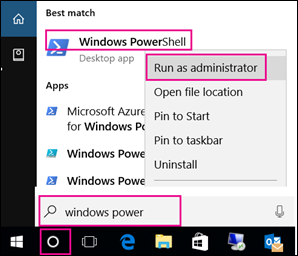

# <a name="manage-who-can-create-office-365-groups"></a><span data-ttu-id="42dd1-103">Administrar quién puede crear grupos de Office 365</span><span class="sxs-lookup"><span data-stu-id="42dd1-103">Manage who can create Office 365 Groups</span></span>

  
<span data-ttu-id="42dd1-104">Puesto que es extremadamente fácil para los usuarios crear grupos de Office 365, no va a recibir una infinidad de solicitudes para crearlos en nombre de otros usuarios.</span><span class="sxs-lookup"><span data-stu-id="42dd1-104">Because it's so easy for users to create Office 365 Groups, you aren't inundated with requests to create them on behalf of other people.</span></span> <span data-ttu-id="42dd1-105">Sin embargo, dependiendo de su empresa, es posible que quiera controlar quién tiene la capacidad de crear grupos.</span><span class="sxs-lookup"><span data-stu-id="42dd1-105">Depending on your business, however, you might want to control who has the ability to create groups.</span></span>
  
<span data-ttu-id="42dd1-106">Este artículo explica cómo deshabilitar la capacidad de crear grupos **en todos los servicios de Office 365 que usan grupos**:</span><span class="sxs-lookup"><span data-stu-id="42dd1-106">This article explains how to disable the ability to create groups **in all Office 365 services that use groups**:</span></span> 
  
- <span data-ttu-id="42dd1-107">Outlook</span><span class="sxs-lookup"><span data-stu-id="42dd1-107">Outlook</span></span>
    
- <span data-ttu-id="42dd1-108">SharePoint</span><span class="sxs-lookup"><span data-stu-id="42dd1-108">SharePoint</span></span>
    
- <span data-ttu-id="42dd1-109">Yammer</span><span class="sxs-lookup"><span data-stu-id="42dd1-109">Yammer</span></span>
    
- <span data-ttu-id="42dd1-110">Microsoft Teams</span><span class="sxs-lookup"><span data-stu-id="42dd1-110">Microsoft Teams</span></span>

- <span data-ttu-id="42dd1-111">Microsoft Stream</span><span class="sxs-lookup"><span data-stu-id="42dd1-111">Microsoft Stream</span></span>
    
- <span data-ttu-id="42dd1-112">StaffHub</span><span class="sxs-lookup"><span data-stu-id="42dd1-112">StaffHub</span></span>
    
- <span data-ttu-id="42dd1-113">Planner</span><span class="sxs-lookup"><span data-stu-id="42dd1-113">Planner</span></span>
    
- <span data-ttu-id="42dd1-114">PowerBI</span><span class="sxs-lookup"><span data-stu-id="42dd1-114">PowerBI</span></span>

- <span data-ttu-id="42dd1-115">Plan de desarrollo</span><span class="sxs-lookup"><span data-stu-id="42dd1-115">Roadmap</span></span>
    
<span data-ttu-id="42dd1-116">Puede restringir la creación de grupos de Office 365 a los miembros de un grupo de seguridad en particular.</span><span class="sxs-lookup"><span data-stu-id="42dd1-116">You can restrict Office 365 Group creation to the members of a particular security group.</span></span> <span data-ttu-id="42dd1-117">Para configurar esto, use Windows PowerShell.</span><span class="sxs-lookup"><span data-stu-id="42dd1-117">To configure this, you use Windows PowerShell.</span></span> <span data-ttu-id="42dd1-118">Este artículo le guiará por los pasos necesarios.</span><span class="sxs-lookup"><span data-stu-id="42dd1-118">This article walks you through the needed steps.</span></span>
  
<span data-ttu-id="42dd1-119">Los pasos de este artículo no impiden que los miembros de determinados roles creen grupos.</span><span class="sxs-lookup"><span data-stu-id="42dd1-119">The steps in this article won't prevent members of certain roles from creating Groups.</span></span> <span data-ttu-id="42dd1-120">Office 365 los administradores globales pueden crear grupos a través de cualquier medio, como el centro de administración de Microsoft 365, Planner, Teams, Exchange y SharePoint Online.</span><span class="sxs-lookup"><span data-stu-id="42dd1-120">Office 365 Global admins can create Groups via any means, such as the Microsoft 365 admin center, Planner, Teams, Exchange, and SharePoint Online.</span></span> <span data-ttu-id="42dd1-121">Otros roles pueden crear grupos a través de medios limitados, que se enumeran a continuación.</span><span class="sxs-lookup"><span data-stu-id="42dd1-121">Other roles can create Groups via limited means, listed below.</span></span>
        
  - <span data-ttu-id="42dd1-122">Administrador de Exchange: Centro de administración de Exchange, Azure AD</span><span class="sxs-lookup"><span data-stu-id="42dd1-122">Exchange Administrator: Exchange Admin center, Azure AD</span></span>
    
  - <span data-ttu-id="42dd1-123">Soporte técnico de nivel 1 de asociado: Centro de administración de Microsoft 365, centro de administración de Exchange, Azure AD</span><span class="sxs-lookup"><span data-stu-id="42dd1-123">Partner Tier 1 Support: Microsoft 365 Admin center, Exchange Admin center, Azure AD</span></span>
    
  - <span data-ttu-id="42dd1-124">Soporte técnico del nivel 2 del asociado: Centro de administración de Microsoft 365, centro de administración de Exchange, Azure AD</span><span class="sxs-lookup"><span data-stu-id="42dd1-124">Partner Tier 2 Support: Microsoft 365 Admin center, Exchange Admin center, Azure AD</span></span>
    
  - <span data-ttu-id="42dd1-125">Escritores de directorios: Azure AD</span><span class="sxs-lookup"><span data-stu-id="42dd1-125">Directory Writers: Azure AD</span></span>

  - <span data-ttu-id="42dd1-126">Administrador de SharePoint: Centro de administración de SharePoint, Azure AD</span><span class="sxs-lookup"><span data-stu-id="42dd1-126">SharePoint Administrator: SharePoint Admin center, Azure AD</span></span>
  
  - <span data-ttu-id="42dd1-127">Team Service Administrator: Centro de administración de Teams, Azure AD</span><span class="sxs-lookup"><span data-stu-id="42dd1-127">Teams Service Administrator: Teams Admin center, Azure AD</span></span>
  
  - <span data-ttu-id="42dd1-128">Administrador de administración de usuarios: Centro de administración de Microsoft 365, Yammer, Azure AD</span><span class="sxs-lookup"><span data-stu-id="42dd1-128">User Management Administrator: Microsoft 365 Admin center, Yammer, Azure AD</span></span>
     
<span data-ttu-id="42dd1-129">Si es miembro de uno de estos roles, puede crear Grupos de Office 365 para usuarios restringidos y, después, asignar al usuario la propiedad del grupo.</span><span class="sxs-lookup"><span data-stu-id="42dd1-129">If you're a member of one of these roles, you can create Office 365 Groups for restricted users, and then assign the user as the owner of the group.</span></span> <span data-ttu-id="42dd1-130">Los usuarios que tienen este rol pueden crear grupos conectados en Yammer, independientemente de la configuración de PowerShell que pueda impedir la creación.</span><span class="sxs-lookup"><span data-stu-id="42dd1-130">Users that have this role are able to create connected groups in Yammer, regardless of any PowerShell settings that might prevent creation.</span></span>

## <a name="licensing-requirements"></a><span data-ttu-id="42dd1-131">Requisitos de licencia</span><span class="sxs-lookup"><span data-stu-id="42dd1-131">Licensing requirements</span></span>

<span data-ttu-id="42dd1-132">Para administrar quién crea grupos, las siguientes personas necesitan licencias de Azure AD Premium o de Azure AD Basic EDU asignadas:</span><span class="sxs-lookup"><span data-stu-id="42dd1-132">To manage who creates Groups, the following people need Azure AD Premium licenses or Azure AD Basic EDU licenses assigned to them:</span></span>

- <span data-ttu-id="42dd1-133">El administrador que configura la configuración de creación de grupos</span><span class="sxs-lookup"><span data-stu-id="42dd1-133">The admin who configures these group creation settings</span></span>
- <span data-ttu-id="42dd1-134">Los miembros del grupo de seguridad que tienen permiso para crear grupos</span><span class="sxs-lookup"><span data-stu-id="42dd1-134">The members of the security group who are allowed to create Groups</span></span>

<span data-ttu-id="42dd1-135">Los siguientes usuarios no necesitan que se les asignen licencias de Azure AD Premium o Azure AD Basic EDU:</span><span class="sxs-lookup"><span data-stu-id="42dd1-135">The following people don't need Azure AD Premium or Azure AD Basic EDU licenses assigned to them:</span></span>

- <span data-ttu-id="42dd1-136">Personas que son miembros de los grupos de Office 365 y que no tienen la capacidad de crear otros grupos.</span><span class="sxs-lookup"><span data-stu-id="42dd1-136">People who are members of Office 365 groups and who don't have the ability to create other groups.</span></span>

## <a name="step-1-create-a-security-group-for-users-who-need-to-create-office-365-groups"></a><span data-ttu-id="42dd1-137">Paso 1: Crear un grupo de seguridad para los usuarios que necesiten crear Grupos de Office 365</span><span class="sxs-lookup"><span data-stu-id="42dd1-137">Step 1: Create a security group for users who need to create Office 365 Groups</span></span>

<span data-ttu-id="42dd1-138">Solo se puede usar un grupo de seguridad de la organización para controlar quién puede crear grupos.</span><span class="sxs-lookup"><span data-stu-id="42dd1-138">Only one security group in your organization can be used to control who is able to create Groups.</span></span> <span data-ttu-id="42dd1-139">Sin embargo, puede anidar otros grupos de seguridad como miembros de este grupo.</span><span class="sxs-lookup"><span data-stu-id="42dd1-139">But, you can nest other security groups as members of this group.</span></span> <span data-ttu-id="42dd1-140">Por ejemplo, el grupo denominado Permitir la creación de grupos es el grupo de seguridad designado, y los grupos denominados Usuarios de Microsoft Planner y Usuarios de Exchange Online son miembros de ese grupo.</span><span class="sxs-lookup"><span data-stu-id="42dd1-140">For example, the group named Allow Group Creation is the designated security group, and the groups named Microsoft Planner Users and Exchange Online Users are members of that group.</span></span>

<span data-ttu-id="42dd1-141">Los administradores de los roles enumerados anteriormente no tienen que ser miembros de este grupo: conservan la capacidad de crear grupos.</span><span class="sxs-lookup"><span data-stu-id="42dd1-141">Admins in the roles listed above do not need to be members of this group: they retain their ability to create groups.</span></span>

> [!IMPORTANT]
> <span data-ttu-id="42dd1-142">Asegúrese de usar un **grupo de seguridad** para restringir quién puede crear grupos.</span><span class="sxs-lookup"><span data-stu-id="42dd1-142">Be sure to use a **security group** to restrict who can create groups.</span></span> <span data-ttu-id="42dd1-143">Si intenta usar un grupo de Office 365, los miembros no podrán crear un grupo desde SharePoint ya que comprueba si hay un grupo de seguridad.</span><span class="sxs-lookup"><span data-stu-id="42dd1-143">If you try to use an Office 365 Group, members won't be able to create a group from SharePoint because it checks for a security group.</span></span> 
    
1. <span data-ttu-id="42dd1-144">En el centro de administración, vaya a **la** \> <a href="https://go.microsoft.com/fwlink/p/?linkid=2052855" target="_blank"></a> página grupos de grupos.</span><span class="sxs-lookup"><span data-stu-id="42dd1-144">In the admin center, go to the **Groups** \> <a href="https://go.microsoft.com/fwlink/p/?linkid=2052855" target="_blank">Groups</a> page.</span></span>

2. <span data-ttu-id="42dd1-145">Haga clic en **Agregar un grupo**.</span><span class="sxs-lookup"><span data-stu-id="42dd1-145">Click on **Add a Group**.</span></span>

3. <span data-ttu-id="42dd1-146">Elija **seguridad** como tipo de grupo.</span><span class="sxs-lookup"><span data-stu-id="42dd1-146">Choose **Security** as the group type.</span></span> <span data-ttu-id="42dd1-147">Recuerde que el nombre del grupo.</span><span class="sxs-lookup"><span data-stu-id="42dd1-147">Remember the name of the group!</span></span> <span data-ttu-id="42dd1-148">Lo necesitará más adelante.</span><span class="sxs-lookup"><span data-stu-id="42dd1-148">You'll need it later.</span></span>
  
4. <span data-ttu-id="42dd1-149">Termine de configurar el grupo de seguridad, agregando personas u otros grupos de seguridad que quiera que puedan crear grupos en su organización.</span><span class="sxs-lookup"><span data-stu-id="42dd1-149">Finish setting up the security group, adding people or other security groups who you want to be able to create Groups in your org.</span></span>
    
<span data-ttu-id="42dd1-150">Para obtener instrucciones detalladas, vea [crear, editar o eliminar un grupo de seguridad en el centro de administración de Microsoft 365](../email/create-edit-or-delete-a-security-group.md).</span><span class="sxs-lookup"><span data-stu-id="42dd1-150">For detailed instructions, see [Create, edit, or delete a security group in the Microsoft 365 admin center](../email/create-edit-or-delete-a-security-group.md).</span></span>
  
## <a name="step-2-install-the-preview-version-of-the-azure-active-directory-powershell-for-graph"></a><span data-ttu-id="42dd1-151">Paso 2: instalar la versión preliminar de Azure Active Directory PowerShell para Graph</span><span class="sxs-lookup"><span data-stu-id="42dd1-151">Step 2: Install the preview version of the Azure Active Directory PowerShell for Graph</span></span>

<span data-ttu-id="42dd1-152">Estos procedimientos requieren la versión preliminar de Azure Active Directory PowerShell para Graph.</span><span class="sxs-lookup"><span data-stu-id="42dd1-152">These procedures require the preview version of the Azure Active Directory PowerShell for Graph.</span></span> <span data-ttu-id="42dd1-153">La versión GA no funcionará.</span><span class="sxs-lookup"><span data-stu-id="42dd1-153">The GA version will not work.</span></span>


> [!IMPORTANT]
> <span data-ttu-id="42dd1-154">No puede instalar la versión preliminar y la versión GA en el mismo equipo al mismo tiempo.</span><span class="sxs-lookup"><span data-stu-id="42dd1-154">You cannot install both the preview and GA versions on the same computer at the same time.</span></span> <span data-ttu-id="42dd1-155">Puede instalar el módulo en Windows 10, Windows Server 2016.</span><span class="sxs-lookup"><span data-stu-id="42dd1-155">You can install the module on Windows 10, Windows Server 2016.</span></span>

  
<span data-ttu-id="42dd1-156">Como práctica recomendada, recomendamos mantenerse  *siempre*  actualizado: desinstale la versión antigua de AzureADPreview o de AzureAD y obtenga la última.</span><span class="sxs-lookup"><span data-stu-id="42dd1-156">As a best practice, we recommend  *always*  staying current: uninstall the old AzureADPreview or old AzureAD version and get the latest one.</span></span> 
  
1. <span data-ttu-id="42dd1-157">En la barra de búsqueda, escriba Windows PowerShell.</span><span class="sxs-lookup"><span data-stu-id="42dd1-157">In your search bar, type Windows PowerShell.</span></span>
    
2. <span data-ttu-id="42dd1-158">Haga clic con el botón derecho en **Windows PowerShell** y seleccione **Ejecutar como administrador**.</span><span class="sxs-lookup"><span data-stu-id="42dd1-158">Right-click on **Windows PowerShell** and select **Run as Administrator**.</span></span>
    
    
    
3. <span data-ttu-id="42dd1-160">Establezca la Directiva en RemoteSigned mediante [Set-ExecutionPolicy](https://docs.microsoft.com/powershell/module/microsoft.powershell.security/set-executionpolicy).</span><span class="sxs-lookup"><span data-stu-id="42dd1-160">Set the policy to RemoteSigned by using [Set-ExecutionPolicy](https://docs.microsoft.com/powershell/module/microsoft.powershell.security/set-executionpolicy).</span></span>
    
    ```
    Set-ExecutionPolicy RemoteSigned
    ```
  
4. <span data-ttu-id="42dd1-161">Compruebe el módulo instalado:</span><span class="sxs-lookup"><span data-stu-id="42dd1-161">Check installed module:</span></span>
    
    ```
    Get-InstalledModule -Name "AzureAD*"
    ```

5. <span data-ttu-id="42dd1-162">Para desinstalar una versión anterior de AzureADPreview o AzureAD, ejecute este comando:</span><span class="sxs-lookup"><span data-stu-id="42dd1-162">To uninstall a previous version of AzureADPreview or AzureAD, run this command:</span></span>
  
    ```
    Uninstall-Module AzureADPreview
    ```

    <span data-ttu-id="42dd1-163">o bien</span><span class="sxs-lookup"><span data-stu-id="42dd1-163">or</span></span>
  
    ```
    Uninstall-Module AzureAD
    ```

6. <span data-ttu-id="42dd1-164">To install the latest version of AzureADPreview, run this command:</span><span class="sxs-lookup"><span data-stu-id="42dd1-164">To install the latest version of AzureADPreview, run this command:</span></span>
  
    ```
    Install-Module AzureADPreview
    ```

    <span data-ttu-id="42dd1-165">At the message about an untrusted repository, type **Y**. It will take a minute or so for the new module to install. </span><span class="sxs-lookup"><span data-stu-id="42dd1-165">At the message about an untrusted repository, type **Y**. It will take a minute or so for the new module to install.</span></span>

<span data-ttu-id="42dd1-166">Deje abierta la ventana de PowerShell para el paso 3, a continuación.</span><span class="sxs-lookup"><span data-stu-id="42dd1-166">Leave the PowerShell window open for Step 3, below.</span></span>
  
## <a name="step-3-run-powershell-commands"></a><span data-ttu-id="42dd1-167">Paso 3: ejecutar comandos de PowerShell</span><span class="sxs-lookup"><span data-stu-id="42dd1-167">Step 3: Run PowerShell commands</span></span>

<span data-ttu-id="42dd1-168">Copie el script siguiente en un editor de texto, como el Bloc de notas o [Windows POWERSHELL ISE](https://docs.microsoft.com/powershell/scripting/components/ise/introducing-the-windows-powershell-ise).</span><span class="sxs-lookup"><span data-stu-id="42dd1-168">Copy the script below into a text editor, such as Notepad, or the [Windows PowerShell ISE](https://docs.microsoft.com/powershell/scripting/components/ise/introducing-the-windows-powershell-ise).</span></span>

<span data-ttu-id="42dd1-169">Reemplace \* \<SecurityGroupName\> \* por el nombre del grupo de seguridad que ha creado.</span><span class="sxs-lookup"><span data-stu-id="42dd1-169">Replace *\<SecurityGroupName\>* with the name of the security group that you created.</span></span> <span data-ttu-id="42dd1-170">Por ejemplo:</span><span class="sxs-lookup"><span data-stu-id="42dd1-170">For example:</span></span>

`$GroupName = "Group Creators"`

<span data-ttu-id="42dd1-171">Guarde el archivo como GroupCreators. ps1.</span><span class="sxs-lookup"><span data-stu-id="42dd1-171">Save the file as GroupCreators.ps1.</span></span> 

<span data-ttu-id="42dd1-172">En la ventana de PowerShell, navegue hasta la ubicación donde guardó el archivo (escriba "CD <FileLocation>").</span><span class="sxs-lookup"><span data-stu-id="42dd1-172">In the PowerShell window, navigate to the location where you saved the file (type "CD <FileLocation>").</span></span>

<span data-ttu-id="42dd1-173">Para ejecutar el script, escriba:</span><span class="sxs-lookup"><span data-stu-id="42dd1-173">Run the script by typing:</span></span>

`.\GroupCreators.ps1`

<span data-ttu-id="42dd1-174">e [inicie sesión con su cuenta de administrador](https://docs.microsoft.com/office365/enterprise/powershell/connect-to-office-365-powershell#step-2-connect-to-azure-ad-for-your-office-365-subscription) cuando se le solicite.</span><span class="sxs-lookup"><span data-stu-id="42dd1-174">and [sign in with your administrator account](https://docs.microsoft.com/office365/enterprise/powershell/connect-to-office-365-powershell#step-2-connect-to-azure-ad-for-your-office-365-subscription) when prompted.</span></span>

```PowerShell
$GroupName = "<SecurityGroupName>"
$AllowGroupCreation = "False"

Connect-AzureAD

$settingsObjectID = (Get-AzureADDirectorySetting | Where-object -Property Displayname -Value "Group.Unified" -EQ).id
if(!$settingsObjectID)
{
      $template = Get-AzureADDirectorySettingTemplate | Where-object {$_.displayname -eq "group.unified"}
    $settingsCopy = $template.CreateDirectorySetting()
    New-AzureADDirectorySetting -DirectorySetting $settingsCopy
    $settingsObjectID = (Get-AzureADDirectorySetting | Where-object -Property Displayname -Value "Group.Unified" -EQ).id
}

$settingsCopy = Get-AzureADDirectorySetting -Id $settingsObjectID
$settingsCopy["EnableGroupCreation"] = $AllowGroupCreation

if($GroupName)
{
    $settingsCopy["GroupCreationAllowedGroupId"] = (Get-AzureADGroup -SearchString $GroupName).objectid
}
 else {
$settingsCopy["GroupCreationAllowedGroupId"] = $GroupName
}
Set-AzureADDirectorySetting -Id $settingsObjectID -DirectorySetting $settingsCopy

(Get-AzureADDirectorySetting -Id $settingsObjectID).Values
```

<span data-ttu-id="42dd1-175">La última línea del script mostrará la configuración actualizada:</span><span class="sxs-lookup"><span data-stu-id="42dd1-175">The last line of the script will display the updated settings:</span></span>


<span data-ttu-id="42dd1-177">Si en el futuro desea cambiar el grupo de seguridad que se va a usar, puede volver a ejecutar el script con el nombre del nuevo grupo de seguridad.</span><span class="sxs-lookup"><span data-stu-id="42dd1-177">If in the future you want to change which security group is used, you can rerun the script with the name of the new security group.</span></span>

<span data-ttu-id="42dd1-178">Si desea desactivar la restricción de creación de grupos y volver a permitir que todos los usuarios creen grupos, establezca $GroupName en "" y $AllowGroupCreation en "true" y vuelva a ejecutar el script.</span><span class="sxs-lookup"><span data-stu-id="42dd1-178">If you want to turn off the group creation restriction and again allow all users to create groups, set $GroupName to "" and $AllowGroupCreation to "True" and rerun the script.</span></span>
    
## <a name="step-4-verify-that-it-works"></a><span data-ttu-id="42dd1-179">Paso 4: comprobar que funciona</span><span class="sxs-lookup"><span data-stu-id="42dd1-179">Step 4: Verify that it works</span></span>

1. <span data-ttu-id="42dd1-180">Inicie sesión en Office 365 con la cuenta de usuario de alguien que NO debe tener la capacidad de crear grupos.</span><span class="sxs-lookup"><span data-stu-id="42dd1-180">Sign in to Office 365 with a user account of someone who should NOT have the ability to create groups.</span></span> <span data-ttu-id="42dd1-181">Es decir, no son miembros del grupo de seguridad que ha creado o administrador.</span><span class="sxs-lookup"><span data-stu-id="42dd1-181">That is, they are not a member of the security group you created or an administrator.</span></span>
    
2. <span data-ttu-id="42dd1-182">Seleccione el mosaico de **Planner** .</span><span class="sxs-lookup"><span data-stu-id="42dd1-182">Select the **Planner** tile.</span></span> 
    
3. <span data-ttu-id="42dd1-183">En Planner, seleccione **nuevo plan** en el panel de navegación izquierdo para crear un plan.</span><span class="sxs-lookup"><span data-stu-id="42dd1-183">In Planner, select **New Plan** in the left navigation to create a plan.</span></span> 
  
4. <span data-ttu-id="42dd1-184">Debe obtener un mensaje que indica que la creación de grupos y el plan está deshabilitada.</span><span class="sxs-lookup"><span data-stu-id="42dd1-184">You should get a message that plan and group creation is disabled.</span></span>

<span data-ttu-id="42dd1-185">Vuelva a probar el mismo procedimiento con un miembro del grupo de seguridad.</span><span class="sxs-lookup"><span data-stu-id="42dd1-185">Try the same procedure again with a member of the security group.</span></span>

> [!NOTE]
> <span data-ttu-id="42dd1-186">Si los miembros del grupo de seguridad no pueden crear grupos, compruebe que no se bloquean a través de la [Directiva de buzón de OWA](https://go.microsoft.com/fwlink/?linkid=852135).</span><span class="sxs-lookup"><span data-stu-id="42dd1-186">If members of the security group aren't able to create groups, check that they aren't being blocked through their [OWA mailbox policy](https://go.microsoft.com/fwlink/?linkid=852135).</span></span>
    
## <a name="related-articles"></a><span data-ttu-id="42dd1-187">Artículos relacionados</span><span class="sxs-lookup"><span data-stu-id="42dd1-187">Related articles</span></span>

[<span data-ttu-id="42dd1-188">Introducción a PowerShell de Office 365</span><span class="sxs-lookup"><span data-stu-id="42dd1-188">Getting started with Office 365 PowerShell</span></span>](https://go.microsoft.com/fwlink/p/?LinkId=808033)

[<span data-ttu-id="42dd1-189">Configurar la administración de grupos de autoservicio en Azure Active Directory</span><span class="sxs-lookup"><span data-stu-id="42dd1-189">Set up self-service group management in Azure Active Directory</span></span>](https://docs.microsoft.com/azure/active-directory/users-groups-roles/groups-self-service-management)

[<span data-ttu-id="42dd1-190">Set-ExecutionPolicy</span><span class="sxs-lookup"><span data-stu-id="42dd1-190">Set-ExecutionPolicy</span></span>](https://docs.microsoft.com/powershell/module/microsoft.powershell.security/set-executionpolicy)

[<span data-ttu-id="42dd1-191">Cmdlets de Azure Active Directory para configurar configuraciones de grupo</span><span class="sxs-lookup"><span data-stu-id="42dd1-191">Azure Active Directory cmdlets for configuring group settings</span></span>](https://docs.microsoft.com/azure/active-directory/users-groups-roles/groups-settings-cmdlets)
