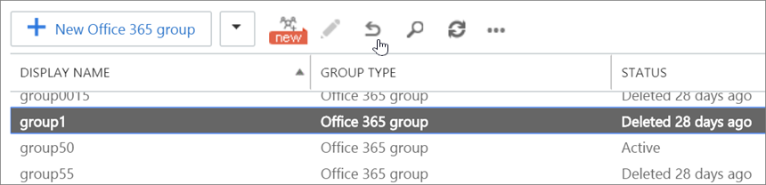

# <a name="restore-a-deleted-office-365-group"></a>Restaurar un grupo de Office 365 eliminado

Si es el propietario de un grupo de Office 365, puede restaurar el grupo mediante los siguientes pasos.

1. En la [Página grupos eliminados](https://outlook.office.com/people/group/deleted), seleccione la opción **administrar grupos** en el nodo **grupos** y, a continuación, elija **eliminado**.
2. Haga clic en la pestaña **restaurar** situada junto al grupo que desea restaurar.

Si el grupo eliminado no aparece aquí, póngase en contacto con un administrador.
  
Si es un usuario que desea restaurar un grupo de Office 365, pida a un administrador que siga estos pasos para usted o póngase en contacto con el Departamento de soporte técnico.  
   
Si ha eliminado un grupo, se conservará durante 30 días de forma predeterminada. Este período de 30 días se considera una "eliminación temporal" porque todavía puede restaurar el grupo. Transcurrido el plazo de 30 días, el grupo y su contenido asociado se eliminan de forma permanente y no se pueden restaurar.
  
Durante el período "Soft-delete", si un usuario intenta acceder al sitio, recibirá un mensaje 404 _prohibido_ . Después de este período, si un usuario intenta acceder al sitio, recibirá un mensaje 404 _no encontrado_ .
  
Cuando se restaura un grupo, se restaura el siguiente contenido:
  
- Azure Active Directory (AD) Office 365 Groups (objeto, propiedades y miembros).
    
- Direcciones de correo electrónico del grupo.
    
- Bandeja de entrada y calendario compartidos de Exchange Online.
    
- Sitio de grupo y archivos de SharePoint Online.
    
- Bloc de notas de OneNote
    
- Planner
    
- Teams

- Grupo de Yammer y contenido del grupo (si se creó el grupo de Office 365 desde Yammer)
    
También puede [Eliminar permanentemente un grupo de Office 365](#permanently-delete-an-office-365-group) si no puede esperar a que expire el período de retención de 30 días para que se elimine el contenido de forma permanente. 

> [!NOTE]
> El propietario del grupo Office 365 eliminado también puede restaurar el grupo. Para restaurar un grupo de Office 365 mediante permiso de propietario sin permiso de administrador, vea [restaurar un grupo de office 365 con PowerShell](#restore-an-office-365-group-using-powershell).

## <a name="restore-an-office-365-group-using-the-exchange-admin-center"></a>Restaurar un grupo de Office 365 con el Centro de administración de Exchange

Debe tener permisos de administrador global de Office 365.

1. Vaya al <a href="https://go.microsoft.com/fwlink/p/?linkid=2059104" target="_blank">Centro de administración de Exchange</a>.
    
2. En el Centro de administración de Exchange, seleccione **destinatarios** y, luego, elija **grupos**. Puede ver si el grupo está activo o eliminado temporalmente. Si el grupo se ha eliminado de forma permanente, directamente no aparecerá.
  
3. Para ver el tiempo exacto en el que se eliminó el grupo de forma temporal, seleccione el grupo y vea la información en el panel derecho.
      
4. Seleccione el grupo que desea restaurar y, a continuación, seleccione el icono restaurar.
    
    
  
5. Seleccione actualizar  para actualizar la información de la página. El grupo se mostrará como Activo. También se restaurarán los formularios y los datos de formulario asociados con su grupo.
    
## <a name="restore-an-office-365-group-using-powershell"></a>Restaurar un grupo de Office 365 con PowerShell

Debe tener los permisos de administrador global de Office 365 o ser un antiguo propietario del grupo de Office 365 eliminado.

> [!IMPORTANT]
> Si usa Remove-MsolGroup en PowerShell para eliminar un grupo, se eliminará el grupo de forma permanente. Al usar PowerShell para eliminar grupos, se recomienda usar **Remove-AzureADMSGroup** para eliminar temporalmente el grupo de Office 365. De este modo, lo podrá restaurar si es necesario. 
  
### <a name="install-the-preview-version-of-the-azure-active-directory-powershell-for-graph"></a>Instalación de la versión preliminar de Azure Active Directory PowerShell para Graph

> [!IMPORTANT]
> No puede instalar la versión preliminar y la versión GA en el mismo equipo al mismo tiempo.
  
Como procedimiento recomendado, se recomienda mantenerse *siempre* actualizado, es decir, desinstalar la versión antigua de AzureADPreview o la versión de AzureAD anterior y obtener la última. 
  
 
1. En la barra de búsqueda, escriba Windows PowerShell.
    
2. Haga clic con el botón derecho en **Windows PowerShell** y seleccione **Ejecutar como administrador**.
  
2. Revise los módulos instalados:
    
  ```
  Get-InstalledModule -Name "AzureAD*"
  ```

3. Para desinstalar una versión anterior de AzureADPreview o AzureAD, ejecute este comando:
  
```
   Uninstall-Module AzureADPreview
```

o bien
  
```
   Uninstall-Module AzureAD
```

4. To install the latest version of AzureADPreview, run this command:
  
```
   Install-Module AzureADPreview
```


At the message about an untrusted repository, type **Y**. It will take a minute or so for the new module to install. 
  
### <a name="restore-the-deleted-group"></a>Restaurar el grupo eliminado
  
1. ¿Ha instalado el módulo **AzureADPreview** , tal y como se indica en la sección Previoius "instalar la versión preliminar del módulo Azure Active Directory para Windows PowerShell"?  No tener instalada la versión **preliminar** más actual es la razón número 1 para que estos pasos no funcionen. 
    
2. Si todavía no lo ha hecho, abra una ventana de Windows PowerShell en el equipo (no importa si es una ventana de Windows PowerShell normal o una que haya abierto mediante la selección de **Ejecutar como administrador**).
    
3. Ejecute los siguientes comandos presionando **entrar** después de cada uno: 
    
  ```
  Import-Module AzureADPreview
  ```

  ```
  Connect-AzureAD
  ```


  En la pantalla **iniciar sesión en su cuenta** que se abre, escriba el nombre de usuario y la contraseña de la cuenta administrativa para conectar con el servicio de Azure ad y seleccione **iniciar sesión**.
  
4. Ejecute este comando para mostrar todos los grupos de Office 365 eliminados temporalmente de la organización que aún están en el período de eliminación de software de 30 días:
    
  ```
  Get-AzureADMSDeletedGroup
  ```

5. Anote el identificador de objeto del grupo o grupos que desea restaurar. Si no ve el grupo que está buscando en esta lista, es probable que ya se haya purgado de forma permanente.
    
    > [!CAUTION]
    > Si se ha creado un grupo nuevo con el mismo alias o la misma dirección SMTP que el grupo eliminado, tendrá que eliminar el grupo nuevo antes de poder restaurar el grupo eliminado. 
  
6. Para restaurar ese grupo, ejecute este comando:
    
  ```
  Restore-AzureADMSDeletedDirectoryObject -Id <objectId>
  ```

7. Este proceso suele durar sólo unos minutos pero, en algunos casos raros, puede tardar hasta 24 horas en restaurarse completamente. Para comprobar que el grupo se ha restaurado correctamente, ejecute este comando en PowerShell:
    
  ```
  Get-AzureADGroup -ObjectId <objectId>
  ```

Una vez que la restauración se haya completado correctamente, el grupo debería aparecer de nuevo en el panel de navegación de Outlook y Outlook en la Web. Todo el contenido restaurado, incluido el de SharePoint y Planner, debería volver a estar disponible para los miembros del grupo.
  
## <a name="permanently-delete-an-office-365-group"></a>Eliminar permanentemente un grupo de Office 365

A veces, es posible que desee purgar un grupo de forma permanente sin esperar a que expire el período de eliminación de software de 30 días. Para ello, inicie PowerShell y ejecute este comando para obtener el identificador de objeto del Grupo:
  
```
Get-AzureADMSDeletedGroup
```

Anote el identificador de objeto del grupo o grupos que desea eliminar de forma permanente.
  
> [!CAUTION]
> Purgar el grupo elimina el grupo y sus datos para siempre. 
  
Para purgar el grupo, ejecute este comando en PowerShell:
  
```
Remove-AzureADMSDeletedDirectoryObject -Id <objectId>
```

Para confirmar que el grupo se ha purgado correctamente, ejecute el cmdlet  *Get-AzureADMSDeletedGroup*  de nuevo para confirmar que el grupo ya no aparece en la lista de grupos eliminados temporalmente. En algunos casos, la eliminación permanente del grupo y todos sus datos puede tardar hasta 24 horas. 
  
## <a name="got-questions-about-office-365-groups"></a>¿Tiene preguntas sobre los grupos de Office 365?

Visite [Microsoft Tech Community](https://techcommunity.microsoft.com/t5/Office-365-Groups/ct-p/Office365Groups) para publicar preguntas y participar en conversaciones sobre grupos de Office 365. 
  
## <a name="related-articles"></a>Artículos relacionados

[Administrar grupos de Office 365 con PowerShell](https://support.office.com/article/aeb669aa-1770-4537-9de2-a82ac11b0540)
  
[Eliminar grupos mediante el cmdlet Remove-UnifiedGroup](https://technet.microsoft.com/library/mt238270%28v=exchg.160%29.aspx)
  
[Administrar la configuración de su sitio de grupo conectado](https://support.office.com/article/8376034d-d0c7-446e-9178-6ab51c58df42.aspx)
  
[Eliminar un grupo en Outlook](https://support.office.com/article/ca7f5a9e-ae4f-4cbe-a4bc-89c469d1726f.aspx)
