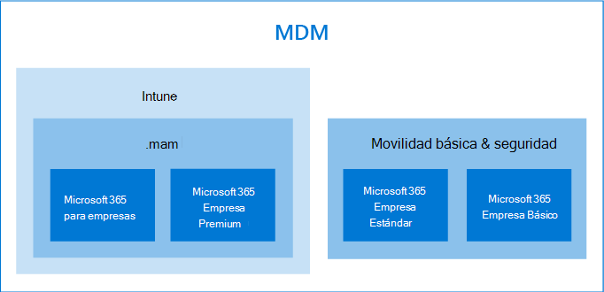

# Opciones para proteger los dispositivos y los datos de la aplicaciónOptions for protecting your devices and app data

Tiene varias formas de proteger los dispositivos y los datos de sus organizaciones con Microsoft 365 para empresas y Enterprise.You have several ways to secure your organizations devices and data on them with Microsoft 365 for business and enterprise. Puede usar los siguientes planes independientes:You can use the following stand-alone plans:

- Intune (una parte de la administración de extremos de Microsoft)Intune (a part of Microsoft Endpoint Management)
- Planes de Azure Active Directory Premium.Azure Active Directory Premium plans.
- Movilidad y seguridad básica (incluida en la mayoría de los planes de Microsoft 365 para empresas y empresas) o use las suscripciones que incluyan algunos o todos los planes independientes anteriores.Basic Mobility and Security (included in most Microsoft 365 for business and enterprise plans) Or use the subscriptions that include some, or all of the previous standalone plans.

- Una suscripción a Microsoft 365 empresa Premium, que incluye seguridad y protección contra amenazas para pequeñas empresas en 300 usuarios.A Microsoft 365 Business Premium subscription, which includes security and threat protection for small business under 300 users.
- Planes de Microsoft 365 Enterprise que incluyen seguridad avanzada y protección contra amenazas.Microsoft 365 Enterprise plans that include advanced security and threat protection.

## Opciones de administración de dispositivosDevice management options

- La **movilidad y la seguridad básica** se ofrecen con la mayoría de los planes de 365 de Microsoft y es la única opción integrada que se ofrece para Microsoft 365 Business Standard y Microsoft 365 Business Basic.**Basic Mobility and Security** is offered with most Microsoft 365 plans, and is the only built-in choice offered for Microsoft 365 Business Standard and Microsoft 365 Business Basic. Para obtener más información, consulte [Availability of Basic Mobility and Security](../basic-mobility-security/choose-between-basic-mobility-and-security-and-intune.md#availability-of-basic-mobility-and-security-and-intune).For more information, see [availability of Basic Mobility and Security](../basic-mobility-security/choose-between-basic-mobility-and-security-and-intune.md#availability-of-basic-mobility-and-security-and-intune). 

    Si tiene Microsoft 365 Business Basic o Microsoft 365 Business Standard, también puede adquirir Intune si su organización tiene necesidades de seguridad más complejas.If you have either Microsoft 365 Business Basic or Microsoft 365 Business Standard, you can also purchase Intune if your organization has more complex security needs.
 
- **Microsoft Intune** es un plan independiente que también se incluye en algunos planes de Microsoft 365 para empresas o para empresas.**Microsoft Intune** is a stand-alone plan that is also included with some Microsoft 365 for business or enterprise plans. Si tiene Intune como un independiente o una parte de la suscripción, proporciona la capacidad de ajustar con precisión el dispositivo y la administración de los datos de la aplicación.If you have Intune either as a stand-alone or a part of your subscription, it provides ability to fine-tune your device and app-data management. Para obtener más información sobre la disponibilidad con Microsoft 365, consulte [Availability of Intune](../basic-mobility-security/choose-between-basic-mobility-and-security-and-intune.md#availability-of-basic-mobility-and-security-and-intune).For more information on availability with Microsoft 365, see [availability of Intune](../basic-mobility-security/choose-between-basic-mobility-and-security-and-intune.md#availability-of-basic-mobility-and-security-and-intune).

    Microsoft Intune es un servicio basado en la nube que se centra en la administración de dispositivos móviles (MDM) y la administración de aplicaciones móviles (MAM).Microsoft Intune is a cloud-based service that focuses on mobile device management (MDM) and mobile application management (MAM). Usted controla cómo se usan los dispositivos de la organización, incluidos los teléfonos móviles, las tabletas y los equipos portátiles.You control how your organization’s devices are used, including mobile phones, tablets, and laptops. También puede configurar directivas específicas para controlar las aplicaciones.You can also configure specific policies to control applications. Para obtener más información, vea la [documentación de Microsoft Intune](https://docs.microsoft.com/mem/intune/).For more information, see [Microsoft Intune documentation](https://docs.microsoft.com/mem/intune/).

- Los planes de Microsoft **Azure Active Directory (ad) Premium** son planes independientes que también se incluyen en algunos de los planes de Microsoft 365 para empresas y empresas.**Azure Active Directory (AD) Premium** plans are standalone plans that also come with some of the Microsoft 365 for business and enterprise plans. Para obtener más información, consulte [precios de Azure ad](https://azure.microsoft.com/pricing/details/active-directory/).For more information, see [Azure AD pricing](https://azure.microsoft.com/pricing/details/active-directory/).

     Azure AD Premium P1 y Azure AD Premium P2 le permiten establecer las características de acceso condicional, el restablecimiento de contraseñas de autoservicio, etc. Para obtener más información sobre las capacidades de los planes Premium, consulte la página de [precios de Azure ad](https://azure.microsoft.com/pricing/details/active-directory/) .Azure AD Premium P1 and Azure AD Premium P2 allow you to set conditional access features, self-service password reset, etc. For more information on the capabilities of the Premium plans, see [Azure AD pricing](https://azure.microsoft.com/pricing/details/active-directory/) page.
- **Microsoft 365 Business Premium** incluye Intune y Azure Active Directory Premium P1 y Office 365 protección contra amenazas avanzada.**Microsoft 365 Business Premium** includes Intune and Azure Active Directory Premium P1 and Office 365 Advanced Threat Protection. 
 
    Microsoft 365 Business Premium ofrece un conjunto de plantillas de directiva para proteger sus dispositivos y datos de aplicaciones.Microsoft 365 Business Premium offers a set of policy templates for securing your devices and app data. Ofrece un buen nivel de protección contra amenazas y seguridad para la mayoría de las empresas de menos de 300 usuarios.It offers a good level of security and threat protection for most businesses under 300 users. Para obtener más información, vea [set up Microsoft 365 Business Premium en el Asistente para la instalación](../../business/set-up.md), [proteger los equipos con Windows 10](../../business/secure-win-10-pcs.md)y [las características de seguridad y cumplimiento de Microsoft 365 Business Premium](../../business/security-features.md).For more information, see [set up Microsoft 365 Business Premium in the setup wizard](../../business/set-up.md), [secure Windows 10 computers](../../business/secure-win-10-pcs.md),  and [Microsoft 365 Business Premium security and compliance features](../../business/security-features.md).

- **Microsoft 365 para** las suscripciones empresariales incluye Microsoft Intune y E5 también incluye los planes 1 y 2 de Azure ad Premium.**Microsoft 365 for enterprise** subscriptions include Microsoft Intune and E5 also includes the Azure AD premium plans 1 and 2.

    Microsoft 365 E5 ofrece el nivel más alto de protección contra amenazas y seguridad de todas las suscripciones de Microsoft 365.Microsoft 365 E5 offers the highest level of security and threat protection of all the Microsoft 365 subscriptions. Para obtener más información, consulte [información general de Microsoft 365 para empresas](../../enterprise/microsoft-365-overview.md).For more information, see [Microsoft 365 for enterprise overview](../../enterprise/microsoft-365-overview.md).
