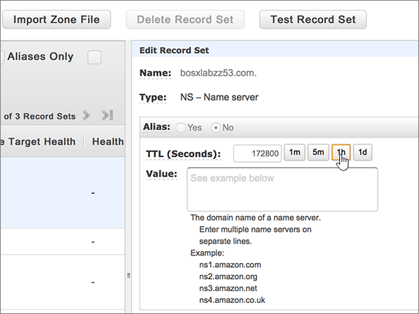

# Cambiar los servidores DNS para configurar Office 365 con Amazon Web Services (AWS)Change nameservers to set up Office 365 with Amazon Web Services (AWS)

 **[Consulte Preguntas más frecuentes acerca de los dominios](../setup/domains-faq.md)** si no encuentra lo que busca.**[Check the Domains FAQ](../setup/domains-faq.md)** if you don't find what you're looking for. 
  
Siga estas instrucciones si quiere que Office 365 administre los registros DNS de Office 365 automáticamente. (Si lo prefiere, puede [administrar todos los registros DNS de Office 365 en AWS](create-dns-records-at-aws.md)).Follow these instructions if you want Office 365 to manage your Office 365 DNS records for you. (If you prefer, you can [manage all your Office 365 DNS records at AWS](create-dns-records-at-aws.md).)
  
    
## Agregar un registro TXT para verificaciónAdd a TXT record for verification

Para que pueda usar el dominio con Office 365, tenemos que asegurarnos de que es de su propiedad. Si puede iniciar sesión en la cuenta en su registrador de dominios y crear el registro DNS, Office 365 sabrá que es el propietario del dominio.Before you use your domain with Office 365, we have to make sure that you own it. Your ability to log in to your account at your domain registrar and create the DNS record proves to Office 365 that you own the domain.
  
> [!NOTE]
> Este registro se usa exclusivamente para verificar si se es el propietario de un dominio; no afecta a nada más. Puede eliminarlo más adelante, si lo desea.This record is used only to verify that you own your domain; it doesn't affect anything else. You can delete it later, if you like. 
  
1. Para empezar, vaya a su página de dominios en AWS a través de [este vínculo](https://console.aws.amazon.com/route53/home). Se le pedirá que inicie sesión primero.To get started, go to your domains page at AWS by using [this link](https://console.aws.amazon.com/route53/home). You'll be prompted to log in first.
    
2. En la página **recursos** , seleccione **zonas hospedadas**.On the **Resources** page, select **Hosted Zones**.
    
3. En la página **zonas hospedadas** , en la columna **nombre de dominio** , seleccione el nombre del dominio que desea editar.On the **Hosted Zones** page, in the **Domain Name** column, select the name of the domain that you want to edit. 
    
4. Seleccione **crear conjunto de registros**.Select **Create Record Set**.
    
5. In the **Create Record Set** area, in the boxes for the new record, type or copy and paste the values from the following table.In the **Create Record Set** area, in the boxes for the new record, type or copy and paste the values from the following table. 
    
    (Choose the **Type** and **Routing Policy** values from the drop-down lists.)(Choose the **Type** and **Routing Policy** values from the drop-down lists.) 
    
    > [!TIP]
    > The quotation marks required by the onscreen instructions are supplied automatically. You don't need to type them manually.The quotation marks required by the onscreen instructions are supplied automatically. You don't need to type them manually. 
  
|||||||
|:-----|:-----|:-----|:-----|:-----|:-----|
|**Name****Name**   |**Type****Type**   |**Alias****Alias**   |**TTL (segundos)****TTL (Seconds)**   |**Valor****Value**   |**Directiva de enrutamiento****Routing Policy**   |
|(Deje este campo en blanco)(Leave this field empty)    |TXT - TextTXT - Text    |NoNo    |300300    |MS=ms *XXXXXXXX*MS=ms *XXXXXXXX*   **Nota:** Este es un ejemplo.**Note:** This is an example. Utilice aquí su valor de **Dirección o puntos de destino**, de la tabla de Office 365.Use your specific **Destination or Points to Address** value here, from the table in Office 365. [¿Cómo puedo encontrarlo?How do I find this?](../get-help-with-domains/information-for-dns-records.md)     |SimpleSimple   |
   
6. Seleccione **Crear**.Select **Create**.
    
7. Espere unos minutos antes de continuar para que el registro que acaba de crear pueda actualizarse en Internet.Wait a few minutes before you continue, so that the record you just created can update across the Internet.
    
Now that you've added the record at your domain registrar's site, you'll go back to Office 365 and request Office 365 to look for the record.Now that you've added the record at your domain registrar's site, you'll go back to Office 365 and request Office 365 to look for the record.
  
When Office 365 finds the correct TXT record, your domain is verified.When Office 365 finds the correct TXT record, your domain is verified.
  
1. En el centro de administración, vaya a la página **configuración** \> de <a href="https://go.microsoft.com/fwlink/p/?linkid=834818" target="_blank">dominios</a> .In the admin center, go to the **Settings** \> <a href="https://go.microsoft.com/fwlink/p/?linkid=834818" target="_blank">Domains</a> page.

    
2. En la página **dominios** , seleccione el dominio que desea comprobar.On the **Domains** page, select the domain that you are verifying. 
    
3. En la página **configuración** , seleccione **Iniciar configuración**.On the **Setup** page, select **Start setup**.
    
4. En la página **comprobar dominio** , seleccione **comprobar**.On the **Verify domain** page, select **Verify**.
    
> [!NOTE]
> Typically it takes about 15 minutes for DNS changes to take effect.Typically it takes about 15 minutes for DNS changes to take effect. However, it can occasionally take longer for a change you've made to update across the Internet's DNS system.However, it can occasionally take longer for a change you've made to update across the Internet's DNS system. Si tiene problemas con el flujo de correo u otros problemas después de agregar registros DNS, consulte [Buscar y corregir problemas después de agregar el dominio o los registros DNS en Office 365](../get-help-with-domains/find-and-fix-issues.md).If you're having trouble with mail flow or other issues after adding DNS records, see [Find and fix issues after adding your domain or DNS records in Office 365](../get-help-with-domains/find-and-fix-issues.md). 
  
## Cambiar los registros del servidor de nombres (o NS) de su dominioChange your domain's nameserver (NS) records

Para completar la configuración del dominio con Office 365, debe cambiar los registros NS del dominio en su registrador de dominios para que apunten a los servidores DNS primario y secundario de Office 365. Esto configura Office 365 para actualizar los registros DNS del dominio. Agregaremos todos los registros para que el correo electrónico, Skype Empresarial Online y su sitio web público funcionen con su dominio, y ya lo tendrá todo preparado.To complete setting up your domain with Office 365, you change your domain's NS records at your domain registrar to point to the Office 365 primary and secondary name servers. This sets up Office 365 to update the domain's DNS records for you. We'll add all records so that email, Skype for Business Online, and your public website work with your domain, and you'll be all set.
  
> [!CAUTION]
> Si cambia los registros NS del dominio para que apunten a los servidores DNS de Office 365, esto afectará a todos los servicios que estén asociados actualmente con su dominio. Por ejemplo, todos los correos que se envíen a su dominio (como, por ejemplo, rob@ *su_dominio*  .com) comenzarán a llegar a Office 365 después de realizar este cambio.When you change your domain's NS records to point to the Office 365 name servers, all the services that are currently associated with your domain are affected. For example, all email sent to your domain (like rob@ *your_domain*  .com) will start coming to Office 365 after you make this change. 
  
> [!IMPORTANT]
>  El siguiente procedimiento le mostrará cómo eliminar cualquier otro de los servidores de nombres no deseados de la lista, y también cómo agregar los servidores de nombres correctos si aún no aparecen.The following procedure will show you how to delete any other, unwanted nameservers from the list, and also how to add the correct nameservers if they are not already listed. > cuando haya completado los pasos de esta sección, los únicos servidores DNS que se deben enumerar son los cuatro: > ns1.bdm.microsoftonline.com > ns2.bdm.microsoftonline.com > ns3.bdm.microsoftonline.com > ns4.bdm.microsoftonline.com>  When you have completed the steps in this section, the only nameservers that should be listed are these four: >  ns1.bdm.microsoftonline.com >  ns2.bdm.microsoftonline.com >  ns3.bdm.microsoftonline.com >  ns4.bdm.microsoftonline.com 
  
1. Para empezar, vaya a su página de dominios en AWS a través de [este vínculo](https://console.aws.amazon.com/route53/home).To get started, go to your domains page at AWS by using [this link](https://console.aws.amazon.com/route53/home). Se le pedirá que inicie sesión primero.You'll be prompted to log in first.
    
2. En la página **recursos** , seleccione **zonas hospedadas**.On the **Resources** page, select **Hosted Zones**.
    
3. En la página **zonas hospedadas** , en la columna **nombre de dominio** , seleccione el nombre del dominio que desea editar.On the **Hosted Zones** page, in the **Domain Name** column, select the name of the domain that you want to edit. 
    
4. Seleccione el conjunto de registros **Servidor DNS**.Select the **Nameserver** record set. 
    
    
  
5. En el conjunto de registros **NS: servidor de nombres de dominio** del cuadro **Valor**, elimine todos los servidores de nombres al seleccionarlos todos y después presionar la tecla **Supr** en el teclado.In the **NS - Name server** record set in the **Value** box, delete all of the nameservers by selecting them all and then pressing the **Delete** key on your keyboard. 
    
    > [!CAUTION]
    > Follow these steps only if you have existing nameservers other than the four correct nameservers.Follow these steps only if you have existing nameservers other than the four correct nameservers. (Es decir, elimine solo los servidores DNS actuales que *no* tengan el nombre **ns1.BDM.microsoftonline.com**, **NS2.BDM.microsoftonline.com**, **NS3.BDM.microsoftonline.com**o **NS4.BDM.microsoftonline.com**).(That is, delete only any current nameservers that are  *not*  named **ns1.bdm.microsoftonline.com**, **ns2.bdm.microsoftonline.com**, **ns3.bdm.microsoftonline.com**, or **ns4.bdm.microsoftonline.com**.) 
  
    
  
6. En el área **TTL (segundos):** , seleccione **1H** (1 hora).In the **TTL (Seconds):** area, select **1h** (1 Hour). 
    
    
  
7. Aún en el conjunto de registros **NS: servidor de nombres**, en el cuadro **Valor**, escriba o copie y pegue el valor **Primera línea** de la tabla siguiente y después presione la tecla **Entrar** en el teclado y escriba o copie y pegue el siguiente valor **línea**.Still in the **NS - Name server** record set, in the **Value** box, type or copy and paste the **First line** value from the following table, then press the **Enter** key on your keyboard and type or copy and paste the next **line** value. 
    
    > [!IMPORTANT]
    > Cada valor de servidor DNS  *debe*  estar en su propia línea dentro del cuadro **Valor**, como se muestra en la siguiente ilustración.Each nameserver value  *must*  be on its own separate line within the **Value** box, as shown in the following illustration. 
  
|||
|:-----|:-----|
|**Primera línea****First line**   |ns1.bdm.microsoftonline.com.ns1.bdm.microsoftonline.com.    **This value MUST end with a period (.)****This value MUST end with a period (.)**   |
|**Segunda línea****Second line**   |ns2.bdm.microsoftonline.com.ns2.bdm.microsoftonline.com.    **This value MUST end with a period (.)****This value MUST end with a period (.)**   |
|**Tercera línea****Third line**   |ns3.bdm.microsoftonline.com.ns3.bdm.microsoftonline.com.    **Este valor DEBE terminar en punto (.).****This value MUST end with a period (.)**   |
|**Cuarta línea****Fourth line**   |ns4.bdm.microsoftonline.com.ns4.bdm.microsoftonline.com.    **Este valor DEBE terminar en punto (.).****This value MUST end with a period (.)**   |
   
   
  
8. Seleccione **Guardar conjunto de registros**.Select **Save Record Set**.
    
    
  
> [!NOTE]
> Las actualizaciones de los registros de los servidores de nombres pueden tardar varias horas en propagarse por el sistema DNS de Internet. A continuación, su correo electrónico y otros servicios de Office 365 estarán listos para funcionar con su dominio.Your nameserver record updates may take up to several hours to update across the Internet's DNS system. Then your Office 365 email and other services will be all set to work with your domain. 
