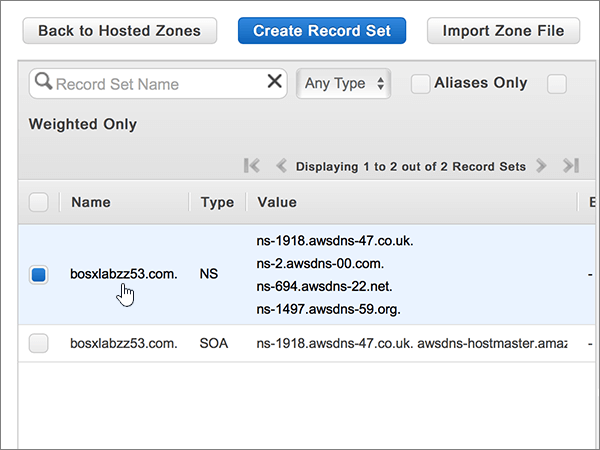

# Cambiar los servidores DNS para configurar Office 365 con Amazon Web Services (AWS)

 **[Consulte Preguntas más frecuentes acerca de los dominios](../setup/domains-faq.md)** si no encuentra lo que busca. 
  
Siga estas instrucciones si quiere que Office 365 administre los registros DNS de Office 365 automáticamente. (Si lo prefiere, puede [administrar todos los registros DNS de Office 365 en AWS](create-dns-records-at-aws.md)).
  
    
## Agregar un registro TXT para verificación

Para que pueda usar el dominio con Office 365, tenemos que asegurarnos de que es de su propiedad. Si puede iniciar sesión en la cuenta en su registrador de dominios y crear el registro DNS, Office 365 sabrá que es el propietario del dominio.
  
> [!NOTE]
> Este registro se usa exclusivamente para verificar si se es el propietario de un dominio; no afecta a nada más. Puede eliminarlo más adelante, si lo desea. 
  
1. Para empezar, vaya a su página de dominios en AWS a través de [este vínculo](https://console.aws.amazon.com/route53/home). Se le pedirá que inicie sesión primero.
    
2. En la página **recursos** , seleccione **zonas hospedadas**.
    
3. En la página **zonas hospedadas** , en la columna **nombre de dominio** , seleccione el nombre del dominio que desea editar. 
    
4. Seleccione **crear conjunto de registros**.
    
5. In the **Create Record Set** area, in the boxes for the new record, type or copy and paste the values from the following table. 
    
    (Choose the **Type** and **Routing Policy** values from the drop-down lists.) 
    
    > [!TIP]
    > The quotation marks required by the onscreen instructions are supplied automatically. You don't need to type them manually. 
  
|||||||
|:-----|:-----|:-----|:-----|:-----|:-----|
|**Name**   |**Type**   |**Alias**   |**TTL (segundos)**   |**Valor**   |**Directiva de enrutamiento**   |
|(Deje este campo en blanco)    |TXT - Text    |No    |300    |MS=ms *XXXXXXXX*   **Nota:** esto es un ejemplo. Use su valor **Dirección de destino** específico aquí, de la tabla de Office 365. [¿Cómo puedo encontrar esto?](../get-help-with-domains/information-for-dns-records.md)     |Simple   |
   
6. Seleccione **Crear**.
    
7. Espere unos minutos antes de continuar para que el registro que acaba de crear pueda actualizarse en Internet.
    
Ahora que ha agregado el registro en el sitio de su registrador de dominios, volverá a Office 365 y solicitará que Office 365 lo busque.
  
Cuando Office 365 encuentre el registro TXT correcto, se comprobará su dominio.
  
1. En el centro de administración, diríjase a la página **configuración** \> <a href="https://go.microsoft.com/fwlink/p/?linkid=834818" target="_blank">dominios</a>.

    
2. En la página **Dominios**, elija el dominio que está verificando. 
    
3. En la página de **Configuración**, elija ** Iniciar configuración**.
    
4. En la página**Verificar dominio**, elija **Verificar**.
    
> [!NOTE]
> Normalmente, se necesitan unos 15 minutos para que los cambios de DNS surtan efecto. Sin embargo, a veces los cambios pueden necesitar más tiempo para aplicarse en todo el sistema DNS de Internet. Si tiene problemas con el flujo de correo u otros problemas después de agregar registros DNS, consulte [Encontrar y solucionar problemas después de agregar el dominio o registros DNS en Office 365](../get-help-with-domains/find-and-fix-issues.md). 
  
## Cambiar los registros del servidor de nombres (o NS) de su dominio

Para completar la configuración del dominio con Office 365, debe cambiar los registros NS del dominio en su registrador de dominios para que apunten a los servidores DNS primario y secundario de Office 365. Esto configura Office 365 para actualizar los registros DNS del dominio. Agregaremos todos los registros para que el correo electrónico, Skype Empresarial Online y su sitio web público funcionen con su dominio, y ya lo tendrá todo preparado.
  
> [!CAUTION]
> Si cambia los registros NS del dominio para que apunten a los servidores DNS de Office 365, esto afectará a todos los servicios que estén asociados actualmente con su dominio. Por ejemplo, todos los correos que se envíen a su dominio (como, por ejemplo, rob@ *su_dominio*  .com) comenzarán a llegar a Office 365 después de realizar este cambio. 
  
> [!IMPORTANT]
>  El siguiente procedimiento le mostrará cómo eliminar cualquier otro de los servidores de nombres no deseados de la lista, y también cómo agregar los servidores de nombres correctos si aún no aparecen. > cuando haya completado los pasos de esta sección, los únicos servidores DNS que se deben enumerar son los cuatro: > ns1.bdm.microsoftonline.com > ns2.bdm.microsoftonline.com > ns3.bdm.microsoftonline.com > ns4.bdm.microsoftonline.com 
  
1. Para empezar, vaya a su página de dominios en AWS a través de [este vínculo](https://console.aws.amazon.com/route53/home). Se le pedirá que inicie sesión primero.
    
2. En la página **recursos** , seleccione **zonas hospedadas**.
    
3. En la página **zonas hospedadas** , en la columna **nombre de dominio** , seleccione el nombre del dominio que desea editar. 
    
4. Seleccione el conjunto de registros **Servidor DNS**. 
    
    
  
5. En el conjunto de registros **NS: servidor de nombres de dominio** del cuadro **Valor**, elimine todos los servidores de nombres al seleccionarlos todos y después presionar la tecla **Supr** en el teclado. 
    
    > [!CAUTION]
    > Follow these steps only if you have existing nameservers other than the four correct nameservers. (Es decir, elimine solo los servidores DNS actuales que *no* tengan el nombre **ns1.BDM.microsoftonline.com**, **NS2.BDM.microsoftonline.com**, **NS3.BDM.microsoftonline.com**o **NS4.BDM.microsoftonline.com**). 
  
    
  
6. En el área **TTL (segundos):** , seleccione **1H** (1 hora). 
    
    
  
7. Aún en el conjunto de registros **NS: servidor de nombres**, en el cuadro **Valor**, escriba o copie y pegue el valor **Primera línea** de la tabla siguiente y después presione la tecla **Entrar** en el teclado y escriba o copie y pegue el siguiente valor **línea**. 
    
    > [!IMPORTANT]
    > Cada valor de servidor DNS  *debe*  estar en su propia línea dentro del cuadro **Valor**, como se muestra en la siguiente ilustración. 
  
|||
|:-----|:-----|
|**Primera línea**   |ns1.bdm.microsoftonline.com.    **This value MUST end with a period (.)**   |
|**Segunda línea**   |ns2.bdm.microsoftonline.com.    **This value MUST end with a period (.)**   |
|**Tercera línea**   |ns3.bdm.microsoftonline.com.    **Este valor DEBE terminar en punto (.).**   |
|**Cuarta línea**   |ns4.bdm.microsoftonline.com.    **Este valor DEBE terminar en punto (.).**   |
   
   
  
8. Seleccione **Guardar conjunto de registros**.
    
    
  
> [!NOTE]
> Las actualizaciones de los registros de los servidores de nombres pueden tardar varias horas en propagarse por el sistema DNS de Internet. A continuación, su correo electrónico y otros servicios de Office 365 estarán listos para funcionar con su dominio. 
