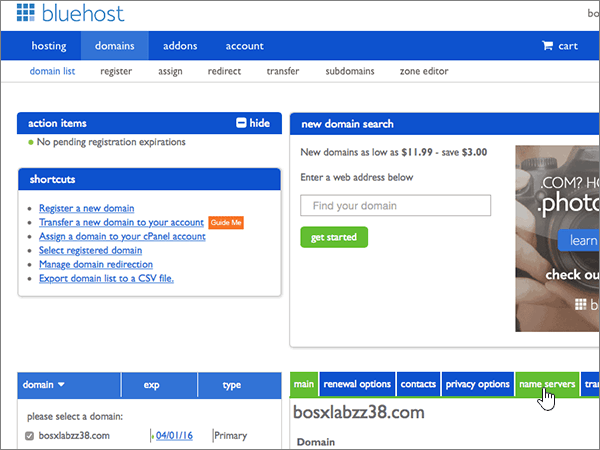
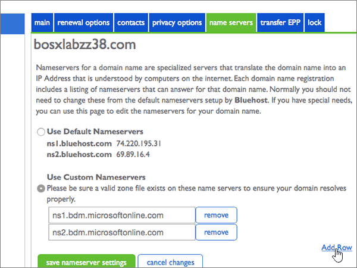

# Cambiar los servidores DNS para configurar Office 365 con Bluehost

 **[Consulte Preguntas más frecuentes acerca de los dominios](../setup/domains-faq.md)** si no encuentra lo que busca. 
  
Siga estas instrucciones si quiere que Office 365 administre automáticamente los registros DNS de Office 365. (Si lo prefiere, puede [administrar todos los registros DNS de Office 365 en Bluehost](create-dns-records-at-bluehost.md)).
  
## Agregar un registro TXT para verificación

Para que pueda usar el dominio con Office 365, tenemos que asegurarnos de que es de su propiedad. Si puede iniciar sesión en la cuenta en su registrador de dominios y crear el registro DNS, Office 365 sabrá que es el propietario del dominio.
  
> [!NOTE]
> Este registro se usa exclusivamente para verificar si se es el propietario de un dominio; no afecta a nada más. Puede eliminarlo más adelante, si lo desea. 
  
1. Para empezar, vaya a su página de dominios en Bluehost a través de [este vínculo](https://my.bluehost.com/cgi/dm). You'll be prompted to log in first.
    
2. En la página **dominios**, en el área **dominio**, encuentre la fila del dominio que quiere cambiar y, a continuación, seleccione la casilla que corresponde a ese dominio. 
    
    (Es posible que tenga que desplazarse hacia abajo). 
    
3. En el área **domain_name** , en la fila editor de la **zona DNS** , seleccione **administrar registros DNS**.
    
4. On the **DNS Zone Editor** page, in the Add DNS Record area, in the boxes for the new record, type or copy and paste the values from the following table. 
    
    (Choose the **Type** value from the drop-down list.) 
    
|||||
|:-----|:-----|:-----|:-----|
|**Host Record**   |**TTL**   |**Tipo**   |**TXT Value**   |
|@    |14400    |TXT    |MS=ms *XXXXXXXX*   **Nota:** Este es un ejemplo. Utilice aquí su valor de **Dirección o puntos de destino**, de la tabla de Office 365. [¿Cómo puedo encontrarlo?](../get-help-with-domains/information-for-dns-records.md)   |

   
5. Seleccione **Agregar registro**.
    
6. Espere unos minutos antes de continuar para que el registro que acaba de crear pueda actualizarse en Internet.
    
Now that you've added the record at your domain registrar's site, you'll go back to Office 365 and request Office 365 to look for the record.
  
When Office 365 finds the correct TXT record, your domain is verified.
  
1. En el centro de administración, vaya a la página **configuración** \> de <a href="https://go.microsoft.com/fwlink/p/?linkid=834818" target="_blank">dominios</a> .

    
2. En la página **dominios** , seleccione el dominio que desea comprobar. 
    
3. En la página **configuración** , seleccione **Iniciar configuración**.
    
4. En la página **comprobar dominio** , seleccione **comprobar**.
    
> [!NOTE]
> Typically it takes about 15 minutes for DNS changes to take effect. However, it can occasionally take longer for a change you've made to update across the Internet's DNS system. Si tiene problemas con el flujo de correo u otros problemas después de agregar registros DNS, consulte [Buscar y corregir problemas después de agregar el dominio o los registros DNS en Office 365](../get-help-with-domains/find-and-fix-issues.md). 
  
## Cambiar los registros del servidor de nombres (o NS) de su dominio

Para completar la configuración del dominio con Office 365, debe cambiar los registros NS del dominio en su registrador de dominios para que apunten a los servidores DNS primario y secundario de Office 365. Esto configura Office 365 para actualizar los registros DNS del dominio. Agregaremos todos los registros para que el correo electrónico, Skype Empresarial Online y su sitio web público funcionen con su dominio, y ya lo tendrá todo preparado.
  
> [!CAUTION]
> Si cambia los registros NS del dominio para que apunten a los servidores DNS de Office 365, esto afectará a todos los servicios que estén asociados actualmente con su dominio. Por ejemplo, todos los correos que se envíen a su dominio (como, por ejemplo, rob@ *su_dominio*  .com) comenzarán a llegar a Office 365 después de realizar este cambio. 
  
> [!IMPORTANT]
>  El siguiente procedimiento le mostrará cómo eliminar cualquier otro de los servidores de nombres no deseados de la lista, y también cómo agregar los servidores de nombres correctos si aún no aparecen. > cuando haya completado los pasos de esta sección, los únicos servidores DNS que se deben enumerar son los cuatro: > ns1.bdm.microsoftonline.com > ns2.bdm.microsoftonline.com > ns3.bdm.microsoftonline.com > ns4.bdm.microsoftonline.com 
  
1. Para empezar, vaya a su página de dominios en Bluehost a través de [este vínculo](https://my.bluehost.com/cgi/dm). You'll be prompted to log in first.
    
2. En la página **dominios** , en el área **domain_name** , active la casilla correspondiente a su dominio y, a continuación, seleccione **servidores de nombres**.
    
    
  
3. En el área **domain_name** , seleccione **usar servidores DNS personalizados**.
    
    
  
4. Dependiendo de si ya existen o no servidores de nombres enumerados en la página que se muestra ahora, continúe con uno de los dos procedimientos siguientes:
    
  - Si aún **NO** se muestran servidores DNS en la lista, [Si aún NO se muestran servidores DNS en la lista](#if-there-are-no-nameservers-already-listed).
    
  - Si **YA** se muestran servidores DNS en la lista, [Si ya existen servidores de nombres enumerados](#if-there-are-nameservers-already-listed).
    
### Si aún NO se muestran servidores DNS en la lista

1. En la sección **Usar servidores DNS personalizados**, escriba (o copie y pegue) los valores de la tabla siguiente. 
    
|||
|:-----|:-----|
|**Primera fila vacía**   |ns1.bdm.microsoftonline.com    |
|**Segunda fila vacía**   |ns2.bdm.microsoftonline.com    |
   
   
  
2. Seleccione **Agregar fila**.
    
    
  
3. En la sección **Usar servidores de nombre personalizados**, escriba (o copie y pegue) los valores de la primera fila de la tabla siguiente en la nueva fila vacía. 
    
|||
|:-----|:-----|
|**Tercera fila vacía**   |ns3.bdm.microsoftonline.com    |
|**Cuarta fila vacía**   |ns4.bdm.microsoftonline.com    |
   
    
  
4. Para agregar el cuarto registro de servidor de nombres, seleccione **Agregar fila** de nuevo y cree un registro con los valores de la última fila de la tabla anterior. 
    
5. Seleccione **Guardar configuración de servidor DNS**.
    
    
  
> [!NOTE]
> Las actualizaciones de los registros de los servidores de nombres pueden tardar varias horas en propagarse por el sistema DNS de Internet. A continuación, su correo electrónico y otros servicios de Office 365 estarán listos para funcionar con su dominio. 
  
### Si ya existen servidores de nombres enumerados

> [!CAUTION]
> Follow these steps only if you have existing nameservers other than the four correct nameservers. (Es decir, elimine solo los servidores DNS actuales que *no* tengan el nombre **ns1.BDM.microsoftonline.com**, **NS2.BDM.microsoftonline.com**, **NS3.BDM.microsoftonline.com**o **NS4.BDM.microsoftonline.com**). 
  
1. Si la lista contiene otros servidores DNS, elimínelos (para hacerlo, selecciónelos y, después, presione la tecla **Suprimir** en el teclado). 
    
    
  
2. En la sección **Usar servidores DNS personalizados**, escriba (o copie y pegue) los valores de la tabla siguiente. 
    
|||
|:-----|:-----|
|**Primera fila vacía**   |ns1.bdm.microsoftonline.com    |
|**Segunda fila vacía**   |ns2.bdm.microsoftonline.com    |
   
   
  
3. Seleccione **Agregar fila**.
    
    
  
4. En la sección **Usar servidores de nombre personalizados**, escriba (o copie y pegue) los valores de la primera fila de la tabla siguiente en la nueva fila vacía. 
    
|||
|:-----|:-----|
|**Tercera fila vacía**   |ns3.bdm.microsoftonline.com    |
|**Cuarta fila vacía**   |ns4.bdm.microsoftonline.com    |
   
   
  
5. Para agregar el cuarto registro de servidor de nombres, seleccione **Agregar fila** de nuevo y cree un registro con los valores de la última fila de la tabla anterior. 
    
6. Seleccione **Guardar configuración de servidor DNS**.
    
    
  
> [!NOTE]
> Las actualizaciones de los registros de los servidores de nombres pueden tardar varias horas en propagarse por el sistema DNS de Internet. A continuación, su correo electrónico y otros servicios de Office 365 estarán listos para funcionar con su dominio. 
  
